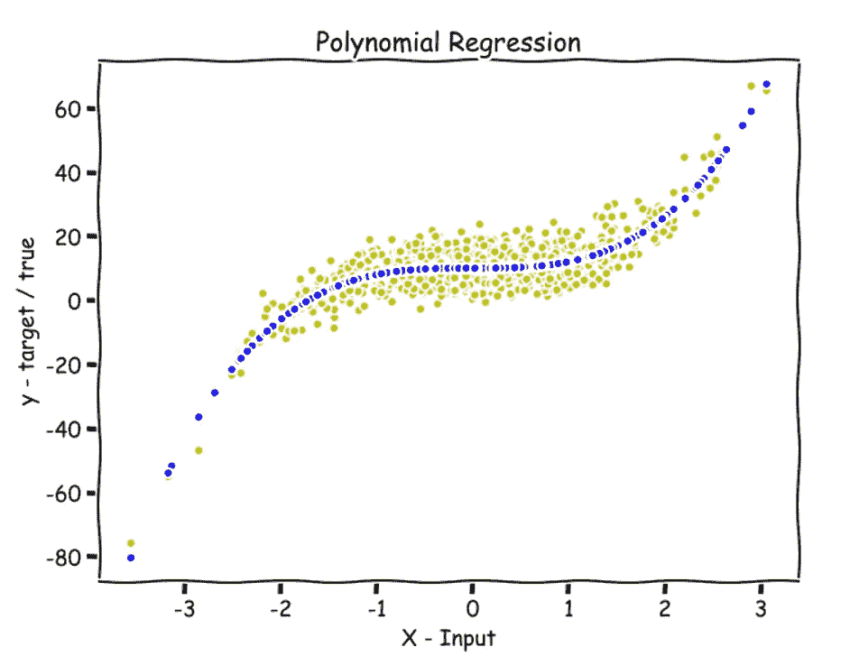
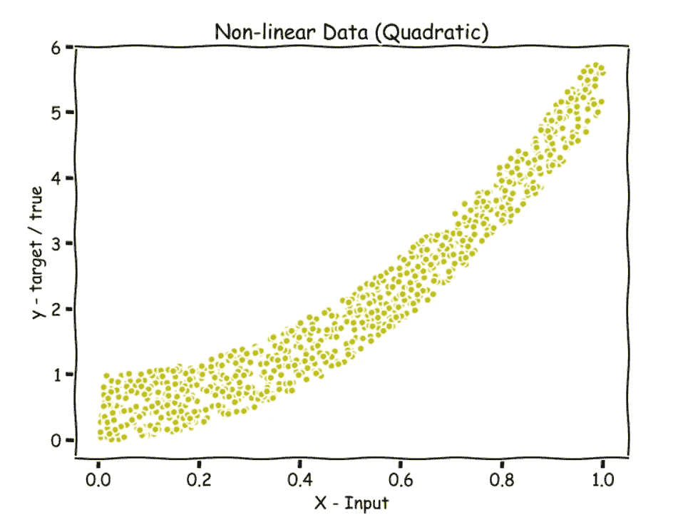
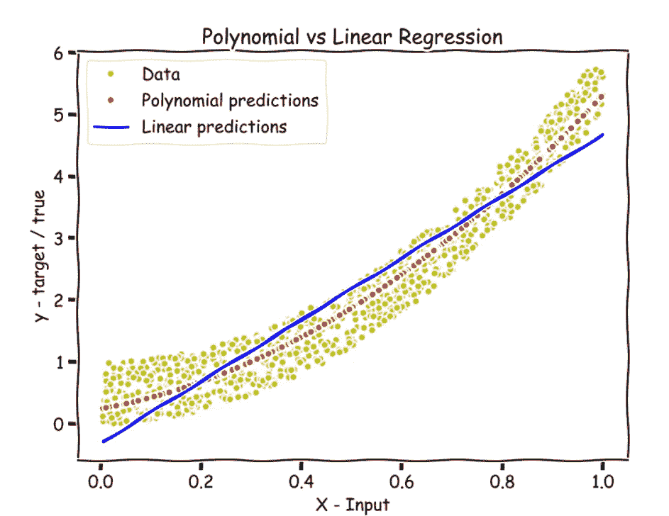
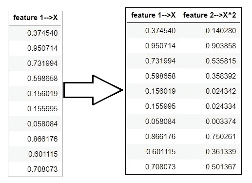
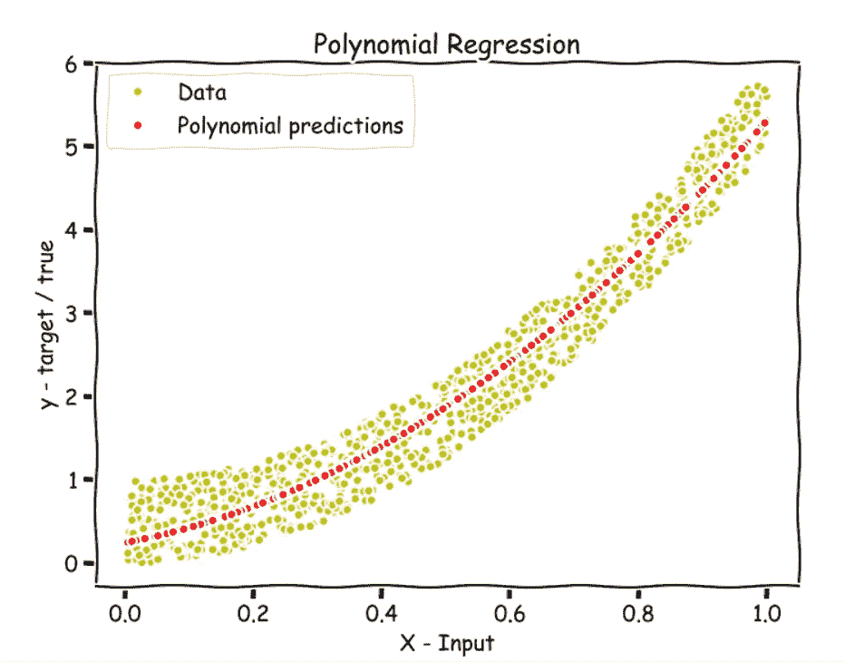

# Python 中从头开始的多项式回归

> 原文：<https://towardsdatascience.com/polynomial-regression-in-python-b69ab7df6105?source=collection_archive---------1----------------------->

## 从零开始的机器学习:第 4 部分



多项式回归；作者图片

在本文中，我们将了解多项式回归算法，通过修改假设函数和添加我们希望添加到输入中的新要素，该算法可用于拟合非线性数据。

多项式回归只是标准线性回归的另一个版本。

[](https://medium.com/analytics-vidhya/linear-regression-from-scratch-in-python-b6501f91c82d) [## Python 中从头开始的线性回归

### 从零开始的机器学习:第 1 部分

medium.com](https://medium.com/analytics-vidhya/linear-regression-from-scratch-in-python-b6501f91c82d) 

首先，我们将重述**符号**(寻找新变量`degrees`)，然后**理解**算法，最后**使用 Python NumPy 和 Matplotlib 实现**它，**绘制预测**并计算 **r2 分数**。

# 符号—

*   `n`→功能数量
*   `m`→培训实例数量
*   `X`→形状输入数据矩阵(`m` x `n`)
*   `y`→大小为`m`的真/目标值向量
*   `x(i), y(i)`→以训练为例，其中`x(i)`为 n 维，`y(i)`为实数。
*   `degrees`→一个列表。我们将`X^(value)`特征添加到输入中，其中值是列表中的值之一。(稍后详细解释)
*   `w` →形状的权重(参数)(`n` x 1)
*   `b` →bias(参数)，一个可以[广播的实数](https://numpy.org/doc/stable/user/basics.broadcasting.html)。
*   `y_hat` →假设(`w`(权重)和`X`的点积加上`b`(偏差))— `w.X + b`
*   **损失函数**→均方误差损失或均方误差损失(`y_hat` - `y`)，你最小化这个函数以便找到参数`w`和`b`。

# 多项式回归

让我们以下面的数据集为例来理解多项式回归，其中 x 轴代表输入数据`X`，y 轴代表具有 1000 个示例(`m`)和 1 个特征(`n`)的真值/目标值`y`。

```
import numpy as np
import matplotlib.pyplot as pltnp.random.seed(42)
X = np.random.rand(1000,1)
y = 5*((X)**(2)) + np.random.rand(1000,1)
```



随机二次数据；作者图片

如果我们对该数据使用标准线性回归，我们将只能对数据拟合一条直线，如下图中的蓝线所示，其中假设为— `w1.X + b`(用`w1`替换`w`)。

但是，我们可以看到数据不是线性的，下面显示的红点线非常适合这些数据。



多项式与线性回归；作者图片

因此，在将模型拟合到数据时，您必须回答的一个问题是— **您希望使用什么功能？**您是想对数据进行直线拟合，还是想对形式为— `b + w1.X + w2.X²`的假设进行拟合，因为上述数据可能看起来像是二次函数拟合。

或者，您可能有看起来像平方根拟合的数据，因此您可能希望您的假设像这样— `b + w1.X + w2.(X)^0.5`或者您的数据可以是任何程度的，因此您可以选择您想要的特征并修改假设函数。

现在要实现这一点，我们所要做的就是将我们的第一个特征 x1(特征 1)定义为`X`，将第二个特征 x2(特征 2)定义为`X²`，或者根据您想要使用的特征，将 x1 定义为`X`，将 x2 定义为`X^0.5`。通过定义一个新的特征 x2，即`X²`或`X^0.5`，我们看到线性回归中的机制适用于拟合这些类型的非线性数据。

> **这里需要注意的重要一点是，我们的假设仍然是线性的，因为** `**X²**` **或** `**X^0.5**` **都只是特征。然而，我们得到了数据的非线性拟合。**

*我们所要做的就是修改输入(* `*X*` *)，也就是说，只要添加我们想要的任何程度的特征，就像我们将为我们的例子添加一个特征 X。*

如果您通过添加新特征来修改输入，假设会自动得到修改，因为`h(x) = w.X +b`，其中`w`是大小为`n`(特征数量)的向量。

下图显示了前 10 个示例，其中我们向输入数据添加了一个新的特征 X。



变换输入(X)，添加 X 特征；作者图片

我们可以添加尽可能多的功能，这将是我们已经拥有的功能的一些指数运算。

# 该算法

*   根据你掌握的数据，修改线性回归的假设函数。
*   向输入中添加所需的新的更高阶要素。
*   对修改后的输入进行梯度下降/小批量梯度下降，以找到参数—权重和偏差。

# 多项式回归在起作用

# **损失函数**

让我们首先定义损失函数，也就是 MSE 损失函数—

(`y_hat` - `y`)其中，`y_hat`为假设— `w.X + b`

```
**def loss(y, y_hat):**

    # y --> true/target value.
    # y_hat --> hypothesis

    #Calculating loss.
    **loss = np.mean((y_hat - y)**2)
    return loss**
```

# 计算梯度的函数

现在，让我们写一个函数来计算损失函数相对于`w`和`b`的偏导数(梯度)。

请参见注释(#)。

```
# Calulating gradient of loss w.r.t parameters(weights and bias).**def gradients(X, y, y_hat):**

    # X --> Input.
    # y --> true/target value.
    # y_hat --> hypothesis
    # w --> weights (parameter).
    # b --> bias (parameter).

    # m-> number of training examples.
    **m = X.shape[0]**

    # Gradient of loss w.r.t weights.
    **dw = (1/m)*np.dot(X.T, (y_hat - y))**

    # Gradient of loss w.r.t bias.
    **db = (1/m)*np.sum((y_hat - y))** 

    **return dw, db**
```

# 向输入数据添加要素的函数

让我们编写一个函数，向输入中添加尽可能多的特性。这里我们将定义一个名为`degrees`的变量，它是一个 python 列表。

> 无论我们将什么值传递到这个列表中，我们都会向输入添加一个新的特性，即`X^(value)`。例如，如果我们将 2 和 3 传入列表，我们将特性`X²`和`X³`添加到输入中。

请参见注释(#)。

```
**def x_transform(X, degrees):**

    # X --> Input.
    # degrees --> A list, We add X^(value) feature to the input
    #             where value is one of the values in the list.

    # making a copy of X.
    **t = X.copy()**

    # Appending columns of higher degrees to X.
    **for i in degrees:
        X = np.append(X, t**i, axis=1)

    return X**
```

# 培训功能

训练函数包括初始化权重和偏差以及具有小批量梯度下降的训练循环。

请参见注释(#)。

```
**def train(X, y, bs, degrees, epochs, lr):**

    # X --> Input.
    # y --> true/target value.
    # bs --> Batch Size.
    # epochs --> Number of iterations.
    # degrees --> A list, We add X^(value) feature to the input
    #             where value is one of the values in the list.
    # lr --> Learning rate.

    # Adding features to input X.
    **x = x_transform(X, degrees)**

    # m-> number of training examples
    # n-> number of features 
    **m, n = x.shape**

    # Initializing weights and bias to zeros.
    **w = np.zeros((n,1))
    b = 0**

    # Reshaping y.
    **y = y.reshape(m,1)**

    # Empty list to store losses.
    **losses = []**

    # Training loop.
    **for epoch in range(epochs):
        for i in range((m-1)//bs + 1):**

            # Defining batches.
            **start_i = i*bs
            end_i = start_i + bs
            xb = x[start_i:end_i]
            yb = y[start_i:end_i]**

            # Calculating hypothesis
            **y_hat = np.dot(xb, w) + b**

            # Getting the gradients of loss w.r.t parameters.
            **dw, db = gradients(xb, yb, y_hat)**

            # Updating the parameters.
            **w -= lr*dw
            b -= lr*db**

        # Calculating loss and appending it in the list.
        **l = loss(y, np.dot(x, w) + b)
        losses.append(l)**

    # returning weights, bias and losses(List).
    **return w, b, losses**
```

# 预测功能

请参见注释(#)。

```
# Predicting function.**def predict(X, w, b, degrees):**

    # X --> Input.
    # w --> weights (parameter).
    # b --> bias (parameter).
    degrees --> A list, We add X^(value) feature to the input
    #             where value is one of the values in the list.

    # Adding degrees to input X.
    **x1 = x_transform(X, degrees)**

    # Returning predictions.
    **return np.dot(x1, w) + b**
```

# 训练和绘制预测

使用`train`功能训练数据。

> 仅向`degrees`列表传递 2。您可以尝试传递任何其他数字，看看会发生什么。

```
w, b, l = train(X, y, bs=100, degrees=[2], epochs=1000,
                lr=0.01)**# Plotting**
fig = plt.figure(figsize=(8,6))
plt.plot(X, y, 'y.')
plt.plot(X, predict(X, w, b, [2]), 'r.')
plt.legend(["Data", "Polynomial predictions"])
plt.xlabel('X - Input')
plt.ylabel('y - target / true')
plt.title('Polynomial Regression')
plt.show()
```



预测用红色表示；作者图片

看起来不错。

> 由于我们已经在列表`losses`中收集了每次迭代的损失，试着绘制`losses`对迭代(`epochs`)的图，看看在训练时损失是否下降。

# r2 得分

计算我们预测的 r2 分数，看看我们做得有多好。

供参考—[R2 分数是多少？](https://www.geeksforgeeks.org/python-coefficient-of-determination-r2-score/#:~:text=Coefficient%20of%20determination%20also%20called,input%20independent%20variable(s).)

```
def r2_score(y, y_hat):
    return 1 - (np.sum((np.array(y_hat)-np.array(y))**2)/
                np.sum((np.array(y)-np.mean(np.array(y)))**2))r2_score(y_train, predict(x_train, w, b, [2]))
>>**0.9541881152879292**
```

这是一个很好的 r2 分数。

感谢阅读。对于问题、评论、顾虑，请在回复部分进行讨论。更多的 ML 从零开始即将推出。

看看从零开始的机器学习系列—

*   第 1 部分:[Python 中从头开始的线性回归](https://medium.com/analytics-vidhya/linear-regression-from-scratch-in-python-b6501f91c82d?source=your_stories_page-------------------------------------)
*   第二部分:[Python 中的局部加权线性回归](/locally-weighted-linear-regression-in-python-3d324108efbf?source=your_stories_page-------------------------------------)
*   第 3 部分:[使用 Python 的正规方程:线性回归的封闭解](/normal-equation-in-python-the-closed-form-solution-for-linear-regression-13df33f9ad71?source=your_stories_page-------------------------------------)