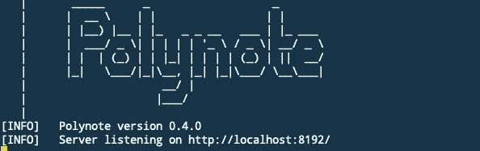
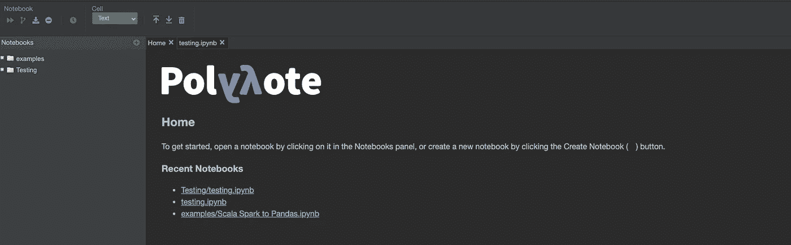
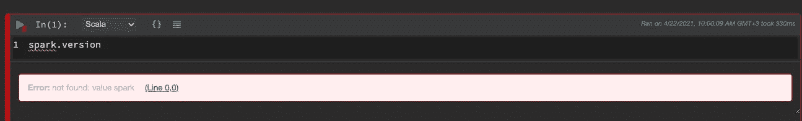
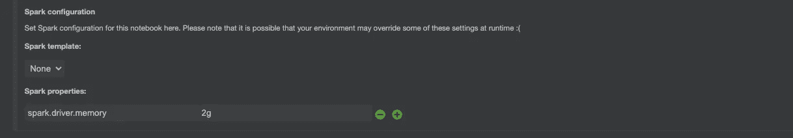
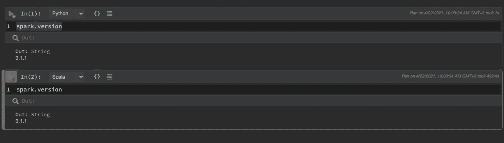
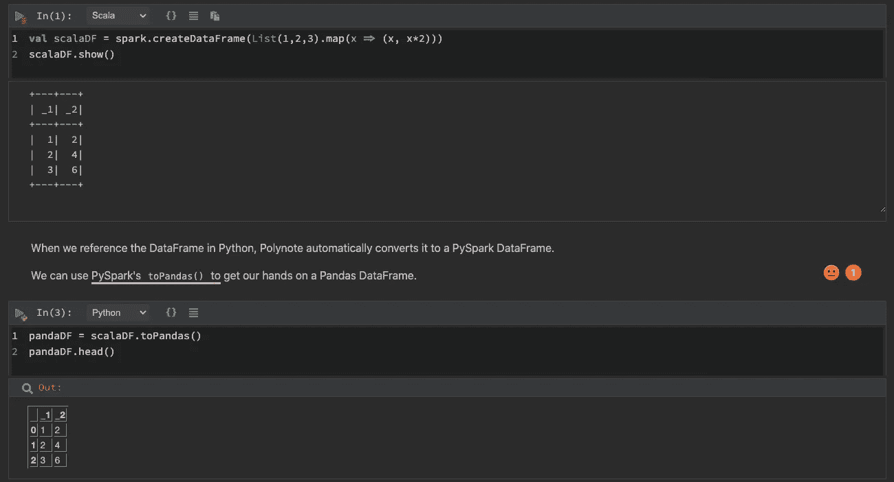

# 带 Spark 3.1 的多项式

> 原文：<https://towardsdatascience.com/polynote-with-spark-3-1-301ff6dbb9a2?source=collection_archive---------24----------------------->

## 多语言笔记本应用程序。在同一个笔记本中使用 python 和 scala 进行原型制作和试验。


照片由[希望之家出版社——皮革日记工作室](https://unsplash.com/@hope_house_press_leather_diary_studio?utm_source=unsplash&utm_medium=referral&utm_content=creditCopyText)在 [Unsplash](https://unsplash.com/s/photos/notebooks?utm_source=unsplash&utm_medium=referral&utm_content=creditCopyText)

# 介绍

我看过[冰间湖](https://polynote.org/)，我想，大概在 2019 年 10 月，在这篇[博文](https://medium.com/netflix-techblog/open-sourcing-polynote-an-ide-inspired-polyglot-notebook-7f929d3f447)中。那一刻我就爱上了它。对我来说，知道 python 几乎不费吹灰之力就试用了 scala，简直是梦想成真。我可以比较 Python 和 Scala 的执行时间，尝试 Dataset 和 Dataframe，做一些教程，甚至帮我写一篇博客。但当时，他们说它并不完美，还处于初级阶段。一年半过去了，我回来重新点燃这个火花(一语双关)。

我计划在我的 [GitHub](https://github.com/tomaspel) 中创建一个互动研讨会，提供示例、跟进和解释+动手实践任务，polynote 非常适合这里。有大量的教程，但不知何故，没有一个能引起我的共鸣，直到我开始用 spark 做更多的事情。通过向每个人提供我的内容，我希望能为社区做更多的贡献。请记住，准备适当内容需要时间；准备好了我可能会再发一篇博文:)

# 初步调查结果

最近(4 月 2 日)，他们发布了 [0.4.0](https://github.com/polynote/polynote/releases/tag/0.4.0) 版本。从上一个版本发布到现在的半年时间里，他们实现并修复了很多东西。此外，我只看到了 spark 2.4.5 版本，但没有 spark 3.1.1(或 3.0.1)，这两个版本已经发布了相当长一段时间。试图更新最新的功能，我认为使用最新的版本会很好。

我注意到在他们的 [GitHub](https://github.com/polynote/polynote) 里，他们有一个 Docker 文件夹，里面有基础镜像，spark 2.4.5 版本等等。我心想——我做了 [docker 101](/docker-101-ee3d2b8ace11) ，我认为我完全有能力使用基本图像和 Docker 知识创建自己的 Docker 图像。

# Docker 图像

Dockerfile 的大部分内容都是从[基础映像](https://github.com/polynote/polynote/blob/master/docker/base/Dockerfile)中重新使用的。做了一些调整以使用不同的 Scala 版本(2.12)和指定的 polynote 版本:

```
ARG *POLYNOTE_VERSION*="0.4.0"
ARG *SCALA_VERSION*="2.12"
ARG *DIST_TAR*="polynote-dist.tar.gz"
```

我必须添加的另一个调整是处理 spark 安装:

*   使用不同的工作目录
*   下载 spark 3.1.1(请记住，我特意选择了这个链接，因为它离我最近，下载速度会更快)
*   进行一些重命名并指定 ENV 变量

所以它看起来像这样:

```
WORKDIR /opt/spark/work-dirRUN wget [https://apache.mirror.serveriai.lt/spark/spark-3.1.1/spark-3.1.1-bin-hadoop3.2.tgz](https://apache.mirror.serveriai.lt/spark/spark-3.1.1/spark-3.1.1-bin-hadoop3.2.tgz)
RUN tar -xvf spark-3.1.1-bin-hadoop3.2.tgzRUN mv spark-3.1.1-bin-hadoop3.2/* /opt/spark
WORKDIR /opt/spark
ENV *SPARK_HOME*=/opt/spark
ENV *PATH*=$*PATH*:$*SPARK_HOME*/bin:$*SPARK_HOME*/sbin
ENV *PYSPARK_PYTHON*=python3
```

# 可执行文件和别名

也请阅读他们的[自述](https://github.com/polynote/polynote/tree/master/docker)以及所有的免责声明和更广泛的解释。

在他们的文档中，他们建议使用创建的 **config.yml** 文件运行 docker image，如下所示:

```
listen:
  host: 0.0.0.0storage:
  dir: /opt/notebooks
  mounts:
    examples:
      dir: examples
```

所以我们让我们的 docker 映像监听所有端口。出于 PoC 学习的目的，这很好，但是您不希望在生产中出现这种情况！

如果我们在 Polynote 中创建新的笔记本，它们将出现在笔记本文件夹中。你可以用更多的文件夹来组织它，等等。，合你心意。

他们打包了一些例子来理解它是如何工作的，我们把它们放在最后三行。

根据这篇[博客文章](/the-ultimate-guide-to-your-terminal-makeover-e11f9b87ac99)，为了让我的生活更轻松，我改装了我的终端。为了快速访问 Polynote，我更喜欢在一些命令上使用别名。为此，我创建了 **run_polynote.sh** ，，这非常简单:

```
docker build -it polynote_local:latest .
docker run --rm -it -p 127.0.0.1:8192:8192 -p 127.0.0.1:4040-4050:4040-4050 -v `pwd`/config.yml:/opt/config/config.yml -v `pwd`/notebooks:/opt/notebooks/ polynote_local:latest --config /opt/config/config.yml
```

我正在构建我的 docker 文件，并将其标记为 **polynote_local:latest** ，然后用我之前创建的 **config.yml** 运行它。

现在我需要修改我的。zshrc:


作者图片

通过执行

```
run_polynote
```

我会让我的冰穴运行。



作者图片

# 确认

为了确定我们所做的一切是否正确，我们需要打开 polynote 并运行代码

```
**spark.version**
```

了解我们是否在使用 3.1.1。

打开 0.0.0.0:8192 我们可以看到:



作者图片

让我们创建一个新笔记本；在我的例子中，我将其命名为“testing_for_demo”我们首先看到的是配置和依赖关系。在这里，我们可以指定多个不同的依赖项(Scala 或 Python)，Spark 配置等。
我注意到的一件事是，如果我没有通过任何 spark 配置运行 **spark.version** ，我会得到:



作者图片

为驱动程序内存添加简单配置使其工作:



作者添加了简单的火花配置图片

我们看到了什么:



我做了相同代码的两个版本，一个用 Python，另一个用 Scala。他们两个都很管用。

我真正喜欢的是与 docker 图像捆绑在一起的 **Scala Spark to Pandas** 示例。在那里，他们在 scala 中创建了一个数据框，并从 python 中的另一个节点访问它！



作者图片

# 结论

polynote——网飞的开源笔记本允许你运行你的 scala spark 代码，并从 python 中的另一个 note 访问它，允许你利用两个世界的优势。对于这篇博文，你可以在我的 [GitHub](https://github.com/TomasPel/workshops/tree/main/spark_101) 中查看所有的代码和文档。