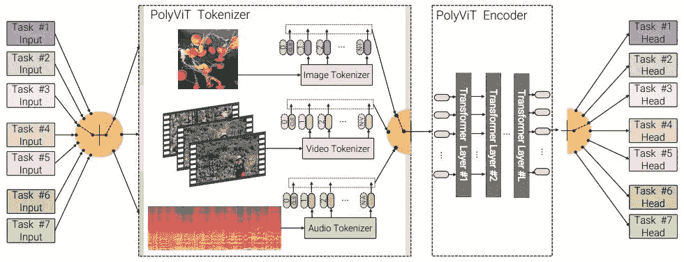
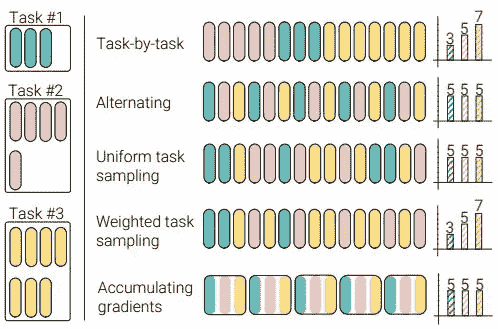
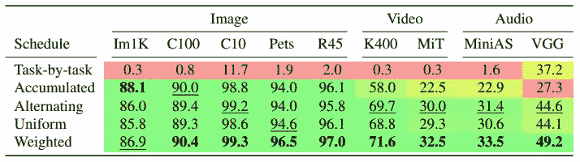
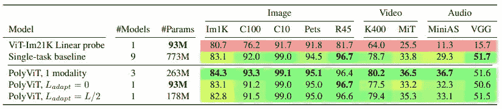

# PolyViT:在图像、视频和音频方面共同培训视觉转换者

> 原文：<https://towardsdatascience.com/polyvit-co-training-vision-transformers-on-images-videos-and-audio-f5e81bee9491?source=collection_archive---------23----------------------->

## 深度学习中的变形金刚

## 多模态是变压器时代高效和可扩展解决方案的前进方向

哈尔·盖特伍德在 [Unsplash](https://unsplash.com/s/photos/brain?utm_source=unsplash&utm_medium=referral&utm_content=creditCopyText) 上拍摄的照片

# 介绍

T2017 年发布的著名 Transformer [1]架构非常出色，打破了自然语言处理领域几乎所有的 SOTA 基准。然后，它被用于其他领域，如图像&视频分类、对象检测、音频分类，甚至在没有任何重大修改的情况下用于生成网络。众所周知的架构之一——视觉转换器[2]在 ImageNet 分类任务上取得了 SOTA 结果，从而奠定了计算机视觉领域的基础。我们现在有围绕深度学习保护伞下每个领域的变形金刚进行的主流研究。所实现的架构和结果是异常的，但是抛出了一个简单的问题，

> *我们是否需要每种设备都有一个模型？*

我们能为多个数据集训练一个单一的变压器模型吗？**poly vit**【3】旨在通过采用可用于在图像、视频和音频数据集上训练单个模型的协同训练方法来解决这一问题。就减少多种模式的工作量而言，这将是巨大的。

**注:**模态可视为“处理的输入类型”

# 背景

多任务学习在深度学习中并不新鲜。多任务学习的一个抽象想法是开发能够概括的架构，同时在多种类型的数据集(如图像、视频、语音、点云等)之间共享参数。重要的观察结果是，与单任务模型相比，表现有所下降，这反过来阻碍了对这一特定假设的更多研究。当更多的任务组合在一起时，性能进一步下降，这导致很少或没有鼓励研究人员进一步探索这个领域。就初始化和校准参数以实现稳定的训练/拟合而言，训练多任务模型也相当棘手。

> 这不也是一种模仿人脑的尝试吗？人脑可以毫不费力地学习各种形态的模式。

感知者[4]架构是一个转换器，可以使用潜在标记的交叉注意处理来处理、标记和训练不同的模态。但这不是一个参数共享的网络。我们有类似单元[5]和联合视频和图像编码器[6]的架构，它们采用多模态策略，但性能并不优于单任务模型。

# 理念与建筑

为了设置 PolyViT 的上下文，我们首先需要了解 3 种转换器架构，它们在各自的数据集模态中是最好的，

1.  图像视觉转换器(ViT)
2.  视频视觉转换器(ViViT)[7]用于视频
3.  音频声谱图转换器(AST)〔8〕

查看 ViT 上的这个[博客](https://amaarora.github.io/2021/01/18/ViT.html)，全面了解这个架构。ViViT 是 ViT 的延伸，与 ViT 中观察到的 2D 图像补丁相比，唯一显著的区别是称为小管的 3D 补丁(时空)。AST 只是一个在声谱图(语音/音频的时间-频率表示)图像上训练的 ViT。当在 ImageNet-21K 或 JFT 等数据集上进行预训练时，这三个模型都可以实现最佳性能。

PolyViT 架构说明了联合训练设置。图片鸣谢——波利维特[论文](https://arxiv.org/pdf/2111.12993.pdf)

来到 PolyViT，我们可以在上图中看到*编码器*是如何在设备间共享的。基础架构是一个预训练的 ViT，增加了特定任务的标记器和注意力头。对于三种模态图像、视频(帧序列)和音频中的每一种，我们都有单独的输入和位置嵌入以及类标记。编码过程是特定于模态的，以确保它满足不同数量的记号/模态。在训练期间，它在每一遍中执行来自一个模态的一个任务(图像模态中的图像分类任务)。

## 合作培训

该程序包括对不同的任务使用相同的超参数集，但是使用来自相同设备的小批量。通过随机梯度下降(SGD)来处理优化。构建小批量有多种方法——逐个任务、交替、累积梯度、均匀采样和加权采样。我们使用术语 *U* 来表示联合训练中 SGD 步骤的总数。

小批量取样方法。图片致谢— PolyViT [论文](https://arxiv.org/pdf/2111.12993.pdf)

从上面的方法中我们可以观察到，逐个任务的采样遵循一个顺序，其中 SGD 步骤应用于每个任务。任务顺序是随机的。交替采样是(确定性的)重复的，SGD 对每个任务执行一次。均匀采样包括从概率为 1/T 的均匀分布中构建批次，导致每个任务有 U/T 个步骤。加权采样是一种调度，它根据单任务模型中的步骤数为每项任务分配一定的权重。最后，累积渐变过程与其他过程有很大不同——在每个任务的单个向前和向后属性之后存储渐变，然后对整个批处理(包含多个任务)应用该参数。

> 我的直觉是，我们应该有一个任务，并只为此应用参数更新；在一个批处理中有各种各样的任务和更新将会把训练搞得一团糟。

无论使用哪种采样技术，都会导致定义的 *n* 任务的参数共享，这是 PolyViT 的主要目标之一。为了支持大量的模态，作者引入了一个特殊的模态特定层 L(adapt ),它在标记化之后立即应用。

# 结果和基准

现在，我们将观察 PolyViT 对各种数据集(如 ImageNet-1K、CIFAR-10 & 100、Kinetics400、Moments in Time (MIT)、AudioSet 和 VGGSound)的每种任务采样方法的结果。

PolyViT 接受了 9 项任务培训的各种任务采样方法的培训。L(adapt) = 0，这意味着不使用特定于模态的层。图片来源——波利维特[论文](https://arxiv.org/pdf/2111.12993.pdf)

结果重申了这样一个事实，即梯度更新应该是特定于任务的，以获得稳健的结果，并且如果是在逐个任务的采样中随机采样，则它的性能非常差。加权时间表被认为是最好的，因此在所有随后的实验中使用。这里要注意的一点是，每个任务的步骤数是从其单个任务基线得出的，这导致了与单独训练的 9 个任务相同的计算资源。太棒了，不是吗？

与单任务比较基准相比具有不同 L(适应)值的 PolyViT。图片鸣谢—波利维特[论文](https://arxiv.org/pdf/2111.12993.pdf)

在观察上述结果后，为单一模态(3 个模型，263 米)训练的 PolyViT 在 9 个任务中的 7 个任务中表现优于 SOTA 基准。对所有 9 项任务使用共同训练，它与 SOTA 结果相差 0.2-0.3%，参数减少了 3 倍(93M)。L(adapt) = 0 的 PolyViT 几乎在单任务基线的 1%以内，参数减少了 8 倍(773M 到 93M)。此外，我们可以得出结论，单模态联合训练提高了每个模态内较小数据集的准确性，证实了正则化的效果和适应较小数据集的能力，这在标准 ViT 模型中是看不到的。

类似地，在经过训练的 PolyViT 上进行实验，并在线性头上对下游任务进行评估。多模态 PolyViT 在 11 项任务中表现出色。此外，在一种模式内性能改善的鼓舞下，作者联合训练了单一模式的 PolyViT，其结果是在参数显著减少的情况下超过了 SOTA 基准。请参考 PolyViT 论文，了解上述实验和训练设置的更多细节(附录部分)。

# 我的想法

在我看来，这是一次出色的尝试，取得了 SOTA 级别的成果。我们有很多优点，如参数效率、单个模型而不是 n 个特定于任务的模型、易于实现和维护。推理时间在整个模态和任务中也是恒定的。

PolyViT 现在可以在边缘设备上部署重量相对较轻的多模变压器型号，而不是重量较重的特定任务型号。想想一个模型在一台设备上完成多项任务的可用性。这些途径肯定可以扩展和升级，这样我们就有希望拥有一个“用于大多数 ML 任务的单一模型”。此外，对较小数据集的正则化效果的事实是一个受欢迎的补充，使个体从业者/研究人员更容易防止过拟合问题。

我观察到的唯一一个小警告是，它与添加了 L(适应)层的完全参数共享模型的初始假设相反。由于 L(adapt) = 0 设置的模型的结果非常好，我们可以不予考虑，将 PolyViT 视为完全参数共享模型😊

# 结论

具有联合训练和单模态设置的 PolyViT 在 5 个标准视频和音频分类任务中超过了之前的 SOTA 结果。将其更改为多模态设置，它的效率很高，性能几乎没有下降(0.5–1%)。事实上，它可以学习和推广多任务，多模态(领域)与接近 SOTA 的性能本身就是一个巨大的胜利。第二大问题是在多模态设置中观察到的参数效率，与它们的单任务基线相比。由于具有鲁棒的表示，微调变得更加容易，无需任何超参数调整。仍然有实验的余地，可以使用更大的数据集，如 ImageNet-21K 数据集，并扩展到其他领域。

## 我的更多研究论文评论

</non-deep-networks-b0b80c65c7c6>  </expire-span-not-all-memories-are-created-equal-explained-ffcbd9663bfd>  </mlp-mixer-an-all-mlp-architecture-for-vision-7438fac99a06> [## MLP 混合器:全 MLP 的视觉建筑

towardsdatascience.com](/mlp-mixer-an-all-mlp-architecture-for-vision-7438fac99a06) 

# 参考

[1]变形金刚:[https://arxiv.org/pdf/1706.03762.pdf](https://arxiv.org/pdf/1706.03762.pdf)

[2]视觉变形金刚:【https://arxiv.org/pdf/1409.1556.pdf】T2

[3]波利维特:【https://arxiv.org/pdf/2111.12993.pdf】T4

[4]感知者:[https://arxiv.org/pdf/2103.03206](https://arxiv.org/pdf/2103.03206)

[5]单位:[https://arxiv.org/pdf/2102.10772.pdf](https://arxiv.org/pdf/2102.10772.pdf)

[6]联合视频和图像编码器:[https://arxiv.org/pdf/2104.00650.pdf](https://arxiv.org/pdf/2104.00650.pdf)

[7]视频视觉转换器:[https://arxiv.org/pdf/2103.15691](https://arxiv.org/pdf/2103.15691)

[8]音频声谱图变换器:[https://arxiv.org/pdf/2104.01778](https://arxiv.org/pdf/2104.01778)