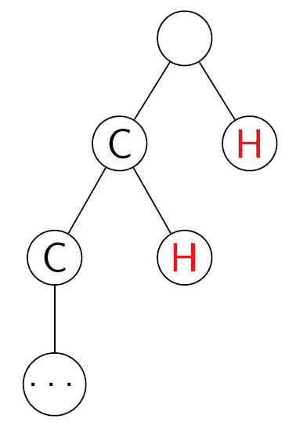
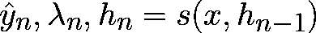
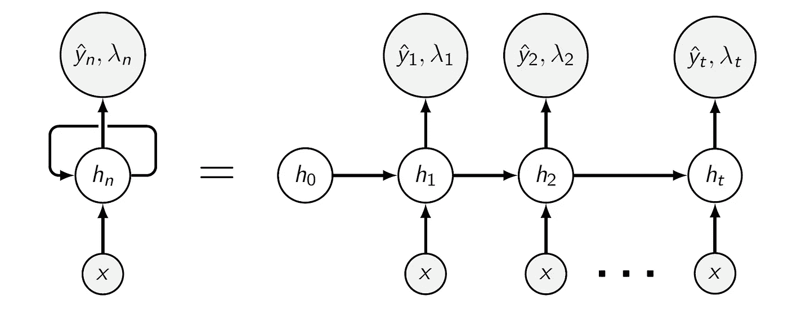
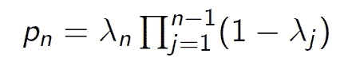
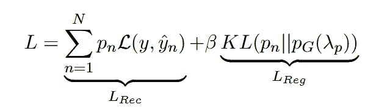
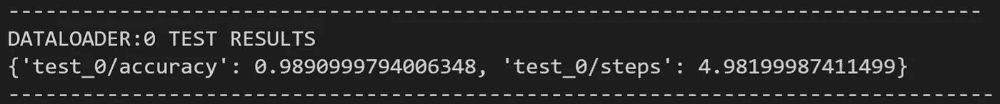
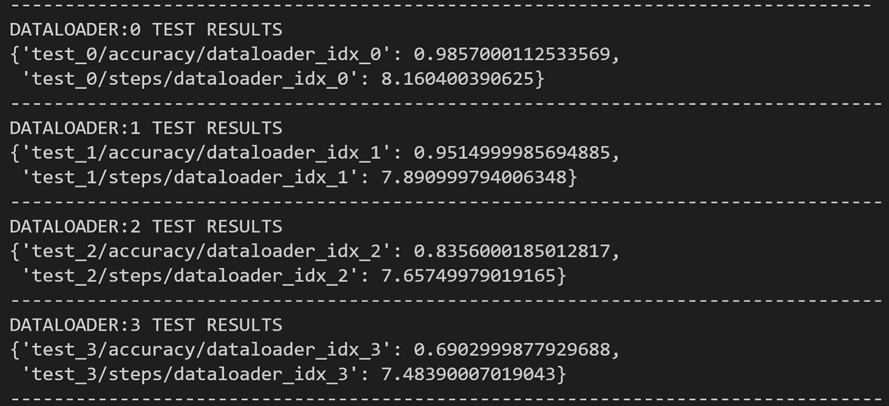

# 庞德奈特解释道

> 原文：<https://towardsdatascience.com/pondernet-explained-5e9571e657d?source=collection_archive---------20----------------------->

## 为 MNIST 数据集实现一个思考网络

你可以在 [this GitHub repo](https://github.com/conradkun/PonderNet_MNIST) 中找到这篇文章的代码。现在就克隆它！

你可以用[这个 Colab 笔记本](https://colab.research.google.com/drive/1ZIfcrpV_Pv6WCfRMHJw9x_0PMolOn6O_?usp=sharing)运行你阅读的代码。现在打开它！

[廷杰律师事务所](https://unsplash.com/@tingeyinjurylawfirm?utm_source=medium&utm_medium=referral)在 [Unsplash](https://unsplash.com?utm_source=medium&utm_medium=referral) 上拍摄的照片

如果我们真的想实现机器人霸主的反乌托邦未来，我们必须认识到，当前的人工智能永远不会成功。大多数现代神经网络都缺少某些东西，这是阻止它们统治世界的一个关键因素:它们无法思考。

幸运的是， *DeepMind* 最近发布了 [**PonderNet**](https://arxiv.org/abs/2107.05407) ，这是一个可能会让任何网络思考的框架。突然间，未来又变得光明了。

玩笑归玩笑，思考是一个重要的概念，可能会对我们如何设计新模型产生严重的影响。在这篇文章中，我们将讨论这个理论(你会惊讶于它有多简单！)和**实现了一个在 MNIST 数据集上执行图像分类的 PonderNet** 版本。在后面的部分，我们将进行一些**实验**来确定思考能力的影响力有多大。

我们将使用[**py torch Lightning**](https://www.pytorchlightning.ai/)作为我们的框架(因为它实在是太棒了)；如果你对它不熟悉，现在是学习基础知识的好时机！对于日志记录，我们将使用 [**权重&偏差**](http://wandb.ai/) (也因为它实在是太棒了)。我强烈建议您尝试一下，但是如果您喜欢不同的日志程序，您只需要修改一行代码(因为 PyTorch Lightning 实在是太棒了)。

</from-pytorch-to-pytorch-lightning-a-gentle-introduction-b371b7caaf09>  

# 1.动机

这一切都很好，但是思考它到底意味着什么呢？作者是这样表述的:

> **思考**就是根据任务的复杂程度来调整计算预算。

根据这个定义，很明显，机器学习研究人员和工程师**一直在思考**:每次他们选择特定数量的隐藏层，选择不同的 GPU 来训练他们的模型，或者做出任何影响网络架构的决定。

同样清楚的是，大多数电视网不能够考虑 T7。我们可以争辩说，数字 6 的图像确实很容易识别，而人们可能需要更多的时间来区分 1 和 7；然而，CNN 将花费相同数量的资源来预测这两种图像的标签。这主要是由于神经网络的刚性结构，以及它们如何充当黑盒映射。

PonderNet 从之前的研究[中创新出来，能够将更多的资源分配给它认为需要的投入。如果我们希望模型学习超越当前的最先进水平，这是一个关键属性。这也是在经典算法的背景下思考神经网络的一步，可以为该领域带来许多新鲜的想法(不要错过美丽的](https://arxiv.org/abs/1603.08983)[附录 E](https://arxiv.org/pdf/2107.05407.pdf) )。

# 2.PonderNet 框架

在这一节中，我们将放下 PonderNet 背后的所有理论。首先，让我们试着理解它是如何在高水平上调整其计算预算的。

## 直觉

假设我们有一个想要解决的任务(例如，对 MNIST 的数字进行分类！)和解决它的模型(如 good ol' CNN)。传统的方法是简单地处理一次输入并产生一个输出。相比之下，PonderNet 框架允许输入被多次处理，并且能够找到合适的时间停止并输出结果。

图 PonderNet 的选项。(图片由作者提供)

概括地说，PonderNet 做了以下工作:

*   处理原始输入。
*   产生一个预测和一个在当前步骤停止计算的概率。
*   抛硬币决定是“暂停”还是“继续”。
*   如果我们暂停，输出最新的预测；否则，再次处理输入以及一些上下文信息。

图 1 通过将暂停选项表示为二叉树总结了这一思想。

## 形式定义

更正式地说，我们可以将 PonderNet 框架定义为满足以下等式的阶跃函数 *s* (通常是神经网络):

这里， *x* 表示原始输入，两个 *h* 表示通过不同步骤传播的隐藏状态， *y* 是当前步骤的输出，λ是在当前步骤停止的概率。

换句话说，这意味着在每一步，PonderNet 都获取原始输入和最新的隐藏状态，并为新的一步产生一个预测、停止的概率和更新的隐藏状态。它将以概率λ投掷一枚有偏向的硬币，以决定是暂停并输出 *y* 还是通过进一步传播 *h* 来继续。

图 2:展开的 PonderNet。(图片由作者提供)

图 2 非常直观地显示了隐藏状态如何流经所有步骤，以及每一步如何产生一对输出和停止的概率。如果你熟悉 RNNs，你会在结构中发现一些**相似之处。**

</recurrent-neural-networks-rnns-3f06d7653a85>  

## λ的含义

值得注意的是，从技术上讲，λ是在当前步骤*停止的概率，假定*在之前的步骤中没有发生停止。这使得我们可以将λ视为一个**伯努利随机变量**的概率，它告诉我们是否应该在当前步骤停止。如果我们希望找到在当前步骤停止的*无条件*概率(此后为 *p* ，它还必须包括在先前步骤中不停止的概率:

## 思考步骤

我们通常只允许特定的最大数量的“思考步骤”。这意味着我们将在最后一步强制λ为 1，从而保证停止。

在推理过程中，我们并不明确需要这样的限制，因为我们可以让网络无限期地运行，直到其中一个硬币的投掷使它自然停止；然后，我们将输出在该步骤中获得的 *y* 。尽管如此，限制思考的步骤仍然是一个好主意，因为从理论上讲**它可以永远运行**。

在训练期间，由于损失函数，思考步骤的界限是必需的，正如我们现在将看到的。

## 训练思考网

像几乎所有的神经网络一样，PonderNet 试图优化一个损失函数:

让我们来分析一下。 *L* 可分为两种损失，即**重构损失**和**正则化损失**(类似于 VAEs)；这两者之间的权衡由超参数β调节。在这两种情况下，损失可以分解成 N 个项；这是我们思考步骤的最大数量。

重建损失是非常直观的:对于我们思考的每一步，我们计算该步输出的损失，并以我们在其中停止的无条件概率进行加权。从这个意义上说，重建损失无非是跨越所有步骤的**预期损失**。请注意，在整个计算过程中，我们使用的是我们试图解决的任务的潜在损失函数(在多类分类的情况下，交叉熵)。

正则化损失在停止应该如何表现方面引入了偏差。它试图最小化由有质网生成的暂停分布和具有某个超参数λ *p* 的先验几何分布之间的**KL-散度**。对于那些不熟悉 KL-divergence 的人，可以随意查看下面的链接；直观上，我们所说的是我们希望网络产生的所有λ都接近λ *p.*

</light-on-math-machine-learning-intuitive-guide-to-understanding-kl-divergence-2b382ca2b2a8>  

这个正则项的影响是双重的。一方面，我们**将预期的思考步骤数**偏向 1/λ *p* (因为这是几何分布的预期值)。另一方面，它**促进探索**通过在任何步骤中给予正概率来停止，不管它有多远。

# 3.为 MNIST 实施 PonderNet

没那么糟吧。我们现在准备开始动手了！请记住，在阅读时，您是按照本文的 Colab 笔记本来运行代码的。如果你想在本地运行它，所有的代码(和一些额外的东西！)可以在这个 [GitHub repo](https://github.com/conradkun/PonderNet_MNIST) 中找到；如果你发现任何错误，不要犹豫，打开一个问题！

## 数据模块

让我们首先解决数据模块的问题。这里没有什么新奇的东西，除了这个数据模块允许你拥有**多个测试数据加载器**(这是一个惊喜的工具，以后会对我们有帮助！).

## 损耗

我们将损失中的每一项分别建模，作为扩展`nn.Module`的两个不同类别。让我们从**重建损失**说起。我们唯一需要做的是计算加权平均值，这很容易实现:

至于正则化损失，还有一些多余的细节要讲。为了计算生成的暂停分布和我们的先验之间的 KL-divergence，我们将首先制造我们的先验的值，这在初始化函数中完成。

最后，我们创建一个类来将这两个损失包装在一起，以便它们可以紧凑地传递给函数。

## 助手模块

为了使我们的生活更容易，我们为一个简单的 CNN 创建了一个类。这将用于将图像嵌入到 PonderNet 中的矢量表示中。

同样，我们创建了一个基本的多层感知器，将图像嵌入与 PonderNet 内部的隐藏状态结合起来。

## PonderNet

最后，我们得到了重要的东西。为了更详细地评论`LightningModule`的不同部分，它内部的一些函数将在单独的代码片段中显示；只要记住他们都属于同一类！

我们的 PonderNet 具体实现由多个子模块组成。首先，CNN 将图像嵌入到矢量表示中。该向量与对应于前一步骤的隐藏状态连接，并通过 MLP 获得当前步骤的隐藏状态。这又被推过两个不同的线性层，一方面获得预测的逻辑，另一方面获得 lambdas 的逻辑。下面的片段显示了这些子模块如何被声明为 PonderNet 的一部分，以及损耗和一些指标:

我们现在到达了可以说是代码中最复杂的部分:向前传递**。获得 *h* ， *y* 和λ是直截了当的，记住，为了获得λ，你必须使用 sigmoid 函数，否则你就不能强迫它成为一个概率。**

**由于我们是成批操作的，所以当涉及到网络停止的思考步骤时，我们需要找到一种方法来单独跟踪每个元素。为此，我们维护一个向量`halting_step`,对于每个元素，如果 PonderNet 尚未停止，则该向量为 0，否则停止的步骤为 0。当然，更新`halting_step`包括在每一步从伯努利分布中提取，以确定网络是否应该停止。**

**最后，我们还维护了一个向量`un_halted_prob`，它帮助我们以一种廉价而快速的方式获得每一步的 *p* 的值。**

**最后，我们返回所有批处理元素和所有步骤的所有预测、所有批处理元素和所有步骤的所有 *p* 以及所有批处理元素的暂停步骤。**

**由于需要处理前向传递的输出以获得损失(在一些情况下我们需要这样做)，我们定义了一个帮助函数来计算损失、预测和一些其他指标。**

**`if`条件有助于规避我个人遇到的一个技术问题。在训练的早期阶段，对于选定的步骤，一些 *p* 值可以是 0。当这通过正则化损失时，零点变成负无穷大，网络最终开始返回 nan。忽略包含值为 0 的 *p* 的元素解决了这个问题，并且这些相同的元素在后面的时期被正确分类。**

**最后，PyTorch Lightning 模块中需要的其他常用功能可以在下面找到。这些包括日志和一些回调，使培训更加用户友好。**

## **运行插值实验**

**我们基本上完成了！这就是 PyTorch 闪电的美妙之处。使用下面的代码片段，我们将能够在香草 MNIST 上运行一个基本的实验；我们的记录者将在整个训练过程中记录损失(一起和单独的)、准确性和思考步骤。如果您想使用不同的记录器，您只需要从 PyTorch Lightning 导入支持的类，并在第 40 行中相应地实例化它；就这么简单！**

**下面是我们在 MNIST 测试集上评估时获得的正确率和思考步骤的平均数。正如我们所见，PonderNet 做得很好。更有趣的是，思考步骤的平均数量非常接近 5，这是 1/λ *p* 的值，即预期的步骤数量；这意味着我们的正规化确实在起作用！**

****

# **4.我们真的在思考吗？**

**运行上面的代码应该可以让你相信，PonderNet 至少可以在 MNIST 上获得相当高的精度…但是我们使用了它的任何属性吗？难道我们不能用一个简单的 CNN 取得类似的结果吗？我们如何知道它确实对更难的输入考虑得更久？我们将试图通过外推实验来回答其中的一些问题。**

**阅读原始论文，人们可能会对实验如何在**玩具数据集**或**任务上进行感到有点沮丧，这些任务是如此复杂**以至于不可能解释任何东西。MNIST 数据集提供了一个中间地带，在这里，任务肯定没有被设计为使用 PonderNet 产生预期的结果，并且其结果在某种程度上是可以解释的。**

**我们实验的前提是**旋转的图像更难分类**。遵循与 PonderNet 论文中提出的框架相似的框架，我们将对“稍微硬”的输入进行训练，并对一系列“硬”输入进行评估。特别是，我们将对旋转了 22.5 度的图像进行训练，并对旋转了 22.5 度、45 度、67.5 度和 90 度的图像进行评估。我们预计准确率会逐渐下降(一些图像一旦旋转到这种程度，甚至可能无法分类)，但希望我们看到步骤数的**增加，这表明网络发现任务更难了，并决定分配更多资源给它。下面是这样一个实验的代码:****

**我们进行这个实验后得到的结果有点争议。一方面，在任何旋转数据集上进行测试确实需要的平均步骤数明显高于插值实验所需的步骤数，这意味着 PonderNet 认为对旋转图像进行分类是一项**更困难的任务**。**

**然而，另一方面，网络似乎需要更少的步骤来实现更明显的旋转，这是违反直觉的。我们希望 PonderNet 对高度倾斜的图像不确定，从而分配更多的资源用于它们的分类和更长时间的思考，但似乎它反而变得不正确。精度也会降低，尽管在这种情况下，这是意料之中的。**

****

**注意:此处的数据加载器分别对应 22.5 度、45 度、67.5 度和 90 度旋转。**

# **5.结论**

**PonderNet 是深度学习领域的一个很好的补充。它以数学为基础的设计选择有足够的理由让**对它的可能性感到**兴奋，原始论文中呈现的结果令人鼓舞。然而，可悲的是，并没有多少努力去诚实地解释这个网络真正的能力。**

**我们试图通过实现 MNIST 的 PonderNet(该领域的通用基准)来阐明这个问题，并通过在不同难度的任务中训练网络来进行实验。**

**我们的结果是不确定的，因为在某些方面它们与我们的预期一致，而在另一些方面则不一致。这可能有多种原因。一方面，很有可能旋转的角度对于这个特定任务的复杂性来说不是一个很好的启发，我的人类偏见干扰了实验设计。另一方面，我们不能放弃这样一种可能性，即 PonderNet 并不是我们所希望的全能框架；毕竟这方面还有很多研究要做。**

**总而言之，我希望你今天学到了一些东西；也许是我启发你在自己的项目中尝试了 PonderNet！我很乐意听到您的任何意见、问题或建议。**感谢您的阅读！****

# **6.承认**

**如果没有三个主要来源，这篇博文是不可能发表的。**

*   **第一个是[Yannic Kilcher 的 YouTube 视频](https://www.youtube.com/watch?v=nQDZmf2Yb9k)解释了 PonderNet 的基础知识；如果你没有订阅他的频道，我不知道你在做什么！**
*   **PonderNet 实现的一个重要部分是从 MildlyOverfitted 的[这个 GitHub repo](https://github.com/jankrepl/mildlyoverfitted/tree/b8765bd66893f1ec7f373559bdce61c4766ceba9/github_adventures/pondernet) 借来的。虽然在我偶然发现他的代码之前，我已经有了一个运行的原型，但我还是忍不住使用了他的酷把戏！**
*   **最后，一些样板代码取自本教程中关于 PyTorch Lightning 的[和权重&偏差。](https://colab.research.google.com/github/wandb/examples/blob/master/colabs/pytorch-lightning/Supercharge_your_Training_with_Pytorch_Lightning_%2B_Weights_%26_Biases.ipynb)**

**最后，我要感谢我的导师 Fabian Laumer，他鼓励我尝试不同的东西，作为我的研讨会演示的一部分。我可能在这个小项目上损失了几十个小时，但我确实学到了很多！**

## **参考**

**[1] A .巴尼诺，j .巴拉格尔，c .布伦德尔，[庞德奈特:学会思考](https://arxiv.org/abs/2107.05407) (2021)，arXiv: 2107.05407。**

**[2] A. Graves，[递归神经网络的自适应计算时间](https://arxiv.org/abs/1603.08983) (2017)，arXiv: 1603.08983。**