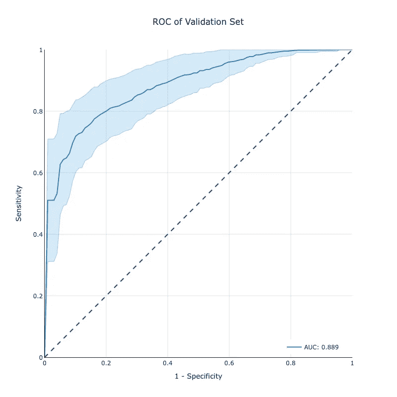
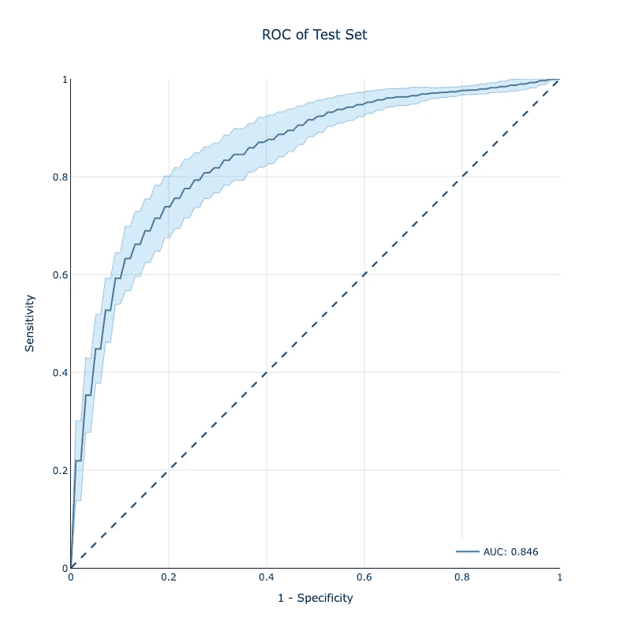

# 带置信区间的简易 ROC 曲线

> 原文：<https://towardsdatascience.com/pooled-roc-with-xgboost-and-plotly-553a8169680c?source=collection_archive---------6----------------------->

## 在合并的 ROC 图中显示分类器性能的稳健性


凯尔·格伦在 [Unsplash](https://unsplash.com/s/photos/uncertainty?utm_source=unsplash&utm_medium=referral&utm_content=creditCopyText) 上的照片

在机器学习中，一个至关重要的规则是，在你对单独使用训练数据的结果感到满意之前，你不应该根据以前看不见的数据(也就是你的测试集)对你的模型进行评分。

为了显示模型的性能和稳健性，可以在训练数据中使用多个训练集和测试集。为了避免混淆，如果它是训练数据的一部分，我们称之为验证集。将训练数据分成多个训练集和验证集称为交叉验证。集合的比率、大小和数量取决于交叉验证方法和训练集的大小。最常见的可能是 K-Fold，但是根据训练集的大小，您可能希望尝试 Bootstrapping 或留一法。每种方法都有优点和缺点，比如每折叠增加训练集或验证集的大小。我就不赘述了，Medium 上有很多关于这个话题的牛逼文章。

因此，我们使用某种交叉验证和分类器来多次训练和验证模型。这种方法会产生一系列得分结果。可能最常见的度量是 ROC 曲线，用来比较彼此之间的模型性能。它没有考虑到阶级的不平衡，这使得它可以与其他用不同数据训练但在相同研究领域的模型进行比较。ROC 曲线的一个很好的补充是 PRC 曲线，它考虑了类别不平衡，并有助于判断用相同数据训练的不同模型的性能。但是，在 Medium 上已经有很多关于各种指标的精彩文章了。为了得到一条 ROC 曲线，你基本上绘制了真阳性率(TPR)对假阳性率(FPR)。为了表明模型的性能，您需要计算 ROC 曲线下的面积(AUC)。

假设我们在 100×5 重交叉验证中训练了一个 XGBoost 分类器，得到了 500 个结果。对于每个折叠，我们必须提取 TPR(也称为敏感性)和 FPR(也称为特异性),并计算 AUC。基于这一系列的结果，你实际上可以给出一个置信区间来显示你的分类器的稳健性。

由于这是专门为了展示如何构建一个汇集的 ROC 图，我将不运行特征选择或优化我的参数。

首先，我们导入一些包并加载一个数据集:

```
import numpy as np
import pandas as pd
import plotly.graph_objects as go
from tqdm.notebook import tqdm
from sklearn.model_selection import RepeatedKFold
import xgboost as xgb
from sklearn.model_selection import train_test_split
from sklearn.metrics import roc_auc_score, roc_curveurl = '[https://archive.ics.uci.edu/ml/machine-learning-databases/heart-disease/processed.cleveland.data'](https://archive.ics.uci.edu/ml/machine-learning-databases/heart-disease/processed.cleveland.data')
df  = pd.read_csv(url, header=None)
```

有几个丢失的值标为“？”，我们必须首先删除它们:

```
for i in range(13):
    df[i] = df[i].apply(lambda x: np.nan if x=='?' else x)
    df[i] = df[i].astype(float)
df = df.dropna()
```

克利夫兰癌症数据集有一个编码为 0-4 的目标，我们将把它二进制化为类 0，所有目标编码为 0，1，所有目标编码为 1-4。

```
def binarize(x):
    if x==0:
        value=0
    else:
        value=1
    return valuedf[13] = df[13].map(binarize)
```

接下来，我们定义我们的特征和标签并分割数据:

```
X = df.drop(13, axis=1)
y = df[13]
```

现在我们对数据进行分层分割，以保留潜在的阶级不平衡:

```
X_train, X_test, y_train, y_test = train_test_split(X, y, test_size=0.3, random_state=101, stratify=y)
```

我们现在可以使用我们的火车设置来获得折叠。我使用重复的 k-fold 来获得更多的分数结果:

```
cv    = RepeatedKFold(n_splits=5, n_repeats=100, random_state=101)
folds = [(train,test) for train, test in cv.split(X_train, y_train)]
```

让我们建立一个字典来收集我们的结果:

```
metrics = ['auc', 'fpr', 'tpr', 'thresholds']
results = {
    'train': {m:[] for m in metrics},
    'val'  : {m:[] for m in metrics},
    'test' : {m:[] for m in metrics}
}
```

要初始化 XGBoost，我们必须选择一些参数:

```
params = {
    'objective'   : 'binary:logistic',
    'eval_metric' : 'logloss'
}
```

现在是时候运行我们的交叉验证并将所有分数保存到我们的字典中了:

```
dtest = xgb.DMatrix(X_test, label=y_test)
for train, test in tqdm(folds, total=len(folds)):
    dtrain = xgb.DMatrix(X_train.iloc[train,:], label=y_train.iloc[train])
    dval   = xgb.DMatrix(X_train.iloc[test,:], label=y_train.iloc[test])
    model  = xgb.train(
        dtrain                = dtrain,
        params                = params, 
        evals                 = [(dtrain, 'train'), (dval, 'val')],
        num_boost_round       = 1000,
        verbose_eval          = False,
        early_stopping_rounds = 10,
    )
    sets = [dtrain, dval, dtest]
    for i,ds in enumerate(results.keys()):
        y_preds              = model.predict(sets[i])
        labels               = sets[i].get_label()
        fpr, tpr, thresholds = roc_curve(labels, y_preds)
        results[ds]['fpr'].append(fpr)
        results[ds]['tpr'].append(tpr)
        results[ds]['thresholds'].append(thresholds)
        results[ds]['auc'].append(roc_auc_score(labels, y_preds))
```

这是一个相当简单的程序。也有可能在`xgb.cv`方法中使用`feval`，将您的分数放入一个自定义函数中，但是我的体验是，这要慢得多，也更难调试。

现在我们有了来自 100 个交叉验证折叠的结果，我们可以绘制我们的 ROC 曲线:

```
kind = 'val'c_fill      = 'rgba(52, 152, 219, 0.2)'
c_line      = 'rgba(52, 152, 219, 0.5)'
c_line_main = 'rgba(41, 128, 185, 1.0)'
c_grid      = 'rgba(189, 195, 199, 0.5)'
c_annot     = 'rgba(149, 165, 166, 0.5)'
c_highlight = 'rgba(192, 57, 43, 1.0)'fpr_mean    = np.linspace(0, 1, 100)
interp_tprs = []
for i in range(100):
    fpr           = results[kind]['fpr'][i]
    tpr           = results[kind]['tpr'][i]
    interp_tpr    = np.interp(fpr_mean, fpr, tpr)
    interp_tpr[0] = 0.0
    interp_tprs.append(interp_tpr)
tpr_mean     = np.mean(interp_tprs, axis=0)
tpr_mean[-1] = 1.0
tpr_std      = 2*np.std(interp_tprs, axis=0)
tpr_upper    = np.clip(tpr_mean+tpr_std, 0, 1)
tpr_lower    = tpr_mean-tpr_std
auc          = np.mean(results[kind]['auc'])fig = go.Figure([
    go.Scatter(
        x          = fpr_mean,
        y          = tpr_upper,
        line       = dict(color=c_line, width=1),
        hoverinfo  = "skip",
        showlegend = False,
        name       = 'upper'),
    go.Scatter(
        x          = fpr_mean,
        y          = tpr_lower,
        fill       = 'tonexty',
        fillcolor  = c_fill,
        line       = dict(color=c_line, width=1),
        hoverinfo  = "skip",
        showlegend = False,
        name       = 'lower'),
    go.Scatter(
        x          = fpr_mean,
        y          = tpr_mean,
        line       = dict(color=c_line_main, width=2),
        hoverinfo  = "skip",
        showlegend = True,
        name       = f'AUC: {auc:.3f}')
])
fig.add_shape(
    type ='line', 
    line =dict(dash='dash'),
    x0=0, x1=1, y0=0, y1=1
)
fig.update_layout(
    template    = 'plotly_white', 
    title_x     = 0.5,
    xaxis_title = "1 - Specificity",
    yaxis_title = "Sensitivity",
    width       = 800,
    height      = 800,
    legend      = dict(
        yanchor="bottom", 
        xanchor="right", 
        x=0.95,
        y=0.01,
    )
)
fig.update_yaxes(
    range       = [0, 1],
    gridcolor   = c_grid,
    scaleanchor = "x", 
    scaleratio  = 1,
    linecolor   = 'black')
fig.update_xaxes(
    range       = [0, 1],
    gridcolor   = c_grid,
    constrain   = 'domain',
    linecolor   = 'black')
```

你可以通过使用 plotlys `toself`填充方法使代码更短，但是这样你在颜色或者上下边界的特定变化方面更灵活。这是我们 KFold 程序中验证集的分数结果:



验证集得分的 ROC

当你调整了你的模型，发现了一些更好的特性，优化了你的参数后，你可以通过将上面代码中的`kind = 'val'`改为`kind = 'test'`，为你的测试数据绘制同样的图形。让我们看看这些模型在我们的测试集上表现如何:



测试集上分数的 ROC

当然，您可以使用相同的过程来构建精确召回曲线(PRC ),并保存每个折叠的特征重要性，以便在类不平衡较高时检查性能，或者了解您的特征的健壮性。

因为我们使用`plotly`来绘制结果，所以该图是交互式的，可以在`streamlit`应用程序中可视化。

希望这有助于一些数据科学家同事展示他们的分类器的性能。感谢阅读！