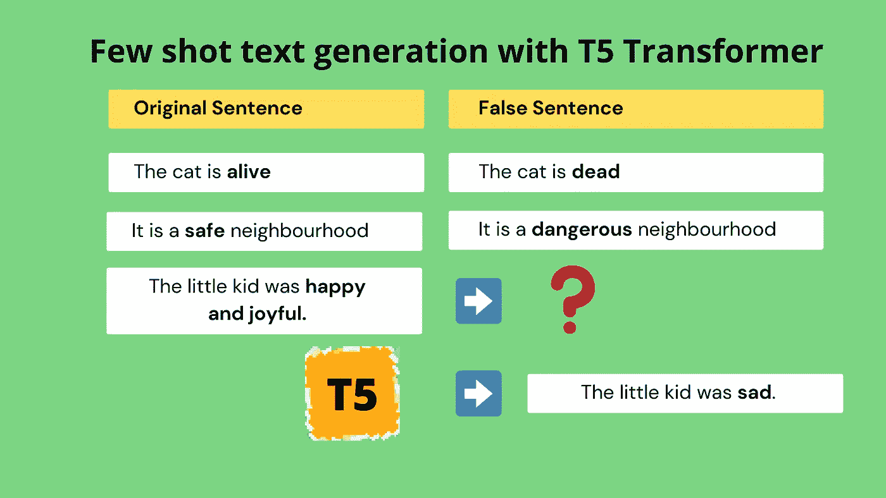
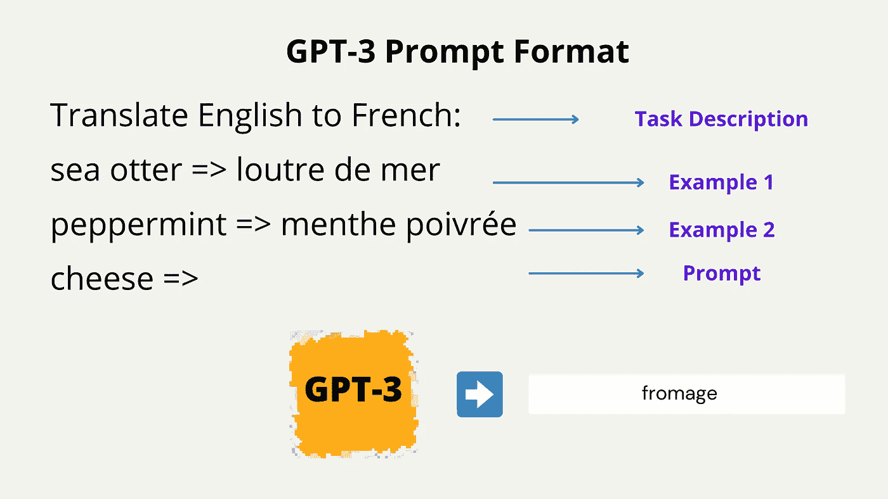
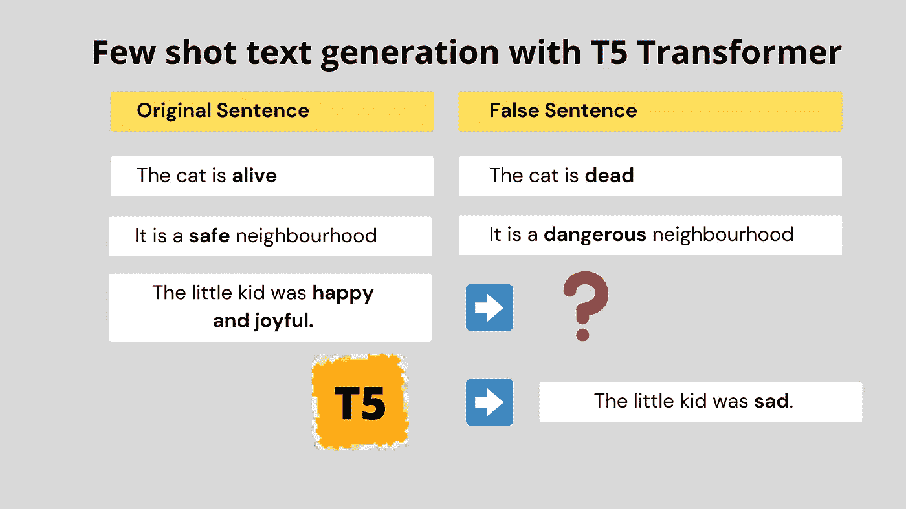

# 可怜人的 GPT-3:用 T5 变压器生成少量的镜头文本

> 原文：<https://towardsdatascience.com/poor-mans-gpt-3-few-shot-text-generation-with-t5-transformer-51f1b01f843e?source=collection_archive---------6----------------------->

## 用 HuggingFace 生成少量文本的极简代码



作者图片

我相信你们大多数人都听说过 OpenAI 的 GPT-3 和它疯狂的文本生成能力，只从几个例子中学习过。

用很少的训练数据喂养一个模型，并让它学会完成一项新颖的任务，这种概念被称为**少镜头学习。**

一个网站 [GPT-3 示例](https://gpt3examples.com/)收集了自 GPT-3 发布以来社区提出的所有令人印象深刻的应用程序。GPT-3 显示生成**整个前端代码**仅仅从一个网站看起来如何的文本描述。它显示了如何从一份简短的简介(描述)中生成一份**完整的营销文案**。你可以在网站上查看更多令人印象深刻的应用程序。

GPT-3 本质上是一个**文本到文本**转换器模型，其中你展示了输入和输出文本的**几个例子(少量学习)**，稍后它将学习从给定的输入文本生成输出文本。

GPT-3 提示符如下所示。你输入几个例子(输入->输出)，然后**提示** GPT-3 填写一个输入。



作者图片

但是 GPT-3 不是开源的，对于你的用例来说，API 的成本可能会很高。

现在，在从事我的开源问题生成项目 [Questgen.ai](https://github.com/ramsrigouthamg/Questgen.ai) 时，我意识到了谷歌的 [T5 Transformer](https://ai.googleblog.com/2020/02/exploring-transfer-learning-with-t5.html) 的文本到文本的能力，我决定让 T5 在一个未经训练的任务上做同样的事情，看看结果。

我必须说，通过让 T5 基础模型从几个例子中学习，结果相当令人印象深刻。

所以我给的任务是这样的—



作者图片

## 输入:

我通过把**主形容词**换成与相对的**词，给出了几个**句子对**，它们是彼此的**假句**。**

例句:猫是活着的

**仅使用(~10 个样本)和< 5 mins of training T5 was able to generate impressive results on unseen sentences.**

## ****输出进行训练后:****

**T5 时刻提示:水手**开心快乐**。**

**T5 生成的句子(通过[波束搜索](https://huggingface.co/blog/how-to-generate)从前 3 个响应中选出) :**

*   **水手很不高兴**。****
*   ****那个水手很伤心**。******

******提示到 T5:乌龟非常**慢**。******

****T5 生成的句子(通过[波束搜索](https://huggingface.co/blog/how-to-generate)从前 3 个响应中选出) :****

*   ****乌龟跑得非常快。****
*   ****乌龟非常快。****

****事不宜迟，让我们看看代码。****

# ****密码****

****对我来说，编写代码是一次有趣的探索。我不得不仔细阅读[拥抱脸](https://medium.com/u/b1574f0c6c5e?source=post_page-----51f1b01f843e--------------------------------)文档，想出用 T5 变压器写一个**极简**正向传递和反向传播代码。****

## ****Colab 笔记本****

****一个整洁有序的 Google Colab 笔记本在这里可以买到****

## ****1.1 安装****

****安装 HuggingFace transformers 并检查 Colab 上的 GPU 信息。****

```
**!pip install transformers==2.9.0!nvidia-smi**
```

## ****1.2 必要的导入和模型下载****

****首先从变形金刚库中导入一些必要的东西-****

```
**import random
import pandas as pd
import numpy as np
import torch
from torch.utils.data import Dataset, DataLoaderfrom transformers import (
    AdamW,
    T5ForConditionalGeneration,
    T5Tokenizer,
    get_linear_schedule_with_warmup
)def set_seed(seed):
  random.seed(seed)
  np.random.seed(seed)
  torch.manual_seed(seed)set_seed(42)**
```

****初始化模式及其标记器-****

```
**tokenizer = T5Tokenizer.from_pretrained('t5-base')
t5_model = T5ForConditionalGeneration.from_pretrained('t5-base')**
```

****初始化优化器—****

****这里，我们提到在计算每个参数相对于损耗的梯度之后，T5 模型的哪些参数需要更新。****

```
**# optimizer
no_decay = ["bias", "LayerNorm.weight"]
optimizer_grouped_parameters = [
    {
        "params": [p for n, p in t5_model.named_parameters() if not any(nd in n for nd in no_decay)],
        "weight_decay": 0.0,
    },
    {
        "params": [p for n, p in t5_model.named_parameters() if any(nd in n for nd in no_decay)],
        "weight_decay": 0.0,
    },
]
optimizer = AdamW(optimizer_grouped_parameters, lr=3e-4, eps=1e-8)**
```

## ****1.3 培训数据****

****用于我们的 T5 少数镜头文本生成任务的完整训练数据(约 10 个样本)。****

## ****1.4 训练模型****

****这是一个简单的循环，我们用上面的样本训练 T5 模型。****

****在这里，我们训练 10 个历元，遍历来自我们训练数据的每个样本对。我们得到每一步的损失，**计算梯度**(损失。向后)和**更新权重**(优化器。step)，这是所有深度学习算法的标准。****

****大部分的努力是在理解和让 T5 训练这个简单的循环:)****

****就是这样。根据 GPU 的不同，模型在 5 分钟或更短的时间内完成训练，并准备好用一些看不见的样本进行测试。****

## ****测试模型****

****测试句子:水手很快乐。****

****使用波束解码，我们得到代码生成的前 3 个句子****

*   ****水手不高兴了****
*   ****水手很伤心****
*   ****水手很高兴****

## ****再来一个:****

****测试句子:乌龟非常慢。****

****使用波束解码，我们得到代码生成的前 3 个句子****

*   ****乌龟非常慢****
*   ****乌龟跑得非常快****
*   ****乌龟非常**敏捷******

****如你所见，T5 能够生成一个给定句子的假句子，即使它之前在训练中没有见过那些**形容词**或**句子单词**。****

# ****奖金****

****如果你已经走到这一步，我有一个奖励给你:)****

****使用 HuggingFace [的**最新版本**在 **Pytorch Lightning** 格式中找到相同的代码](https://t.co/XkhOpaQo91?amp=1)****

# ****使用自然语言处理的问题生成——教程****

****我推出了一个非常有趣的 Udemy 课程，名为“使用 NLP 生成问题”,扩展了这篇博文中讨论的一些技术。如果你想看一看，这里是[链接](https://www.udemy.com/course/question-generation-using-natural-language-processing/?referralCode=C8EA86A28F5398CBF763)。****

# ****结论****

****希望你喜欢我们为**少数镜头**文本生成任务探索 T5 的方式，就像 GPT 3 一样。****

****当我去年开始探索 T5 时，我意识到了它的潜力。它可以非常有效地完成相当多的文本到文本的任务。****

****祝 NLP 探索愉快，如果你喜欢它的内容，请随时在 Twitter 上找到我。****

****如果你想学习使用变形金刚的现代自然语言处理，看看我的课程[使用自然语言处理的问题生成](https://www.udemy.com/course/question-generation-using-natural-language-processing/?referralCode=C8EA86A28F5398CBF763)****