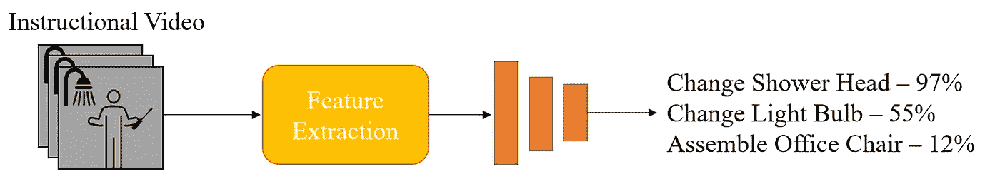

# 视频表征学习的流行下游任务

> 原文：<https://towardsdatascience.com/popular-downstream-tasks-for-video-representation-learning-8edbd8dc19c1?source=collection_archive---------31----------------------->

## *用于评估长教学视频的视频表示学习的常见下游任务的总结。*

# **什么是表征学习？**

表征学习是一个研究领域，其重点是如何学习不同信号源的紧凑的数字表征。这些信号通常是视频、文本、音频和图像。这项研究的目标是将这些表征用于其他任务，如查询信息。一个众所周知的例子是在 YouTube 上搜索视频时:用户提供文本关键词，导致 YouTube 返回一组与这些词最相似的视频。

在计算机视觉文献中，通过训练深度学习模型将原始输入嵌入(或转换)到数字向量来学习表示。当嵌入视频、音频或文本时，数字向量通常是多维的，以保持时间关系。研究人员训练这些模型的方式千差万别。下游任务是如何评估这些方法，也是本文的重点。

# 数据集

我看过的很多论文都是用数据集[**how to 100m**](https://www.di.ens.fr/willow/research/howto100m/)**来训练模型的。这个语料库总共包含*120 万个视频*，活动范围 23k！活动的类型多种多样，从烹饪到手工制作到健身到园艺等等。这个数据集非常庞大，普通研究人员需要很长时间来训练一个模型。然而，如果你有计算能力，它是一个用于表示学习的很好的数据集。每个视频都包含任务的简短描述和一组自动生成的字幕。根据我的经验，以及最初的研究人员的经验，字幕噪音很大，存在对齐问题，音频到文本的翻译也不准确。简短的任务描述并不总是准确或者非常笼统。然而，这是因为 YouTube 的提取，而不是研究人员的错。**

**对于每个下游任务，都有数据集，这些数据集具有特定于任务评估的注释。这些数据集有一个较小的视频集，集中于一个较小的活动集。**

## **数据集**

**适用于*文本相关视频任务*的数据集有:**

**[**【you cook 2】**](http://youcook2.eecs.umich.edu/)是一个基于烹饪的数据集，包含 89 个烹饪食谱的 2K 个未经剪辑的视频，并带有逐步注释。该数据集还包括对时间目标任务有用的时间边界。 [**MSR-VTT**](https://www.microsoft.com/en-us/research/publication/msr-vtt-a-large-video-description-dataset-for-bridging-video-and-language/) 是一个更通用的 10K 视频剪辑数据集，具有 257 个不同主题的 20 万个人类注释剪辑-字幕对。虽然没有具体的指导性，但 [**LSMDC**](https://sites.google.com/site/describingmovies/) 数据集包含 101k 个唯一的视频剪辑-字幕对，其描述来自电影脚本或音频描述。**

**更常用于*动作相关视频任务*的数据集有:**

**[**CrossTask**](https://github.com/DmZhukov/CrossTask)**包含 2.7k 的教学视频，每一帧都有分步动作注释。 [**硬币**](https://coin-dataset.github.io/) 也是一个通用的教学视频数据集，具有 11，827 个视频，显示了 180 个任务，带有与视频中发生的动作相关联的注释。****

# ****下游任务****

## ****视频/动作分类****

********

****图一。特征提取表示通过原始表示学习模型传递视频。为了预测活性，增加了一个小的前馈网络。****

****要设置的最快的下游任务是对整个视频或修剪后的版本进行分类。这项任务的目标是对给定的视频进行高精度的分类，使其显示复杂的动作。目标是所有类别的平均准确度都很高。一些有助于展示这一空间的可视化方法是聚类。理想情况下，来自同一个类的视频应该在同一个集群附近。为了修改这个下游任务的原始模型，您添加了一个输出*d =类的数量的小型前馈网络。*一个**零触发**实验意味着你不在下游数据集上训练这个修改过的网络，而只是测试。然而，更常见的是，训练一些时期来更新新层的随机参数。测量精度基于视频总数中准确分类的视频数量。****

## ****文本到视频检索****

****该任务的目标是使用文本查询来检索匹配的视频。将文本查询的特征向量与视频池的学习特征进行比较，并且地面实况匹配应该是最相似的视频。另一个相关的任务是**文本到完整视频检索**。该任务使用*多个*标题来描述视频的多个部分，从而检索视频。通过将视频池传递通过训练的模型来提取特征。这项任务需要一个具有文本-视频配对的多模态数据集，以便将文本和视频投影到同一个“空间”中。*回忆*准确性是这项任务最常见的表现衡量标准。R@1 测量最相似的视频的平均准确度，R@5 测量最相似的前 5 个视频之一的平均准确度，最后 R@10 是前 10 个视频之一。另外两个常用的指标是 *median-R* 和 *mean-R* ，用于衡量视频池中检索到的真实结果的中值和平均排名，越小越好。****

********

****图二。使用训练好的模型，提取所有视频的验证数据集的特征。为文本查询和视觉特征添加一组编码层(如果原始模型仅使用视频),以将两者嵌入同一空间。这通常是为少数时代训练的。完成后，将使用新图层嵌入文本查询和视频。基于文本查询和所有视频表示之间的相似性对视频进行排序。****

## ****时间动作定位****

****此任务的目标是在视频剪辑中找到一个动作。给定一个视频片段和一个无序的动作列表，任务是在视频流中找到这些动作。这种设置非常类似于帧级动作分类，只是增加了一个前馈网络。这与图 1 所示的过程相同，但是视频片段更小。它也可以是基于相似性的，比如在检索中，将活动的嵌入与片段级的嵌入进行比较。这与图 2 所示的过程相同，但是查询是用动作而不是关键字。用于该任务的度量可以是召回率、准确度、交叉检测和交叉合并(参见 [Kouhne 等人](https://arxiv.org/pdf/1906.01012.pdf) 2019 和 [Chen 等人](https://arxiv.org/abs/2104.12671)2021)。****

## ****视频字幕****

****此任务的目标是将原始视频转换为一个简短的文本描述，或一组简短的句子描述。这对于出于查询或基于知识的原因总结视频很有用。这项任务通常使用变压器解码器将视频解码成字幕(见[朱和杨 2020](https://arxiv.org/abs/2011.07231) )。关于变形金刚的更多细节，请看 [*图解变形金刚*](https://jalammar.github.io/illustrated-transformer/) *。*这类似于图 1，但用变压器代替了前馈网络。像 PyTorch 这样的编程框架有[层](https://pytorch.org/docs/master/nn.html?highlight=nn%20transformer#transformer-layers)和[教程](https://pytorch.org/tutorials/beginner/transformer_tutorial.html)可以用于这个下游任务。基于 NLP 的指标用于评估性能，包括 BLEU、METEOR、ROUGE 和 CIDEr。这些指标使用 n 元语法重叠、最佳匹配长度和词序来比较模型的输出标题和真实标题。****

## ****视频问答****

****此任务的目标是选择多项选择题的正确答案。这是通过将视频与每个可能答案的组合分别输入模型来实现的。附加层是线性的，并且使用视频和文本表示来预测候选对是正确选择的可能性。最常用的衡量标准是准确性。此任务测量您学习的功能完成基于推理的任务的能力。****

# ****摘要****

****[**动作分类**](https://paperswithcode.com/task/action-classification) **:** 将整个视频分类为一个复杂的动作。****

*   *****方法*:基于特征的线性分类器。****
*   *****数据集* : [YouCook2](http://youcook2.eecs.umich.edu/) ， [MSRVTT](https://www.microsoft.com/en-us/research/publication/msr-vtt-a-large-video-description-dataset-for-bridging-video-and-language/) ，[硬币](https://coin-dataset.github.io/)，[活动网](http://activity-net.org/)****
*   *****度量*:平均精度(mAP)和准确度****
*   *****示例* : W-TALC:弱监督时间活动定位和分类，VideoBERT:视频和语言表征学习的联合模型****

****[**文本到视频检索**](https://paperswithcode.com/task/video-retrieval) :给定真实文本描述，从视频池中检索匹配视频。****

*   *****方法*:测量文本查询和视频特征数据库之间的相似度。****
*   *****数据集* : [YouCook2](http://youcook2.eecs.umich.edu/) ， [MSRVTT](https://www.microsoft.com/en-us/research/publication/msr-vtt-a-large-video-description-dataset-for-bridging-video-and-language/) ，[硬币](https://coin-dataset.github.io/)，[活动网](http://activity-net.org/)， [LSMDC](https://sites.google.com/site/describingmovies/)****
*   *****指标* : R@1，R@5，R@10，中值-R****
*   *****示例*:从无标签视频进行自我监督学习的多模态聚类网络(2021)，ActBERT:学习全局-局部视频-文本表示(2020)，HowTo100M:通过观看一亿个带叙述的视频剪辑学习文本-视频嵌入(2019)****

****[**时间动作定位**](https://paperswithcode.com/task/action-recognition) :给定一段视频和片段中出现的动作步骤的无序列表，在视频流中找到那些动作。**行动步骤本地化**使用有序的活动列表。****

*   *****方法*:动作嵌入和视频嵌入之间的片段级分类或相似度。****
*   *****数据集* : [交叉任务](https://openaccess.thecvf.com/content_CVPR_2019/papers/Zhukov_Cross-Task_Weakly_Supervised_Learning_From_Instructional_Videos_CVPR_2019_paper.pdf)，[活动网](http://activity-net.org/)，[挖掘 YouTube](https://arxiv.org/abs/1906.01012)****
*   *****指标*:召回****
*   *****示例* : HowTo100M:通过观看一亿个叙述视频剪辑学习文本-视频嵌入(2019)和 ActBERT:学习全球-本地视频-文本表示(2020)****

****[**动作分割**](https://paperswithcode.com/task/action-segmentation) :在帧或片段级别对子动作进行分类。****

*   *****方法*:帧级/片段级分类。****
*   *****数据集* : [硬币](https://coin-dataset.github.io/)，[活动网](http://activity-net.org/)****
*   *****指标*:准确性****
*   *****示例* : ActBERT:学习全球-本地视频-文本表示(2020)****

****[**视频字幕**](https://paperswithcode.com/task/video-captioning) :将视频转换成一段简短的文字描述或一组字幕。****

*   *****方法*:变压器解码器****
*   *****数据集* : [MSRVTT](https://www.microsoft.com/en-us/research/publication/msr-vtt-a-large-video-description-dataset-for-bridging-video-and-language/) ， [YouCook2](http://youcook2.eecs.umich.edu/)****
*   *****指标*:蓝色、流星、苹果酒、胭脂****
*   *****例子* : ActBERT:学习全球-本地视频-文本表示(2020)****

****[**视频问答**](https://paperswithcode.com/task/video-question-answering) : 根据一个问题和一组选择题答案，能够选出正确答案。****

*   *****方法*:将每个带视频的选择题答案候选人送入线性分类器，对问题的正确答案进行分类。****
*   *****数据集* : [MSRVTT](https://www.microsoft.com/en-us/research/publication/msr-vtt-a-large-video-description-dataset-for-bridging-video-and-language/)****
*   *****指标*:准确性****
*   *****示例* : ActBERT:学习全球-本地视频-文本表示(2020)****

****更多的例子和信息，请查看代码为的[论文。](https://paperswithcode.com/)****