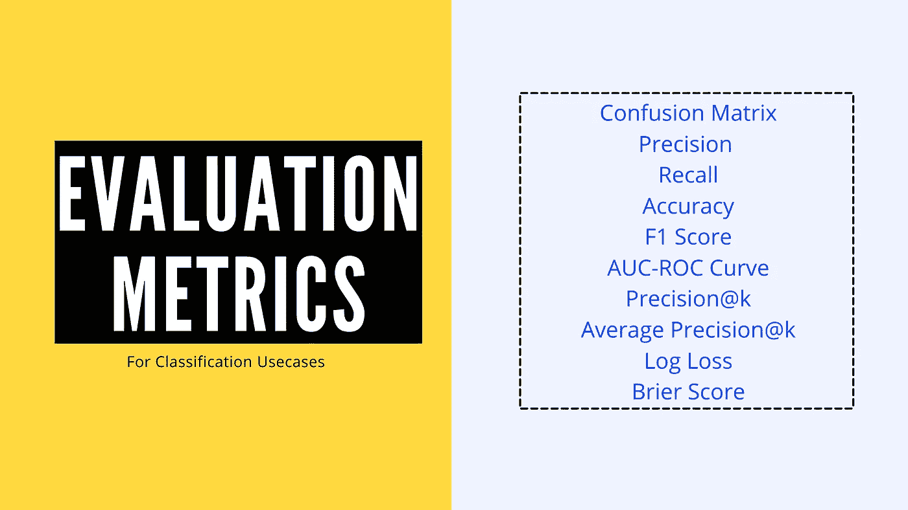
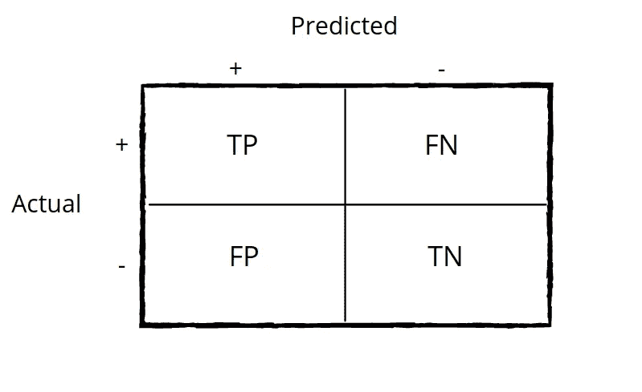
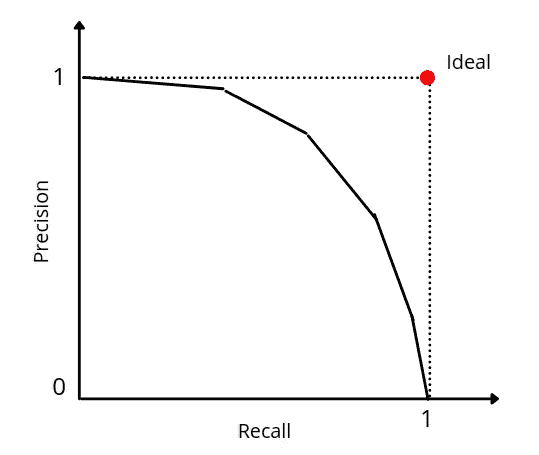
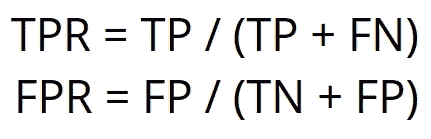
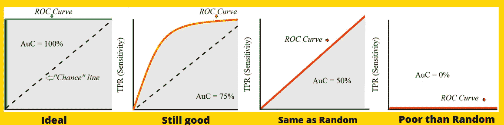

# 代码分类的流行评估标准

> 原文：<https://towardsdatascience.com/popular-evaluation-metrics-for-classification-with-code-580fa0d4eb20?source=collection_archive---------45----------------------->

## 每个数据科学家都必须知道的



作者图片

假设你的任务是训练一个 ML 模型，将数据点分类到一定数量的预定义类别中。因此，一旦你建立了你的分类模型，下一个任务就是测量它的性能。基于用例，有许多指标可以帮助您做到这一点。在这篇博客中，我们将尝试回答类似于**何时使用**的问题。**是什么**？和**如何实现？**

****

**作者图片**

****混淆矩阵**定义为(类 x 类)大小的矩阵，因此对于二进制分类是 2x2，对于三类问题是 3x3，以此类推。为了简单起见，让我们考虑二进制分类并理解矩阵的组成部分。**

****

**图 1 —作者图片**

*   ****真阳性(TP)——**这表示该类为阳性的次数，并且您的模型也说它为阳性。**
*   ****True Negative(TN)——**这表示该类为负的次数，并且您的模型也说它为负。**
*   ****假阳性(FP)——**这表示有多少次类是阴性的，而你的模型却说它是阳性的。**

***你可以这样记——你的型号* ***假*** *说它是* ***正*****

*   ****假阴性(FN)——**这表示这个类有多少次是阳性的，但是你的模型却说它是阴性的。**

***你可以这样记——你的型号* ***假*** *说它是* ***负*****

**使用 sklearn 可以很容易地得到混淆矩阵，如下所示—**

```
from sklearn import metricsdef calculate_confusion_matrix(y, y_pred):
    return metrics.confusion_matrix(y, y_pred)
```

**正如图 1 中所讨论的，混淆矩阵的组成部分是 TP、TN、FP、FN，您也可以使用如下所示的普通 python 来计算它们**

## **计算 TP、TN、FP、FN**

```
def calculate_TP(y, y_pred):
    tp = 0
    for i, j in zip(y, y_pred):
        if i == j == 1:
            tp += 1
    return tpdef calculate_TN(y, y_pred):
    tn = 0
    for i, j in zip(y, y_pred):
        if i == j == 0:
            tn += 1
    return tndef calculate_FP(y, y_pred):
    fp = 0
    for i, j in zip(y, y_pred):
        if i == 0 and j == 1:
            fp += 1
    return fpdef calculate_FN(y, y_pred):
    fn = 0
    for i, j in zip(y, y_pred):
        if i == 1 and j == 0:
            fn += 1
    return fn
```

**[混淆矩阵](https://en.wikipedia.org/wiki/Confusion_matrix)对于理解你的模型的粒度级性能很重要，然后基于用例的敏感性，你可以决定这个模型是好是坏。例如，在医疗诊断用例中，您希望模型具有非常低的假阴性，因为您不希望系统在测试该人的任何疾病踪迹时，如果事实是肯定的，则说“否”。你仍然可以设法让**有一点点高的假阳性**，因为这样这个人就可以通过相关的测试并在后期得到确认。**

****

**作者图片**

****准确性**为模型的表现提供了一些整体的感觉。但如果使用不当，它很容易高估数字。例如，如果你有一个[偏态分布](https://www.statisticshowto.com/probability-and-statistics/skewed-distribution/)的类标签，那么只预测多数类会给你很高的数字(高估了性能)，不像在平衡类的情况下，准确性更有意义。**

**您可以使用 sklearn 轻松获得准确度分数，如下所示—**

```
from sklearn import metricsdef calculate_accuracy_sklearn(y, y_pred):
    return metrics.accuracy_score(y, y_pred)
```

**也可以使用 Python 从如下所示的混淆矩阵组件中进行计算—**

```
def calculate_accuracy(y, y_pred):
    tp = calculate_TP(y, y_pred)
    tn = calculate_TN(y, y_pred)
    fp = calculate_FP(y, y_pred)
    fn = calculate_FN(y, y_pred)
    return (tp+tn) / (tp+tn+fp+fn)
```

****

**作者图片**

****精度**指标帮助我们了解识别阳性样本的正确率%。例如，假设我们的模型有 80 次说某事是肯定的，我们精确地计算这 80 次中有多少次模型是正确的。**

**也可以如下图计算—**

```
def calculate_precision(y, y_pred):
    tp = calculate_TP(y, y_pred)
    fp = calculate_FP(y, y_pred)
    return tp / (tp + fp)
```

****

**作者图片**

****回想一下**指标有助于我们了解模型能够正确识别的所有基本事实正样本的正样本百分比。例如，假设数据中有 100 个样本是阳性的，通过回忆，我们可以计算出这 100 个样本中有多少是模型能够正确捕获的。**

**也可以如下图计算—**

```
def calculate_recall(y, y_pred):
    tp = calculate_TP(y, y_pred)
    fn = calculate_FN(y, y_pred)
    return tp / (tp + fn)
```

***附注:对于输出概率的模型，调整阈值，然后填充相关的混淆矩阵和其他属性始终是一个好的做法。也可以为不同阈值绘制精确-召回曲线，并相应地基于用例的敏感性选择阈值。***

```
def precision_recall_curve(y, y_pred):
    y_pred_class,precision,recall = [],[],[]
    thresholds = [0.1, 0.2, 0.3, 0.6, 0.65]
    for thresh in thresholds:
        for i in y_pred:     #y_pred holds prob value for class 1
            if i>=thresh: y_pred_class.append(1)
            else: y_pred_class.append(0)
        precision.append(calculate_precision(y, y_pred_class))
        recall.append(calculate_recall(y, y_pred_class))
    return recall, precisionplt.plot(recall, precision)
```

****

**精确召回曲线—作者图片**

****

**作者图片**

****F1** 将精确度和召回分数结合起来，得到一个单一的数字，有助于对不同型号进行直接比较。它可以被视为 P 和 r 的调和平均值。调和平均值，因为它对非常大的值不敏感，不像其他平均值。当处理带有倾斜目标的数据集时，我们通常考虑 F1 而不是准确度。**

**你可以如下图计算—**

```
def calculate_F1(y, y_pred):
    p = calculate_precision(y, y_pred)
    r = calculate_recall(y, y_pred)
    return 2*p*r / (p+r)
```

****

**作者图片**

****AUC-ROC** 是二元分类问题中非常常用的评价指标之一。这是一条绘制在 y 轴上的 TPR(真阳性率)和 x 轴上的 FPR(假阳性率)之间的曲线，其中 TPR 和 FPR 定义为—**

****

**跨国激进党和 FPR——作者图片**

**如果你注意到， **TPR** 和 **Recall** 有相同的表示，就像你正确分类了多少正确的样本。另一边的 FPR 是被错误分类的反面例子的比率。ROC 图总结了每个阈值的分类器性能。因此，对于每个阈值，我们都有 TPR 和 FPR 的新混淆矩阵值，它最终成为 ROC 2-D 空间中的点。ROC 曲线下的 AUC(曲线下面积)值越接近 1，模型越好。这意味着通常对于每个阈值，我们的具有高 AUC 的模型表现得比另一个更好。**

**你可以如下图计算—**

```
**from** sklearn.metrics **import** roc_auc_scoredef roc_auc(y, y_pred):
    return roc_auc_score(y, y_pred)
```

****

**AUC-ROC 曲线变异——修改自[来源](https://www.bing.com/images/search?view=detailV2&ccid=k0f6Jnhg&id=AB15D20D669470D0C1964001DBB6D3A690FD0455&thid=OIP.k0f6JnhgCkFFfNd9bFsAQQHaBl&mediaurl=https%3a%2f%2fgblobscdn.gitbook.com%2fassets%252F-LvBP1svpACTB1R1x_U4%252F-LvGspxW3Zko2589SZEN%252F-LvHDdtKiSfM4WORukWK%252Fimage.png%3falt%3dmedia%26token%3d37e218e6-2fe1-4e71-8a69-bdf47bf117e0&cdnurl=https%3a%2f%2fth.bing.com%2fth%2fid%2fR9347fa2678600a41457cd77d6c5b0041%3frik%3dVQT9kKbTttsBQA%26pid%3dImgRaw&exph=465&expw=2169&q=auc+roc+curve&simid=608033701821811184&ck=E0B642D717B8B3FA21668630027F1986&selectedIndex=2&FORM=IRPRST&ajaxhist=0)**

****

**作者图片**

****Precision@k** 是[多标签分类](https://en.wikipedia.org/wiki/Multi-label_classification)设置中使用的常用指标之一。在这种情况下，我们计算给定示例的前 k 个预测，然后计算这 k 个预测中有多少是真正的标签。我们将精度@k 计算为—**

****Precision@k =(来自 k 的正确预测数)/(k 中的项目数)****

```
actual_label = [1, 1, 0, 0, 1]
predicted_label = [1, 1, 1, 0, 0]Let k=3
Precision@k = 2/3    (It's same as TP/(TP+FP))
```

****

**作者图片**

**这不是神奇的:D，它只是 Precision@k 上所有样本的平均值**

****

**作者图片**

****当你有二进制分类问题时，日志损失**是相当不错的。当您有一个输出概率的模型，并且该模型根据预测与实际标注的偏差考虑了预测的不确定性时，就可以使用它。**

**你可以如下图计算—**

```
def calculate_log_loss(y, y_pred_probs):
    log_loss = -1.0*(t*log(p) + (1-t)*(t*log(1-p))
    return log_loss
```

**在不平衡集合的情况下，你也可以增加类权重来惩罚少数类的错误。在代码中，w1 和 w2 对应于正类和负类的权重。**

```
def calculate_log_loss_weighted(y, y_pred):
    log_loss = -1.0*(w1*t*log(p) + w2*(1-t)*(t*log(1-p))
    return log_loss
```

***附注:你可以很容易地将其扩展到称为分类交叉熵的多类设置。***

****

**作者图片**

**当任务本质上是二元的时，通常使用。它就是实际值和预测值的平方差。对于 N 个样本的集合，我们取其平均值。**

**你可以如下图计算—**

```
def brier_score(y, y_pred):
    s=0
    for i, j in zip(y, y_pred):
        s += (j-i)**2
    return s * (1/len(y))
```

*****在这篇博客中我们看到了一些流行的评估指标，每个数据科学家在根据手头问题的性质评估机器学习分类模型时都必须牢记在心。*****

***这篇博客到此为止。我希望这本书值得你花时间去读！谢了。***