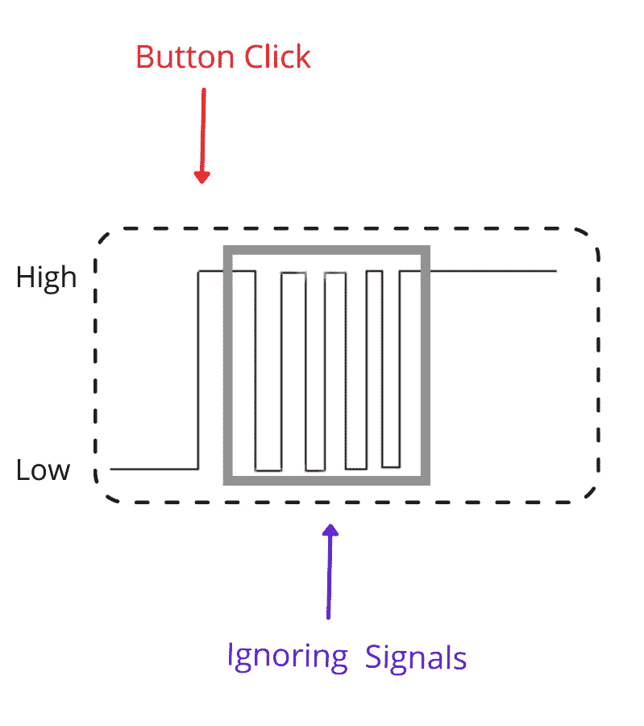

# 一个流行的面试问题把我从 SDE 的角色简化为 SDE 的角色

> 原文：<https://towardsdatascience.com/popular-interview-question-that-reduced-me-to-sde-1-from-sde-2-role-4b6d7dae5ffe?source=collection_archive---------30----------------------->

## 取消了那次晋升！！


照片由 [LinkedIn 销售解决方案](https://unsplash.com/@linkedinsalesnavigator?utm_source=medium&utm_medium=referral)在 [Unsplash](https://unsplash.com?utm_source=medium&utm_medium=referral) 上拍摄

“想象一下这个场景”面试官在没有用他准备好的问题库完全困住我后开始说。

这个人手里拿着我职业生涯中的一个里程碑……一个让人头脑麻木、山摇地动、海裂的软件开发工程师 2 的角色。

从“*九头蛇 HR* ”一直到最后一轮“*邪恶妖王高级开发者*”，我历经千辛万苦才走到这一步。

> 但是！！

命运没有这么慷慨，我的面试官像猫抓老鼠一样玩弄我。但上帝保佑，我不是容易的猎物。我像一个冠军一样接受了他的问题，像他从未见过的人一样互相攻击，直到他拿出他的王牌，许多勇敢的 SDE 1 号工程师都倒下了。

这是我从未遇到过的武器……直到现在。

# 需要“去抖功能”的场景

“想象一下这个场景”面试官开始说道。

“你有一个搜索框，一旦用户停止输入，你就在那里显示自动完成，记住，要显示这些建议，你需要向后端发送一个 API 请求。你会怎么处理？”

当我第一次听到这个问题时，在我的脑海里…

> 嗯嗯……如果 CTC 超过 20L，队伍预算应该是 20，000 卢比，不，也许我应该增加更多…..

但当面试官鼓励我大声思考时，我很快就回到了现实。当然，我不敢说我是在为战胜他的庆功宴计划预算。

但我也感到奇怪，为什么他会选择这么简单的问题作为结尾？

当我更深入地探究细节时，这些想法很快就结束了…让我解释一下

假设用户键入了“s”、“se”、“ser”、“sert”、“serty”。

如果不小心的话，您可能会为一个用户发送 5 个 API 请求。即使忽略它对后端的巨大影响，为如此多的请求提供服务，在前端处理它也会有问题。

我开始时很慢，最后想出了一个使用 setTimeout 发送请求的解决方案，但由于 react 中的一些干扰，如果在 React 项目中使用它，这个解决方案将无法工作(结果我只是在采访中错误地实现了它，这也是一个愚蠢的错误)。

面试结束后，面试官解释说，我要找的术语叫“去抖功能”。

所以，我查了一下，这就是我的发现

# 什么是去抖？

术语**去抖**来自电子学。当你按下一个按钮时，比如说电视遥控器上的电源按钮，遥控器中的微芯片接收信号的速度非常快，即使你按住它几毫秒，它也会多次记录“按下”。



作者图片

为了避免这种行为，一旦微芯片记录了一个信号，它就停止处理来自该按钮的信号一小段设定的时间间隔，该时间间隔可以变化。

# JavaScript 中的去抖

我们被问到的问题类似于上面的例子。

只有当你确定用户已经停止输入的时候，你才希望把 API 请求发送到后端。

在 react 中，这可以通过下面的库和代码轻松实现。

预先编写了这个函数的库是 lodash.debounce，所以让我们导入它

```
import debounce from "lodash.debounce";
```

现在我们要写一个函数来使用上面的 react

```
const timer = 1000const debouncedSave = useRef(debounce((nextValue) => YourFunction(nextValue), timer)).current;
```

计时器→您可以通过编辑“1000”来编辑您想要等待的时间，在本例中“1000”表示 1 秒。

你的功能→你想延迟到用户完成的功能。它看起来会像

```
const YourFunction = (value)=> {sendAPIRequest(value)}
```

如果你想知道去抖功能的具体实现，你可以在这里查看它的[代码](https://codepen.io/ondrabus/pen/WNGaVZN)

但这是我从网上得到的一个简单的实现

```
function debounce(func, timeout = 300){
  let timer;
  return (...args) => {
    clearTimeout(timer);
    timer = setTimeout(() => { func.apply(this, args); }, timeout);
  };
}
function saveInput(){
  console.log('I have been called');
}
const processChange = debounce(() => saveInput());
```

# 想要更多吗？

1.  [**订阅**](https://kanlanc.medium.com/subscribe) 在我发表文章时得到通知。
2.  [**成为推荐媒介会员，支持我的写作，无需额外费用**](https://kanlanc.medium.com/membership) 。
3.  在[**Linkedin**](https://www.linkedin.com/in/vikranth-kanumuru-751a73125/)**和** [**Twitter**](https://twitter.com/kanlanc) 上连接并联系我

# 参考资料:

<https://codeburst.io/throttling-and-debouncing-in-javascript-b01cad5c8edf>  <https://stackoverflow.com/questions/24004791/can-someone-explain-the-debounce-function-in-javascript>  <https://www.freecodecamp.org/news/javascript-debounce-example/> 