# 流行的机器学习性能指标

> 原文：<https://towardsdatascience.com/popular-machine-learning-performance-metrics-a2c33408f29?source=collection_archive---------43----------------------->

## 直观的解释和与概率的联系


安迪·凯利在 Unsplash 上的图片。

在本文中，我们将直观地回顾最流行的监督学习指标

*   **分类—** 准确度、精密度、召回率，fᵦ&AUC；和
*   **回归** — MAE，MSE 和 R。

对于分类任务，更高级的分类指标允许您针对您的用例校准 I 类和 II 类错误的重要性，同时帮助您处理不平衡的数据集。

我们还将直观地探索分类指标和概率之间的一些联系。

在[这篇](/will-your-employee-leave-a-machine-learning-model-8484c2a6663e)和[这篇](/predict-house-prices-with-machine-learning-5b475db4e1e)文章中，我使用 scikit-learn 将这些监督学习指标应用于 Jupyter 笔记本中的真实世界 ML 问题。

在此加入 Medium [并获得**无限制访问**互联网上最好的数据科学文章。](https://col-jung.medium.com/membership)

# 1.分类标准

## 混淆矩阵

```
from sklearn.metrics import confusion_matrix
```

二进制分类产生四种结果，可以在**混淆矩阵**中总结。然后使用矩阵中的值计算分类的度量。

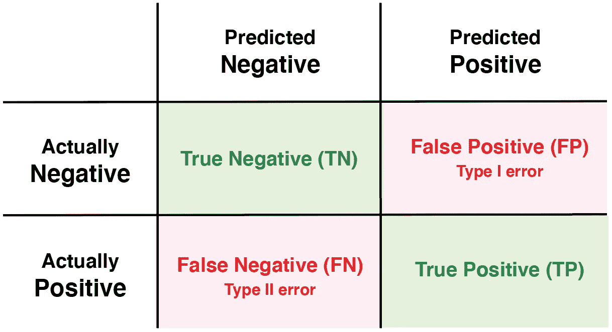

混乱矩阵。图片作者。

## 准确(性)

```
from sklearn.metrics import accuracy_score
```

最基本的衡量标准是**准确性**，它给出了我们的模型正确预测的比例。

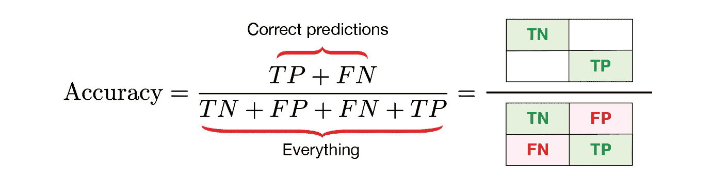

图片作者。

尽管精确度很容易计算，也很容易理解，但是对于不平衡的数据集来说，它是失败的，正如我们将在下面看到的。

## 精确

```
from sklearn.metrics import precision_score
```

**精度**给出了我们正确预测的比例。该指标优先考虑将第一类错误最小化**。一个需要高精度模型的典型问题是对垃圾邮件进行分类——下面将详细介绍。在这里，让假阳性通过意味着重要的电子邮件被意外抛出。**

**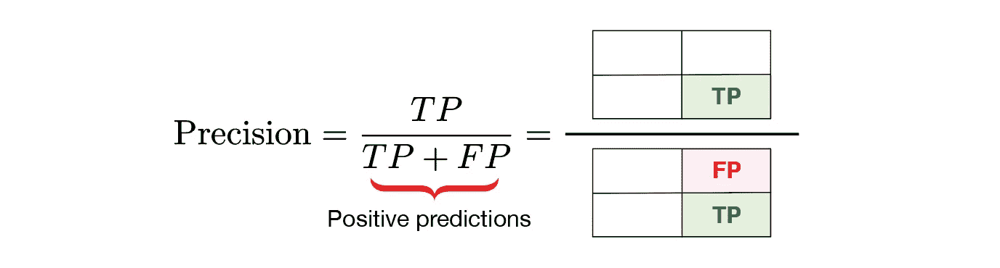**

**图片作者。**

## **回忆**

```
from sklearn.metrics import recall_score
```

****Recall** 给出了我们正确预测的实际阳性率。该指标优先考虑将第二类错误最小化。需要高召回率模型的示例问题包括对新冠肺炎的诊断测试、对欺诈性信用卡交易进行分类以及预测有缺陷的飞机部件。在这些问题中，假阴性要么造成经济损失，要么甚至是致命的。**

**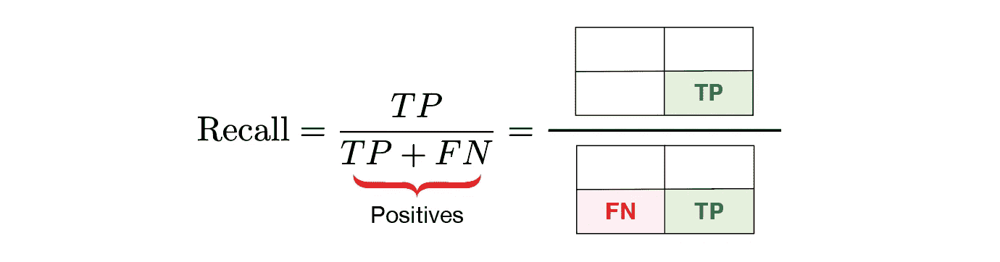**

**图片作者。**

## **使用准确度、精确度和召回的示例**

**以下面的分类欺诈性信用卡交易为例。**

**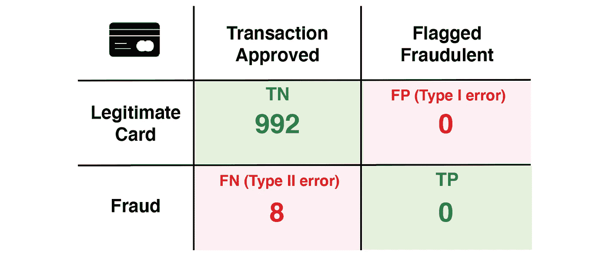**

**图片作者。**

**混淆矩阵告诉我们，这个“愚蠢”的模型将每一笔交易都归类为合法交易。结果**精度**是恒星 **992/1000 = 99.2%** 。但是…我们错过了**每一笔欺诈交易！**该死。**

**为了捕捉这些类型 II 错误的重要性，我们可以使用 **recall** 来代替。**

**这里， **recall = 0/8 = 0%** ，强调没有检测到欺诈 CC。哎呦！**

**看看下一个例子**过滤掉垃圾邮件**。在这里，犯第一类错误比犯第二类错误更糟糕。这是因为不小心扔掉一封重要的邮件比不小心让几封垃圾邮件通过更有问题。这里一个很好的衡量标准是**精度**。换句话说，我们正在寻找训练一个**高精度模型**。**

**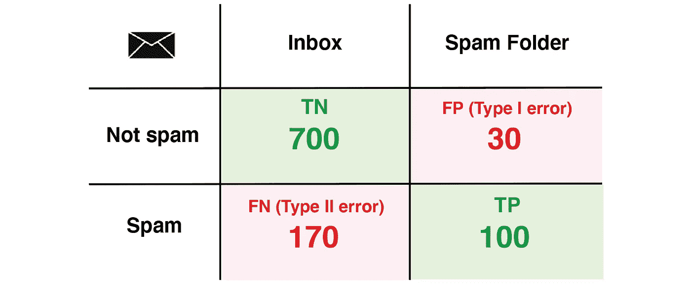**

**图片作者。**

**我们有**精度= 100/130 = 77%** 。这意味着在我们自动过滤到垃圾邮件文件夹的 130 封邮件中，有 100 封是真正的垃圾邮件。还不错，但是我要说对于一个生产邮件服务器来说肯定不够好！**

**最后，看看这个**诊断新冠肺炎**的例子。在这里，犯 II 型错误(假阴性测试)意味着遗漏了实际生病的人。这对个人来说是致命的，对公共健康来说是灾难性的。**

**同时，I 型错误(假阳性测试)最多会给个人带来不便。安全总比后悔好！因此，我们希望培养一个**高召回模型**。**

**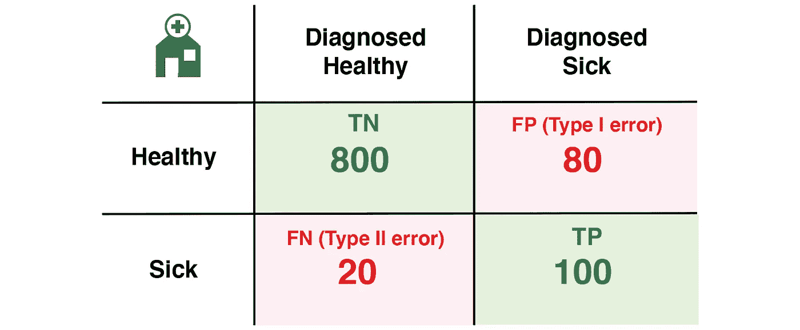**

**图片作者。**

**我们有**召回= 100/120 = 83%** 。这意味着我们在 120 名新冠肺炎阳性者中找到了 100 名进行了测试，并让 20 名认为自己没有感染病毒的人回家。不幸的是，这个测试对于一般应用来说还不够好。**

## **F₁和 Fᵦ得分**

```
from sklearn.metrics import f1_score, fbeta_score
```

**考虑到精确度和召回率， **F₁-score** 是一种先进的度量标准，可以让您两全其美*和*对不平衡的数据集具有鲁棒性。该指标被定义为精度和召回率的**调和平均值**:**

****

**或者，您可以直接从混淆矩阵计算 F₁-score :**

**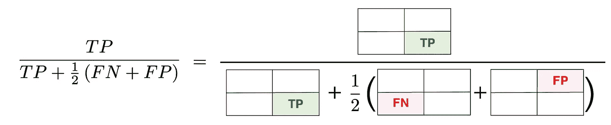**

**图片作者。**

**对于我们的新冠肺炎模型，**f₁-score = 100/(100+0.5(20+80))= 67%。****

**更一般地说， **Fᵦ-score** 允许你更精确地校准 I 型和 II 型误差的重要性。它通过让您说出您认为召回比精确度重要 ***β*** 倍的指标来做到这一点。**

****

**设置 ***β*** = 1 给出了 **F₁-score** 。**

**下面是直接从混淆矩阵计算 Fᵦ-score 的公式:**

**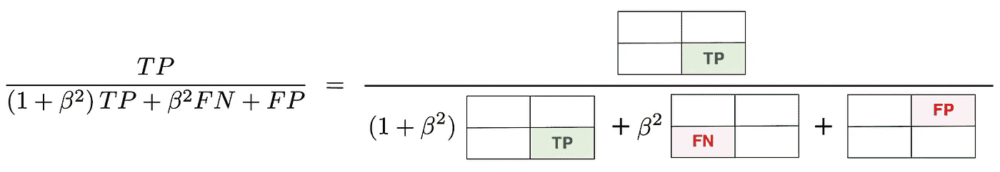**

**图片作者。**

## **曲线下面积**

```
from sklearn.metrics import roc_curve, roc_auc_score
```

**具体来说，我们正在查看**受试者工作特性(ROC)曲线**下的**区域**。**

**这个范围从 0 到 1，测量你的分类器分离两个类和从噪声中筛选信号的能力。**

**全面积为 1 代表完美模型，而 AUC 为 0.5 的模型比随机猜测好不了多少。一般来说，0.9 分被认为是优秀，0.8 分是优秀，0.7 分是可以接受的。**

**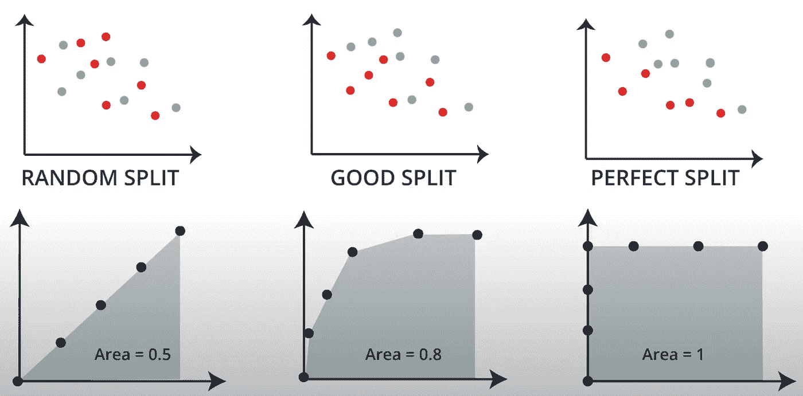**

**图片来自 [Udacity](https://www.udacity.com/) 。**

**为了首先绘制 ROC 曲线，我们绘制了**真阳性率(TPR)** (又名**召回**)对**假阳性率(FPR)** 。**

**具体来说，我们改变真实预测的概率阈值，获得混淆矩阵，并绘制点(FPR，TPR)。我们对所有可能的阈值都这样做，每次给我们不同的混淆矩阵和(FPR，TPR)点。ROC 曲线因此总结了关于一组可能的混淆矩阵的信息。**

**YouTube 上有一个关于 ROC 的很棒的视觉解释。**

**中华民国应该是什么样子？远高于对角线的 ROC 意味着更多的混淆矩阵，其中模型能够区分阳性和假阳性。也就是说，TPR 在 FPR 上占优势的点和混淆矩阵更多。**

**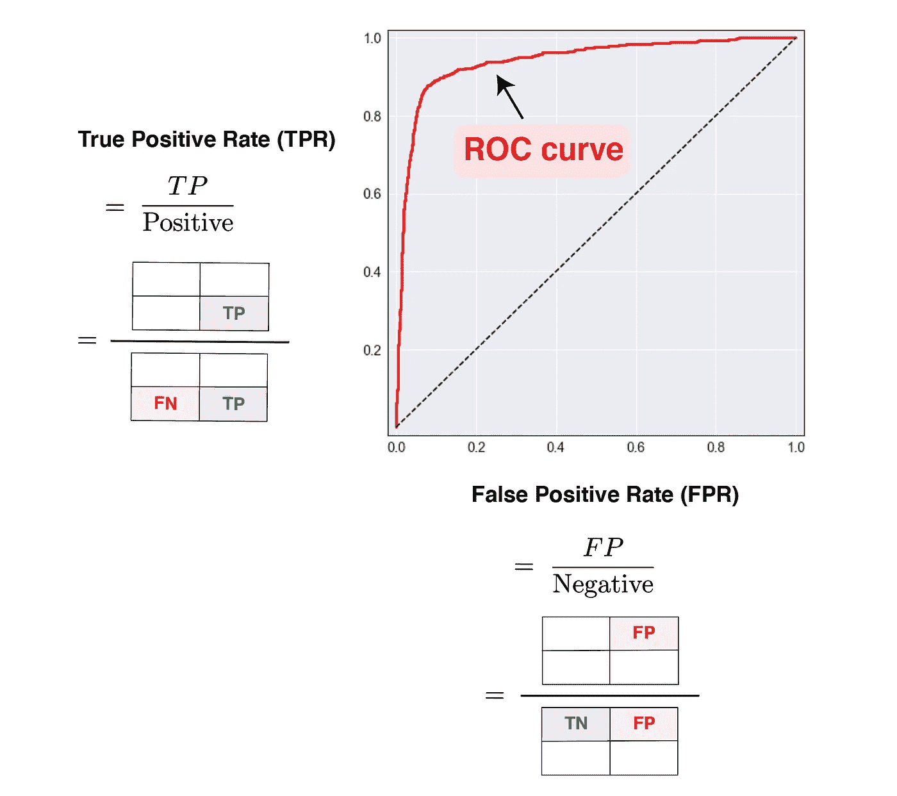**

**ROC 曲线。图片作者。**

**该信息可以概括为 ROC 曲线下的**区域。AUC 越高，“ROC 曲线越高”，模型越好。****

**具有更高 AUC 的模型意味着我们能够更广泛地改变概率阈值，同时保留模型从噪声中读取信号的能力。**

**在本文的[中，我使用 scikit-learn 生成 ROC 曲线，并在 Python 中计算 AUC。](/will-your-employee-leave-a-machine-learning-model-8484c2a6663e)**

**在下一节中，我们将更详细地考察 TPR、FPR、TNR 和 FNR。**

# **混淆矩阵、概率和树**

**为了获得新的视角，我们可以通过树的透镜来看混淆矩阵。这样做的好处是，我们可以在混淆矩阵和概率之间建立一些联系。**

**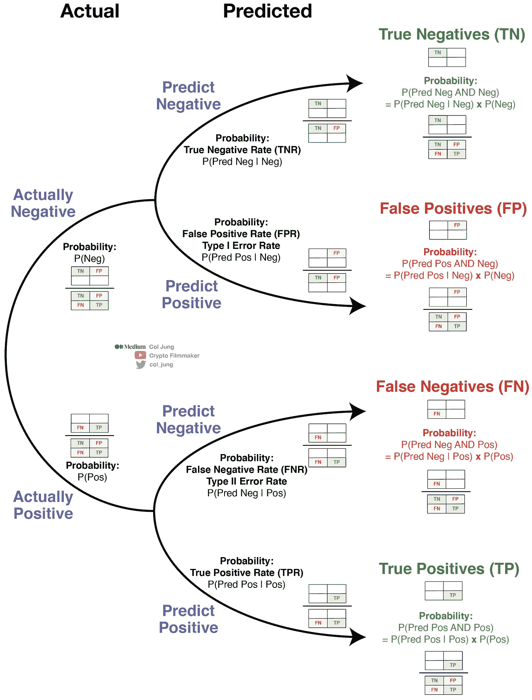**

**混淆矩阵和概率树。图片作者。**

**注意概率树的第二层非常有趣。它们是四种*利率*:**

*   ****真阴性率**又名**特异性**。**
*   ****假阳性率**又名**1 型错误率**。**
*   ****假阴性率**又名**二型错误率**。**
*   ****真阳性率**又名**灵敏度**或**召回**。**

**这些概率——作为概率树的分支——也是条件概率。**

**下面是这四种费率的详细汇总。**

**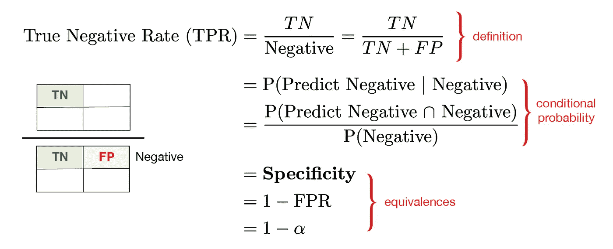****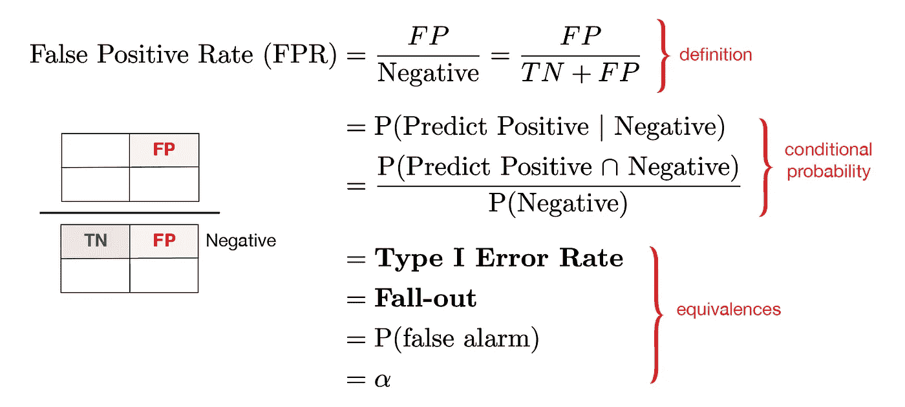****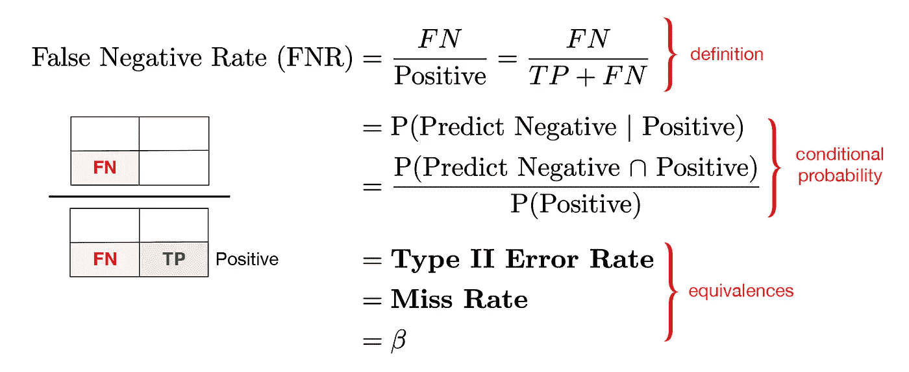****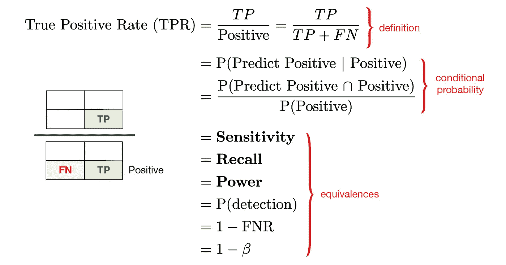**

**作者图片。**

# **2.回归任务的度量**

## **平均绝对误差**

```
from sklearn.metrics import mean_absolute_error
```

****MAE** 度量计算模型和数据之间所有偏差误差的平均值。**

****

**图片来自 [Udacity](https://www.udacity.com/) ，作者进行了改进。**

## **均方差**

```
from sklearn.metrics import mean_squared_error
```

**这个 **MSE** 计算所有这些偏差误差的平方，并计算它们的平均值。**

**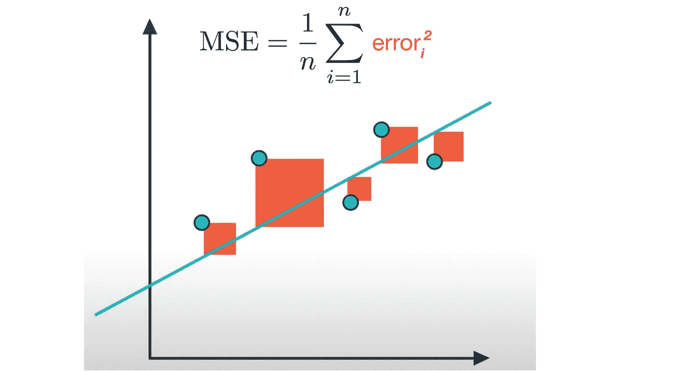**

**图片来自 [Udacity](https://www.udacity.com/) ，作者进行了改进。**

## **决定系数**

```
from sklearn.metrics import r2_score
```

**R -score 有效地比较了您的模型的 MSE 和**简单均值模型**的 MSE，范围在 0 到 1 之间，1 为最佳。**

**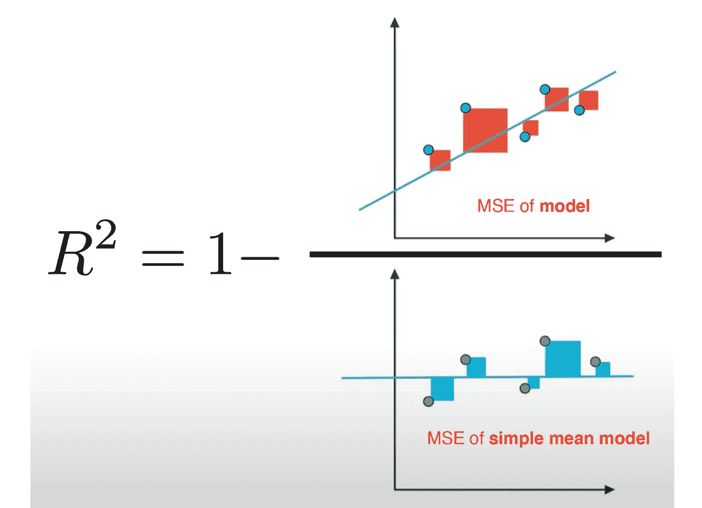**

**图片来自 [Udacity](https://www.udacity.com/) ，作者进行了改进。**

**这里的想法是，如果模型非常好，那么模型的 MSE 将远远小于数据集的简单均值模型的 MSE，从而使这两者的比率接近于 0。R 分数将更接近于 1。**

**但是，当你的模型不好的时候，你的模型的 MSE 和简单均值模型的 MSE 不会有太大的差别，导致它们的比值接近 1。R 分数将接近于 0。**

# **3.摘要**

**在评估**分类算法**的性能时，我们从混淆矩阵开始。**

**这是一个通用二进制分类任务的矩阵，从中我们可以计算各种指标的得分。**

**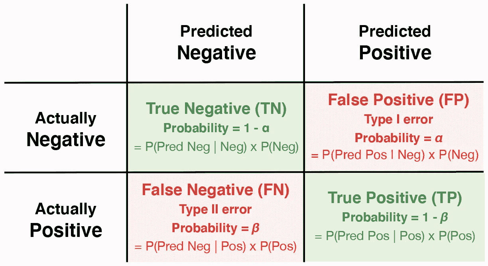**

**图片作者。**

****准确性**是最简单的度量标准，但是没有考虑到 I 类和 II 类错误的相对重要性，对于不平衡的数据集也不稳健。像**精度**、**召回**和 **F₁** 这样的更高级的指标可以补救这些问题。 **ROC 和 AUC** 提供了一种图形化的方法来评估您的分类器区分类别和从噪声中分离信号的能力。**

**正如我们已经看到的，矩阵的四个结果也可以在概率树中解释，其中 **TPR、TNR、FPR 和 FNRs** 对应于某些**条件概率**。**

**对于**回归算法**，三个最流行的指标是 **MAE** 、 **MSE** 和 **R -score** 。后者是根据两个 MSE 计算的，一个是您的模型，另一个是简单均值模型。**

**在后续文章中，我们将关注**损失函数**以及它们如何用于优化常见的监督学习算法和神经网络模型。干杯！**

**本文中的图表是使用 Adobe Illustrator、LaTeXiT 和 Microsoft Excel 创建的。**

**在 YouTube[和 Twitter](https://www.youtube.com/c/CryptoFilmmaker) 上关注我。**

# ****无限制媒体访问****

**提升你的知识和技能到一个新的水平。**

**[加入 Medium](https://col-jung.medium.com/membership) 享受**无限访问**互联网上的**最佳分析&数据科学文章**。你可以在这里加入[支持我和其他顶级作家](https://col-jung.medium.com/membership)。**

# **我的数据科学文章**

*   **微分方程与机器学习——此处[为](https://medium.com/swlh/differential-equations-versus-machine-learning-78c3c0615055)**
*   **新冠肺炎的数学建模与机器学习— [此处](https://medium.com/swlh/math-modelling-and-machine-learning-for-covid-19-646efcbe024e)**
*   **用回归预测房价——此处[此处](/predict-house-prices-with-machine-learning-5b475db4e1e)**
*   **分类预测员工流失— [此处](/will-your-employee-leave-a-machine-learning-model-8484c2a6663ea)**
*   **流行的机器学习性能指标— [此处](/popular-machine-learning-performance-metrics-a2c33408f29)**
*   **Jupyter 笔记本对 Dataiku DSS — [此处](/jupyter-notebooks-versus-dataiku-dss-for-data-science-e02264a753ca)**
*   **Power BI —从数据建模到令人惊叹的报告— [此处](/intro-to-power-bi-from-data-modelling-to-stunning-reports-b34aac43d8a1)**