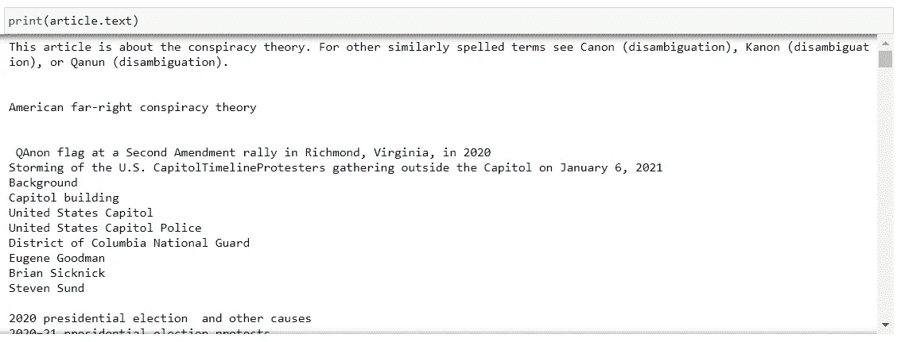
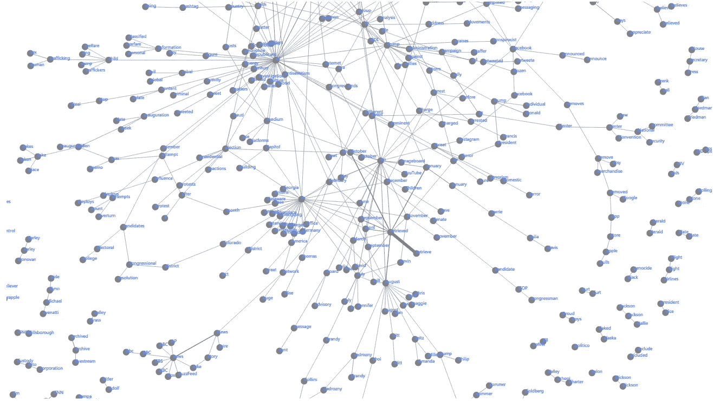
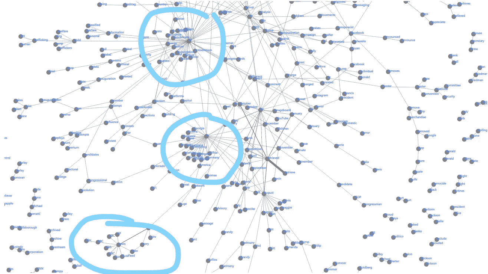

# 用单词填充网络图

> 原文：<https://towardsdatascience.com/populating-a-network-graph-with-words-17b6c62208ac?source=collection_archive---------27----------------------->

## 自然语言处理

## 使用 spaCy 为自然语言处理创建知识图


Andrew Itaga 在 [Unsplash](https://unsplash.com/s/photos/chucks?utm_source=unsplash&utm_medium=referral&utm_content=creditCopyText) 上拍摄的照片

今天，我们将获取一篇维基百科文章的内容，并为自然语言处理做准备。我们将使用 spaCy 来处理文本，并使用 Power BI 来可视化我们的图形。

打开 jupyter 笔记本，让我们开始吧！

让我们把进口的东西扔掉:

```
# for manipulating dataframes
import pandas as pd# for webscraping
from requests import get
from bs4 import BeautifulSoup# for natural language processing
import spacy
import en_core_web_sm
nlp = en_core_web_sm.load()
```

然后，我们将向 Wikipedia 发出 get 请求，如下所示:

```
url = '[https://en.wikipedia.org/wiki/QAnon'](https://en.wikipedia.org/wiki/QAnon')
response = get(url)
```

为了了解我们到底在处理什么，打印带有`print(response.text[:999])`的响应，我们将得到类似下图的结果:


[作者](https://medium.com/@ednalyn.dedios)截图

接下来，我们将使用 Beautiful Soup 提取维基百科页面的主要文章:

```
soup = BeautifulSoup(response.content, 'html.parser')
article = soup.find('div', class_='mw-parser-output')
```

让我们看看用`print(article.text)`打印主文得到了什么。



[作者](https://medium.com/@ednalyn.dedios)截图

看到第一段了吗？这是一个注释，不应该是我们文档的一部分，所以让我们把它去掉:

```
unwanted = article.find('div', role='note')
unwanted.extract()
```

瞧，它不见了！


[作者](https://medium.com/@ednalyn.dedios)截图

我们的下一步将是使用 spaCy 处理文章，这样它就可以使用它的统计模型来分配一些关于我们文章中的单词(标记)的信息。然后我们将它赋给一个变量`doc`来保存所有的信息和元数据。

```
doc = nlp.(article.text)
```

我们需要遍历文档中的所有单词，以获得构建数据帧所需的元素。

```
text_list = []
head_list = []for token in doc:
    if token.is_alpha:
        if not token.is_stop:
            text_list.append(token.lemma_)
            head_list.append(token.head.text.lower())df = pd.DataFrame(list(zip(text_list, head_list)), 
               columns =['text', 'head'])
```

在上面的代码中，我们启动了两个空列表来保存我们将提取的值——一个用于文档中的单词，另一个用于其标题或父单词。然后，我们遍历文档中的每个标记，同时过滤掉停用词和数字。如果条件通过，我们将每个令牌附加到`text_list`和`head_list`。然后，我们通过将两个列表压缩在一起创建了一个数据帧。

接下来，我们将对行进行分组，并获取每个特定的文本和标题组合的计数。

```
combos = df.groupby(['text','head']).size().reset_index().rename(columns={0:'count'}).sort_values('count', ascending=False)
```

让我们来看一看:


[作者截图](https://medium.com/@ednalyn.dedios)

最后，我们将把数据帧导出到 csv 文件中，以便在 Power BI 中可视化。

```
combos.to_csv('../data/out/qanon_combos.csv', index=False)
```

结果是这样的:



[作者截图](https://medium.com/@ednalyn.dedios)

该图展示了至少三个集群。



[作者](https://medium.com/@ednalyn.dedios)截图

让我们放大。


[作者](https://medium.com/@ednalyn.dedios)截图

有道理！

以下是我们今天使用的所有代码(不包括输出):

今天，我们拿了一篇维基百科的文章，用 spaCy 处理了它，并创建了一个相关单词的数据框架。然后，我们将其导出到 csv，并使用 Power BI 来可视化网络图。

就这样，伙计们！

你可以在这里找到朱庇特笔记本。

谢谢你过来看我的帖子。希望对你有用:-)

*如果你想了解更多关于我从懒鬼到数据科学家的旅程，请查看下面的文章:*

[](/from-slacker-to-data-scientist-b4f34aa10ea1) [## 从懒鬼到数据科学家

### 我的无学位数据科学之旅。

towardsdatascience.com](/from-slacker-to-data-scientist-b4f34aa10ea1) 

*如果你正在考虑改变方向，进入数据科学领域，现在就开始考虑重塑品牌:*

[](/the-slackers-guide-to-rebranding-yourself-as-a-data-scientist-b34424d45540) [## 懒鬼将自己重塑为数据科学家指南

### 给我们其他人的固执己见的建议。热爱数学，选修。

towardsdatascience.com](/the-slackers-guide-to-rebranding-yourself-as-a-data-scientist-b34424d45540) 

*敬请期待！*

你可以通过 [Twitter](https://twitter.com/ecdedios) 或 [LinkedIn](https://www.linkedin.com/in/ednalyn-de-dios/) 联系我。