# 新兴市场债券的投资组合多样化

> 原文：<https://towardsdatascience.com/portfolio-diversification-with-emerging-market-bonds-ef1ec966531a?source=collection_archive---------10----------------------->

## 在数据世界里争吵

## 用贝叶斯概率模型测试均值-方差优化

图片由来自 Pixabay 的 doroheine 提供

我们对金融投资的实际回报几乎没有控制权。我们希望有正回报，但不能保证。在整个过程中，我们唯一能控制的是这些投资价值的波动性，我们通过分散投资来做到这一点。不要把所有的鸡蛋放在一个篮子里，这是**古老的智慧。这是 Harry Markowitz 的均值-方差投资组合优化的关键观点和目标。**

**投资组合优化**本质上是寻求以尽可能低的波动性提供一定的目标回报。这是通过将各种相互关联度较低的金融资产组合成一个投资组合来实现的。投资需要对未来的信心，而资产配置旨在增强这种信心，抵御未知未来的不确定性。

世界各地的全球机构投资者面临着一个重大困境，因为在许多情况下，全球债券收益率已经跌至接近零甚至负水平。发达市场(DM)债券尤其如此，尤其是欧洲和日本债券。问题的一部分在于，零到负的债券收益率强烈暗示着机构投资者持有的最重要资产类别之一的未来回报率为负。问题的另一部分，也可能是更紧迫的一部分，是如此低的债券收益率意味着，DM 债券可能无法像过去那样为全球投资组合提供同样的多元化收益。

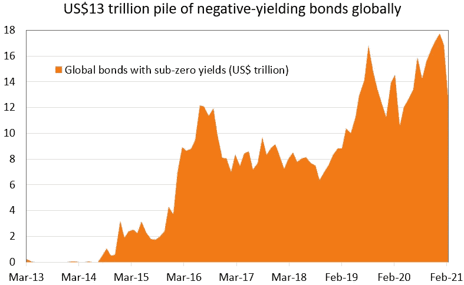

负收益债券在 12 月达到 18 万亿美元的峰值。资料来源:彭博

在这篇文章中，我探讨了增加对包括中国在内的“新兴市场”债券的投资如何有助于缓解这些问题。为了保持文章的合理长度，我不会对均值-方差投资组合优化的理论和实践进行长篇大论的解释。

***来自《走向数据科学》编辑的提示:*** *虽然我们允许独立作者根据我们的* [*规则和指导方针*](/questions-96667b06af5) *发表文章，但我们并不认可每个作者的贡献。你不应该在没有寻求专业建议的情况下依赖一个作者的作品。详见我们的* [*读者术语*](/readers-terms-b5d780a700a4) *。*

# 资本市场假设

有三个因素(或称 ***统计矩*** )进入投资组合优化过程，它们共同构成了 ***资本市场假设*** 。第一个是组合中考虑的金融资产的*预期收益，通常是几何平均预期收益。第二个是资产的 ***期望方差*** ，与之相关的第三个因素是它们的 ***期望协方差*** 。协方差和相关性密切相关，因为两个标准化变量的协方差等于它们的相关性。*

*注意刚刚讨论的三个因素中的“预期”项是很重要的。它不应该是历史回报、历史方差或历史协方差，除非人们明确假设未来将是过去的翻版。这就是资产分配如此困难的原因，即需要依赖于**对各种金融资产的未来回报、波动性和相关性的预测**。*

*此外，依赖预测的未来值会使整个过程容易出错。预测未来绝非易事，尤其是当试图预测未来数年时，我们应该谦虚地假设事后看来点估计很可能是不准确的。因此，包含对未来预测的信念强度的贝叶斯方法是有用的，但稍后会有更多介绍。*

*在现实生活中，花在研究和预测这些资本市场假设上的时间比资产配置过程的任何其他方面都要多得多。这项工作需要深厚广博的专业知识，尤其是在考虑全球资产类别的时候。在这种情况下，我采用 2021 年 2 月([链接](https://github.com/at-tan/EM_Bonds_Diversification/blob/main/BI%20capital%20market%20assumptions%20Feb%202021.xlsm?raw=true))公布的 ***贝莱德研究所*** (BI)预测的 **10 年几何预期收益** **和年化波动率**的权宜之计。贝莱德是世界上最大的资产管理公司，我认为它的研究部门在这方面一定拥有世界领先的专业知识。*

*此外，根据经验，投资组合优化结果对预期回报的敏感度**远高于其他两个时刻。广义资产类别的**协方差也倾向于更长期地跟随它们的历史价值**，比如十年或更长时间，而回报则不那么容易适应。因此，我将在本练习中简化问题，并使用**历史协方差**值，这是该领域的惯例。***

*为了使这种做法切合实际，又不至于让读者陷入细枝末节，我挑选了九种全球资产类别纳入全球投资组合，如下所示。这些是许多全球资产管理公司会考虑的关键公开市场资产类别。然后，我选择最广泛使用的基准指数(以美元计价)来代表这九个资产类别。*

*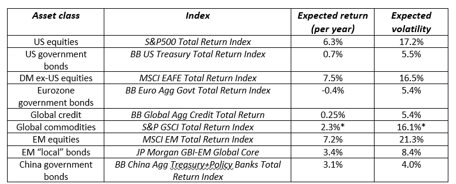*

***预期收益&来自贝莱德研究所的波动性，除了*来自 JP 摩根资产管理***

*有几点需要澄清。“BB”是彭博巴克莱银行的简称。DM 不包括美国股票的预期回报改编自 BI 的“全球不包括美国大盘股”回报。全球信贷预期回报是 BI 分别对“美国信贷”和“欧盟公司债券”的预期回报的 50-50 混合。BI 没有提供大宗商品的预期时刻，但 *JP 摩根资产管理*提供了，这是我获得大宗商品预期回报和波动性的地方。*

*上面列出的中国政府债券指数只有 2016 年 11 月以来的每日数据。我使用*彭博巴克莱中国 Agg 国债总回报指数*作为 2016 年 11 月前的每日数据。这一替代指数自 2012 年 5 月以来每天都有数据。其他资产类别指数至少从 2012 年开始通过订阅从彭博获得每日数据。*

*样本期将涵盖八个日历年的每日数据，时间跨度从 2013 年 1 月**到 2020 年 12 月**。这八年包括极低和高波动性制度。因此，样本期很好地融合了不同的全球市场体系。这个样本将提供所有九个资产类别的历史**协方差数据**。*

*按照上表的顺序，每个资产类别的相关变量名为: ***spx，usd_gov，eafe，eu_gov，credit，gsci，em_stx，em_gov*** 和 ***ch_gov*** 。这九个资产类别在 2013–2020 样本期的汇总统计数据如下:*

*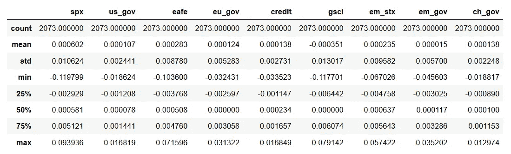*

***2013–2020**日收益汇总统计。资料来源:彭博*

# *多样化的好处*

*下面的**相关矩阵**是从那九个资产类别的**每日日志回报**计算出来的，但是投资组合优化和统计矩计算将基于**每日简单百分比回报**。在金融学中，对于如何以及何时使用对数收益和简单收益存在一些误解。*

*从资产类别的对数收益来计算它们之间的线性相关性可能更合适。**然而，投资组合矩应该根据投资组合中各组成资产的简单百分比回报率**来计算。投资组合回报是投资组合中资产或证券的加权平均值。只有简单的百分比回报可以用这种方式合计。日志仅返回一段时间内的聚合。希望看到对这一原则更正式解释的读者可以在下面的[链接](https://papers.ssrn.com/sol3/papers.cfm?abstract_id=1586656)中找到。*

*从下面的相关性矩阵中我们可以看出，各种权益资产类别——*spx*、 *eafe* 和*em _ stx*——彼此之间具有高度的正相关性。从 *spx* 和 *eafe* 之间的+0.54，到 *eafe* 和 *em_stx* 之间的+0.74。任何小于+1.0 的相关性都意味着多样化收益，但是相关性越小甚至越负，多样化收益就越大。这意味着这些全球股票资产类别的多样化收益是有限的。*

*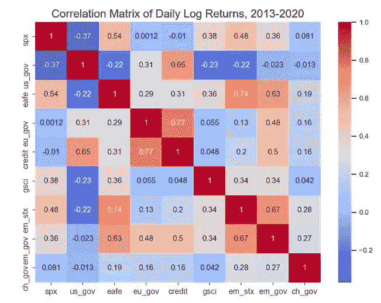*

*相比之下， *spx* 和 *us_gov* 之间的相关性为-0.37，这表明将这两种资产放在一个投资组合中会带来巨大的多元化收益。但由于美国 10 年期国债收益率目前约为 1.5%，未来**多样化的好处可能不会那么强大**。1.5%的收益率意味着债券价格上涨的空间小于下跌的空间(收益率和债券价格反向运动)，因为名义收益率不太可能降至零以下，但没有上行(正)界限。*

*全球资产管理公司倾向于对股票资产类别进行大规模配置，因为它们具有出色的长期回报(即*股票风险溢价*)，除非该管理公司有专门的关注点，例如固定收益。问题在于，股票也是最不稳定的资产类别之一。以下是这九个资产类别的已实现**年化标准差**，我们可以看到，在样本期内，股票的波动率( *spx，eafe & em_stx* )仅次于商品( *gsci* )。*

*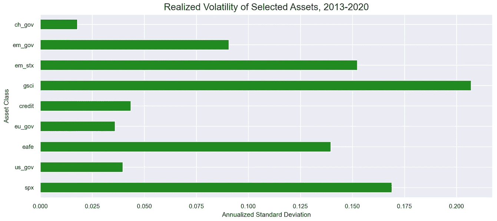*

*这种高回报和高波动性的结合意味着，全球基金经理需要投资组合中的资产能够相对于股票持有实现多样化，从而抑制整体投资组合的波动性。令人高兴的是，他们可以转向新兴市场债券来分散风险。 *em_gov* 和 *ch_gov* 分别与 *us_gov* 和*eu _ gov*(DM 债券资产)的相关性较低。然而， *em_gov* 与 *spx* 和 *eafe* 具有中到高的正相关性，而 *ch_gov* 与这两个资产类别具有低到零的相关性。因此，将基准新兴市场债券指数与**增加的中国政府债券敞口**结合起来可能是有益的，因为后者具有潜在的更高的多元化收益。*

# *投资组合约束*

*在选择资产类别后，我接下来为各种资产类别或它们的组合设置具体的分配或限制。前两个**等式约束**由 BI 推荐的 **DM 股权权重**和**目标回报**指导，目标回报来自上述同一出版物中的假设“英国多资产管理公司”:*

1.  *spx+eafe 分配= 43%*
2.  *投资组合目标回报率= 4.5%*

*我还为 DM 股票配置中的**美国股票**敞口添加了一个不平等(最小)约束。这是现实的，因为美国股市是全球规模最大、流动性最强的股市之一，因此全球基金经理往往有相当大的风险敞口。此外，毕只建议将 7%的资金配置在新兴市场股票上。在这次演习中，我将挑战极限，将新兴市场股票敞口的上限提高到 10%。因此，对股权分配的额外不平等约束是:*

1.  *spx ≥ 15%*
2.  *em_stx 分配≤ 10%*

*BI 的分配建议包括将 26%的份额分配给 **DM 债券**。我决定将这一比例降低到最高 20%，以便为其他固定收益资产留出考虑空间。我另外对**新兴市场债券**敞口设置了两个**不等式约束**，以及一个最终等式约束，即各种资产类别权重之和必须为 100%:*

1.  *德国马克债券≤ 20%*
2.  *em_bonds + ch_bonds ≤ 15%*
3.  *ch_bonds ≤ 5%*
4.  *np .总和(W) = 100%*

*基本上，**新兴市场债券敞口被限制在投资组合的至多 15%**,其中最多 5%可分配给中国债券。这比允许不受限制的配置更现实，因为新兴市场债券市场的流动性远不如发达市场债券，而且这一资产类别仍被认为有些奇特，不管这种想法是对是错。因此，全球资产管理公司对新兴市场债券的配置很少。事实上，15%的最高分配限额可能被认为是相当大胆的。目前通常是个位数百分比。但这篇文章的重点是，它应该更多，正如我们将看到的！*

# *投资组合优化*

*投资组合优化函数如下，函数设置为**最大化投资组合的预期收益除以其标准差的比率**。您还可以看到列出的八个约束条件—四个等式约束条件和四个不等式约束条件:*

*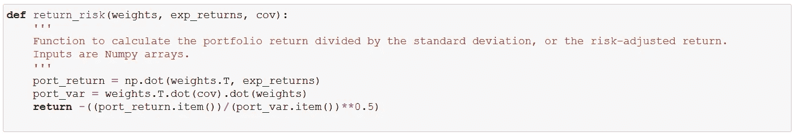*

***风险调整回报函数***

*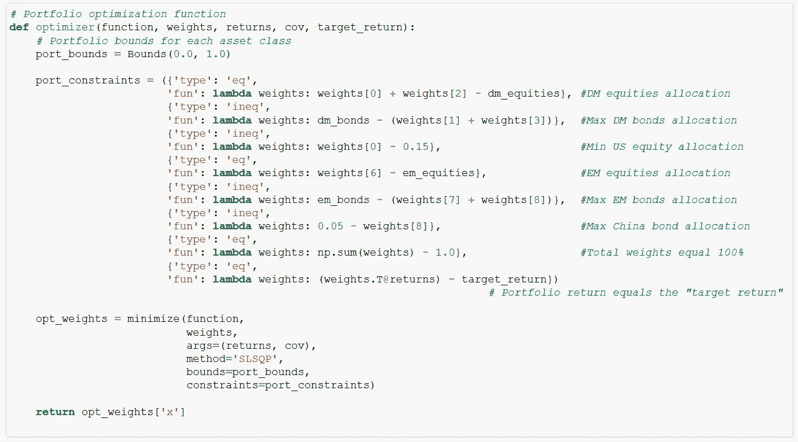*

***具有投资组合约束的投资组合优化函数***

*运行优化流程后，所有九个资产类别的**原始投资组合**的最终分配权重为:*

*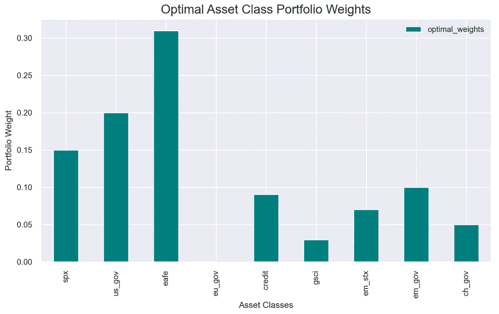*

*然后我**放弃中国债券**作为额外的资产类别选择，并且**将对整体新兴市场债券的最大配置限制在 5%** 。投资组合被重新优化，**新兴市场受限投资组合**的新分配权重为:*

*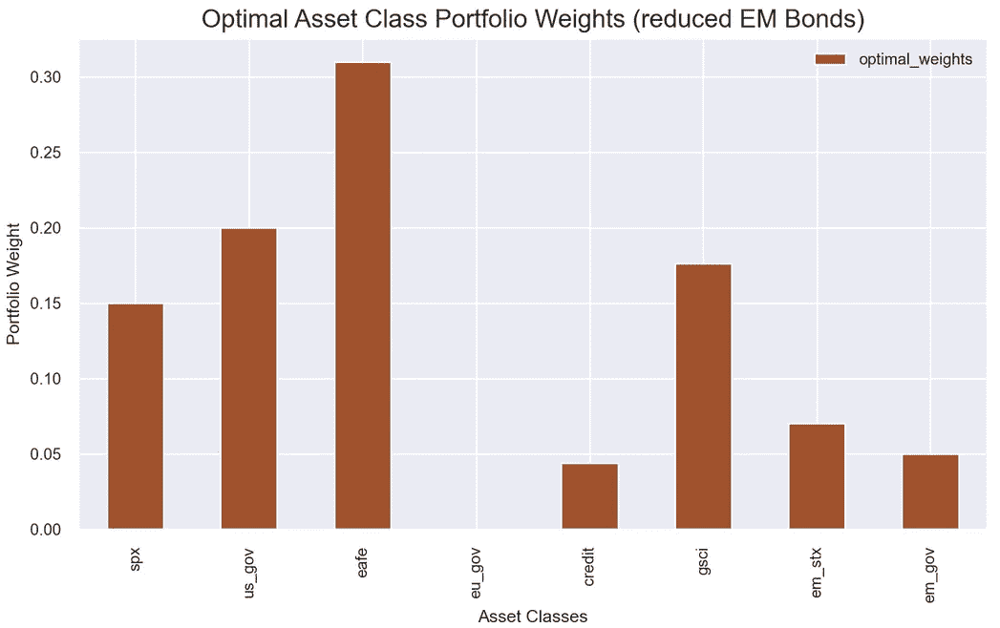*

*如果你还记得的话，上述过程是使用 2013-2020 年的协方差数据作为三个时刻之一进行的。现在，我让优化过程接受场景分析，特别是通过使用两个不同的历史方差-协方差样本期。预期收益保持不变。*

*第一个场景使用 2020 日历年的历史**方差-协方差矩阵，该矩阵经历了来自新冠肺炎疫情的全球金融市场的极高波动性。第二种方法使用 2019 日历年**的**方差-协方差矩阵，其特点是整个资产市场的波动性普遍较低。***

*我使用这些不同的方差-协方差矩阵运行优化程序，所有三个协方差期间的比较投资组合预期收益和年化标准差为:*

*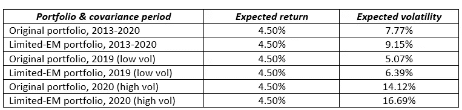*

***投资组合预期收益&不同协方差情景下的波动率***

*需要注意的一点是，所有投资组合的平均预期收益是相同的。事实上，在所有情况下，投资组合的目标回报率都保持在 4.5%，因此这并不令人意外。更重要的是，投资组合的持续**低波动性**或年化标准差**高新兴市场债券持有量**。请记住，这项练习的全部目的是检验新兴市场债券是否能为全球投资组合带来多样化的好处。因此，持有较多新兴市场债券、波动性较低的投资组合，初看起来会支持这一论点。*

# *方差相等的检验*

*关于不同数据样本的方差是否相等，有几种统计检验。这些是 **frequentist 统计显著性检验**，人们可以在指定的 *α* 阈值(通常为 5%)拒绝或不拒绝零假设，以最大限度地减少 I 类错误。两个样本方差相等的传统检验是 **F 检验**，但它假设总体呈正态分布。*

*另一种对偏离常态不太敏感的测试是 Levene 测试。使用中位数的 Levene 检验对偏态分布是稳健的，而使用修剪平均数的检验对厚尾分布是稳健的。我们执行所有三个测试: **F 检验**、**带中位数的 Levene**和**带修整平均数的 Levene**。这些测试比较了三个历史协方差时期(即 2013 年至 2020 年、2019 年和 2020 年)的**原始投资组合与 EM 限制投资组合**之间的方差。*

*所有三个测试都表明，我们可以**拒绝原始投资组合和 EM 受限投资组合之间方差相等的零假设**，只有一个例外。使用 2020 年协方差数据对投资组合方差进行的 Levene(中值)测试返回了一个高于标准 5%阈值的 *p 值*(13.8%)，尽管 f 检验和 Levene(修剪均值)检验都返回了低于阈值的 *p 值*。*

*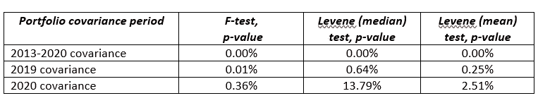*

***各种方差相等测试的结果***

*这些测试让我得出结论，更高的新兴市场债券配置，包括对中国债券的额外配置，有助于降低投资组合的预期波动性。相等波动性的零假设被拒绝，无论我使用高波动性时期(2020 年)还是低波动性时期(2019 年)的方差-协方差数据，情况基本上都是如此。*

# *贝叶斯视角*

*到目前为止，在“数据科学”这个术语被创造出来之前，我们已经讨论过很久了。马科维茨获得诺贝尔奖的投资组合配置框架发表于 1952 年。几十年来，方差分析也一直是传统统计学的主要内容。这并不减损他们永恒的洞察力和实用性。但是让我们享受一下数据科学和贝叶斯建模的乐趣。*

*我不会对贝叶斯统计进行详细的解释，因为许多其他人已经在本出版物中全面地介绍了它。让我举一个金融市场中的**频率主义者与贝叶斯观点**的例子，来提供对概念差异的洞察。*

*如果问一位统计学家，在未来十年里，T4 的 P500 指数(美国主要股票市场指数)的平均年回报率是多少，他会说什么？资深统计学家会说 x%，因为这是标准普尔 500 指数的平均长期历史回报率。另一方面，贝叶斯统计学家可能会说 y%,因为市场的市盈率低/高，美联储预计会提高/降低利率。*

*换句话说，贝叶斯主义者提供了一种可能性，这种可能性取决于他们对世界状况的主观信念。它必然是“主观的”,因为在这种情况下，它涉及对未知未来的信念。在金融市场中，这是一个有用的方法，在我们参与市场之前，我们确实可能有一套信念，无论这些信念是明确的还是隐含的。*

*都说投资就是对未来有信仰，至少对我们投资的价格方向有信仰，而信仰不就是一套信仰吗？整个投资组合配置框架已经依赖于我们对高度不确定现象的资本市场假设。既然我们已经在这些先前的信念下劳作，那就让我们跟着它们一路奔跑吧！*

# *贝叶斯推理*

*贝叶斯推断是基于估计而不是测试。目的是估计各种统计矩在样本间的差异。考虑到数据生成过程中的随机不确定性和我们对真实参数值知识的缺乏，在估计差异时，我还需要估计围绕该差异的不确定性。毕竟，我依赖的是对未来金融资产行为的预测。量化这种不确定性意味着围绕感兴趣的矩的点估计构建一个分布。*

*贝叶斯统计的基本概念是，我从某种现象的某种*先验概率分布开始，基于我对结果分布的信念。然后我用来自观察数据的新信息更新这个先验概率，通知**似然函数**。得到的更新后的概率分布是 ***后验分布*** 。**

****

****后验分布正比于概率乘以先验****

**因此，后验分布将由开始时指定的先验分布和观测数据确定。人们可能认为这是一件好事，因为后验分布受我们对先验分布的初始假设强度的影响。因此，我可以根据我的信念改变先验的**信息**性质，例如，如果我对参数有更大的信念，则使用更窄的先验分布，如果我没有更大的信念，则使用更宽的先验分布。**

**而且，观测数据也起着重要的作用，更多的数据会对得到的后验分布产生越来越大的影响。通常这是一件好事，但我在这个练习中需要小心，因为我没有“真实”的观察数据，这是在未知的未来。请记住，我们正在处理**预期的**投资组合时刻。**

**换句话说，我需要通过在我对先验分布的确信和模拟数据(更多内容见下文)之间小心平衡来接近贝叶斯推断。在这个过程中有很多主观性。这种方法的积极方面是，它迫使我们更深入地思考我们所持有的假设，以及我们对这些假设有多大的信心。**

**在下面的[链接](https://seeing-theory.brown.edu/bayesian-inference/index.html)，布朗大学有一个很好的关于贝叶斯推理的互动网站。**

**在这种情况下，如何使用贝叶斯建模呢？我打算实现两个目标。**首先是根据我的资本市场假设，对预期标准差**(波动性)产生一个更全面的看法。我已经计算了标准偏差的**点估计**，但是理解这些点估计周围的**分布会给我一个更完整的描述。****

****其次是了解这两种预期波动率分布是否不同**。回到最初的问题:新兴市场债券有助于投资组合多元化吗？所以我想弄清楚，这两个期望标准差的分布，是否真的不同，以及不同的程度。**

# **投资组合模拟**

**如上所述，我需要“观察数据”来通知我以前的分布。鉴于我依赖的是模拟数据，而不是真实的(未来的)观察数据，重要的是不要让它们淹没推理过程。更多的模拟将提供更高的精度，但在这种情况下，这将是一个错误的精度。**

**因此，我**限制了模拟的样本量**。另一方面，我们也应该通过对我们的资本市场假设表现出一些信心，来鼓起我们信念的勇气。否则，整个工作就没有任何意义。为了简单起见，我任意选择了中低 300 次模拟。只能说这显示了自信而不是傲慢。**

**投资组合数据是根据 BI 的预期收益和预期波动性模拟的，加上 2013 年至 2020 年的历史协方差数据，假设为多元正态分布。虽然金融市场的回报确实不是正态分布的，但由不同资产类别组成的多元化投资组合的回报分布很可能更接近正态分布。**

**在任何情况下，该假设用于简化模拟程序，并且只是贝叶斯建模练习的一部分。模拟投资组合数据的结果分布如下所示:**

**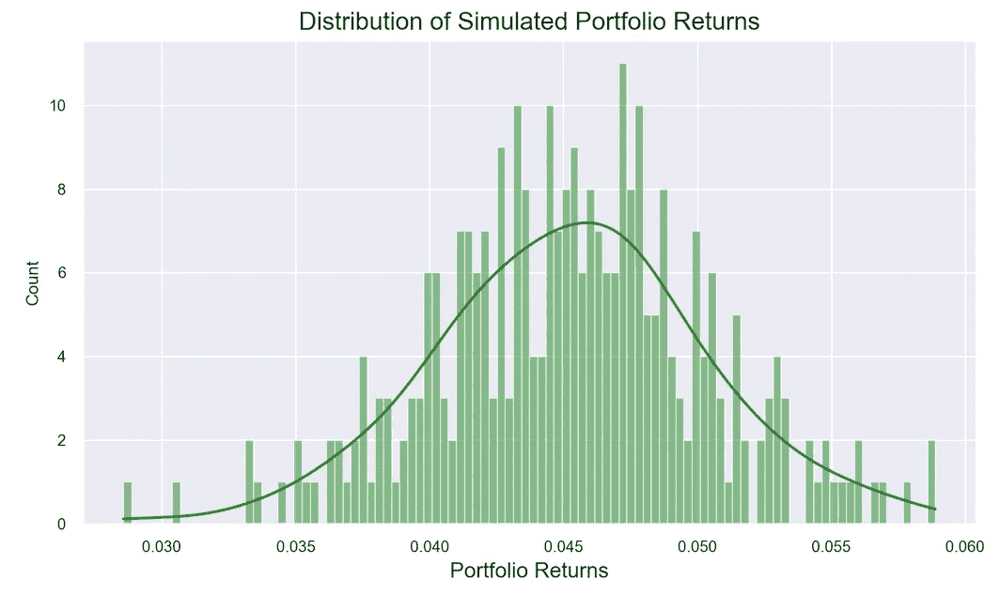****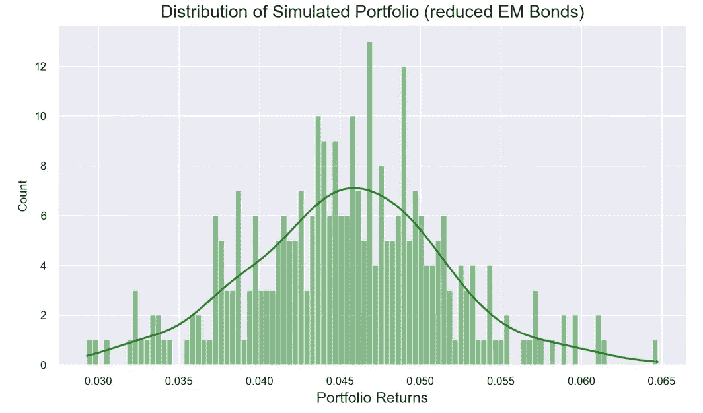**

**这些模拟分布近似对称，但较小的样本也会产生更分散的分布，这有利于表明我们对资本市场假设的不确定性。这些分布将在随后的贝叶斯建模练习中形成**观察数据**。来自模拟投资组合的统计矩应该接近上面发现的那些，但是稍微分散一些:**

**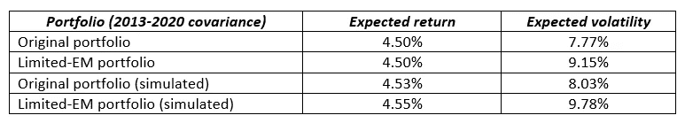**

**下面的贝叶斯模型允许我**生成后验分布，不仅是预期收益的后验分布，更重要的是预期波动率的后验分布**，正如我们将看到的。**

# **贝叶斯建模**

**接下来，我指定了与该现象相对应的全概率模型。选择一个学生的 t 分布作为投资组合数据的似然函数，其尾部比正态分布更厚。三参数 t 分布又允许规定均值*、标准差*和自由度参数*。 *v* 的较大值使分布变得更加“正常”，并且 *v* 值被假定为由原始投资组合和 EM 受限投资组合的 t 分布共享。*****

**我指定 *μ* 、 *σ* 和 *ν* 的以下**先验分布**:**

1.  *******μ***的正态分布**，使用上一节汇集的模拟投资组合数据的平均值和标准差乘以 2(使分布更宽)；**
2.  ****均匀分布** of ***σ*** 具有零左界和 15%右界(请注意，这些约束是针对**非年化**标准差的，它们分别仅为 0.51%和 0.61%，因此是非常宽的均匀分布)；和**
3.  ******的伽马分布**的 *ν* 的**，就是受此处[讨论](https://statmodeling.stat.columbia.edu/2015/05/17/do-we-have-any-recommendations-for-priors-for-student_ts-degrees-of-freedom-parameter/)的启发。**

**下图显示了这些先验分布与似然函数参数的关系:**

**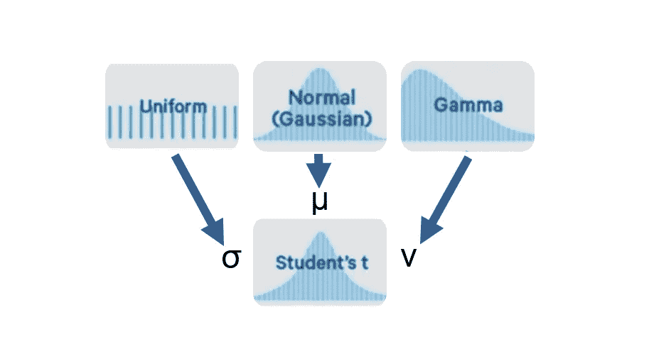**

****先验分布和似然函数****

**如果您想要与 frequentist 显著性检验进行比较，为均值和标准差的先验分布设置相同的规格类似于在这两个时刻设置无差异的零假设。这确实是我所做的。**

**采样过程根据给定的先验分布为感兴趣的参数生成值。然后，根据由模拟投资组合数据组成的观察数据，将先前的每个采样值与**似然函数**进行比较。概率被分配给每个采样的参数值。如果概率较高，则假设采样值是可信的，或者如果概率较低，则不可信。以这种方式，所有被接受的采样值被收集到包含最可能的参数值的新分布中。这就是**的后验分布。****

**这个过程的代码是:**

**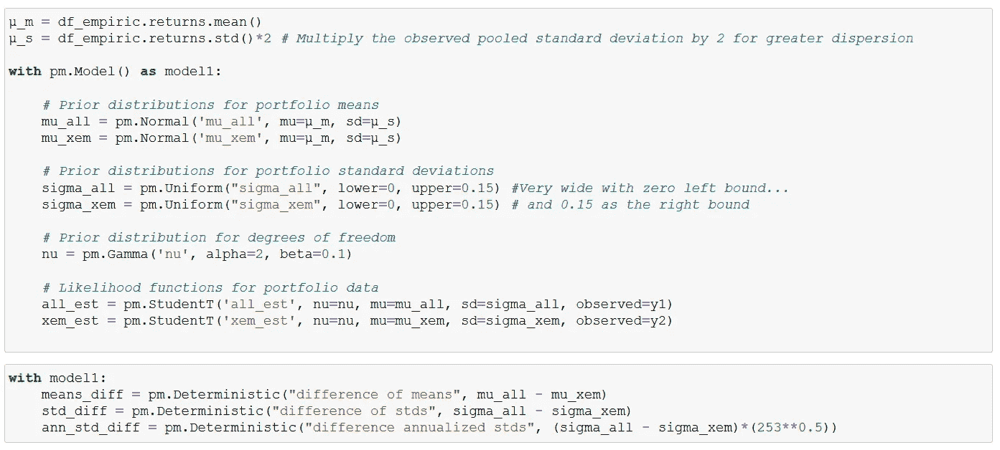**

**原始投资组合(具有更大的新兴市场债券配置)和受新兴市场限制的投资组合的标准差的最终**后验分布**为:**

**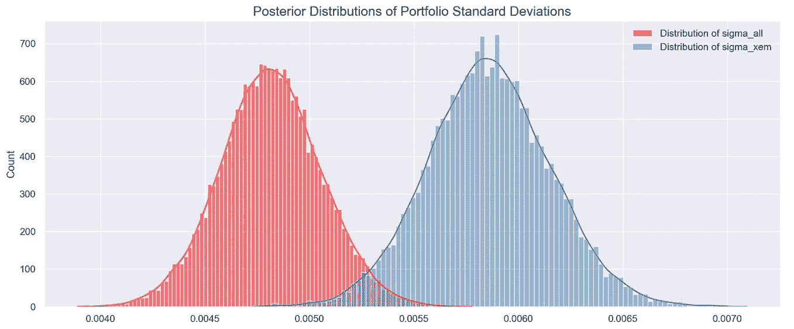**

****波动率的分布，原始投资组合与受 EM 限制的投资组合(统一先验)****

**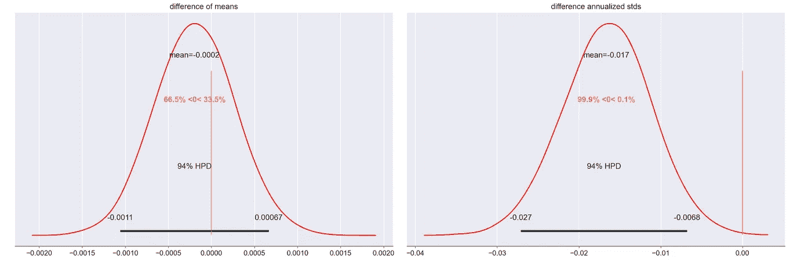**

****均值和波动率差异的确定性分布****

**同样，贝叶斯方法的优势是我能够生成各个时刻的**可观测分布**，而不是像早期的 frequentist 方法那样仅仅依赖点估计。换句话说，贝叶斯后验分布提供了关于我的估计精度的完整信息(在这种情况下是标准差)，不像频率主义方法，我可能只拒绝或不拒绝零假设(估计之间没有差异)。此外，我能够构建各种矩之间的差异的**分布，包括标准差的**，这在频率主义者的推断中是不可能的。**

**我们看到，原始投资组合的标准差分布(红色)只有部分重叠，并且位于 EM 受限投资组合的标准差分布(蓝色)的左侧(较低值)。各个投资组合标准差之间的差异分布显示其均值为 **-1.7%** ，差异等于或大于零的概率只有**0.1%**。我不能用频率主义者的显著性检验来做这样的陈述。**

**因此，我以高度的统计信心得出结论，即**原始投资组合的波动性低于受新兴市场限制的投资组合**，实际上低 18.3%(或 1.7%/9.3%)。**

**考虑到要使用的适当分布的不确定性，特别是预期标准差的先验分布，我使用投资组合标准差的更具**信息量的先验分布来重复分析。在这种情况下，我用一个**半柯西分布**代替均匀先验，同时保持所有其他先验不变:****

**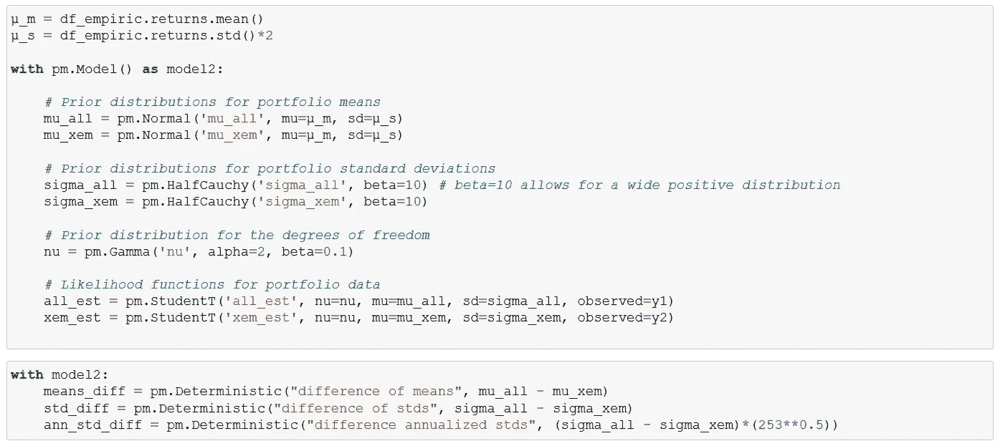**

**柯西分布与学生的单自由度 t 分布相同，因此是一个具有明显厚尾的对称分布。我使用(正)半柯西分布，因为标准差不能为负。**

**原始投资组合(具有更大的新兴市场债券配置)和受新兴市场限制的投资组合的标准差的最终**后验分布**为:**

**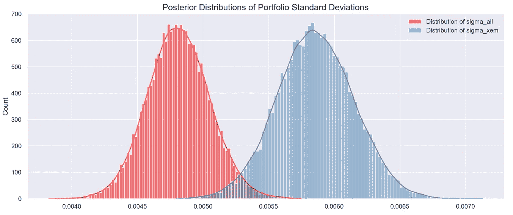**

****波动率的分布，原始与 EM 限制的投资组合(半柯西先验)****

**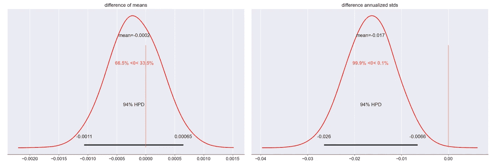**

****均值和波动率差异的确定性分布****

****结论与**大同小异。原始投资组合的波动性或年化标准差再次低于 EM 受限投资组合的波动性或年化标准差，并且在统计上与 EM 受限投资组合的波动性或年化标准差不同。人们当然可以尝试其他以前的发行版，看看这个结论是否对不同的规范是健壮的，但是我将在这里结束它。**

**官方的 **PyMC3** 开发者网站提供了几个关于如何使用该软件包的详细案例研究，例如药物试验评估([链接](https://docs.pymc.io/notebooks/BEST.html))。**

# **结论**

**在这次练习中，我要回答的问题是，新兴市场债券是否能够为全球投资组合带来多样化的好处。我通过经典的均值-方差投资组合优化框架进行分析。资本市场假设主要改编自 2021 年 2 月发表的贝莱德研究所(Blackrock Institute)的假设，特别是九种全球资产类别的预期回报(T21)和波动性。我还使用了这九个资产类别的**历史 2013–2020 协方差**数据。**

**多样化是通过优化投资组合的**预期波动率**或年化标准差来衡量的。各种统计显著性测试**的结果拒绝了方差相等的零假设**，从而让我得出结论**加大对新兴市场债券的配置确实降低了预期波动性**。当我通过使用高波动期(2020 年)和低波动期(2019 年)的历史方差-协方差矩阵对优化程序进行情景测试时，情况仍然如此。**

**然后，我用**贝叶斯模型**增强了分析，这让我能够**精确估计**增加的新兴市场债券敞口降低了投资组合的波动性。各个投资组合波动率之间的差异分布平均值为 **-1.7%** ，差异等于或大于零的概率仅为 0.1%。这意味着，持有更多新兴市场债券将整体预期波动性降低了约 18%。**

**这项研究的总体结论是，增加新兴市场债券配置，同时增加对中国债券的敞口，确实为全球金融资产组合带来了显著的多元化收益。**

**(本练习的完整 Python 代码和支持文档可在我的 [GitHub 页面](https://github.com/at-tan/EM_Bonds_Diversification)获得。如果直接渲染 GitHub 笔记本文件有问题，请使用 [nbviewer](https://nbviewer.org/) 。)**

**如果你看到了阅读这样的文章的价值，你可以在这里订阅 Medium**来阅读我和无数其他作家的其他文章。谢谢你。****

** [## 比特币与宏观因素关系的转变

### 使用回归和统计推断来估计自疫情以来的关系变化

medium.datadriveninvestor.com](https://medium.datadriveninvestor.com/bitcoins-shifting-relationship-to-macro-factors-5465d542078f)  [## 多元时间序列的堆积机器学习模型

### PM 2.5 空气污染数据集的个例研究

towardsdatascience.com](/stacking-machine-learning-models-for-multivariate-time-series-28a082f881)  [## 面向金融的顶级 Python 黑客

### 用比特币时间序列数据

medium.datadriveninvestor.com](https://medium.datadriveninvestor.com/top-python-hacks-for-finance-f9ea900a686c)  [## 外汇市场的等级聚类

### 使用无监督的机器学习来识别行为货币群

towardsdatascience.com](/a-hierarchical-clustering-of-currencies-80b8ba6c9ff3)**