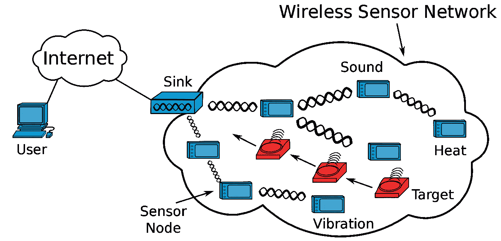
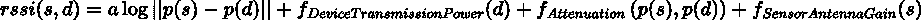
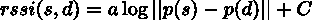
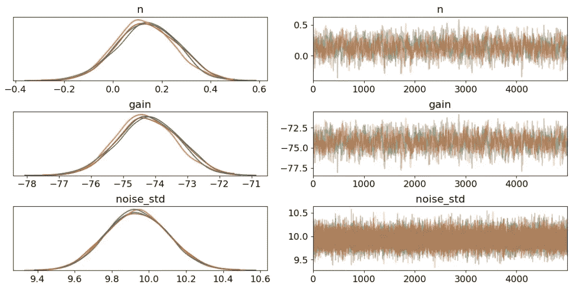
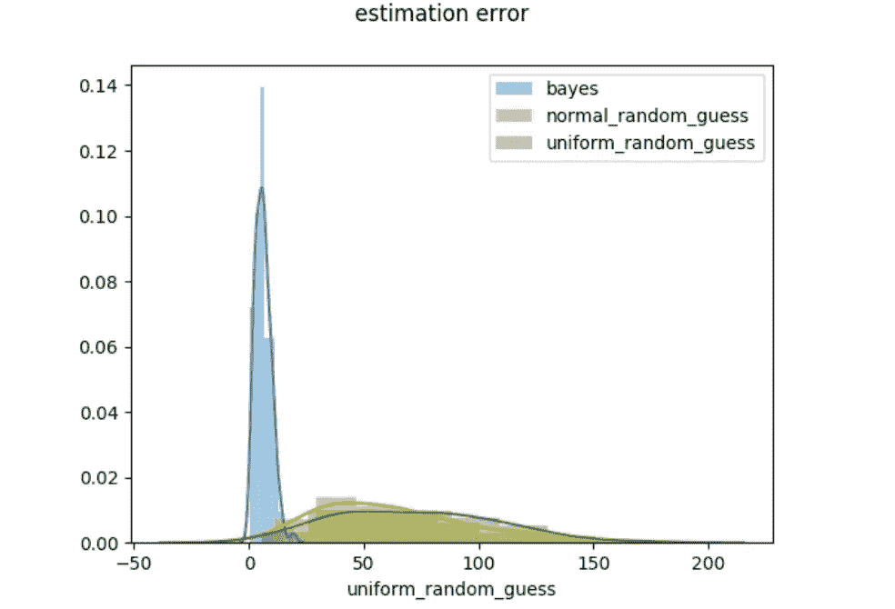
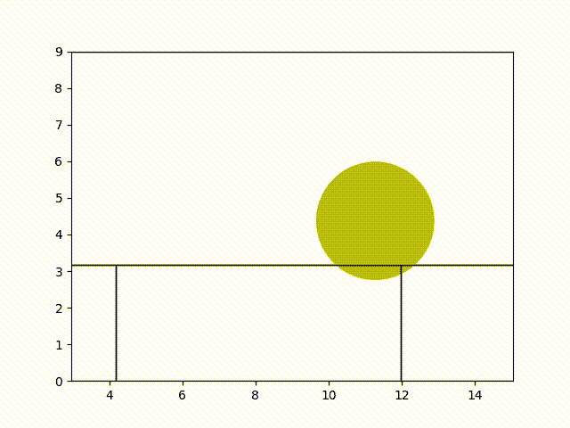

# 基于贝叶斯统计模型的室内 Wi-Fi 用户定位

> 原文：<https://towardsdatascience.com/positioning-indoor-wifi-users-by-bayesian-statistical-modelling-126a8fe282ea?source=collection_archive---------8----------------------->

## 用 Pymc3 识别室内 Wi-Fi 用户的位置



[无线传感器网络](https://www.wikidata.org/wiki/Q336038#/media/File:Wireless_Sensor_Network_General_Structure.svg)

在全球定位系统的帮助下，室外定位有了长足的发展。然而，当面对室内的情况时，我们正遭受重要的不准确性。Wi-Fi 网络的存在为构建定位系统提供了另一种选择，近年来在这一领域进行了大量的研究，其中基于无线信号强度信息的定位因其低成本和易于实现而备受关注。然而，由于难以获得数据的位置标签，在实践中有时难以建立监督模型。

在这篇文章中，你将会读到:

1.  基于接收信号强度指标(RSSI)学习 Wi-Fi 用户位置的无监督模型。
2.  如何使用贝叶斯模型框架 Pymc3 进行具有不确定性容限的定位？

# 基于 RSSI 的 Wi-Fi 用户定位

RSSI 定位技术基于测量从客户端设备到几个不同接入点的 RSSI 值，然后将该信息与传播模型相结合，以确定客户端设备和接入点之间的距离。使用一种短程无源雷达技术的无线传感器可以捕捉到 RSSI 的值，精确度令人惊讶。不幸的是，在实践中，很难将设备的位置与其在接入点的传感器接收到的 RSSI 值一一对应起来。然而，好消息是，在我们的情况下，尽管缺乏标记数据，但背后的物理学可以帮助我们建立一个无监督的模型。对于在某个接入点的设备 d 和传感器 s，下面的等式已经被物理经验所证明:



图片作者:RSSI 值 wrt 设备和传感器

其中 a 是常数，p(s)，p(d)是传感器和设备的位置。其余三个函数值仅取决于设备和传感器。
从这个等式中，我们可以看出，一旦我们知道了常数 a 的值，即设备和传感器的三个剩余函数和位置的表达式，就可以相对简单地得到 RSSI 值。
为了简单起见，我们假设所有三个函数都是常数，也就是说，该方程可以简化为设备和传感器的对数距离的线性回归:



作者图片:简化的 RSSI 方程

假设你知道上述等式中常数的精确值以及传感器的位置，那么很容易识别出该设备所在的球体，因为该等式得到满足。理论上，我们只需要 4 个传感器来定位一个设备。但是注意，这个问题比理论更复杂，原因有三:

1.  我们无法接触到方程中的两个常数。
2.  RSSI 测量值往往会随着环境的变化而大幅波动，因此该等式并不总是成立的。
3.  实际上，我们遭受了重大的数据损失。

# 设备定位的贝叶斯模型

想象一下，现在我们有一个来自几个传感器的 RSSI 值的数据集，该数据集可能质量很差:部分传感器的数据丢失、信号减弱等。我们能做些什么来定位从他们的设备发送这些 RSSI 值的 Wi-Fi 用户？我的建议是:给模型一些不确定性的权利。这种不确定性在许多使用情况下是容许的:例如，在购物中心，操作员知道用户在哪个商店/区域就足够了，而不是精确的点。

假设我们知道所有 Wi-Fi 传感器的位置。目标空间被离散成多个位置。未知常数服从某种正态分布。该模型的思想是首先假设目标可能是具有某些概率的这些位置，并且这些概率可以生成 RSSI 值的分布。**现在对于一个给定的 RSSI 向量，目标是找到一个位置和一对能够生成这个给定向量的常数，也就是最大化似然对数(p(RSSI | d；a，c))。**

回想一下，我们在上一节中说过，RSSI 测量值往往会随着环境的变化而大幅波动。因此，我们在此再做一个假设，即给定传感器和给定设备发送的 RSSI 值遵循正态分布。

# 用 Pymc3 建模

现在让我们看看如何用 P [ymc3](https://docs.pymc.io/en/v3/) 建立模型:一个用于贝叶斯统计建模和概率机器学习的好工具。还要强调的一点是，Pymc3 将在训练中跳过丢失的 RSSI 值(Nan ):假设您有 8 个传感器，其中 2 个丢失了一个设备的 RSSI 值，Pymc3 将使用剩余的 6 个来训练模型。

让我们首先导入我们需要的所有包:

```
import pymc3 as pm
import theano.tensor as tt
import numpy as np
import pandas as pd
from statistics import median 
```

现在让我们建立一个 Wi-Fi 定位模型，它的输入是:1。边界:我们进行采样的目标空间的边界；2.观测值 _n:观测到的 RSSI 值的总数；3.RSSI:提供的 RSSI 值；4.传感器位置:传感器的位置；5.sensors_n:传感器的总数。在下面的代码中，我简单地做了两件事:

1.  具有先验分布的采样参数和目标位置。
2.  建立一个正态分布的 pm.model。

```
def wifi_localization_model(
    bounds,
    observations_n,
    rssis,
    sensor_positions,
    sensors_n,
):rssis=pd.DataFrame(rssis)
    dimensions_n = len(bounds)
    #build the pm model
    model = pm.Model()
    sensor_positions=sensor_positions.reshape((1, sensors_n, dimensions_n))
    with model:
        device_location_dimensions = []
        device_location_variables = []
        #sampling the positions of the devices with a normal distribution          
        for i, bound in enumerate(bounds):
            x = pm.Normal(
                name="x_{}".format(i),
                mu=(bound[0] + bound[1]) / 2,
                sigma=(bound[1] - bound[0])/4 ,
                shape=len(rssis),
            )
            device_location_variables.append(x)
            device_location_dimensions.append(tt.reshape(x, (-1, 1)))
        device_location = tt.concatenate(device_location_dimensions, axis=1)
        device_location = tt.repeat(
            tt.reshape(device_location, (len(rssis), 1, dimensions_n)),
            sensors_n,
            axis=1,
        )
        #sampling the constants of the RSSI equation with a uniform distribution
        n_var = pm.Uniform(name="n", lower=0, upper=10)
        gain_var = pm.Uniform(name="gain", lower=-100, upper=-20)#sampling the noise of the RSSI with a normal distribution
        noise_std_var = pm.Uniform(name="noise_std", lower=0, upper=100)
        log_distance = (
            -10
            * n_var
            * 0.5
            * tt.log10(
                tt.sum(
                    tt.sqr(
                        device_location
                        - np.repeat(sensor_positions, len(rssis), 0)
                    ),
                    axis=2,
                )
            )
        )
        rssi = log_distance + gain_var
        pm.Normal(
            name='observation', mu=rssi, sigma=noise_std_var, observed=rssis
        )
        # start with the initializer "advi"
        tr = pm.sample(
            draws=3000,
            tune=500+dimensions_n * 100,
            chains=4,
            init="advi",
            target_accept=0.75 + 0.05 * dimensions_n,
        )
        n= median(tr['n'])
        gain=median(tr['gain'])
        noise=median(tr['noise_std'])
        estimated_location = []
        estimated_std = []
        locations = []
        for i, device_location_variable in enumerate(device_location_variables):
            summary = pm.summary(
                tr, var_names=[device_location_variable.name]
            )
            estimated_location.append(
                summary["mean"].values.reshape(-1, 1)
            )
            estimated_std.append(summary["sd"].values.reshape(-1, 1))estimated_std.append(summary["sd"].values.reshape(-1, 1))        predictions = np.hstack(estimated_location)
        estimated_std.append(summary["sd"].values.reshape(-1, 1))
estimated_std = np.hstack(estimated_std)return (
            predictions,
            estimated_std,
            gain,
            noise,
        )
```

# 结果

我已经在我自己用 21 个传感器生成的合成数据集上测试了这个模型。当然，我去掉了一部分数据来模拟数据丢失的情况。这是 RSSI 方程中所有常数的轨迹图:



作者图片:模型参数的轨迹图

下面是贝叶斯模型与正常随机猜测和均匀随机猜测的误差比较:



图片作者:贝叶斯模型比较两个随机猜测模型

我们已经取得了良好的准确性！

在结束这篇文章之前，我想给你看一个我在我的地方做的实验:我安装了 6 个 Wi-Fi 传感器，并用我从它们那里获得的 RSSI 值拟合模型。有了 estimated_mean 和 estimated_std，我就可以画出一个球体，在这个球体里面，一个设备在任何时刻都可以在。此外，通过每 5 分钟给出这样的预测球体，我可以绘制出我感兴趣的 Wi-Fi 用户的轨迹。下面的 Gif 是我在一个小时内的轨迹:



作者图片

# 结论

在这篇文章中，我们建立了一个贝叶斯无监督模型来定位基于 RSSI 数据的室内无线设备，具有不确定性的容忍度。在 Pymc3 提供的概率编程的帮助下，尽管数据的质量并不完美，但我们已经通过相对简单的实现获得了良好的准确性。