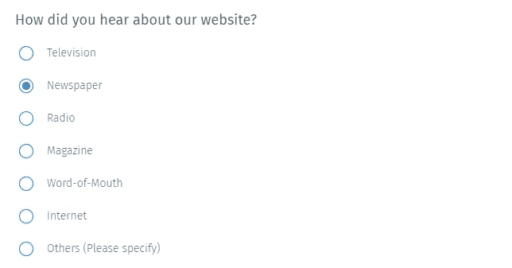
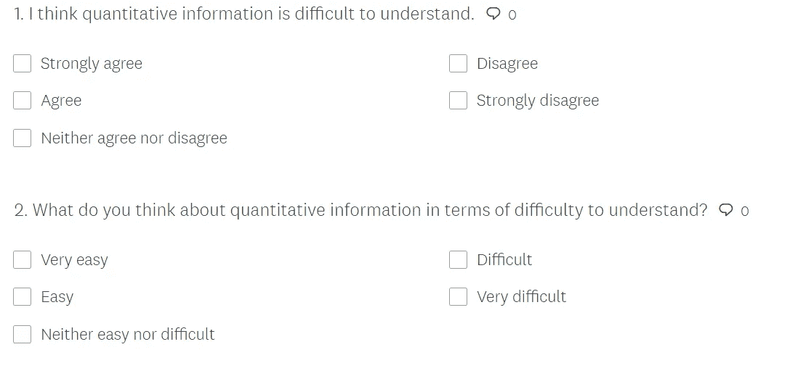

# 调查中可能的偏差

> 原文：<https://towardsdatascience.com/possible-biases-in-surveys-3a5fda36c8a6?source=collection_archive---------20----------------------->

## [公平和偏见](https://towardsdatascience.com/tagged/fairness-and-bias)

## 如何纠正常见的调查偏差以获得更可靠的答案

来源:[麦克尔彼得罗夫](https://stock.adobe.com/contributor/205601455/michail-petrov?load_type=author&prev_url=detail)，Via: [土坯股票](https://stock.adobe.com/)

在数据科学领域，我们处理的数据对我们得到的预测有重大影响。预测模型是基于数据创建的。

数据科学家也是科学家，我们需要意识到我们正在处理的数据中的偏差。我来自社会科学背景，在我的学科中，知识被表述为力量之间战斗的策略。信息被视为政治信息。客观性是一种错觉。在定性研究中，我们只是接受研究人员有偏见，这影响了研究的结果。定性研究者并不声称他们不受主观性的影响。

数据分析产生主观结果的原因之一是数据本身。我们不能盲目相信现有的数据。调查是收集数据的最常见方式之一。在这篇文章中，我将讨论调查中一些可能的偏差，以及如何纠正它们。

**默许偏见**

**默许偏差被定义为同意陈述而不是不同意陈述的倾向** (Hurd & Kapteyn，1999；史密斯·迪尔曼&克里斯蒂安，2014 年，第 100 页)。同意/不同意(A/D)问题很容易产生和应用。这可能是它们如此普遍的原因之一(Saris 等人，2010 年)。另一方面，在使用 A/D 调查时，研究者应该考虑默许偏差的威胁。**当出现默许偏差时，参与者倾向于在同意/不同意选项中选择“同意”或在“是/否”选项中选择“是”** (Kuru & Pasek，2015)。与自我管理的调查相比，由个人管理的调查的效果可能更强(Dillman，Smyth & Christian，2014 年，第 100 页)。

同意/不同意问题示例

在默许偏差的情况下，数据可能会出现错误，因为回答给参与者的真实态度添加了不同的元素(Kuru & Pasek，2015)。最重要的是，默认偏见可以导致类似措辞的问题之间的相关关系，因此，由于这种不相关的关系，消除了一些重要的结构(Bagozzi，1984；麦肯齐&波德萨科夫，2012；库鲁&帕塞克，2015)。即使是与实际反应的微小偏差也会损害研究人员做出可靠推断和预测的能力(Javeline，1999)。因此，即使是源于默许偏差的小调查误差也会降低推论的质量。数据科学家应该警惕他们的数据集中可能存在的默许偏差。

文化也会造成默许偏差。在许多文化中，当与另一个人互动时，同意比不同意更合适(Javeline，1999，Dilman 等人，2014)。

Saris 等人(2010 年)陈述了默许偏差的三个理论上的主要原因。

1.  一些人的个人倾向可以导致他们彬彬有礼，避免冲突，最终具有攻击性。
2.  一些参与者可能认为自己的社会地位低于采访者/研究者。因此，他们可能会相信问题中提供的内容，并无意中接受“同意”选择。
3.  与不一致相比，人们普遍偏向于确认。这就造成了默许偏差。当出现默认偏差时，暗示确认的反应会导致估计均值的增加，并使反应比其实际形状更积极。

**如何消除默许偏差**

该调查最明显的弱点之一可能是默许偏差。为了消除默许偏差，**将同意/不同意(A/D)回答转换为项目特定(IS)回答格式是有效的，因为 IS 回答格式可以更好地避免默许偏差。**针对具体项目的回答格式可以给出更有效和可靠的结果，并提高调查的整体质量(Saris et al .，2010)。无论类别的数量是多还是少，IS scale 都能给出更好的结果。需要注意的是，较低的质量会造成变量之间的相关性(Lord & Novick，1968；Saris 等人，2010 年)。这给调查设计带来了多重共线性问题。

特定于项目的问题示例

就可靠性而言，针对具体项目的调查比同意/不同意的调查表现更好。**这背后的原因是，与同意/不同意调查相比，参与者在选择特定项目调查中的立场时更加确定** (Saris 等人，2010 年)。

下面是一个将同意/不同意问题转换为项目特定格式的示例。第一个是原问题。第二个是我从原始版本修改而来的特定于项目的格式。

第一个问题来自于 M. Viswanathan 在 1993 年提出的数字信息偏好(PNI)调查。第二个问题是它的一个修改版本，采用特定于项目的格式

**另一个可能的偏差:反应顺序效应**

大量文献表明，对调查问题的回答受到回答顺序的影响。**也就是说，较早出现的选择更有可能被选中** (Becker，1954；贝尔森，1966 年；布鲁克和厄普顿，1974；鲤鱼，1974；穆勒，1970 年，s .佩恩，1951 年；j .佩恩 1971；奎因和贝尔森，1969 年；鲁格和坎特里尔，1944 年；舒玛和普雷斯 1981，克罗斯尼克，1991)。根据眼球追踪数据，如果答案选项是分类的，受访者倾向于连续设想它们。此外，第一个选项比后面的选项更受关注(Galeš ic 等人，2008 年；Tourangeau，2018)。**一些受访者在得出一个可接受的答案时停下来，再也看不到其他选项。**

hne 和 lenz ner(2015)的眼球追踪研究陈述了三个发现。

1.  在评定等级中，反应顺序的影响相对较小。
2.  参与者选择反应量表前半部分的频率高于后半部分。这种情况尤其会发生在垂直放置答案的等级量表中。
3.  如果受访者在回答量表的前半部分花费更多时间，他们更有可能选择其中一个答案。

**如何消除响应顺序效应**

为了弥补响应顺序的影响，可以将响应从 A/D 转换为特定于项目的响应。研究表明，回答顺序在 A/D 中有效，但在具体项目的问题格式中无效(hne & Krebs，2018)。此外，受访者的评估表明，完成特定项目问卷比完成 A/D 问卷需要更多的考虑。研究结果表明，IS 问题比 A/D 问题更能抵抗反应顺序效应(hne & Krebs，2018)。

**另一种可以减少响应顺序影响的方法是随机改变不同参与者的响应顺序。通过使用在线调查工具，这可以很容易地实现。我使用了 Survey Monkey 和 Qualdtrics 网站。他们提供了一个随机响应顺序选项。**

**最后，响应选项的排列应垂直放置，因为垂直排列的顺序效应较小**(hne&Krebs，2015)。

**A/D 响应调查的认知负担及补救措施**

在调查中，参与者被要求花费相当多的认知努力，同时在很少或没有奖励的情况下回答调查(Krosnick，1991)。一些回答者可能出于各种原因，如自我表达的愿望、自我理解、情绪图表、智力挑战、人际关系反应等，而被激励付出精神努力来回答问题。(沃里克和林宁格，1975；克罗斯尼克，1991 年)。

自 20 世纪 80 年代以来，人们认识到调查中的很大一部分测量误差源于与参与者的预期认知操作相关的问题(Tourangeau，2018)。调查方法认知方面高级研讨会(CASM)提供了调查响应的四个认知过程的四个组成部分，它们是(Tourangeau，1984):

1.  对问题的理解
2.  信息检索
3.  将信息整合到评估或判断中
4.  该判决的报道

理解过程是关于理解问题中确切地问了什么。认知访谈研究表明，大多数调查错误源于理解问题 (DeMaio 和 Landreth，2004；普莱瑟和布莱尔，1994；威利斯和谢克特，1997 年；Tourangeau，2018)。

有不同的方法可以帮助参与者以预期的方式理解问题，并减少理解问题。**一个有效的方法是对问题中的关键术语给出定义**(绍贝尔和康拉德，1997)。此外，在需要时提供澄清也改善了对问题的理解(Ehlen 等人，2007；Tourangeau，2018)。然而，提供澄清更适合面对面的应用调查，而不是在线调查。

提取是参与者在解释调查问题时发生的另一个认知过程，因为在解释过程中，他们需要从记忆中提取信息来回答问题，而提取可能会失败(Tourangeau，2018)。**信息检索可能会因为不同的原因而失败。它可能会失败，因为:**

*   从不编码信息
*   记忆中的系统性失真
*   对事件时间和地点的混淆

提供更丰富的提取刺激有助于提高回忆。另一种更好的检索方法是引出生活事件。这可以触发记忆，便于及时排序(Tourangeau，2018)。

第三个认知过程是信息的整合。信息通常被整合到评估或判断中。达到这种估计或判断的路径会影响调查问题的认知负担。**当有关于行为频率的问题时，受访者使用的检索策略可能会影响他们的报告错误。当询问频率时，参与者可能会少报或多报行为** (Tourangeau，2018)。

产生认知负担的第四个过程是报告答案。也就是说，调查可以提供封闭式答案或开放式问题。在回答时，受访者大多将答案的终点定在与类别相关的极端情况上。中点可以看作中性点(Tourangeau，2018)。这个过程产生了认知负担。A/D 格式会带来更多的认知负担。也就是说，在分类回答中可以考虑 A/D 反应**。作为分类响应格式，两个相邻选项之间的距离在模数响应**中并不明确(Fowler and Cosenza 2008 刘等，2015)。参与者在回答问题时可能会经历这种认知负担。**另一方面，与 A/D 问题相比，项目特定问题的顺序性较差。因此，应答者在报告答案的认知过程中可能经历较少的负担。**

同意/不同意(A/D)回答格式比项目特定格式需要更多的认知步骤(Carpenter and Just 1975 克拉克和克拉克 1977；特拉巴索，罗林斯，1971，刘等，2015)。必须记住，对高认知负担的需求会对可靠性产生负面影响。需要较少认知负担的响应格式更有利于稳健测量。因此，就认知负担而言，项目特异性反应格式比 A/D 格式更有利。

**结论**

在帖子中，我讨论了在一项调查中可能引起偏差的三个主要原因:默许偏差、反应顺序效应和认知负担效应。当然，还有更多可能的偏差。

数据科学家在解释他们的人工智能模型的结果时，也要对他们的推论的科学基础负责。我们需要承认，所有的数据都有一定程度的偏差，我们的预测模型也带有来自数据的偏差。因此，熟悉数据收集工具的偏差，尤其是调查，可以让我们对自己的解释更加谨慎。

**参考文献**

h . m . alkhateeb 和 a . s . Abed(2002 年)。阿拉伯语翻译量表的因子结构，对数字信息的偏好。*知觉与运动技能*， *94* (1)，185–188。

巴戈齐(1984 年)。市场营销理论建设计划书。*期刊*

*营销，*第 48 卷第 1 期，第 11e29 页。http://doi.org/10.2307/1251307.

贝克，S. L. (1954)。为什么是秩序效应？*舆情季刊*， *18* (3)，271–278。

贝尔森，W.A. (1966)。颠倒言语等级量表呈现顺序的效应。*广告研究杂志*，6 期，30–37 页。

布鲁克和厄普顿(1974)。由于选票上的位置而导致的地方政府选举中的偏见。英国皇家统计学会杂志:C 辑(应用统计学)， *23* (3)，414–419。

J. S .布鲁纳和 h .塔伊费尔(1961 年)。认知风险和环境变化。*《变态与社会心理学杂志》*， *62 期* (2)，231 页。

卡普，F. M. (1974)。职位对面试回答的影响。*老年学杂志*， *29* (5)，581–587。

卡彭特帕特里夏 a 马塞尔 a。1975.句子理解:心理语言学

验证的处理模型。"*心理回顾*82:45–73。

赫伯特·h·克拉克和伊芙·v·克拉克。1977.*心理与语言*。纽约:哈科特·布雷斯

约万诺维奇。

克劳博士和马洛博士(1964 年)。*认同动机:评价依赖研究*。纽约:威利。

德梅奥、T. J .、兰德雷斯(2004 年)。不同的认知面试技巧会产生不同的结果吗？*调查问卷的测试和评估方法*， *546* ，89–108。

d . a . dillman，Smyth，J. D .，& Christian，L. M. (2014 年)。*网络、电话、邮件和混合模式调查:量身定制的设计方法*。约翰·威利的儿子们。

埃伦，p .，绍贝尔，M. F .，，康拉德，F. G. (2007)。模拟语音不流畅以预测语音调查界面中的概念偏差。*话语过程*， *44* (3)，245–265。

Galesic，m .、Tourangeau，r .、Couper，M. P .、和 Conrad，F. G. (2008 年)。眼球追踪数据:对调查反应中反应顺序效应和其他认知捷径的新见解。*舆情季刊*， *72* (5)，892–913。

Hö hne，J. K .，& Krebs，D. (2018 年)。同意/不同意和特定项目问题中的尺度方向效应:问题格式的比较。*《国际社会研究方法论杂志》，第 21 卷* (1)，第 91 页。土井指数:10.1080/136453864867

Hö hne，K. J .，& Lenzner，T. (2015 年)。使用眼动追踪研究网络调查中的反应顺序效应。 *Psihologija* ， *48* (4)，361–377。

Hurd，M. D .，和 Kapteyn，A. (1999 年)。家庭调查中测量资产的锚定和默认偏差。在*偏好的引出*(第 111-138 页)。斯普林格，多德雷赫特。

Javeline 博士(1999 年)。礼貌文化中的回应效应:哈萨克斯坦的默许测试。*民意季刊*，1–28。

克罗斯尼克，J. A. (1991 年)。应对调查中态度测量认知需求的应对策略。*应用认知心理学*， *5* (3)，213–236。

刘，李，s .，，康拉德，F. G. (2015)。比较同意-不同意和项目特定量表之间的极端反应风格。*舆情季刊*， *79* (4)，952–975。

洛德，F. M .，&诺维克，M. R. (1968 年)。*智力测验分数的统计理论*。IAP。

麦肯齐，S. B .，& Podsakoff，P. M. (2012 年)。营销中常见的方法偏差:原因、机制和程序补救。*零售杂志*， *88* (4)，542–555。

穆勒，J. E. (1970)。从 133 名候选人中选择。*《民意季刊》*， *34* (3)，395–402 页。

佩恩(1951 年)。提问的艺术普林斯顿大学出版社。

佩恩博士(1971 年)。在邮寄调查中颠倒口头等级量表顺序的影响。*市场研究学会杂志*， *14* ，30–44。

佩蒂格鲁，T. F. (1958)。范畴宽度作为认知变量的测量和相关因素。*个性杂志*， *26* (4)，532–544 页。

普莱塞和布莱尔(1994 年)。调查预测试:不同的方法会产生不同的结果吗？。*社会学方法论*，73–104。

Saris，w .，Revilla，m .，Krosnick，J. A .，& Shaeffer，E. M. (2010 年 5 月)。将带有同意/不同意回答选项的问题与带有特定项目回答选项的问题进行比较。在*调查研究方法*(第 4 卷，№1，第 61–79 页)中。

绍贝尔，M. F .，，康拉德，F. G. (1997)。对话式访谈能减少调查测量误差吗？。*民意季刊*， *61 期* (4)，576 期。

特拉巴索、汤姆、霍华德·罗林斯和爱德华·沙乌格内西。1971.“储存和核查

处理概念的阶段。"*认知心理学*2:239–89。

索恩，s .，希斯洛普，T. G .，郭，m .，，阿姆斯壮，E. A. (2006)。希望和概率:癌症交流中数字信息意义的患者观点。*定性健康研究*， *16* (3)，318–336。

Tourangeau 河(2018 年)。从认知的角度看调查响应过程。*教育中的质量保证，26* (2)，169–181。doi:10.1108/QAE

Tourangeau 河(1984 年)。认知科学和调查方法。*调查方法的认知方面:在学科之间架起一座桥梁*， *15* ，73–100。

Tourangeau，r .，Couper，M. P .，& Conrad，F. (2007 年)。颜色、标签和反应量表的解释试探法。*民意季刊*， *71* (1)，第 91–112 页。

教科文组织。(2016).*教育造福人类和地球:为所有人创造可持续的未来:全球教育监测报告*。

维斯瓦纳坦(1993 年)。对数字信息偏好的个体差异的测量。*《应用心理学杂志》*， *78* (5)，741 页。

维斯瓦纳坦，m .，，蔡尔德斯，T. L. (1992)。产品属性量值的编码和利用:使用数字和语言信息的调查/1992: 105。 *BEBR 教员工作论文；编号 92–0105*。

沃里克，D. P .，&林宁格，C. A. (1975)。*抽样调查:理论与实践*。麦格劳-希尔。

威利斯和谢克特(1997 年)。认知访谈技术的评估:结果能推广到现场吗？*社会学方法论通报/Bulletin de methodologie Sociologique*， *55* (1)，40–66。

沃森，J. M. (1988)。成就焦虑测验:维度与效用。*《教育心理学杂志》*， *80* (4)，585。