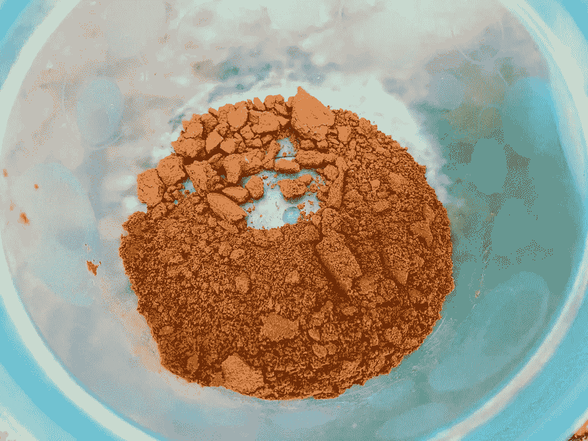
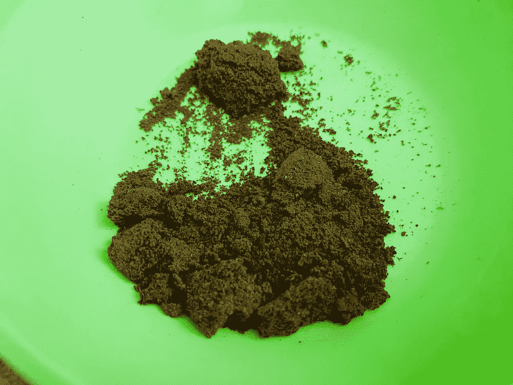
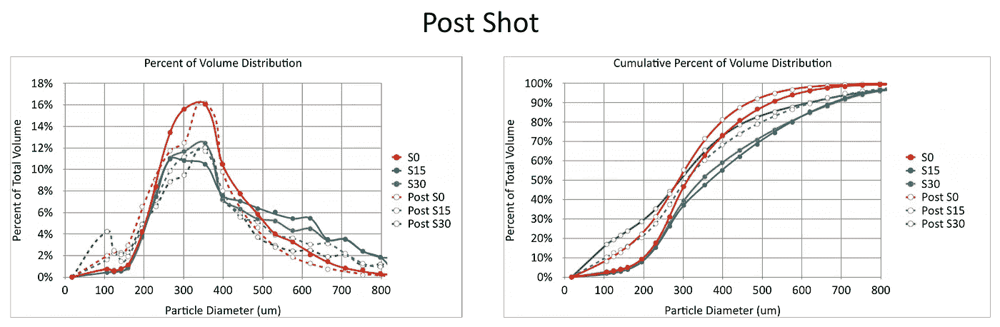
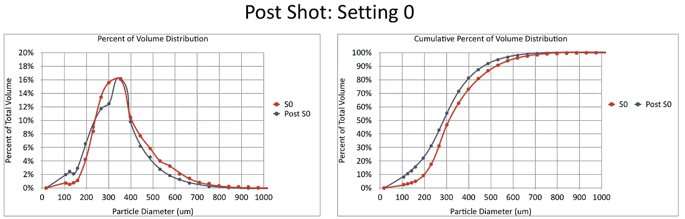
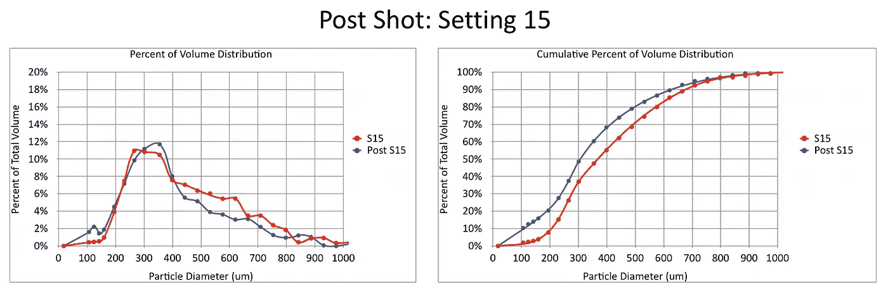
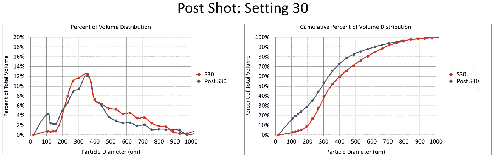
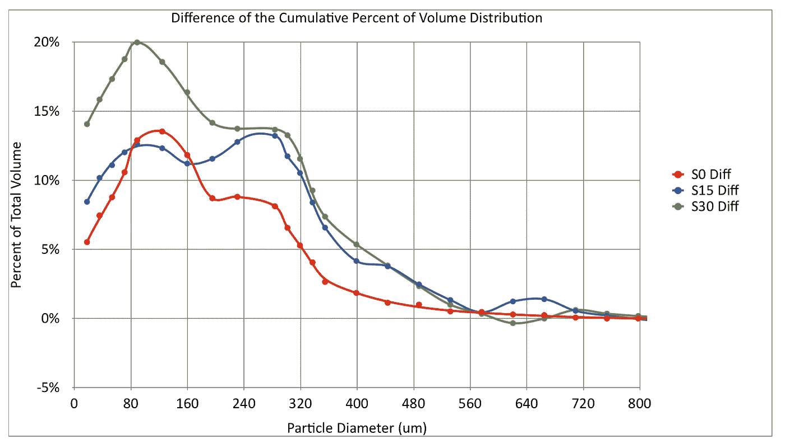
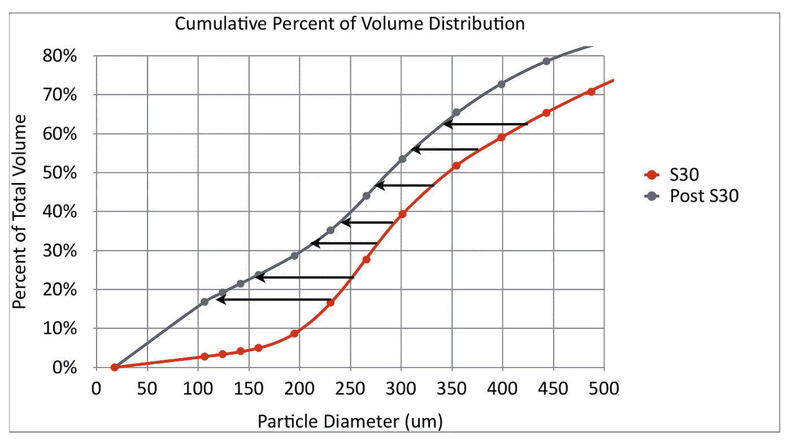
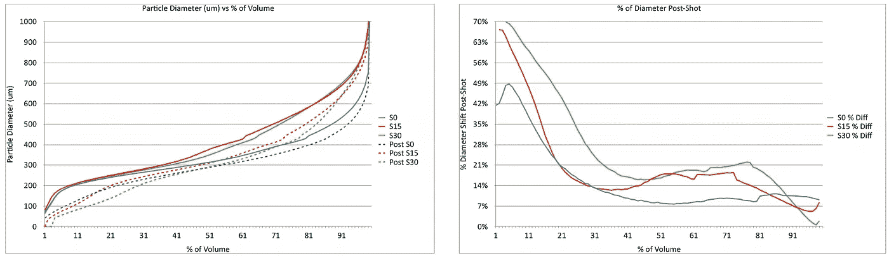

# 浓缩咖啡后的咖啡颗粒分布

> 原文：<https://towardsdatascience.com/post-espresso-shot-coffee-particle-distribution-bf5096d612e3?source=collection_archive---------29----------------------->

## 咖啡数据科学

## 探究萃取如何影响颗粒大小

由于我一直在观察[的粒子分布](https://rmckeon.medium.com/measuring-coffee-grind-distribution-d37a39ffc215)，我对拍摄后的情况感到好奇。萃取如何改变颗粒大小？萃取会使咖啡缩水吗？

幸运的是，我能拍摄分层照片，最近我一直在用壁龛研磨机拍摄 [sudo-staccato](https://link.medium.com/Ik6nkqkpyeb) 照片。此外，我在精细层和粗糙层之间使用了一个[布过滤器](https://link.medium.com/iW43aDmpyeb)，使它们更容易分离。

左:击球后的良好场地。右图:击球后地面粗糙/中等。所有图片由作者提供

我拉了一些镜头，唯一的技巧是分离粗糙(设置 30 或 S30)和中间(设置 15 或 S15)层。然而，一个小勺子解决了这个问题。

这里是所有的情节组合，但我也将它们进一步分离如下。

对于设置为 0，峰值没有移动太多，但其他一切都变得更好。

对于设置 15，这种转变是明显的。

同样适用于设置 30:

累积分布的差异如下所示:

# 翻转轴

我们可以翻转 X 和 Y 轴，看看分布如何移动，如下图所示。我假设粒子会收缩，这可能是提取的一个很好的近似。

我通过对每个粒子分布做最佳拟合多项式来做到这一点。然后我可以计算拍摄前后累积体积的变化。例如，在上面的图表中，我可以看到 50%的颗粒直径小于 340 微米，而拍摄后，50%的颗粒直径约为 280 微米。

人们可以将拍摄后的直径变化百分比视为提取，但我不确定这有多一致。在这种情况下，看起来像是在上方或下方的粒子没有移动太多的地方出现了峰值提取。

然而，我不想假设一个特定直径的粒子比其他大小的粒子均匀地提取。该图中较低体积百分比处的高值是由于测量的不确定性。

这个实验非常简单，粒子分布符合我的预期。我不确定除了一般的确认之外，还能对这些信息做些什么，这是拼图中的另一块，也许有一天会派上用场。

如果你愿意，可以在 Twitter 和 YouTube 上关注我，我会在那里发布不同机器上的浓缩咖啡视频和浓缩咖啡相关的东西。你也可以在 [LinkedIn](https://www.linkedin.com/in/robert-mckeon-aloe-01581595?source=post_page---------------------------) 上找到我。也可以关注我[中](https://towardsdatascience.com/@rmckeon/follow)。

# [我的进一步阅读](https://rmckeon.medium.com/story-collection-splash-page-e15025710347):

[浓缩咖啡系列文章](https://rmckeon.medium.com/a-collection-of-espresso-articles-de8a3abf9917?postPublishedType=repub)

[工作和学校故事集](https://rmckeon.medium.com/a-collection-of-work-and-school-stories-6b7ca5a58318?source=your_stories_page-------------------------------------)

[个人故事和关注点](https://rmckeon.medium.com/personal-stories-and-concerns-51bd8b3e63e6?source=your_stories_page-------------------------------------)

[乐高故事启动页面](https://rmckeon.medium.com/lego-story-splash-page-b91ba4f56bc7?source=your_stories_page-------------------------------------)

[摄影启动页面](https://rmckeon.medium.com/photography-splash-page-fe93297abc06?source=your_stories_page-------------------------------------)

[使用图像处理测量咖啡研磨颗粒分布](/measuring-coffee-grind-particle-distribution-using-image-processing-84882e6dd4fd?source=your_stories_page-------------------------------------)

[使用筛子改进咖啡研磨测量](/improving-coffee-grind-measurement-using-a-sifter-7b358f9c8331?source=your_stories_page-------------------------------------)

[使用先进的图像处理技术测量咖啡渣中的粉末](/measuring-fines-in-coffee-grounds-using-advanced-image-processing-148f048bdb7?source=your_stories_page-------------------------------------)

[使用自适应阈值改善咖啡粉分布](/improving-coffee-grind-distribution-using-adaptive-thresholds-194e001f301?source=your_stories_page-------------------------------------)

[拍摄咖啡渣进行研磨分布分析](https://medium.com/nerd-for-tech/photographing-coffee-grounds-for-grind-distribution-analysis-d3494e980c28?source=your_stories_page-------------------------------------)