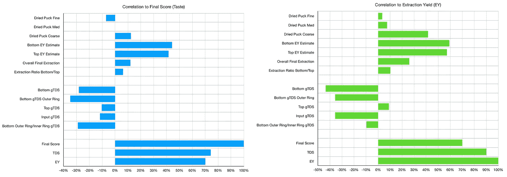
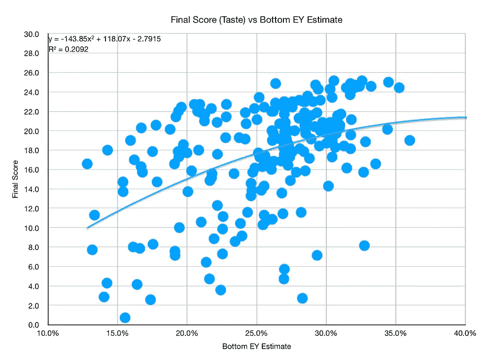
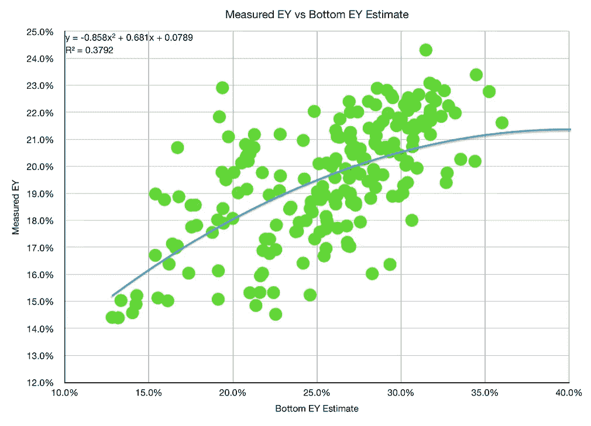
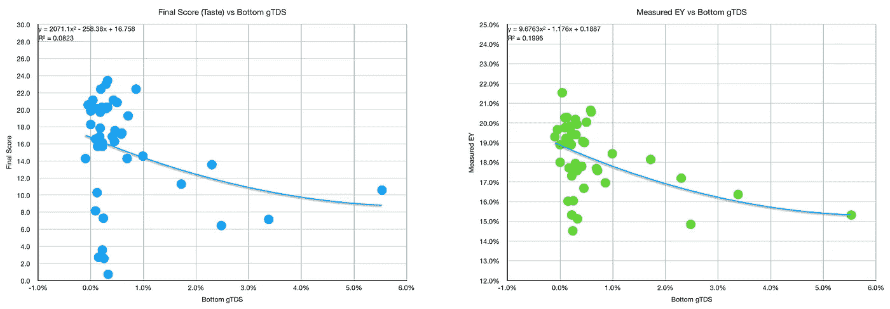
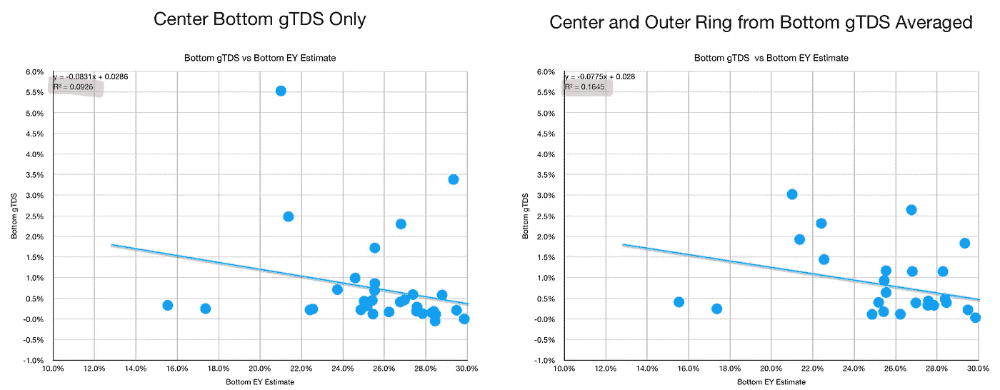
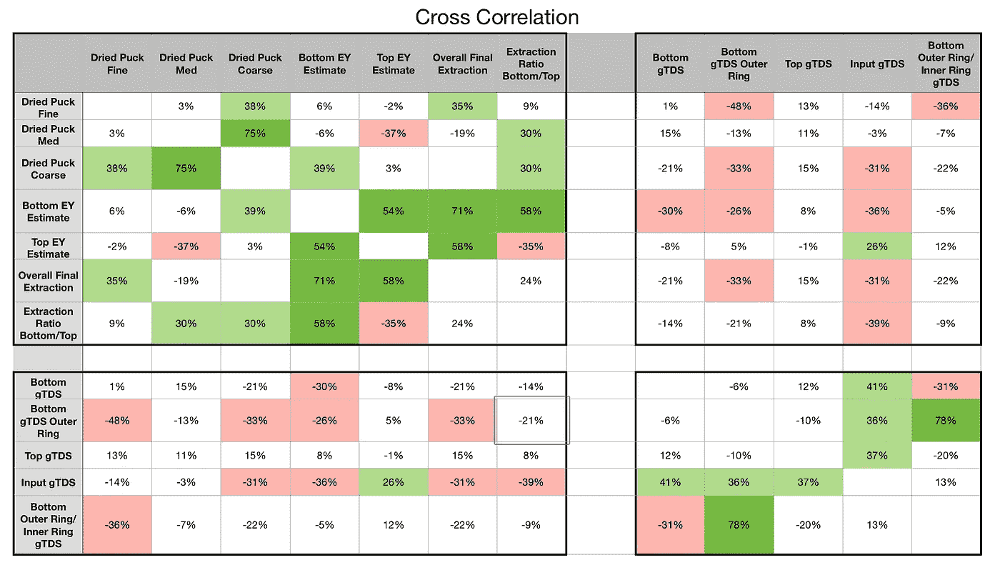

# 浓缩咖啡的拍摄后质量指标

> 原文：<https://towardsdatascience.com/post-shot-quality-metrics-for-espresso-78ca525f0215?source=collection_archive---------30----------------------->

## 咖啡数据科学

## 探索未知数据点

在一些粗略的探索中，我发现了一些我认为可能有助于提供更多浓缩咖啡质量信息的指标。我使用的两个主要指标是提取率(来自总溶解固体(TDS))和最终得分(7 个味道指标)。然而，在浓缩咖啡中还有很多其他潜在的变量。

我将在这项工作中探索两个变量:击球后的冰球重量和[地面 TDS (gTDS)](/other-coffee-measurements-using-a-refractometer-85d0fb28d3d7) 。

这两个变量都有助于理解一个镜头是如何流动的，以及提取发生在哪里。

# 定义

**击球后冰球重量**由击球后冰球的重量决定。在常规的浓缩咖啡拍摄中，这不会提供更多有用的信息，但我通常会在圆盘的顶部和底部之间用布过滤器进行拍摄。这让我可以分别称量用过的冰球的顶部和底部。

我将这个权重与每一半的输入权重结合起来，以确定对各层 EY 的估计。这有几个假设:

1.  水均匀地保留在顶部和底部。
2.  顶部和底部将以相似的湿/干比干燥，通常测量值约为 2.2。

这些假设是基于我以前收集的关于分层提取 T4 的数据，但这并不意味着它们在更大的数据集中是可靠的。我提前承认了这个事实。

[**咖啡渣 TDS (gTDS)**](/other-coffee-measurements-using-a-refractometer-85d0fb28d3d7) 通过取一些咖啡渣，将它们放在数字折光仪上(在这种情况下是 Atago)，加入少量水，并测量 TDS 来确定。这让我们知道还有多少可溶物在地下。

我先前已经发现 gTDS 有助于理解哪里流动更快，这是通灵迹象。

# 绩效指标

我使用两个指标来评估技术之间的差异:最终得分和咖啡萃取。

[**最终得分**](https://towardsdatascience.com/@rmckeon/coffee-data-sheet-d95fd241e7f6) 是评分卡上 7 个指标(辛辣、浓郁、糖浆、甜味、酸味、苦味和余味)的平均值。当然，这些分数是主观的，但它们符合我的口味，帮助我提高了我的拍摄水平。分数有一些变化。我的目标是保持每个指标的一致性，但有时粒度很难确定。

</coffee-solubility-in-espresso-an-initial-study-88f78a432e2c>**使用折射仪测量总溶解固体(TDS)，该数字与一杯咖啡的输出重量和输入重量相结合，用于确定提取到杯中的咖啡的百分比。**

**此外，我在数据分析中使用相关性。**

**[**相关性**](https://en.wikipedia.org/wiki/Correlation_coefficient) 是表示两个变量彼此相似程度的度量。高度相关并不意味着一个变量会引起另一个变量，而是当情况发生变化时，两个变量的涨跌幅度相同。我从一开始就假设一些分级变量会有很高的相关性，因为它们是从不同的时间点来看味道的。**

# **数据**

**我随着时间的推移，通过多次拍摄来观察这些因素，以了解它们是否有用。我从最终得分和 EY 的相关性开始。**

****

**所有图片由作者提供**

**相关性揭示了一些看起来非常直接的事情:**

1.  **最低的 ey 和最高的 EY 估计值与 EY 相关，因为它们来自 EY，这意味着它们也应该与口味相关，但不如 EY 那么强烈。**
2.  **底部 gTDS 与味道和 EY 呈负相关，这也是有意义的，因为它是一个衡量什么可溶物留在地上的指标。**
3.  **底部/顶部提取估计值、顶部 GTD 和输入 GTD 的比率与口味没有很好的相关性，但输入 GTD 似乎与 EY 呈负相关。**

********

**当绘制这些变量的数据时，有一些不错的相关性。**

****

**衡量 gTDS 似乎与最终得分或 EY 没有很好的联系。**

**我还绘制了底部的 GTD 与底部的 EY 估计值，以查看它们之间的关系。**

****

**基于相关性，这两个变量没有很强的联系。**

****

**随着时间的推移，我希望找到一些度量标准来查看，但是它们似乎没有我所希望的有用，至少对于日常收集来说没有用。这仍然是收集额外数据的一个有趣的尝试。**

**如果你愿意，可以在推特[和 YouTube](https://mobile.twitter.com/espressofun?source=post_page---------------------------)[上关注我，我会在那里发布不同机器上的浓缩咖啡照片和浓缩咖啡相关的视频。也可以在](https://m.youtube.com/channel/UClgcmAtBMTmVVGANjtntXTw?source=post_page---------------------------) [LinkedIn](https://www.linkedin.com/in/robert-mckeon-aloe-01581595?source=post_page---------------------------) 上找到我。也可以在[中](https://towardsdatascience.com/@rmckeon/follow)关注我。**

# **[我的进一步阅读](https://rmckeon.medium.com/story-collection-splash-page-e15025710347):**

**[浓缩咖啡系列文章](https://rmckeon.medium.com/a-collection-of-espresso-articles-de8a3abf9917?postPublishedType=repub)**

**[工作和学校故事集](https://rmckeon.medium.com/a-collection-of-work-and-school-stories-6b7ca5a58318?source=your_stories_page-------------------------------------)**

**[个人故事和关注点](https://rmckeon.medium.com/personal-stories-and-concerns-51bd8b3e63e6?source=your_stories_page-------------------------------------)**

**[乐高故事启动页面](https://rmckeon.medium.com/lego-story-splash-page-b91ba4f56bc7?source=your_stories_page-------------------------------------)**

**[摄影启动页面](https://rmckeon.medium.com/photography-splash-page-fe93297abc06?source=your_stories_page-------------------------------------)**

**[使用图像处理测量咖啡研磨颗粒分布](https://link.medium.com/9Az9gAfWXdb)**

**[改进浓缩咖啡](https://rmckeon.medium.com/improving-espresso-splash-page-576c70e64d0d?source=your_stories_page-------------------------------------)**

**[断奏生活方式概述](https://rmckeon.medium.com/a-summary-of-the-staccato-lifestyle-dd1dc6d4b861?source=your_stories_page-------------------------------------)**

**[测量咖啡磨粒分布](https://rmckeon.medium.com/measuring-coffee-grind-distribution-d37a39ffc215?source=your_stories_page-------------------------------------)**

**[咖啡萃取](https://rmckeon.medium.com/coffee-extraction-splash-page-3e568df003ac?source=your_stories_page-------------------------------------)**

**[咖啡烘焙](https://rmckeon.medium.com/coffee-roasting-splash-page-780b0c3242ea?source=your_stories_page-------------------------------------)**

**[咖啡豆](https://rmckeon.medium.com/coffee-beans-splash-page-e52e1993274f?source=your_stories_page-------------------------------------)**

**[浓缩咖啡滤纸](https://rmckeon.medium.com/paper-filters-for-espresso-splash-page-f55fc553e98?source=your_stories_page-------------------------------------)**

**[浓缩咖啡篮及相关主题](https://rmckeon.medium.com/espresso-baskets-and-related-topics-splash-page-ff10f690a738?source=your_stories_page-------------------------------------)**

**[意式咖啡观点](https://rmckeon.medium.com/espresso-opinions-splash-page-5a89856d74da?source=your_stories_page-------------------------------------)**

**[透明 Portafilter 实验](https://rmckeon.medium.com/transparent-portafilter-experiments-splash-page-8fd3ae3a286d?source=your_stories_page-------------------------------------)**

**[杠杆机维修](https://rmckeon.medium.com/lever-machine-maintenance-splash-page-72c1e3102ff?source=your_stories_page-------------------------------------)**

**[咖啡评论和想法](https://rmckeon.medium.com/coffee-reviews-and-thoughts-splash-page-ca6840eb04f7?source=your_stories_page-------------------------------------)**

**[咖啡实验](https://rmckeon.medium.com/coffee-experiments-splash-page-671a77ba4d42?source=your_stories_page-------------------------------------)**