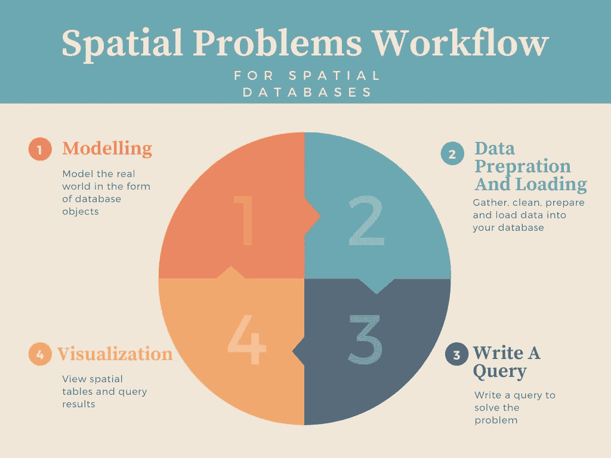
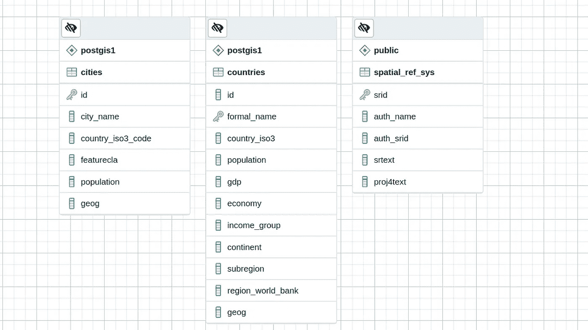
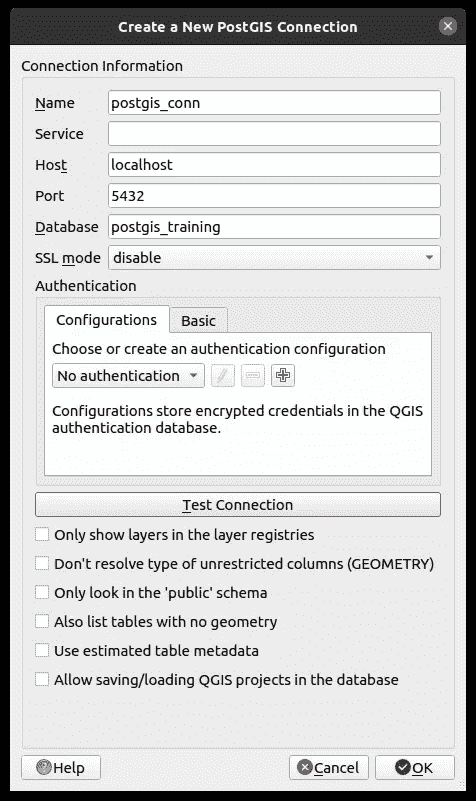
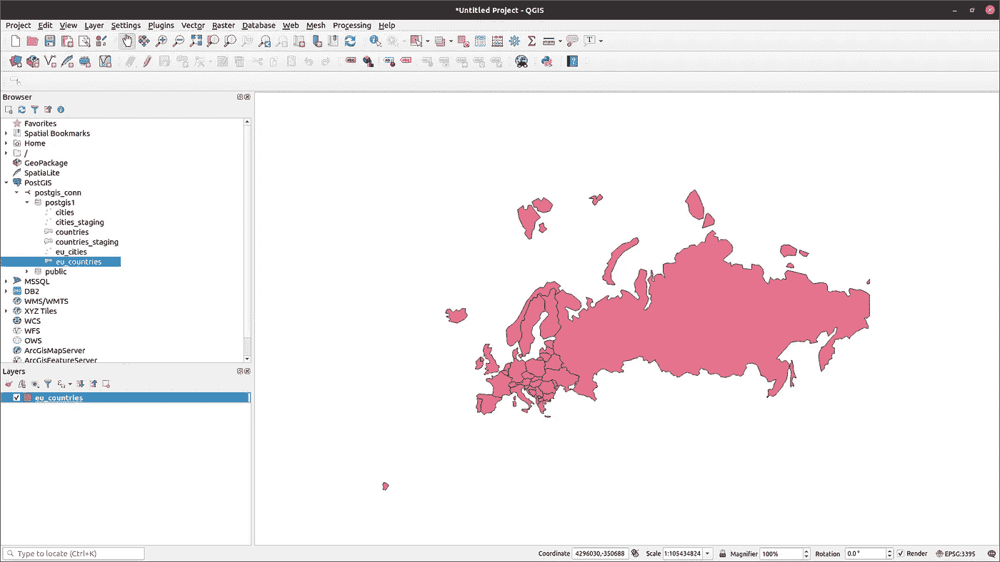
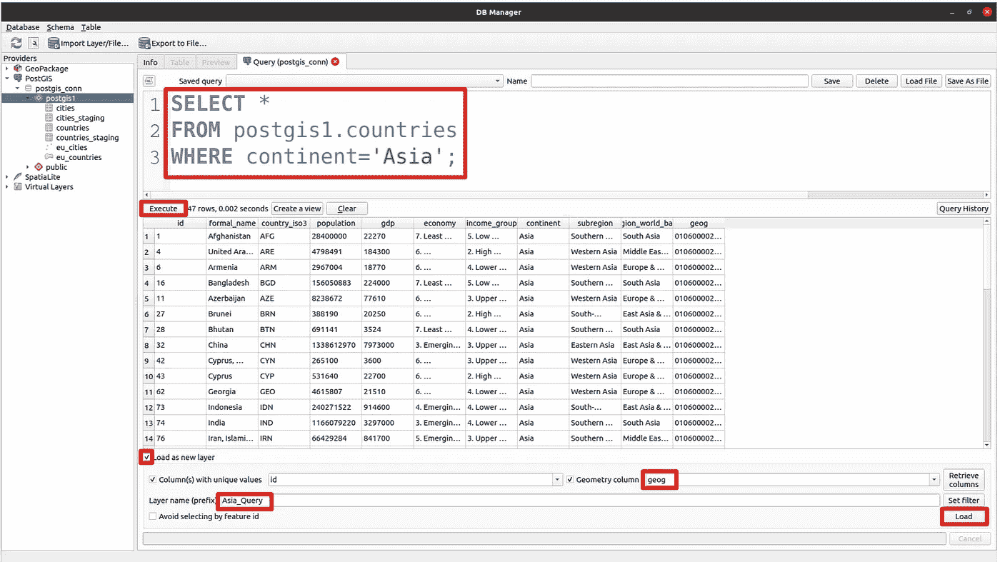
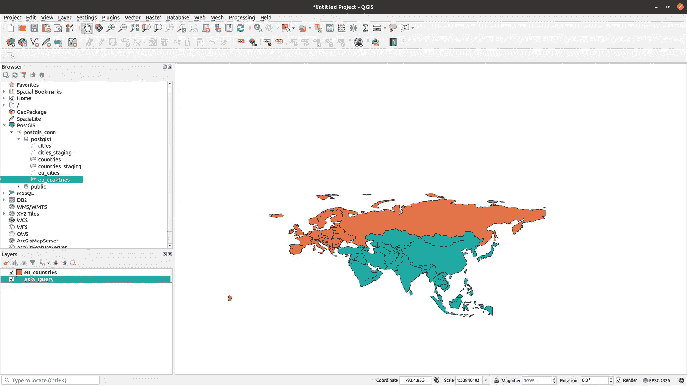

# 一个完整的工作流程

> 原文：<https://towardsdatascience.com/postgis-a-complete-workflow-729bb604f34c?source=collection_archive---------4----------------------->

## 用 PostGIS 分四步应对地理空间挑战


[陈虎](https://unsplash.com/@huchenme?utm_source=medium&utm_medium=referral)在 [Unsplash](https://unsplash.com?utm_source=medium&utm_medium=referral) 上拍照

如果您有世界各国和主要城市的单独 shapefiles，则可以使用 ArcGIS、QGIS 或任何其他 GIS 软件包查看和查询数据。你可以在这里下载来自[的数据](https://drive.google.com/file/d/1HhyQ1b7wDoripkCfBrG7qSYKO3MMNO2g/view?usp=sharing)(用天然泥土制成)。

例如，您可以执行以下操作:

*   使用*识别*工具获取关于您点击的特征的一些信息
*   确定或设置数据参考的空间参考系统
*   重新投影您的数据
*   计算距离和面积
*   计算质心
*   执行缓冲分析

好消息是，你可以用 PostGIS 完成所有这些操作。对于在空间数据库上执行所有这些操作的必要性，可能会出现一个问题。当我们可以在开源或专有软件包中轻松解决问题时，在 PostGIS 中重新表述我们的问题有什么意义呢？

当您想要开发 web、移动或桌面应用程序时，PostGIS 会派上用场。我们在这里使用的数据只包含有限数量的静态记录。在某些情况下，您可能会发现自己处于连续数据流的情况下。桌面 GIS 工具可能不适合消化此类数据并执行(近)实时分析。

处理地理空间问题时，您可以考虑以下四个重要步骤来正确回答问题:

1.  [造型](#48b9)
2.  [准备和加载数据](#d67c)
3.  [编写一个查询来解决问题](https://medium.com/@fashouri/8dc2732bbde8#b37b)
4.  [查看结果](https://medium.com/@fashouri/8dc2732bbde8#cac4)

我在图上为你描绘了这些步骤:



图 1-空间数据库的空间问题工作流(图片由作者提供)

我们将经历所有这些步骤，并尝试应对之前提出的挑战。

# 1.系统模型化

建模是将现实世界转化为由数据库对象组成的模型的过程。换句话说，根据定义，模型是现实的简化表示。例如，将国家表示为面，将城市表示为点。然后，您将为每个对象创建一个表。您需要存储关于每条记录的一些信息。您可能无法保留关于它们的所有信息，因此您将选择那些有助于解决当前问题或以后可能出现的问题的信息。

第一步，您需要创建一个数据库和一个模式来保存您的数据。模式是一个容器，它对对象(表、函数、视图等)进行逻辑分段，以便更好地管理。您在 PostgreSQL 中创建的数据库中有一个默认的公共模式，但我会创建一个新的。请记住，这取决于您希望在模型中简化真实世界的程度。建模本质上是简单性和充分性之间的权衡。尽管所有模型都有缺陷，但它们为我们提供了一种更具成本效益的方法。最好先创建一个数据库和一个模式:

```
 CREATE DATABASE postgis_training;
 CREATE SCHEMA postgis1;
```

默认情况下，PostGIS 功能和操作不起作用，您需要在数据库中启用 PostGIS 才能使其起作用:

```
CREATE EXTENSION postgis;
```

我们需要创建两个表来存放世界国家和城市数据:

```
CREATE TABLE postgis1.countries (
  id serial,
  formal_name VARCHAR(50) PRIMARY key,
  country_iso3 CHAR(3),
  population INT,
  gdp INT,
  economy VARCHAR(50),
  income_group VARCHAR(50),
  continent VARCHAR(50),
  subregion VARCHAR(50),
  region_world_bank VARCHAR(50),
  geog geography(multipolygon, 4326)
);CREATE TABLE postgis1.cities (
  id SERIAL PRIMARY KEY,
  city_name VARCHAR(50),
  country_iso3_code CHAR(3),
  featurecla VARCHAR(50),
  population INT,
  geog GEOGRAPHY(POINT, 4326)
);
```

看看你已经[下载了](https://drive.google.com/file/d/1HhyQ1b7wDoripkCfBrG7qSYKO3MMNO2g/view?usp=sharing)的 shapefiles。我们不需要他们提供的所有字段。我们选择适合我们问题的方法。我认为我们创建的表中的列名足够直观，除了其中的几个之外，不需要任何解释。这里的 *country_iso3* 和 *country_iso_code* 列表示 Alpha-3 代码，是由*国际标准化组织(ISO)* 出版的*ISO 3166–1*中定义的三个字母的国家代码。为了避免混淆，我特意选择了不同的名称。对于具有相同含义的列，可以使用相同的名称。

您可以在图 2 中看到我们数据库的 ERD 表示。对于那些可能不熟悉 *spatial_ref_sys* 表的人来说，它是每个启用了 PostGIS 的数据库中的一个表，列出了所有有效的 SRID 值及其对应的空间参考系统(SRS)的 *proj4text* 表示。



图 2 —数据库的 ERD 表示(图片由作者提供)

# 2.准备和加载数据

让我们把你所有的形状文件直接导入我们的数据库。当我们直接从外部文件导入数据时，我们通常称之为临时表。临时表只是包含原始数据的临时表。它们用于填充我们已经设计好的模型中的主表。为了导入*ne _ 50m _ populated _ places . shp*shape file，我们使用 PostGIS 安装附带的命令行实用程序 *shp2pgsql* 。在操作系统的命令行工具中导航到 shapefiles 文件夹，并运行以下命令:

```
shp2pgsql -s 4326 -I -G ne_50m_populated_places.shp postgis1.cities_staging > staging_cities.sql
```

它会在同一个文件夹中创建一个名为 *staging_cities.sql* 的文件。我们告诉我们想要创建的表的 SRID 是 4326 ( *-s 4326* )。我们通过添加选项 *-I* 在 geocolumn 上创建一个空间索引。我们添加了 *-G* 选项，这意味着我们正在使用地理类型。您可以使用这个命令做更多的事情，但是我们决定在这里保持简单。下一步是运行创建的 SQL 文件，以生成*postgis 1 . cities _ staging*表。您可以使用内置的 *psql* 命令行实用程序来实现:

```
psql -h localhost -d postgis_training -U postgres -f staging_cities.sql
```

使用以下命令对*ne _ 110m _ admin _ 0 _ countries . shp*表执行相同的操作:

```
shp2pgsql -s 4326 -I -G ne_110m_admin_0_countries.shp postgis1.countries_staging > staging_countries.sqlpsql -h localhost -d postgis_training -U postgres -f staging_countries.sql
```

既然我们已经导入了 shapefiles，现在是时候填充我们在模型中创建的表了。

```
INSERT INTO postgis1.countries (
  formal_name, country_iso3, population, gdp,
  economy, income_group, continent, subregion,
  region_world_bank, geog
)
SELECT
  name_sort,
  adm0_a3,
  pop_est,
  gdp_md_est,
  economy,
  income_grp,
  continent,
  subregion,
  region_wb,
  geog
FROM 
  postgis1.countries_staging;INSERT INTO postgis1.cities (
  city_name, country_iso3_code, featurecla,
  population, geog
)
SELECT 
  NAME,
  SOV_a3,
  FEATURECLA,
  POP_OTHER,
  geog
FROM 
  postgis1.cities_staging;
```

我们只是从临时表中选择相应的列来填充我们的主表。

我们已经讲述了如何对一个空间问题建模并使用真实世界的数据填充它。在本文的下一部分，我们将处理一些您可能会遇到的常见问题。

# 3.编写一个查询来解决问题

现在我们的模型和数据库已经准备好运行空间 SQL 查询来回答不同的问题。这里我们有一些问题需要回答，我们将逐一回答:

**选择并创建所有欧洲国家的表格**

作为破冰者，我们希望返回欧洲国家。这里我们不使用任何空间函数:

```
SELECT 
  * INTO postgis1.eu_countries
FROM 
  postgis1.countries
WHERE 
  continent = 'Europe'
```

选择所有居住在欧洲国家的城市

现在我们选择所有与欧洲国家相交的城市。因为我们需要这两个表，所以我们必须连接这两个表:

```
SELECT 
  postgis1.cities.* INTO postgis1.eu_cities
FROM 
  postgis1.cities
  INNER JOIN postgis1.eu_countries ON
    ST_Intersects(
      postgis1.cities.geog, postgis1.eu_countries.geog
    );
```

**重新投影欧洲城市和国家表，并将其存储为单独的几何表**

如果要将地理表重新投影到投影坐标参考系统中，可将地理列转换为几何列。那么 geog 列名可能会产生误导。首先，让我们将两个表中的 geog 列重命名为 *geom* :

```
ALTER TABLE 
  postgis1.eu_cities RENAME COLUMN geog TO geom;ALTER TABLE 
  postgis1.eu_countries RENAME COLUMN geog TO geom;
```

请注意，我们将列重命名为 geom，但是它们仍然包含地理数据。我们不会让这种情况继续下去，而是将它转换为世界墨卡托(SRID 3395)，这是一个投影坐标参考系统:

```
ALTER TABLE 
  postgis1.eu_cities ALTER COLUMN geom TYPE geometry(POINT, 3395)
  USING ST_Transform(geom::geometry, 3395);ALTER TABLE 
  postgis1.eu_countries ALTER COLUMN geom TYPE
  geometry(MULTIPOLYGON, 3395) USING ST_Transform(geom::geometry,
  3395);
```

现在，我们已经将欧洲表完全转换为世界墨卡托和几何数据类型。许多 PostGIS 函数不支持地理类型。此外，许多空间计算在投影的 CRS 上固有地正确执行。对于其余的操作，我们考虑这两个表。

**将新创建的表格导出为 shape file**

您可以使用另一个名为 *pgsql2shp* 的命令行实用程序将空间表导出到 shapefiles。在操作系统上可用的命令行工具中运行以下命令。确保在运行命令的同一个文件夹中创建一个名为 *shp* 的文件夹:

```
pgsql2shp -f ./shp/eu_cities_shp -h localhost -u postgres postgis_training postgis1.eu_citiespgsql2shp -f eu_countries_shp -h localhost -u postgres postgis_training postgis1.eu_countries
```

这些命令将在 *shp* 文件夹中创建城市和国家的形状文件。

*pgsql2shp* 命令的格式如下:

```
pgsql2shp [options] database [schema.]table
```

这些选项看起来很直观，但我对它们进行了详细说明，以使一切变得清晰:

```
**-f** use this option to specify the shapefile name and address you want to create**-h** use this option to specify the database host to connect to**-u** use this option to connect to the database as the specified user
```

您可能需要考虑一些其他选项，但是指定的选项对于我们想要做的事情来说已经足够了。

**识别特定点所在的国家**

考虑在大地坐标系(WGS84 经度/纬度 SRID 4326)中拥有坐标，其中经度= 32.6542，纬度= 50.9533。我们想知道这个点在哪个国家。我们要做的是堪比大多数 GIS 软件包中的*识别*工具。

请注意，我们的数据集不再使用 SRID 4326。我们需要动态地将该点转换为世界墨卡托(SRID 3395):

```
WITH identify AS(
  SELECT 
    ST_Transform(
      ST_SetSRID(
        ST_Point(32.6542, 50.9533),
        4326
      ),
      3395
    ) AS ipoint
)SELECT 
  postgis1.eu_countries.*
FROM
  postgis1.eu_countries,
  identify
WHERE
  ST_Within(ipoint, geom)
```

我们用 CTE 来定义和变换一个点。 *ST_Within(geometry A，geometry B)* 如果几何图形 A 完全在几何图形 B 内，则返回 TRUE。此函数将帮助我们找到要查找的国家。

**查找一个国家的面积**

PostGIS 有一个 *ST_Area* 函数，用于确定多边形的面积。它以 SRID 指定的单位返回面积。同样，我们需要即时改造 SRID:

```
WITH identify AS(
  SELECT 
    ST_Transform(
      ST_SetSRID(
        ST_Point(32.6542, 50.9533),
        4326
      ),
      3395
    ) AS ipoint
)SELECT 
  ST_Area(geom)
FROM
  postgis1.eu_countries,
  identify
WHERE
  ST_Within(ipoint, geom)
```

识别 CTE 部分只是为了查找国家，后面是一段代码来确定地区。如果我们运行这个代码，它返回 1394397442159.71，单位是平方米，相当于 1394.39 平方公里。如果你用谷歌搜索乌克兰的面积，你会得到一个完全不同的数字。乌克兰的面积为 603.63 平方公里。我们计算出的数字是实际数字的两倍多。这怎么能说得过去呢？

事实是，世界墨卡托(SRID 3395)并不保护该地区。从赤道向外，多边形的面积比实际数量增加得快得多。这就是为什么格陵兰在许多世界地图上看起来要大得多。为了获得精确的面积，我们需要使用等面积空间参考系统。为此，我选择了欧洲艾伯斯等面积圆锥曲线(SRID 102013)。它覆盖了整个欧洲，并希望保留多边形的面积。在我们的查询中，我们需要一个动态的乌克兰多边形转换:

```
WITH identify AS(
  SELECT
    ST_Transform(
      ST_SetSRID(
        ST_Point(32.6542, 50.9533),
        4326
      ),
      3395
    ) AS ipoint
)
SELECT
  ST_Area(
    ST_Transform(geom, 3035)
  )
FROM 
  postgis1.eu_countries,
  identify
WHERE 
  ST_Within(ipoint, geom)
```

结果是 601914411764.12 平方米相当于 601.91 平方公里。与国家官方面积(603.63 km2)相当，略有差异极有可能是地图上多边形不准确所致。

然而，还有第二种选择。使用 geography 类型时，面积和距离测量(尤其是在大面积上)保证是准确的。而且考虑了地球的曲率。为了利用地理类型的优势，让我们看看我们原始模型中的*国家*表，看看我们是否能解决问题。然而，地理类型并不支持所有的空间功能，包括 *ST_Distance* 。我们可以选择适合地理类型的 *ST_Covers* :

```
WITH identify AS(
  SELECT
    ST_SetSRID(
      ST_Point(32.6542, 50.9533),
      4326
    ) AS ipoint
)
SELECT 
  ST_Area(geog)
FROM 
  postgis1.countries,
  identify
WHERE 
  ST_Covers(geog, ipoint)
```

找出柏林和伦敦之间的距离。

我们从之前的挑战中了解到，对于大面积的测量，地理数据类型可能是一个合适的选项:

```
SELECT 
  ST_Distance(a.geog, b.geog)
From 
  postgis1.cities a,
  postgis1.cities b
WHERE 
 a.city_name = 'Berlin'
 AND b.city_name = 'London'
```

因为你想在同一个表中找到两点之间的距离，你必须引用同一个表两次。 *ST_Distance* 将利用椭球模型，对于许多应用来说，可以认为足够精确。该查询将返回 933677.99m，这似乎是合理的。

# 4.查看结果

有时 PostGIS 没有 GIS 就叫 *GIS。空间数据的可视化表示对于理解任何地理空间问题都至关重要。没有在地图上看到它，你将不能完全了解情况。然而，空间数据库并不是为可视化空间数据而设计的。但是，您可以找到一种方法来解决这个问题。一些 GIS 软件包可以直接连接到 PostGIS 以显示空间表和查询。我最喜欢的是 QGIS。*



图 3-QGIS-PostGIS 连接设置(图片由作者提供)

点击并选择*视图>面板>浏览器*。如果默认情况下没有打开*浏览器面板*，它会为您打开。在*浏览器面板*中，可以找到 *PostGIS* 。右键点击并选择*新建连接*。在对话框中，像我一样填写选项(图 3)并测试连接。如果添加的连接成功，您可以点击 *ok* 按钮进行连接。

在*浏览器面板*的 *PostGIS* 分支下，会出现一个具有您所选择的名称的新连接(在我的例子中是: *postgis_conn* )。您可以在 *postgis1* 数据库中找到您的模式和表(图 4)。如果您双击任何表格，它将显示在地图画布上，并添加到图层面板。图层可以像 shapefiles 一样打开、关闭、导出和使用。



图 PostGIS 和 QGIS 之间的连接(图片由作者提供)

如果我们想在地图上显示查询的结果呢？为此，从主菜单中选择*数据库>数据库管理器…* 。在*数据库管理器中，*选择*数据库> SQL 窗口*。



图 5——如何将查询结果显示为图层(作者图片)

根据图 5，我们编写了一个简单的查询来返回亚洲国家，然后我点击 *execute* 。然后我勾选了*加载为图层*复选框，填写了必要的字段，点击*加载。*令人惊讶的是，如果你再次检查图层面板，你可以在图层面板上找到一个具有你选择的名称的新图层(这里，图层名称是: *Asian_Query* )。



图 6 —查询结果显示亚洲国家(图片由作者提供)

借助简单的例子，我们考察了使用 PostGIS 解决空间问题的整个工作流程。PostGIS 可以做更多的事情，但对于许多空间挑战，工作流程是相同的。