# PostgreSQL:帮助您启动和运行的基础知识。[第一部分] (macOS)

> 原文：<https://towardsdatascience.com/postgresql-basics-to-get-you-up-and-running-macos-f0a14d51aed0?source=collection_archive---------23----------------------->


来自 [Pexels](https://www.pexels.com/photo/black-and-gray-mining-rig-1148820/?utm_content=attributionCopyText&utm_medium=referral&utm_source=pexels) 的 [panumas nikhomkhai](https://www.pexels.com/@cookiecutter?utm_content=attributionCopyText&utm_medium=referral&utm_source=pexels) 摄影

PostgreSQL 是一个开源的关系数据库管理系统(RDMS ),它之所以受欢迎有很多原因:它是免费的，它是安全的，它支持定制函数，[它是对象关系模型架构](https://tapoueh.org/blog/2018/03/object-relational-database-management-system/)，并且每个表没有行数限制。[查看这篇文章](https://tapoueh.org/blog/2018/03/object-relational-database-management-system/)以获得更深入的分析。PostgreSQL 也被很多大公司使用，包括: [NASA](https://www.postgresql.org/message-id/E0A4DA8CB358A94E860A1C604DCE0482B297999DD7@NDJSSCC01.ndc.nasa.gov) 、 [Twitch](https://blog.twitch.tv/pl-pl/2016/10/11/how-twitch-uses-postgresql-c34aa9e56f58/) 、 [Apple](https://www.networkworld.com/article/2220344/apple-ditches-mysql-in-favor-of-postgresql.html) 、 [Reddit](https://kevin.burke.dev/kevin/reddits-database-has-two-tables/) 。在本文中，我们将触及 PostgreSQL 的基础知识，以便您可以快速入门并运行。

## 下载 PostgreSQL 和 pgAdmin4。

在 Mac 上，由于有了[postgres . app](https://postgresapp.com/)安装包，下载 postgres 的过程得以简化。只需下载所需的版本，并将应用程序保存到应用程序文件夹。

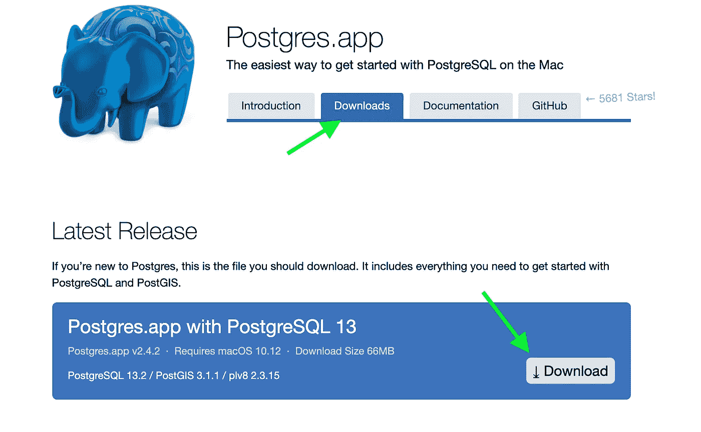

下载后，您应该能够双击蓝色大象图标，并看到类似于此的内容在您的屏幕上弹出。注意:为您显示的数据库会有所不同，但将包括`postgres`和`template1`数据库。

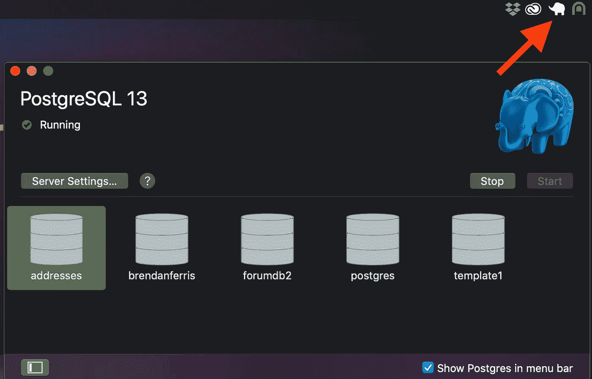

`template1`是一个[模板数据库](https://www.postgresql.org/docs/9.5/manage-ag-templatedbs.html)。默认情况下，每当您运行`CREATE DATABASE` SQL 查询时，postgres 使用`template1`数据库来创建新数据库。请参见[本教程](https://hashrocket.com/blog/posts/exploring-the-default-postgres-template-databases)中关于改变`template1`的演练。

现在，您应该[下载 PgAdmin4](https://www.pgadmin.org/download/pgadmin-4-macos/) ，这是一个桌面 GUI 界面，通常用于与 postgres 数据库进行交互。请记住，当您第一次安装 postgres 时，它附带了`psql`。您应该能够在终端中键入 psql，并通过 CLI 控制数据库，就像使用 pgAdmin 的 GUI 控制数据库一样。


pgAdmin4 GUI 界面。

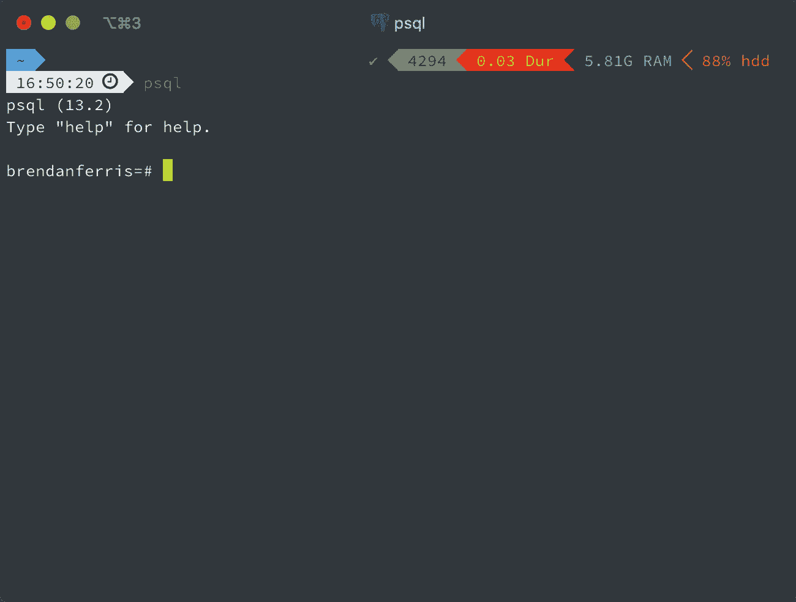

psql 命令行界面。

把 psql 和 PgAdmin 的区别想象成类似于从命令行使用 github 和 github 桌面 GUI 的区别。

## 表创建。

> 为了简单起见，我们将关注如何使用 pgAdmin GUI 执行基本操作——但是请记住，这[都可以通过命令行使用 psql](http://postgresguide.com/utilities/psql.html) 来完成。本文中使用的数据是由交通部编制的[国家地址数据库(NAD)](https://www.transportation.gov/gis/national-address-database/national-address-database-0) 的子集。您可以下载。本文使用的 csv 使用[这个链接](https://drive.google.com/file/d/18I87qGEnDI7R7mkVnkgRy5ndGGF8tQXI/view?usp=sharing)。

让我们创建一个名为`blog`的数据库:

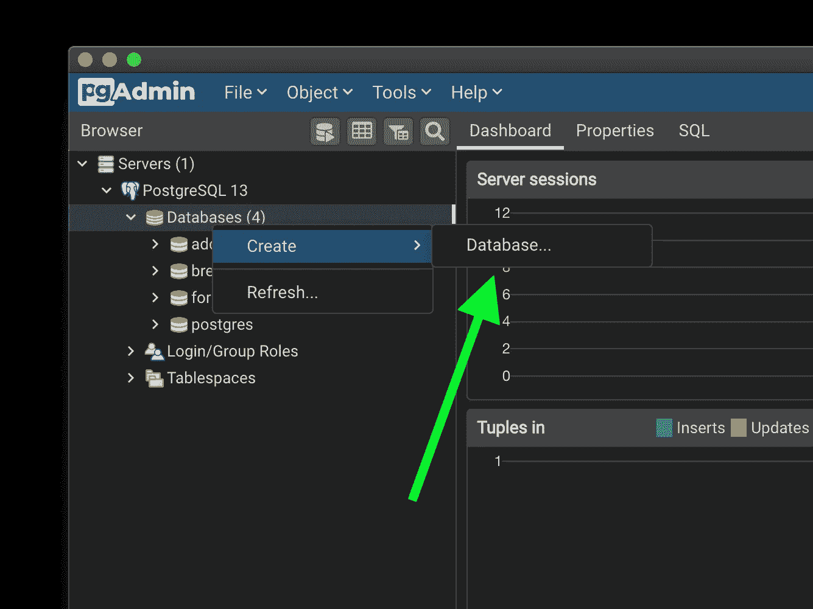

右键单击“数据库”

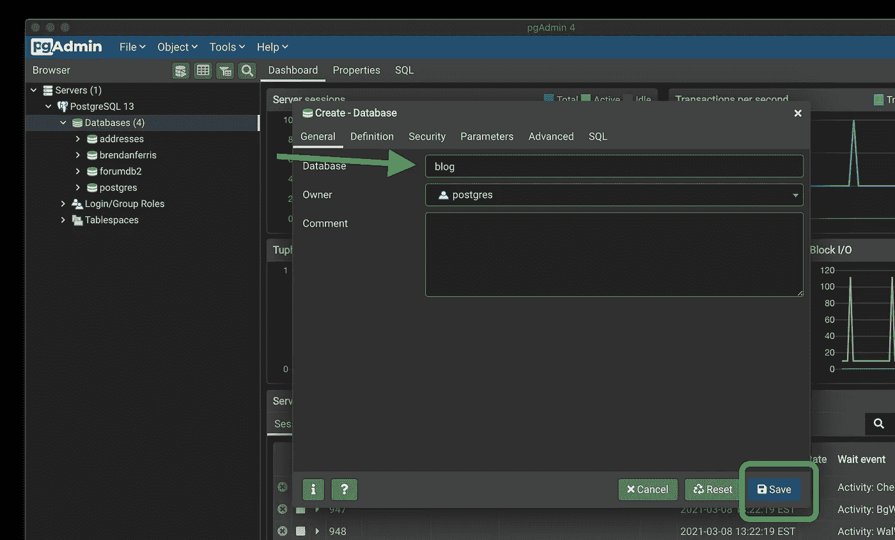

将数据库命名为“blog ”,然后保存。

现在，我们将在左侧浏览器窗口中看到`blog`数据库。当我们点击`blog`数据库时，它会变成黄色，表明我们已经连接到数据库，并展开以便我们可以看到诸如触发器、扩展和模式之类的东西。

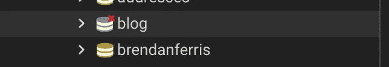

点击前

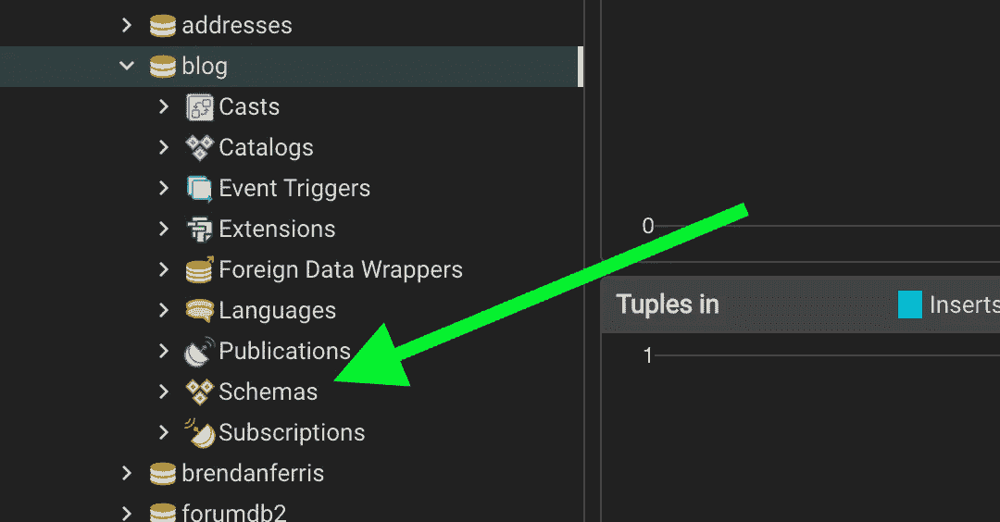

点击后

现在让我们单击 Schemas 菜单，显示 tables 选项卡。在本教程中，我们将从 csv 中获取数据，并将其加载到 postgres 中。

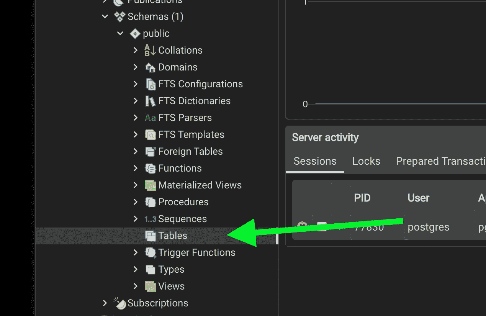

右键单击表格

右键单击`Tables`，然后创建一个名为“邮箱”的新表。

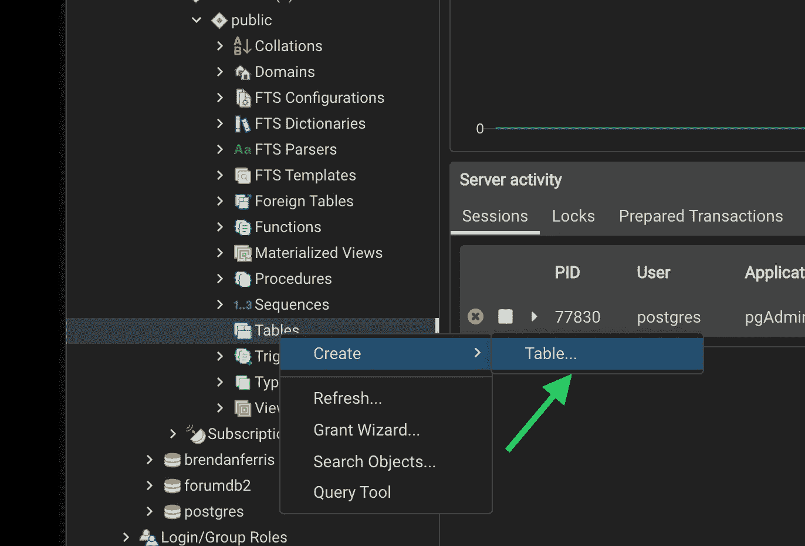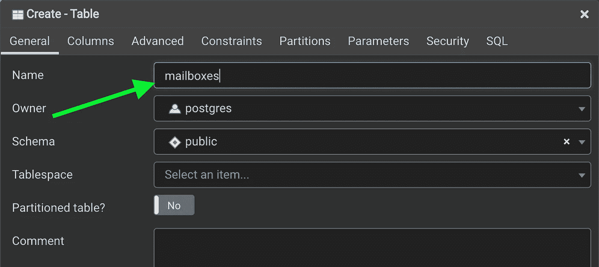

现在我们需要声明数据库中的列。这是一个重要的步骤，邮箱表的列需要与。我们计划导入的 csv 文件。这包括一个索引列，如果您的。csv 有一个。在我们的例子中，我没有索引列。

addresses.csv 文件中的列如下:

```
- State
- Post_Comm
- StreetName
- StN_PosDir (North,South,East,West)
- Add_Number (address number)
- StN_PosTyp (Street/Drive/Lane/Court/Place/Road etc.)
```

让我们单击 Columns 选项卡，将上面提到的列添加到表中。添加列还要求我们声明每个列的数据类型。有时，在导入文件时将所有列设置为文本，然后在导入后处理数据类型的更改是有意义的。在我们的例子中，我们可以将所有数据保存为文本。

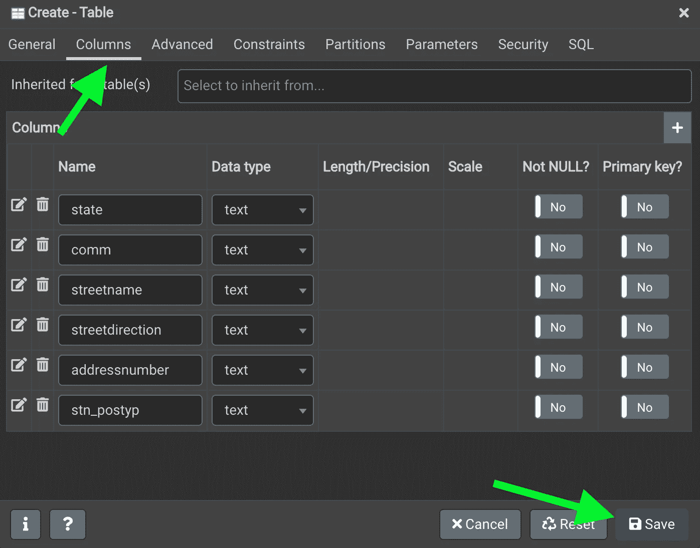

现在，我们应该可以在“邮箱”表中看到所有的列。

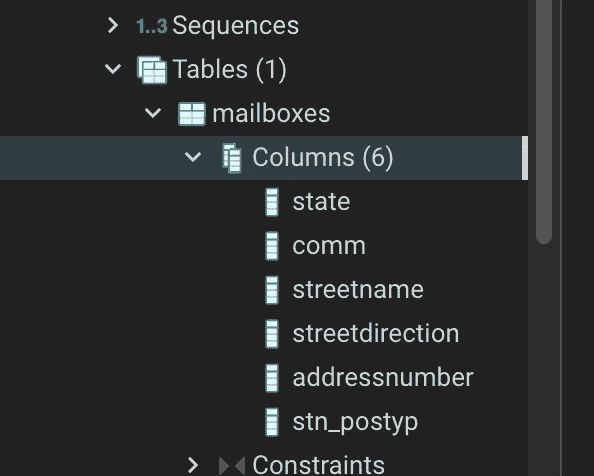

## 将 CSV 数据导入 PostgreSQL。

为了将来自 *addresses.csv* 的数据放入*邮箱*表中，我们需要对*邮箱*表使用 pgAdmin 查询工具。


现在使用下面的 SQL 查询将 CSV 加载到 postgres 中。

```
COPY mailboxes
FROM '/Users/brendanferris/Desktop/scripts/vehicle_analysis/addresses.csv' 
DELIMITER ',' 
CSV HEADER;
```

不要忘记，邮箱是我们要将 CSV 信息发送到的表的名称，邮箱表中的列顺序与 addresses.csv 文件中的列顺序相匹配。`CSV HEADER`表示 addresses.csv 文件的第一行是列名，应该跳过，`DELIMITER`是`','`，因为 CSV *是逗号分隔的文件*。

您可以在查询工具中使用 F5 来运行查询，运行上述查询后，您应该会看到以下输出:

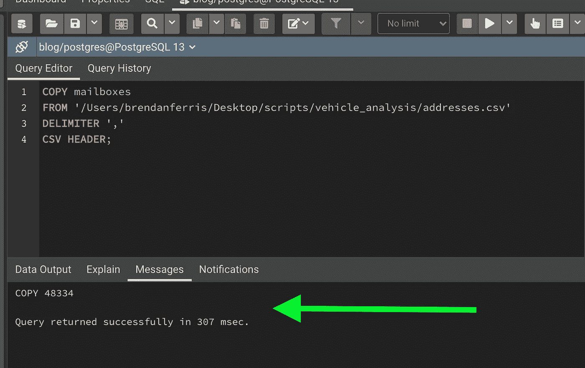

为了确保我们的所有信息现在都在 SQL 数据库中，使用以下查询获取并返回所有行:

```
SELECT * FROM mailboxes;
```

然后按 F5 运行查询。您应该在 pgAdmin 的数据输出窗口中看到所有的表信息。

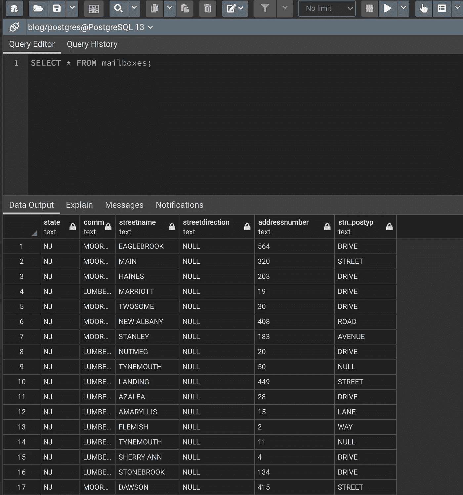

## 将查询结果导出为 CSV 格式。

假设我们对我们的地址信息运行 SQL 查询，并希望将该信息输出为 CSV 文件。首先，让我们编写一个查询，使地址更易读。

```
SELECT CONCAT(addressnumber, ' ', streetdirection, ' ', streetname, ' ', stn_postyp, ' ', comm, ' ', state) as formatted_address FROM mailboxes
```

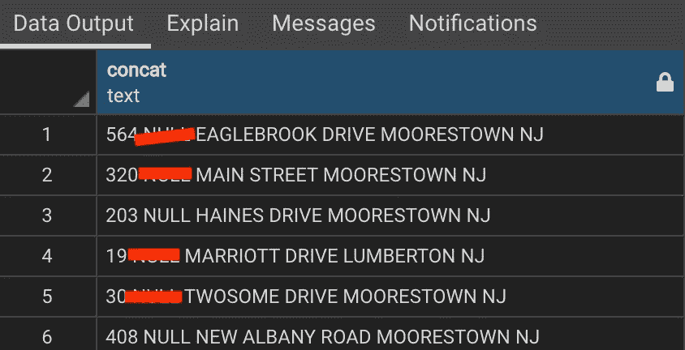

哎呀， *streetdirection* 列中的`NULL`条目似乎是字符串，而不是实际的 postgres 空值。因此，我们应该用空字符串替换所有的`NULL`字符串。这样，当我们编译地址时，我们将只在需要时添加街道方向。要用空字符串替换 *streetdirection* 列中的所有`NULL`字符串，请运行以下查询。

```
UPDATE mailboxes
SET streetdirection = REPLACE(streetdirection,'NULL','');
```

现在，`NULL`被替换为一个空字符串，我们可以使用之前的`CONCAT`查询正确格式化街道名称:

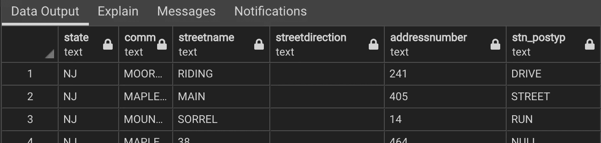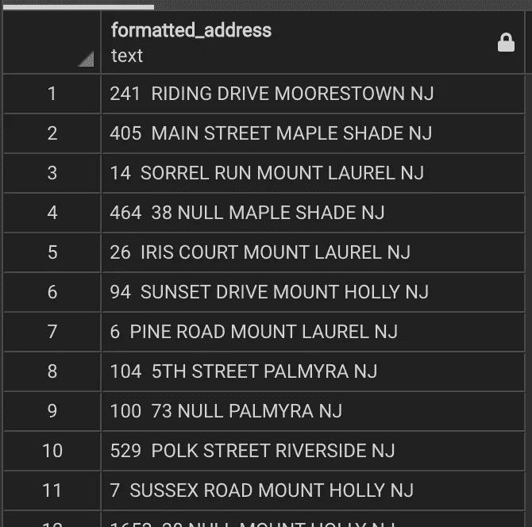

为了将这些文件保存到它们自己的 CSV 文件中，我们需要将`CONCAT`查询放在`COPY`关键字周围，指定输出文件的目的地和名称，以及分隔符。格式如下:

```
**COPY** ([Query]) **TO** '[File Path]' **DELIMITER** ',' CSV HEADER;
```

这有点混乱，但是如果您将该查询复制并粘贴到查询编辑器中，应该会更容易阅读:

```
COPY (SELECT CONCAT(addressnumber, ' ', streetdirection, ' ', streetname, ' ', stn_postyp, ' ', comm, ' ', state) as formatted_address FROM mailboxes) TO '/Users/brendanferris/Desktop/scripts/vehicle_analysis/output.csv' DELIMITER ',' CSV HEADER;
```

现在，所需的数据将位于您指定的文件路径下的 CSV 文件中！

## 下一步。

在以后的文章中，我将处理一些其他操作，比如更新表、删除表以及在 python 脚本中使用表。有许多关于 PostgreSQL 的文档和支持，我鼓励您去探索！

敬请期待！

💻请随时查看我的[网站](https://brendanferris.com/)。