# PostgreSQL:启动和运行的基础知识[第 2 部分] (macOS)

> 原文：<https://towardsdatascience.com/postgresql-basics-to-get-you-up-and-running-part-2-macos-c29cb15e8483?source=collection_archive---------19----------------------->


照片由来自 [Pexels](https://www.pexels.com/photo/black-internal-hdd-on-black-surface-117729/?utm_content=attributionCopyText&utm_medium=referral&utm_source=pexels) 的[阿扎马特·埃森纳列夫](https://www.pexels.com/@bohed?utm_content=attributionCopyText&utm_medium=referral&utm_source=pexels)拍摄

在本系列的第 1 部分中，我介绍了 PostgreSQL 是什么，它是如何工作的，如何开始添加数据库和表来创建存储信息的关系数据库。在本文中，我将假设您已经下载了所有内容，并且有了可以使用的数据库/表格。我将经历一些我过去经常在谷歌上搜索的手术。如果你觉得这个信息有用，它将是你书签的一个很好的补充。我们开始吧！

## 如何导入 CSV？

假设您有一个 CSV 文件，希望使用 pgAdmin 将其导入 postgres 数据库。您需要做的第一件事是在 pgAdmin 中创建一个表，按照您想要的名称命名它，然后根据 CSV 顺序声明适当数量的列。例如，我将导入一个包含两列的 CSV:名称、编号。name 列将是一个字符串，第二列将是一个随机数。

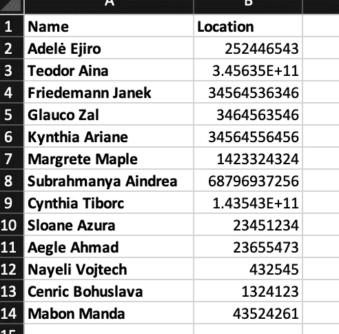

在 pgAdmin 中，让我们创建一个名为 locations 的新表，如本系列的第 1 部分所述。

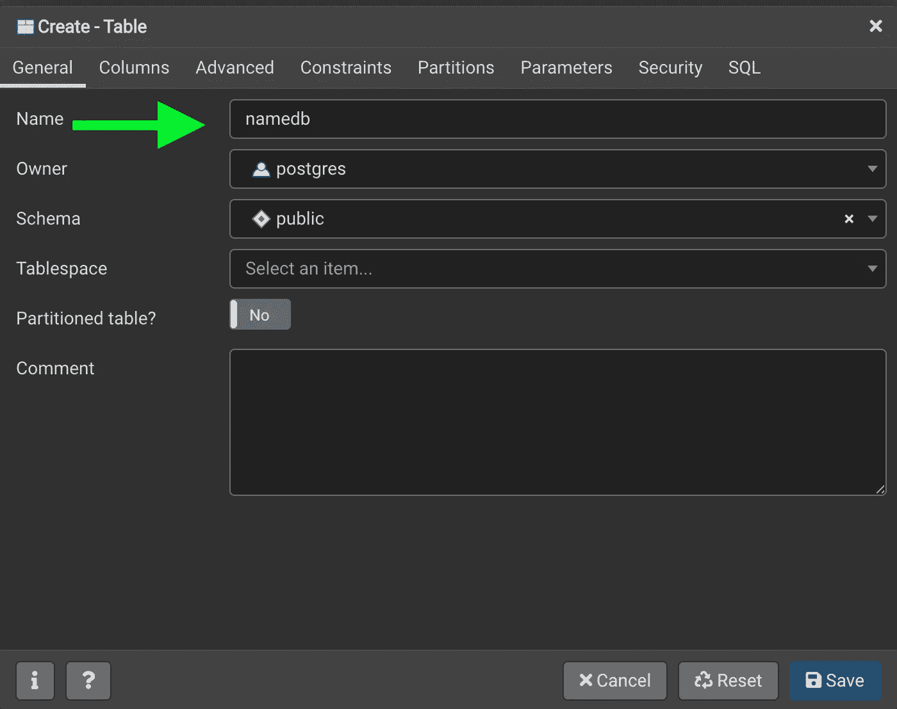

请记住，我们需要声明这些列，并且这些列需要按照它们在 CSV 中出现的顺序进行声明。

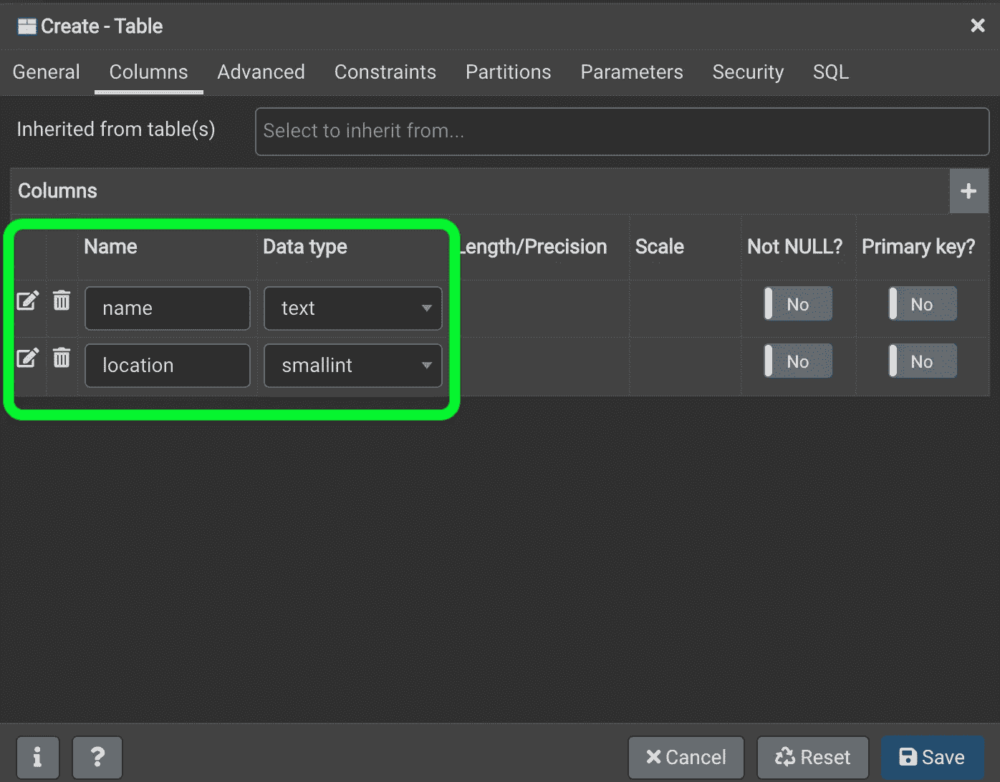

当我们点击 save 时，我们将得到一个名为(namedb)的表，它有两列。要将数据从 CSV 获取到 *namedb* 表中，右键单击 pgAdmin 中的表。

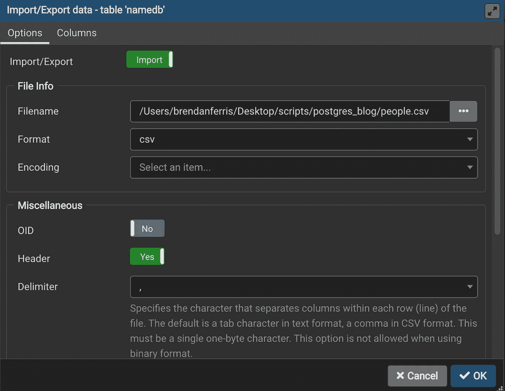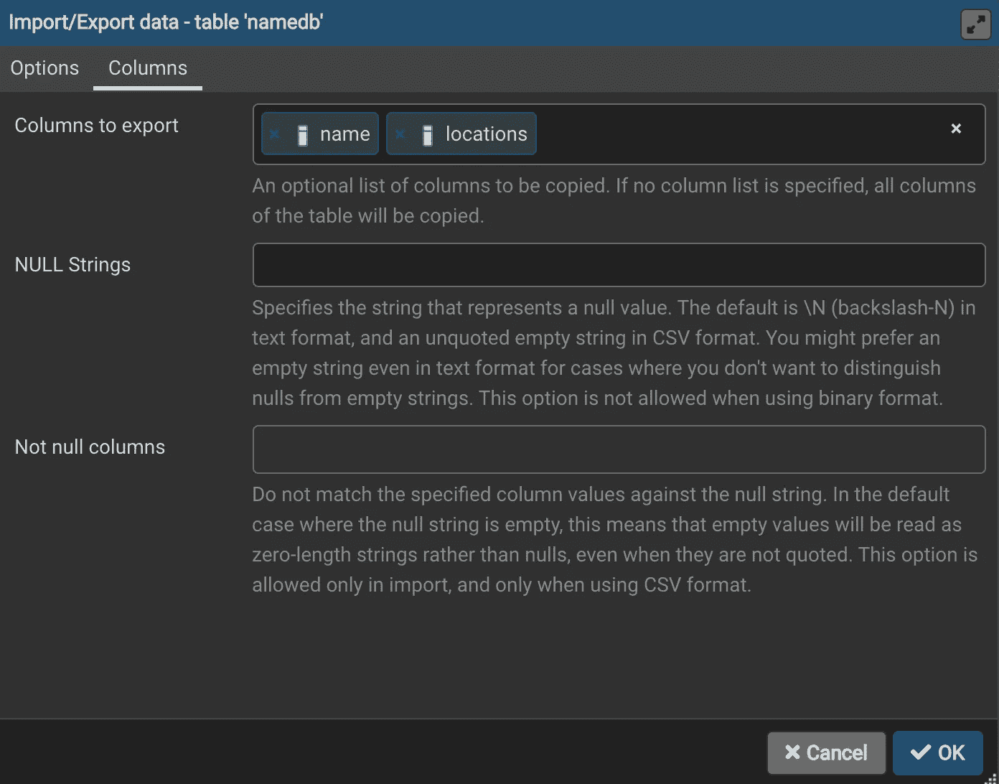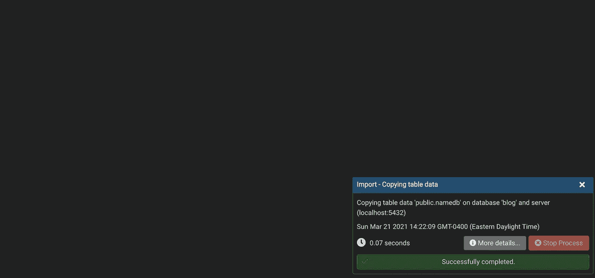

导入完成后，会弹出一个对话框。

也可以通过右键单击 pgAdmin 中的表，选择查询工具，并使用以下 SQL 语句来导入数据:

```
COPY namedb(name, locations)
FROM '/Users/brendanferris/Desktop/scripts/postgres_blog/people.csv'
DELIMITER ','
CSV HEADER;
```

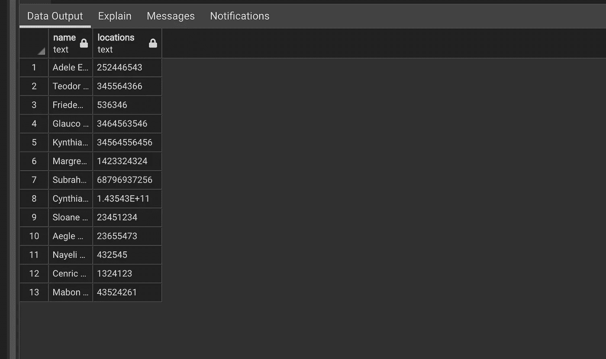

现在我们的数据在数据库里。

## 向现有表中添加 ID 列。

现在我们在表中有了名称和位置，我们想添加一个 id 列，可能用作键[键](https://www.essentialsql.com/what-is-the-difference-between-a-primary-key-and-a-foreign-key/)，使我们能够将信息与其他表中的其他信息连接起来。为此，让我们向 *namedb* 表添加一个 *name_id* 列。

```
ALTER TABLE namedb ADD COLUMN name_id serial PRIMARY KEY;
```

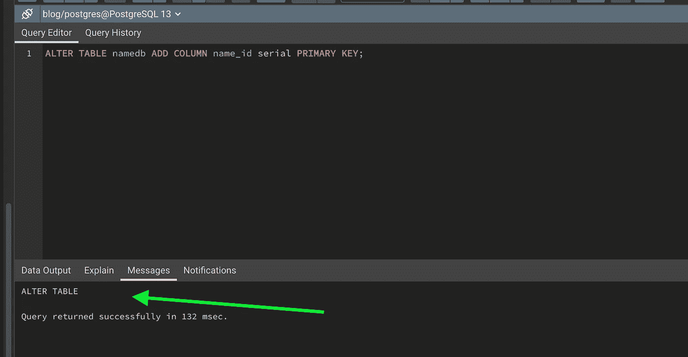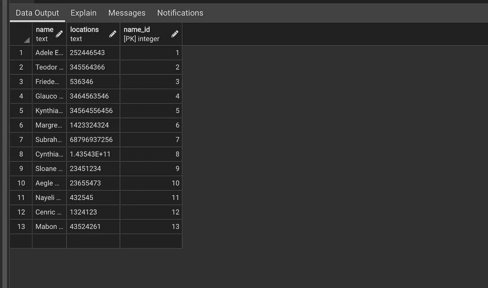

## 将查询结果保存到 CSV 文件中。

假设我们想获得数据库中姓名以“A”开头的所有人，然后将结果保存在它自己的 CSV 文件中。我们可以通过首先获取我们想要的信息来实现这一点，在本例中:

```
SELECT name, locations FROM namedb
WHERE name ILIKE('a%');
```

结果信息应该显示在数据输出窗口中。

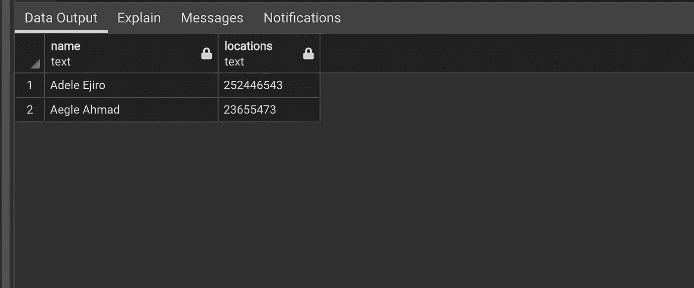

为了将这两行输出到 CSV 中，我们需要使用以下查询格式:

```
**COPY** ([Query]) **TO** '[File Name]' **DELIMITER** ',' CSV HEADER;
```

我们只需要在 COPY 关键字后面的括号中输入我们的查询，并以指定的格式将文件发送到特定的位置。我们指定的格式是 CSV，因为我们将分隔符声明为逗号。

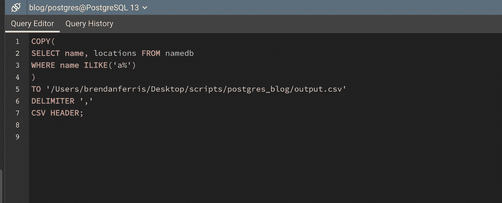

无论您指定哪个路径，都可以找到该文件。

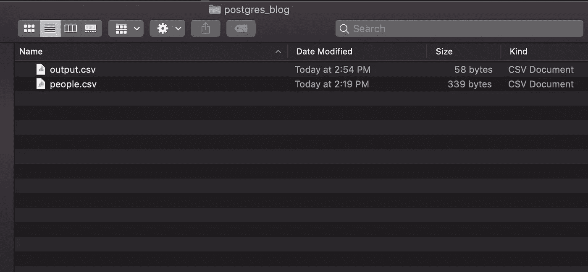

这些是我发现自己在过去执行的一些更常见的操作，我希望这个小纲要在将来能为您节省一些时间。

编码快乐！

💻请随意查看我的[网站](https://brendanferris.com/)。