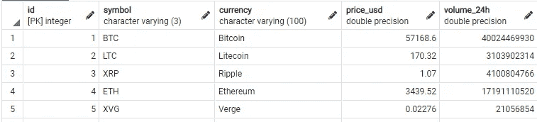
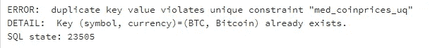
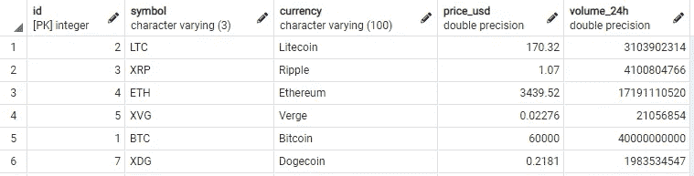
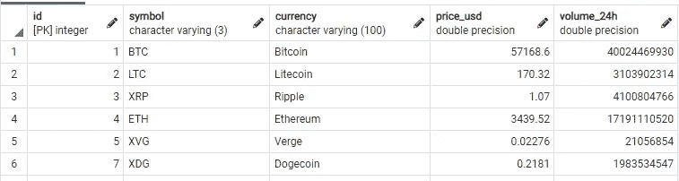

# PostgreSQL —如何安全、轻松、快速地进行升级

> 原文：<https://towardsdatascience.com/postgresql-how-to-upsert-safely-easily-and-fast-246040514933?source=collection_archive---------2----------------------->

## 防止重复，插入新记录，更新现有记录


我们将安全地连接数据库中的数据集，而不是连接道路(图片由 [Unsplash](https://unsplash.com/photos/p50L8cR4xf8) 上的 [Sigmund](https://unsplash.com/@sigmund) 提供)

当您将数据向上插入到表中时，您会更新或忽略已经存在的记录并插入新记录。阅读完本文后，您将能够在 Postgres 中执行一个允许您这样做的查询。我们将通过一个实际的例子来演示如何做到这一点。我们来编码吧！

# 1.设置和准备

假设我们有一个跟踪最新加密货币价格的应用程序。每 10 秒钟，我们就会收到一个包含最新价格和交易量的数据集。我们希望在数据库的一个表中记录这些价格变化，以便我们可以在网站上显示最新的信息。

我们想更新价格和数量的硬币已经在数据库中，并添加新的硬币。我们可以用一句话来处理这些问题。

## 数据库准备

让我们首先设置一些表并插入一些虚拟数据，这样我们就有东西可以使用了。

执行这个查询将得到下面的 coinprices 表。



我们的硬币价格表(图片由作者提供)

如你所见，我们记录了五枚硬币。管理过去 24 小时的价格(美元)和交易量。

目前，如果我们收到一个新的比特币记录，并将其插入到我们的表中，我们就会遇到麻烦:然后我们有两个记录显示一个比特币的价格。我们不能有这种情况，所以我们将在表上添加一个唯一约束:

这确保了我们不能插入多个具有相同符号和货币的记录。我们稍后会用到这个独特的约束。


我们合并吧！(图片由[娜塔莉亚 Y](https://unsplash.com/@foxfox) 在 [Unsplash](https://unsplash.com/photos/f6j5Dol1H_I) 上拍摄)

# 2.向上插入

我们准备好接收新数据了。让我们插上！

我们收到了比特币新的价格和交易量，以及全新的硬币。让我们看看当我们试图将它插入到我们的表中时会发生什么。

执行上述查询会导致:



比特币已经存在于我们的表中(图片由作者提供)

插入操作遇到了*冲突*。我们可以检测是否遇到冲突，然后决定如何处理冲突的记录。

## 在单个语句中向上插入

使用下面的查询，我们可以一次插入新硬币并更新现有的硬币！

```
INSERT INTO med.coinprices (symbol, currency, price_usd, volume_24h) VALUES
	('BTC', 'Bitcoin', 60000, 40000000000)
	, ('XDG', 'Dogecoin', 0.2181, 1983534547)
ON CONFLICT (symbol, currency)
DO UPDATE SET
	price_usd = EXCLUDED.price_usd
	, volume_24h = EXCLUDED.volume_24h;
```

让我们一步一步地完成这个查询。
-第一部分很简单，只是一个普通的两行插页。
-从第 4 行开始，我们决定如何处理冲突的记录。在这种情况下，发生冲突是因为我们违反了表上的唯一约束。

这正是我们想要的！如果我们的表中已经有了*符号*和*货币*列的记录，那么我们想要更新它们。在查询中，EXCLUDED 包含最初建议插入的所有记录。这是我们的结果:



我们新的 coinprices 表，最后两行是向上插入的值(图片由作者提供)

总之:我们执行一个常规的插入，但是捕捉到冲突的记录并指定如何处理它们。

## 升级选项

在我们的实际例子之外的其他情况下，您可能不希望对冲突的记录做任何事情。我们可以简单地调整语句，只插入不冲突的记录，忽略冲突的记录:

上面的查询将只插入 Dogecoin，并忽略比特币的更新:



当指定什么都不做时，比特币保持不变(图片由作者提供)

## 安全的

执行此查询将插入并更新所有建议的记录，或者不插入并更新任何记录。它们发生在单个交易中。更多交易信息在 [**本文**](https://mikehuls.medium.com/sql-rolling-back-statements-with-transactions-81937811e7a7) 。


我们的数据被安全地合并并准备使用(图片由[托马斯·汤普森](https://unsplash.com/@tomthompsonphotography)在 [Unsplash](https://unsplash.com/photos/KSm1Fh8wQtc) 上拍摄)

# 结论

通过这篇文章，我希望对如何在 Postgres 中安全、简单、快速地插入数据有所启发。如果你有建议/澄清，请评论，以便我可以改进这篇文章。同时，看看我的其他关于各种编程相关主题的文章，比如:

*   [删除到另一个表中](https://mikehuls.medium.com/sql-delete-into-another-table-b5b946a42299)
*   [更新到另一个标签页](https://mikehuls.medium.com/sql-update-into-another-table-bfc3dff79a66) le
*   [在一条语句中插入、删除和更新](https://mikehuls.medium.com/sql-insert-delete-and-update-in-one-statement-sync-your-tables-with-merge-14814215d32c)
*   [更新选择一批记录](https://mikehuls.medium.com/sql-update-select-in-one-query-b067a7e60136)
*   [插入唯一表格](https://mikehuls.medium.com/sql-inserting-only-unique-values-in-a-unique-table-af2eb3b9890a)
*   [了解索引如何加快查询速度](https://mikehuls.medium.com/sql-understand-how-indices-work-under-the-hood-to-speed-up-your-queries-a7f07eef4080)

编码快乐！

—迈克

页（page 的缩写）学生:比如我正在做的事情？跟我来！