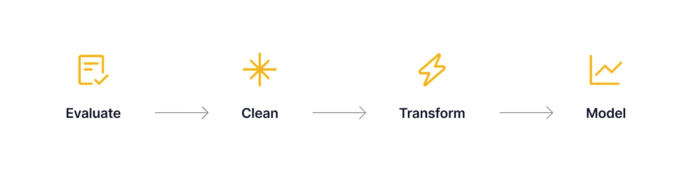
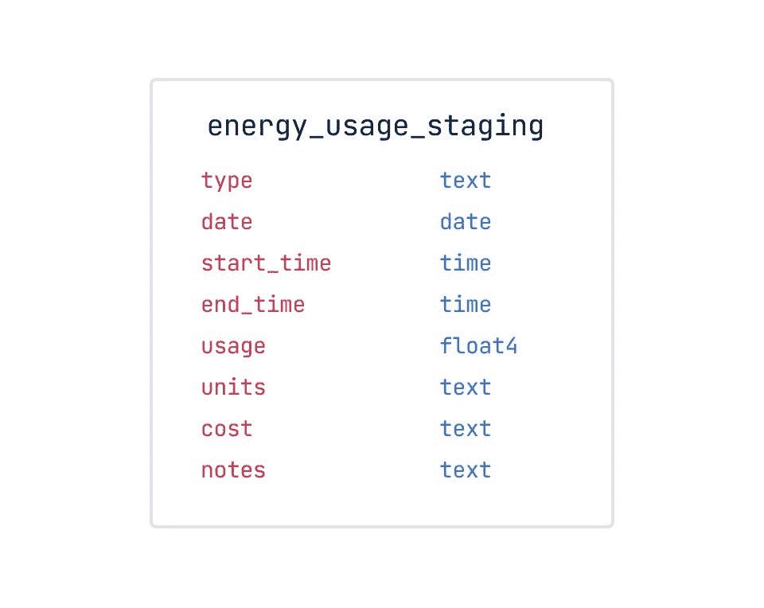
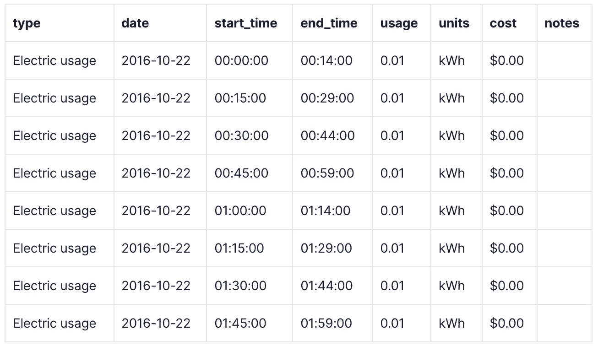
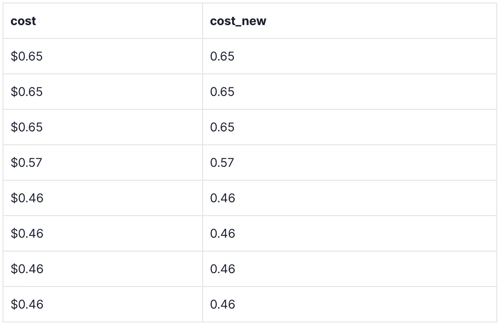
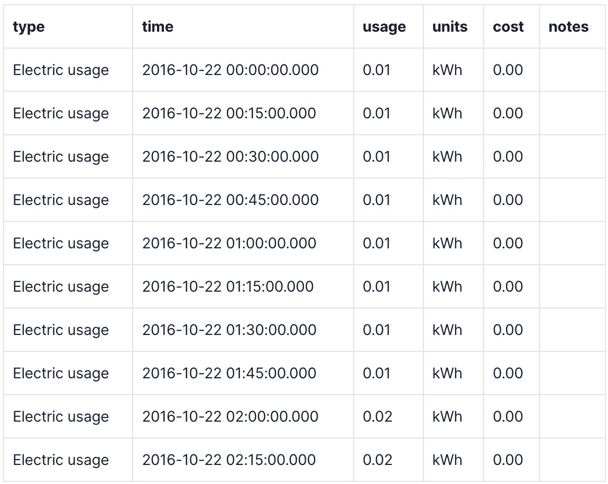
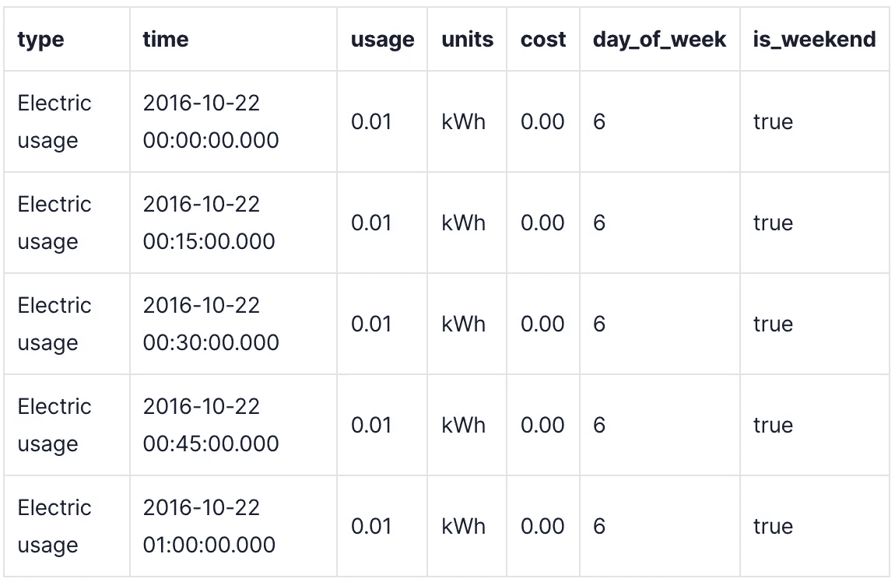
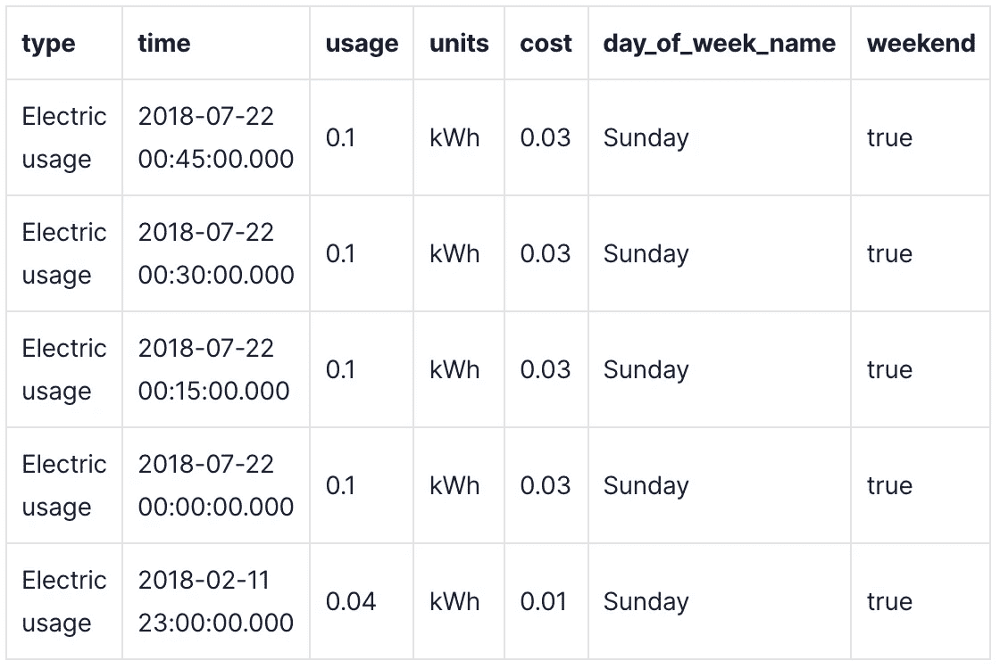

# PostgreSQL 与 Python 的数据清理:指南

> 原文：<https://towardsdatascience.com/postgresql-vs-python-for-data-cleaning-a-guide-9a86834ca4b3?source=collection_archive---------13----------------------->

## 使用 PostgreSQL 和 TimescaleDB 替换 Python 中数据清理任务的方法


从[潘晓珍](https://unsplash.com/@zhenhappy)经 [Unsplash](https://unsplash.com/photos/pj-BrFZ9eAA)

# 介绍

在分析过程中，您很少(如果有的话)直接从评估数据到转换和分析数据。有时候，为了正确地评估您的数据，您可能需要在进行主要的数据清理之前做一些预清理，这需要进行大量的清理工作！为了完成所有这些工作，您可以使用 Excel、R 或 Python，但是这些是数据清理任务的最佳工具吗？

在这篇博客文章中，我探索了一些经典的**数据清理**场景，并展示了如何使用 [TimescaleDB](https://www.timescale.com/?utm_source=tds&utm_medium=blog&utm_id=tsdb-for-data-analysis&utm_content=timescale-website) 和 [PostgreSQL](https://www.postgresql.org/) 在数据库中直接执行这些场景*，取代您可能已经在 Excel、R 或 Python 中完成的任务。TimescaleDB 和 PostgreSQL 不能完全取代这些工具，但它们可以帮助您更有效地管理/清理数据，进而让 Excel、R 和 Python 在可视化、建模和机器学习方面大放异彩。*

清洁是分析过程中非常重要的一部分，从我的经验来看，通常是最累人的！通过直接在我的数据库中清理数据，我能够一次执行许多清理任务，而不是在一个脚本中重复执行，从长远来看，这为我节省了大量时间。

# 数据分析过程概述

我在开始这个关于[数据分析](https://blog.timescale.com/blog/speeding-up-data-analysis/?utm_source=tds&utm_medium=blog&utm_id=tsdb-for-data-analysis&utm_content=first-post)的系列文章时，展示了以下分析过程的摘要:



数据分析生命周期。作者图片

分析生命周期的前三个步骤(评估、清理、转换)包括分析的“数据管理”阶段。从历史上看，我都是在 Python 或 R 中进行数据管理和建模的，这些都是分析的绝佳选择。然而，一旦我接触了 PostgreSQL 和 TimescaleDB，我发现直接在我的数据库中进行数据管理是多么的高效和快速。在我之前的帖子中，我重点展示了[数据评估](https://blog.timescale.com/blog/how-to-evaluate-your-data-directly-within-the-database-and-make-your-analysis-more-efficient/?utm_source=tds&utm_medium=blog&utm_id=tsdb-for-data-analysis&utm_content=previous-post)技术，以及如何用 PostgreSQL 和 TimescaleDB 代码替换之前在 Python 中完成的任务。我现在想进入第二步，**数据清理**。清理可能不是分析过程中最迷人的步骤，但对于创建准确和有意义的模型来说，它绝对是至关重要的。

正如我在上一篇帖子中提到的[，我大学毕业后的第一份工作是在一家能源和可持续发展解决方案公司，该公司专注于监控各种不同的公用事业用途——比如电、水、污水，你能想到的——以找出我们客户的建筑如何才能更高效。我在这家公司的角色是执行数据分析和商业智能任务。](https://blog.timescale.com/blog/how-to-evaluate-your-data-directly-within-the-database-and-make-your-analysis-more-efficient/?utm_source=tds&utm_medium=blog&utm_id=tsdb-for-data-analysis&utm_content=previous-post)

在我整个工作期间，我有机会使用许多流行的数据分析工具，包括 Excel、R 和 Python。但是当我尝试使用数据库来执行数据管理任务时——特别是 PostgreSQL 和 TimescaleDB——我意识到直接在数据库中执行分析，尤其是清理任务是多么高效和简单。

在使用数据库进行数据清理任务之前，我经常会找到需要编辑的列或值。我会从 CSV 文件或数据库中提取原始数据，然后在我的 Python 脚本中对这些数据进行任何调整。这意味着每次我运行 Python 脚本时，我都必须等待我的机器花费计算时间来设置和清理我的数据。这意味着每次运行脚本都会浪费时间。此外，如果我想与同事共享清理后的数据，我必须运行该脚本或将其传递给他们来运行。这种额外的计算时间会随着项目的不同而增加。

相反，使用 PostgreSQL，我可以编写一个查询来进行一次清理，然后将结果存储在一个表中。我不需要花时间用 Python 脚本一次又一次地清理和转换数据，我只需要在我的数据库中设置清理过程，然后就可以收工了！一旦我开始直接在我的数据库中进行清理更改，我就能够跳过在 Python 中执行清理任务，而简单地专注于直接对我的数据建模。

为了让这篇文章尽可能简洁，我选择只展示 Python 和 PostgreSQL 的并行代码比较。如果您对其他工具或语言有任何疑问，请随时加入 TimescaleDB 的 [Slack channel](https://slack.timescale.com/?utm_source=tds&utm_medium=blog&utm_id=tsdb-for-data-analysis&utm_content=slack) ，在这里您可以向时标社区或我询问有关时标或 PostgreSQL 功能的具体问题😊。我很想收到你的来信！

现在，在我们深入研究并获取数据之前，正如 Outkast best 所说，“如此新鲜，如此干净”，我想快速介绍一下我将使用的数据集。此外，我还要注意，我展示的所有代码都将假设您对 SQL 有一些基本的了解。如果你不熟悉 SQL，不用担心！在我的上一篇文章中，我包括了一个关于 SQL 基础的部分，你可以在这里找到。

# 关于样本数据集

根据我在数据科学领域的经验，我在评估后完成了大部分数据清理工作。但是，有时清理数据、评估，然后再次清理是有益的。您选择的过程取决于数据的初始状态以及评估的难易程度。对于我今天将使用的数据集，我可能会在评估前做一些初步清理，然后在评估后再次清理，我会告诉你为什么。

我从 Kaggle 获得了以下[物联网数据集，其中一个非常慷慨的人分享了他们在加州圣何塞公寓的能耗读数，该数据每 15 分钟增加一次。虽然这是很棒的数据，但它的结构与我希望的略有不同。原始数据集遵循以下模式:](https://www.kaggle.com/jaganadhg/house-hold-energy-data)



能源使用分期表。作者图片

看起来像这样…



能源使用表的快照。作者图片

为了对这个数据集进行任何类型的分析，我想清理它。我很快想到的几件事包括:

*   成本被视为文本数据类型，这将导致一些问题。
*   时间列是分开的，如果我想创建随时间变化的图或基于时间执行任何类型的建模，这可能会导致一些问题。
*   我可能还想根据与时间有关的各种参数来过滤数据，例如星期几或假日标识(这两者都可能影响家庭中的能源使用方式)。

为了修复所有这些东西，并获得更有价值的数据评估和分析，我将不得不清理传入的数据！所以，事不宜迟，让我们卷起袖子开始行动吧！

# 清理数据

我将展示我在过去从事数据科学工作时使用的大多数技术。虽然这些示例并不详尽，但我希望它们将涵盖您在自己的分析过程中执行的许多清理步骤，有助于通过使用 PostgreSQL 和 TimescaleDB 来提高清理任务的效率。

请随意探索这些不同的技术，如果你需要的话可以跳过！这里有很多，我把它设计成一个有用的工具词汇表，你可以根据需要使用它。

我将介绍的技术包括:

*   纠正结构性问题
*   创建或生成相关数据
*   向超表添加数据
*   重命名列或表
*   填写缺失的值

**清洁方法注意事项:**

在 PostgreSQL 中，有许多方法可以处理清理过程。我可以创建一个表，然后在清理的时候`[ALTER](https://www.postgresql.org/docs/current/sql-altertable.html)`它，我可以创建多个表来添加或更改数据，或者我可以使用`[VIEW](https://www.postgresql.org/docs/14/sql-createview.html)` [s](https://www.postgresql.org/docs/14/sql-createview.html) 。根据我的数据的大小，这些方法中的任何一种都可能有意义，然而，它们会有不同的计算结果。

你可能已经注意到上面我的原始数据表叫做`energy_usage_staging`。这是因为我决定给定我的原始数据的状态，对我来说最好将原始数据放在一个*暂存表*中，使用`VIEW` s 清理它，然后作为清理过程的一部分将它插入一个更可用的表中。从原始表到可用表的这种移动甚至可以在分析的评估步骤之前发生。正如我上面所讨论的，有时数据清理必须在评估数据之前和之后进行。无论如何，这些数据需要清理，我想使用最有效的方法。在这种情况下，这意味着使用一个分段表，并利用 PostgreSQL `VIEW`的效率和功能，这一点我稍后会谈到。

一般来说，如果您正在处理大量数据，在 PostgreSQL 中修改一个现有表的成本会很高。在这篇文章中，我将向您展示如何使用`VIEW`和其他表来构建干净的数据。这种清理方法效率更高，并且为下一篇关于数据转换的博文做好了准备，其中包括 PostgreSQL 中脚本的使用。

## 纠正结构性问题

马上，我知道由于数据类型的原因，我需要对我的原始表进行一些数据重构。注意，我们将`date`和时间列分开，并且`costs`被记录为文本数据类型。我需要将分离的日期时间列转换成时间戳，将`cost`列转换成 float4。但是在我展示之前，我想谈谈为什么转换为时间戳是有益的。

**TimescaleDB 超表以及时间戳为何重要:**

对于那些不熟悉 [TimescaleDB hypertables](https://docs.timescale.com/timescaledb/latest/overview/core-concepts/hypertables-and-chunks/?utm_source=tds&utm_medium=blog&utm_id=tsdb-for-data-analysis&utm_content=hypertables-chunks) 结构的人来说，它们是我们高效查询和操作时序数据的基础。时间刻度超表是根据时间划分的，更具体地说，是根据创建表时指定的时间列划分的。

数据按时间戳划分成“块”，这样表中的每一行都属于某个基于时间范围的*块*。然后，我们使用这些时间块来帮助查询行，以便您可以获得基于时间的更有效的查询和数据操作。这张图片展示了普通表格和我们的特殊超表格之间的区别。


Hypertables 图像描述。作者图片

**更改日期时间结构:**

因为我想充分利用 TimescaleDB 的功能，比如连续聚合和更快的基于时间的查询，所以我想重组`energy_usage_staging`表的`date`和 time 列。我可以将`date`列用于我的超表分区，但是，我对基于时间操作数据的控制是有限的。具有时间戳的单个列比具有日期和时间的单独列更灵活，空间效率更高。如果以后需要，我可以从时间戳中提取日期或时间！

回头看看表的结构，我应该能够从`date`和`start_time`列中获得一个可用的时间戳值，因为`end_time`并没有给我多少有用的信息。因此，我想将这两个列组合成一个新的时间戳列，让我们看看如何使用 SQL 来实现这一点。剧透一下，就像代数语句一样简单。多酷啊。！

PostgreSQL 代码:

在 PostgreSQL 中，我可以创建列，而无需将它插入数据库。因为我想从这个临时表创建一个新表，所以现在还不想添加更多的列或表。

让我们首先将原始列与新生成的列进行比较。对于这个查询，我简单地将两列相加。`AS`关键字只允许我将列重命名为我想要的名称，在本例中是`time`。

```
--add the date column to the start_time column
SELECT date, start_time, (date + start_time) AS time 
FROM energy_usage_staging eus;
```

结果:


作者图片

Python 代码:

在 Python 中，最简单的方法是向 dataframe 添加一个新列。请注意，在 Python 中，我必须用一个定义的空格将这两列连接起来，然后将该列转换为 datetime。

```
energy_stage_df['time'] = pd.to_datetime(energy_stage_df['date'] + ' ' + energy_stage_df['start_time'])
print(energy_stage_df[['date', 'start_time', 'time']])
```

**更改列数据类型:**

接下来，我想将我的成本列的数据类型从 text 改为 float。同样，这在带有`[TO_NUMBER()](https://www.postgresql.org/docs/14/functions-formatting.html)`函数的 PostgreSQL 中很简单。

函数的格式如下:`TO_NUMBER(‘text’, ‘format’)`。“格式”输入是 PostgreSQL 特定的字符串，您可以根据要转换的文本类型来构建它。在我们的例子中，我们有一个`$`符号，后跟一个数字设置`0.00`。对于格式字符串，我决定使用“L99D99”。L 让 PostgreSQL 知道在文本的开头有一个货币符号，9 让系统知道我有数值，然后 D 代表小数点。

我决定对小于或等于“$99.99”的值进行转换，因为成本列没有大于 0.65 的值。如果您计划转换一个具有较大数值的列，您可能需要添加一个 G 来表示逗号。例如，假设您有一个文本值为“1，672，278.23”的成本列，那么您会希望将字符串的格式设置为“L9G999G999D99”

PostgreSQL 代码:

```
--create a new column called cost_new with the to_number() function
SELECT cost, TO_NUMBER("cost", 'L9G999D99') AS cost_new
FROM energy_usage_staging eus  
ORDER BY cost_new DESC
```

结果:



作者图片

Python 代码:

对于 Python，我使用了一个 lambda 函数，它系统地用空字符串替换所有的' $ '符号。这可能效率相当低。

```
energy_stage_df['cost_new'] = pd.to_numeric(energy_stage_df.cost.apply(lambda x: x.replace('$','')))
print(energy_stage_df[['cost', 'cost_new']])
```

**创建一个** `**VIEW**` **:**

现在我知道了如何转换我的列，我可以组合这两个查询并为我的新的重构表创建一个`VIEW`。一个`[VIEW](https://www.postgresql.org/docs/14/sql-createview.html)`是一个 PostgreSQL 对象，它允许你定义一个查询并通过它的名字`VIEW`调用它，就好像它是你的数据库中的一个表。我可以使用下面的查询生成我想要的数据，然后创建一个`VIEW`,我可以像查询一个表一样查询它。

PostgreSQL 代码:

```
-- query the right data that I want
SELECT type, 
(date + start_time) AS time, 
"usage", 
units, 
TO_NUMBER("cost", 'L9G999D99') AS cost, 
notes 
FROM energy_usage_staging
```

结果:



作者图片

我决定叫我的`VIEW` `energy_view`。现在，当我想做进一步的清理时，我可以在`FROM`语句中指定它的名称。

```
--create view from the query above
CREATE VIEW energy_view AS
SELECT type, 
(date + start_time) AS time, 
"usage", 
units, 
TO_NUMBER("cost", 'L9G999D99') AS cost, 
notes 
FROM energy_usage_staging
```

Python 代码:

```
energy_df = energy_stage_df[['type','time','usage','units','cost_new','notes']]
energy_df.rename(columns={'cost_new':'cost'}, inplace = True)
print(energy_df.head(20))
```

需要注意的是，使用 PostgreSQL `VIEW` s，每次查询时都必须重新计算其中的数据。这就是为什么我们希望在数据设置正确后将数据插入到一个超表中。你可以把`VIEW` s 看作是我在上一篇帖子中讨论的 [CTEs](https://blog.timescale.com/blog/how-to-evaluate-your-data-directly-within-the-database-and-make-your-analysis-more-efficient/?utm_source=tds&utm_medium=blog&utm_id=tsdb-for-data-analysis&utm_content=timescale-tutorials/#cte/) `[WITH](https://blog.timescale.com/blog/how-to-evaluate-your-data-directly-within-the-database-and-make-your-analysis-more-efficient/?utm_source=tds&utm_medium=blog&utm_id=tsdb-for-data-analysis&utm_content=timescale-tutorials/#cte/)` <https://blog.timescale.com/blog/how-to-evaluate-your-data-directly-within-the-database-and-make-your-analysis-more-efficient/?utm_source=tds&utm_medium=blog&utm_id=tsdb-for-data-analysis&utm_content=timescale-tutorials/#cte/>`[AS](https://blog.timescale.com/blog/how-to-evaluate-your-data-directly-within-the-database-and-make-your-analysis-more-efficient/?utm_source=tds&utm_medium=blog&utm_id=tsdb-for-data-analysis&utm_content=timescale-tutorials/#cte/)`语句的速记版本。

我们现在离更干净的数据更近了一步！

## 创建或生成相关数据

通过快速调查，我们可以看到这个数据集的 notes 列是空白的。为了检查这一点，我只需要包含一个`WHERE`子句，并指定`notes`不等于空字符串。

PostgreSQL 代码:

```
SELECT * 
FROM energy_view ew
-- where notes are not equal to an empty string
WHERE notes!='';
```

结果出来是空的

Python 代码:

```
print(energy_df[energy_df['notes'].notnull()])
```

因为注释是空白的，所以我想用各种附加信息来替换该列，以便在建模过程中使用。我想特别添加的一件事是一个指定星期几的列。为此，我可以使用`EXTRACT()`命令。`[EXTRACT()](https://www.postgresql.org/docs/14/functions-datetime.html)`命令是一个 PostgreSQL 日期/时间函数，允许您提取各种日期/时间元素。对于我们的专栏，PostgreSQL 具有规格 DOW(星期几),它将 0 映射到星期天，将 6 映射到星期六。

PostgreSQL 代码:

```
--extract day-of-week from date column and cast the output to an int
SELECT *,
EXTRACT(DOW FROM time)::int AS day_of_week
FROM energy_view ew
```

结果:


作者图片

Python 代码:

```
energy_df['day_of_week'] = energy_df['time'].dt.dayofweek
```

此外，我们可能希望添加另一列来指定某一天是周末还是工作日。我将通过创建一个布尔列来实现这一点，其中`true`表示周末，`false`表示工作日。为此，我将应用一个`[CASE](https://www.postgresql.org/docs/14/plpgsql-control-structures.html)`语句。使用该命令，我可以指定“when-then”语句(类似于编码中的“if-then”语句)，其中我可以说`WHEN`一个`day_of_week`值是`IN`set(0，6) `THEN`输出应该是`true`，`ELSE`值应该是`false`。

PostgreSQL 代码:

```
SELECT type, time, usage, units, cost,
EXTRACT(DOW FROM time)::int AS day_of_week, 
--use the case statement to make a column true when records fall on a weekend aka 0 and 6
CASE WHEN (EXTRACT(DOW FROM time)::int) IN (0,6) then true
 ELSE false
END AS is_weekend
FROM energy_view ew
```

结果:



作者图片

有趣的事实:您可以在没有`CASE`语句的情况下执行相同的查询，但是它只适用于二进制列。

```
--another method to create a binary column
SELECT type, time, usage, units, cost,
EXTRACT(DOW FROM time)::int AS day_of_week, 
EXTRACT(DOW FROM time)::int IN (0,6) AS is_weekend
FROM energy_view ew
```

Python 代码:

请注意，在 Python 中，周末由数字 5 和 6 表示，而 PostgreSQL 周末值为 0 和 6。

```
energy_df['is_weekend'] = np.where(energy_df['day_of_week'].isin([5,6]), 1, 0)
print(energy_df.head(20))
```

也许事情会变得很疯狂，也许你想添加更多的参数！

让我们考虑假期。现在你可能会问“我们到底为什么要这么做？!"，但在美国，人们通常在一些节假日会休息。因为这个人住在美国，他们可能至少有一些假期，无论是当天还是联邦假日。在有休息日的地方，能源使用会有所不同。为了帮助指导我的分析，我想包括假日的识别。为此，我将创建另一个布尔列来标识联邦假日的时间。

为此，我将使用 TimescaleDB 的`time_bucket()`函数。`[time_bucket()](https://docs.timescale.com/api/latest/hyperfunctions/time_bucket/?utm_source=tds&utm_medium=blog&utm_id=tsdb-for-data-analysis&utm_content=time-bucket-docs)`函数是我在之前的[文章](https://blog.timescale.com/blog/how-to-evaluate-your-data-directly-within-the-database-and-make-your-analysis-more-efficient/?utm_source=tds&utm_medium=blog&utm_id=tsdb-for-data-analysis&utm_content=last-blog-time-bucket#timebucket/)中详细讨论过的函数之一。本质上，我需要使用这个函数来确保一天内的所有时间值都被计算在内。如果不使用`time_bucket()`函数，我只能看到与 12am 时间段相关的行的变化。

PostgreSQL 代码:

创建假日表后，我可以在查询中使用其中的数据。我还决定对这个查询使用非 case 语法。注意，两者都可以用！

```
--create table for the holidays
CREATE TABLE holidays (
date date)--insert the holidays into table
INSERT INTO holidays 
VALUES ('2016-11-11'), 
('2016-11-24'), 
('2016-12-24'), 
('2016-12-25'), 
('2016-12-26'), 
('2017-01-01'),  
('2017-01-02'), 
('2017-01-16'), 
('2017-02-20'), 
('2017-05-29'), 
('2017-07-04'), 
('2017-09-04'), 
('2017-10-9'), 
('2017-11-10'), 
('2017-11-23'), 
('2017-11-24'), 
('2017-12-24'), 
('2017-12-25'), 
('2018-01-01'), 
('2018-01-15'), 
('2018-02-19'), 
('2018-05-28'), 
('2018-07-4'), 
('2018-09-03'), 
('2018-10-8')SELECT type, time, usage, units, cost,
EXTRACT(DOW FROM time)::int AS day_of_week, 
EXTRACT(DOW FROM time)::int IN (0,6) AS is_weekend,
-- I can then select the data from the holidays table directly within my IN statement
time_bucket('1 day', time) IN (SELECT date FROM holidays) AS is_holiday
FROM energy_view ew
```

结果:


作者图片

Python 代码:

```
holidays = ['2016-11-11', '2016-11-24', '2016-12-24', '2016-12-25', '2016-12-26', '2017-01-01',  '2017-01-02', '2017-01-16', '2017-02-20', '2017-05-29', '2017-07-04', '2017-09-04', '2017-10-9', '2017-11-10', '2017-11-23', '2017-11-24', '2017-12-24', '2017-12-25', '2018-01-01', '2018-01-15', '2018-02-19', '2018-05-28', '2018-07-4', '2018-09-03', '2018-10-8']
energy_df['is_holiday'] = np.where(energy_df['day_of_week'].isin(holidays), 1, 0)
print(energy_df.head(20))
```

此时，我将把这个扩展的表保存到另一个`VIEW`中，这样我就可以调用数据而不用写出查询。

PostgreSQL 代码:

```
--create another view with the data from our first round of cleaning
CREATE VIEW energy_view_exp AS
SELECT type, time, usage, units, cost,
EXTRACT(DOW FROM time)::int AS day_of_week, 
EXTRACT(DOW FROM time)::int IN (0,6) AS is_weekend,
time_bucket('1 day', time) IN (select date from holidays) AS is_holiday
FROM energy_view ew
```

您可能会问，“为什么将这些列创建为布尔列？?"，一个很公平的问题！你看，我可能想在分析过程中使用这些列进行过滤，这是我在自己的分析过程中经常做的事情。在 PostgreSQL 中，当你使用布尔列时，你可以非常容易地过滤东西。例如，假设我想使用到目前为止的表查询，并且只显示发生在周末`AND`假期的数据。我可以简单地通过添加一个`WHERE`语句和指定的列来实现。

PostgreSQL 代码:

```
--if you use binary columns, then you can filter with a simple WHERE statement
SELECT *
FROM energy_view_exp
WHERE is_weekend AND is_holiday
```

结果:


作者图片

Python 代码:

```
print(energy_df[(energy_df['is_weekend']==1) & (energy_df['is_holiday']==1)].head(10))
```

## 向超表添加数据

现在我已经准备好了新的列，并且我知道我希望我的表是如何结构化的，我可以创建一个新的超表并插入我清理的数据。在我自己对这个数据集的分析中，我可能已经在评估我的数据之前做了清理，这样我就可以在分析中获得更有意义的评估步骤。最棒的是，您可以使用这些技术中的任何一种进行常规清洁，无论是在评估之前还是之后。

PostgreSQL:

```
CREATE TABLE energy_usage (
type text,
time timestamptz,
usage float4,
units text,
cost float4,
day_of_week int,
is_weekend bool,
is_holiday bool,
)--command to create a hypertable
SELECT create_hypertable('energy_usage', 'time')INSERT INTO energy_usage 
SELECT *
FROM energy_view_exp
```

请注意，如果您有持续不断的数据输入，您可以在数据库中创建一个脚本，在导入数据时自动进行这些更改。这样，您可以在数据库中准备好已清理的数据，而不是每次要执行分析时都在脚本中处理和清理数据。

我们将在我的下一篇文章中详细讨论这一点，所以如果你想知道如何创建脚本并保持数据自动更新，请确保继续关注！

## 重命名值

清理数据的另一项有价值的技术是能够重命名各种项目或重新映射分类值。StackOverflow 上这个 Python 数据分析问题的[受欢迎程度放大了这项技能的重要性。问题是“我如何改变熊猫数据帧中的单个索引值？”。由于 PostgreSQL 和 TimescaleDB 使用关系表结构，重命名唯一值可能相当简单。](https://stackoverflow.com/questions/40427943/how-do-i-change-a-single-index-value-in-pandas-dataframe)

在重命名表中的特定索引值时，可以通过在`SELECT`查询中使用 PostgreSQL 的`CASE`语句来“动态”完成。比方说，我不喜欢在`day_of_week`列中用 0 表示星期天，但我更希望它是 7。我可以用下面的查询做到这一点。

PostgreSQL 代码:

```
SELECT type, time, usage, cost, is_weekend,
-- you can use case to recode column values 
CASE WHEN day_of_week = 0 THEN 7
ELSE day_of_week 
END
FROM energy_usage
```

Python 代码:

注意，这段代码会使 Monday = 7，因为 python DOW 函数将 Monday 设置为 0，Sunday 设置为 6。但是这就是在一个列中更新一个值的方法。很可能你不想做这个动作，我只是想展示 python 的等价物作为参考。

```
energy_df.day_of_week[energy_df['day_of_week']==0] = 7
print(energy_df.head(250))
```

现在，假设我想实际使用一周中各天的名称，而不是显示数值？对于这个例子，我实际上想放弃`CASE`语句，创建一个映射表。当您需要更改各种值时，创建一个映射表，然后使用`[JOIN](https://www.postgresql.org/docs/14/queries-table-expressions.html)`命令连接到这个表可能会更有效。

PostgreSQL 代码:

```
--first I need to create the table
CREATE TABLE day_of_week_mapping (
day_of_week_int int,
day_of_week_name text
)--then I want to add data to my table
INSERT INTO day_of_week_mapping
VALUES (0, 'Sunday'),
(1, 'Monday'),
(2, 'Tuesday'),
(3, 'Wednesday'),
(4, 'Thursday'),
(5, 'Friday'),
(6, 'Saturday')--then I can join this table to my cleaning table to remap the days of the week
SElECT type, time, usage, units, cost, dowm.day_of_week_name, is_weekend
FROM energy_usage eu
LEFT JOIN day_of_week_mapping dowm ON dowm.day_of_week_int = eu.day_of_week
```

结果:



作者图片

Python 代码:

在这种情况下，python 具有类似的映射功能。

```
energy_df['day_of_week_name'] = energy_df['day_of_week'].map({0 : 'Sunday', 1 : 'Monday', 2: 'Tuesday', 3: 'Wednesday', 4: 'Thursday', 5: 'Friday', 6: 'Saturday'})
print(energy_df.head(20))
```

希望在您处理数据重命名时，这些技术中的一种会对您有用！

此外，请记住，如果您想更改表中某一列的名称，这真的像`AS`一样简单(我不能不使用这样一个荒谬的语句😂).当使用`SELECT`语句时，可以像这样重命名列，

PostgreSQL 代码:

```
SELECT type AS usage_type,
time as time_stamp,
usage,
units, 
cost AS dollar_amount
FROM energy_view_exp
LIMIT 20;
```

结果:


作者图片

Python 代码:

相比之下，在 Python 中重命名列是一件非常痛苦的事情。在这方面，SQL 不仅速度更快，而且代码更优雅。

```
energy_df.rename(columns={'type':'usage_type', 'time':'time_stamp', 'cost':'dollar_amount'}, inplace=True)
print(energy_df[['usage_type','time_stamp','usage','units','dollar_amount']].head(20))
```

## 填写缺失的数据

数据清理过程中的另一个常见问题是丢失数据。对于我们正在使用的数据集，没有明显缺失的数据点，但是，通过评估，我们很可能会发现停电或其他现象导致的每小时缺失数据。这就是 TimescaleDB 提供的填补空白的功能派上用场的地方。使用算法时，缺失数据通常会对模型的准确性或可靠性产生重大负面影响。有时，您可以通过用合理的估计值填充缺失的数据来解决这个问题，TimescaleDB 实际上有内置的函数来帮助您做到这一点。

例如，假设您正在对一周中某几天的能源使用情况进行建模，由于停电或传感器出现问题，有几天缺少能源数据。我们可以删除数据，或者尝试用合理的估计来填充缺失的值。今天，让我们假设我想要使用的模型将从填充缺失值中获益更多。

举个例子，我创建了一些数据。我把这个表叫做`energy_data`，它丢失了上午 7:45 和 11:30 之间的时间戳的`time`和`energy`读数。


作者图片

我可以用时标数据库的[填隙超函数](https://docs.timescale.com/api/latest/hyperfunctions/gapfilling-interpolation/?utm_source=tds&utm_medium=blog&utm_id=tsdb-for-data-analysis&utm_content=gapfilling-docs)来填补这些缺失值。`[interpolate()](https://docs.timescale.com/api/latest/hyperfunctions/gapfilling-interpolation/interpolate/?utm_source=tds&utm_medium=blog&utm_id=tsdb-for-data-analysis&utm_content=interpolate-docs)`函数是 TimescaleDB 的另一个超函数，它创建的数据点遵循一个线性近似，给出了缺失数据范围前后的数据点。或者，您可以使用`[locf()](https://docs.timescale.com/api/latest/hyperfunctions/gapfilling-interpolation/locf/?utm_source=tds&utm_medium=blog&utm_id=tsdb-for-data-analysis&utm_content=locf-docs)` hyperfunction，它将最后记录的值向前结转以填补空白(注意 locf 代表最后一个结转)。这两个功能必须与`[time_bucket_gapfill()](https://docs.timescale.com/api/latest/hyperfunctions/gapfilling-interpolation/time_bucket_gapfill/?utm_source=tds&utm_medium=blog&utm_id=tsdb-for-data-analysis&utm_content=time-bucket-gapfilling-docs)`功能一起使用。

PostgreSQL 代码:

```
SELECT
--here I specified that the data should increment by 15 mins
  time_bucket_gapfill('15 min', time) AS timestamp,
  interpolate(avg(energy)),
  locf(avg(energy))
FROM energy_data
--to use gapfill, you will have to take out any time data associated with null values. You can do this using the IS NOT NULL statement
WHERE energy IS NOT NULL AND time > '2021-01-01 07:00:00.000' AND time < '2021-01-01 13:00:00.000'
GROUP BY timestamp
ORDER BY timestamp;
```

结果:


作者图片

Python 代码:

```
energy_test_df['time'] = pd.to_datetime(energy_test_df['time'])
energy_test_df_locf = energy_test_df.set_index('time').resample('15 min').fillna(method='ffill').reset_index()
energy_test_df = energy_test_df.set_index('time').resample('15 min').interpolate().reset_index()
energy_test_df['locf'] = energy_test_df_locf['energy']
print(energy_test_df)
```

**奖励:**

下面的查询是我如何忽略丢失的数据。我想包括这一点，向您展示排除空数据是多么容易。或者，我可以使用一个`WHERE`子句来指定我想忽略的时间(第二个查询)。

```
SELECT * 
FROM energy_data 
WHERE energy IS NOT NULLSELECT * 
FROM energy_data
WHERE time <= '2021-01-01 07:45:00.000' OR time >= '2021-01-01 11:30:00.000'
```

# 包裹

阅读完这些不同的清理技术后，我希望您在探索 PostgreSQL 和 TimescaleDB 提供的一些可能性时会感觉更舒服。通过直接在我的数据库中清理数据，我能够一次执行许多清理任务，而不是在一个脚本中重复执行，因此从长远来看节省了我的时间。如果您希望在清理数据以进行分析时节省时间和精力，那么一定要考虑使用 PostgreSQL 和 TimescaleDB。

在我的下一篇文章中，我将介绍如何使用 PostgreSQL 和 TimescaleDB 转换数据的技术。然后，我将把我们学到的所有东西放在一起，对 PostgreSQL 和 TimescaleDB 与 Python 和 pandas 中的数据管理任务进行基准测试。最后一篇博客文章将通过使用 TimescaleDB(用于数据管理)和 Python(用于建模和可视化)深入研究数据分析，向您展示真实数据集的整个过程。

如果您对 TimescaleDB、时间序列数据或上述任何功能有任何疑问，请加入我们的[社区 Slack](https://slack.timescale.com/?utm_source=tds&utm_medium=blog&utm_id=tsdb-for-data-analysis&utm_content=slack) ，在这里您会发现一个由时间序列爱好者和各种时间序列团队成员(包括我！).

如果你有兴趣亲自体验 TimescaleDB 和 PostgreSQL 的强大，你可以[注册 30 天免费试用](https://www.timescale.com/timescale-signup/?utm_source=tds&utm_medium=blog&utm_id=tsdb-for-data-analysis&utm_content=timescale-signup)或者在你当前的 PostgreSQL 实例上安装 TimescaleDB 和[管理它](https://docs.timescale.com/timescaledb/latest/how-to-guides/install-timescaledb/self-hosted/?utm_source=tds&utm_medium=blog&utm_id=tsdb-for-data-analysis&utm_content=timescale-self-hosted)。我们还有一堆[很棒的教程](https://docs.timescale.com/timescaledb/latest/tutorials/?utm_source=tds&utm_medium=blog&utm_id=tsdb-for-data-analysis&utm_content=timescale-tutorials)来帮助你入门。

下次见！

*最初发表于 2021 年 12 月 1 日 https://blog.timescale.com**的* [*。*](https://blog.timescale.com/blog/postgresql-vs-python-for-data-cleaning-a-guide/)