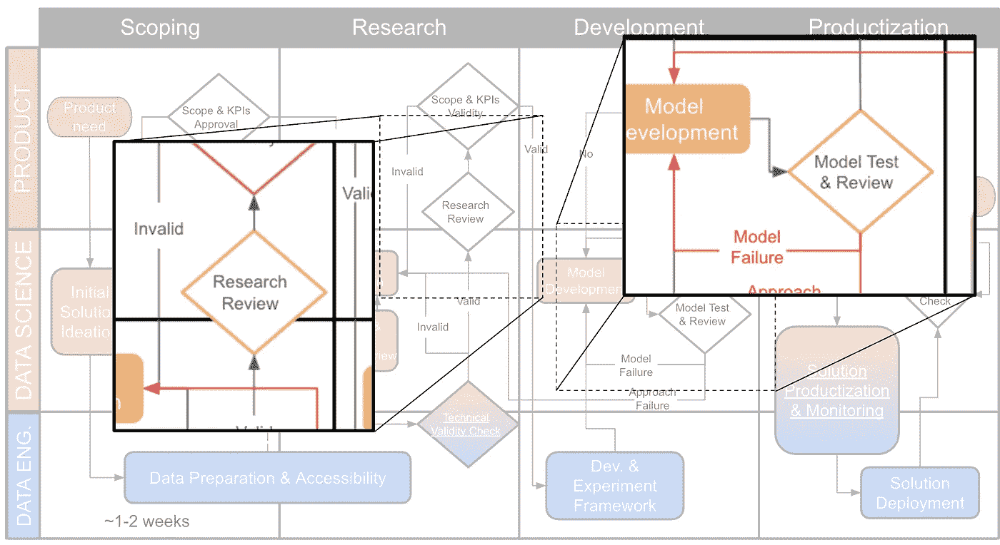

# 事后分析:创业公司数据科学同行评议的一年

> 原文：<https://towardsdatascience.com/postmortem-a-year-of-data-science-peer-review-in-startups-7e9cc2862ed9?source=collection_archive---------20----------------------->

## [行业笔记](https://towardsdatascience.com/tagged/notes-from-industry)

大约一年前，我提出了两个针对数据科学项目的[同行评审流程](https://medium.com/@shay.palachy/peer-reviewing-data-science-projects-7bfbc2919724?source=friends_link&sk=914d618224f713cbcabf1f6ead3ba3d9)，概述了该流程的结构——包括对研究阶段和模型设计及实现的单独评审——并将其定位于更广泛的[数据科学项目流程](/data-science-project-flow-for-startups-282a93d4508d?source=friends_link&sk=7c29bb9683e4c3564d92d89d31a666d1)(正如它在初创公司中所实践的那样)的范围内。该框架还包括应审查的主题、陷阱和问题清单。

这不仅仅是一次脑力锻炼。这篇文章旨在将正式的同行评审流程引入我在过去三年中帮助建立并提供建议的一个数据科学团队的工作流程中。自从这篇文章写出来后，我有机会多次作为一个评审者(和几个客户)见证了这种方法在团队动态中的整合以及它是如何被实践的。

不出所料，事情并没有完全按照计划进行。因此，这篇文章是关于什么可行，什么不可行。我关注的是最具挑战性的方面，试图让数据科学家从他们的同行那里得到评论。我希望这能帮助那些希望在数据科学中正式化同行评审过程的人

一位英俊同行评审员的背影(照片由[查尔斯·德鲁维奥](https://unsplash.com/@charlesdeluvio?utm_source=unsplash&utm_medium=referral&utm_content=creditCopyText)在 [Unsplash](https://unsplash.com/photos/Lks7vei-eAg) 上拍摄)

# 提醒:我们在复习什么？

我提出的评审过程是为了补充由四个阶段组成的工作流:范围界定——研究——模型开发——产品化/部署。建议两个审查过程:第一个是研究阶段，第二个是模型开发阶段。两者都列出了要回顾的主题列表，并详细说明了每个主题的许多具体问题。

作为 DS 项目工作流程一部分的同行评审流程(来源:作者)

*研究评审*关注研究方法以及实践和理论问题，旨在确保在进入模型开发之前选择正确的方法。示例有方法假设、模型可组合性、领域适应、噪声和偏差以及现有实现。

*模型开发评审*关注生产模型的实际问题，意在防止有问题的模型进入生产。示例包括泄漏、因果关系、评估指标、过拟合和运行时间。

# 关键要点

这是我的经历中的一个要点列表。每一个都是为了克服我遇到的特定挑战。

## 📅要点 1:首先安排时间

**挑战:养成习惯很难。**我认为，将流程整合到团队习惯和文化中是主要的挑战。这比代码审查更难，因为没有像在托管版本控制系统(例如 Github)中那样简单的方法来实现强制网关，在托管版本控制系统中，将代码合并到特定的(例如主)分支需要 PR 上的批准(这是您不能给自己的)。

一个没有写着“兔子”的标志(照片由[德鲁·比默](https://unsplash.com/@drew_beamer)在 [Unsplash](https://unsplash.com/photos/uejtDqpJ7ig) 上拍摄)

**习惯的形成也与你的项目流程的结构紧密相关**；越是结构化，就越容易将(通常)强制性审查过程作为从一个阶段进展到另一个阶段的条件。在结构化程度较低的流程中，领导项目的数据科学家和他的经理要承担更多的责任，以确定需要评审的时间点。

> **要点:**一旦新项目开始，让 DS 安排一次研究评审——即使没有评审员，只邀请团队负责人；然后他们可以推迟，但不太可能跳过。您还可以构建您的工作流程，以便更正式地整合这些评审阶段。

## 🔍要点 2:鼓励所有人发现评估机会

**挑战:责任在于被评审者。**成功采用的另一个关键障碍是，让同行评审发生是被评审者(其工作正在接受评审的数据科学家)的责任，这意味着他有责任:

1.  确定一个研究阶段(或有研究的阶段)正在进行。
2.  确定该阶段接近完成。
3.  请记住，同行评审机制是存在的。
4.  让自己承担额外的准备审查的工作，以及将自己的工作暴露给明确的同行审查的脆弱性。

这对一双肩膀来说是很大的额外负担。在与我们工作领域最相关的两个同行评审实践中——学术评审和代码评审——不存在何时或是否通过评审的问题；一篇文章*必须*通过审查才能在学术场所发表；一个拉请求*必须*被不同的团队成员审查和批准，才能被拉进主开发分支(或者至少，很容易设置你的 VCS 来执行这个)。我们这里没有这样的特权。

> **要点:**虽然这不是数据科学家的责任，但我们应该鼓励他们积极帮助他们的同事问问自己，是不是到了进行评估的时候了；每周或每天的团队会议是帮助每个人注意到项目何时从更像研究的动态转向开发的好时机。

## 👯‍♂️的秘诀 3:评论可以使用研究和模型开发主题

**挑战:阶段边界模糊。**当我想到审查研究迭代或模型的正确时间时，我脑海中有一个[有点理想的图片](/peer-reviewing-data-science-projects-7bfbc2919724)关于如何构建一个小型数据科学项目。

我建议的流程假设数据科学团队将其项目明确划分为范围界定、研究、模型开发和产品化阶段；当进入一个阶段时，宣布该阶段的建议持续时间(或其范围),并且交付成果和 DoD 是明确的；因此，可以很容易地安排研究阶段结束时的同行评审，有时甚至可以提前安排。

边界检测通常比这更难(图片由 [Héctor J. Rivas](https://unsplash.com/@hjrc33) 在 [Unsplash](https://unsplash.com/photos/2Axr8NAAqng) 上拍摄)

实际上，**人们不会把他们的工作分成如此不同的阶段**(尽管我相信这可能是有用的)，而且这两种工作之间的界限经常是模糊的。

我也希望我的框架能被大多数从事基于研究和基于产品特性的混合项目的小型数据科学团队所使用，不管他们使用的是什么工作流程；同样，将审查过程分成两种不同的类型会使它与这样的工作流不太相关。

> **要点:**当研究和模型开发阶段的界限模糊不清时，或者当工作本质上包括这两个方面时，评审会议可以利用研究评审列表和模型开发列表中的主题和目标。

## 👂方法 4:轻松评论非技术问题

问题:头脑风暴解决方案更有趣。在参加一系列这样的会议(正式的和非正式的)时，我注意到一个奇怪的现象:数据科学家倾向于将研究评审会议变成建模头脑风暴会议。

便利贴是大多数头脑风暴基准中的 SOTA(图片由[明实验室](https://unsplash.com/@minglabs)在 [Unsplash](https://unsplash.com/photos/HmkNHtKVhXk) 上拍摄)

虽然头脑风暴法对问题建模可能对评审者有益，但这通常不是会议的主要预期益处；当被评审者要求进行研究评审时，他应该对问题的可能建模方法有一个清晰的了解，并考虑到产品需求、资源限制、可用数据等，推荐哪种(或哪些)方法最适合该项目。如果我们谈论的是一个模型开发评审会议，这一点更是如此。

此外，如果我们检查我列出的主题，没有一个关注建模。当然，对每个这样的主题的讨论和评论可以产生新的建模方法的建议，这可能有助于解决新发现的挑战，但是:

1.  解决方案也以预处理、特征工程、标签转换、实现细节和数据科学实践的其他方面的形式出现。
2.  更重要的是，评审者应该专注于帮助被评审者找到他建议的问题解决方案中的漏洞、弱点和未减轻的风险。提出这些问题的解决方案是被评估者的工作。

那么，为什么数据科学家关注建模建议呢？我认为这可能是因为**对方法和计划的批评更难沟通和说服人们，而技术方面的批评更安全**，至少对技术人员来说是这样。

这不应该是一个惊喜:技术索赔感觉(并且经常——尽管不总是——更客观、更冷静、更客观。对工作模式和研究方法的批评可能会被认为——有时也会发表——是对被评审者人格的攻击。不应该是这样的。我们都应该能够安全地承认，我们在做我们所做的事情时并不完美，我们可以在所有方面向我们的同龄人学习。我认为意识到这种偏见可以帮助我们提高项目审查的水平和范围。

> **要点:**同事必须能够自如地辩论和评论规划、研究方法和产品/业务假设中的问题。在我看来，还应该积极鼓励他们关注正在审查的项目的这些方面。

## 💥🥇外卖#5:犯错误应该被允许；找到他们应该受到表扬

问题:受到批评是令人生畏的。我不认为这在任何方面对数据科学来说是特别的，除了将方法失败(或负面研究发现)视为个人失败的独特反模式——这是我们许多人来自的学术背景的有毒遗产(稍后将详细介绍)。

然而，这在做研究活动时比在工程中重要得多，因为基本故障是我们职业的核心。

> **外卖:**弱势传播的文化；频繁而坚定地承认自己一无所知；认为识别错误是一个自然和常见的工作过程，这对于促进频繁和坦诚的同行评审至关重要。
> 
> **要点:**当评审暴露出关键错误或未解决的问题时，被评审者和评审者都应该受到表扬——这是一种共同的成就；这意味着不仅评审者有智慧识别这些问题，而且被评审者安排了评审的时间，提供了正确的信息，并正确地构建了信息，从而能够进行上述识别。

## 📝要点 6:话题焦点

问题:许多潜在的话题需要触及。我列的清单很长，涉及许多问题——如此之多，以至于在一次会议上几乎不可能全部看完，至少不能浅尝辄止。我认为这里有一个简单的要点:

> **要点:**被评审者和评审者应该就他们特别感兴趣解决的一小部分问题达成一致——例如，偏见、KPI 目标一致性和领域适应性——并关注它们。
> 
> 如果你没有时间来讨论这个问题，那么任何一方选择 3-4 个他们想关注的问题就足够了。

## 📉要点 7:忙时放下准备工作

**问题:备考时间稀缺。**我发现评审员通常找不到时间准备评审会议——手头总是有更紧迫的任务。实际上，我认为你没有它也可以，而且以上对几个主题的关注会有所帮助。

> **要点:**如果准备时间不足，只需通读清单中与焦点问题相关的部分，就足以了解相关的问题和陷阱。

## 🧪💥要点 8:回顾失败的研究

问题:我们通常不会回顾失败的研究。失败的研究不是研究人员的失败，即使不是大多数情况下也是很多情况下的失败；这是研究活动的本质，包括大量的负面发现:单词嵌入没有捕捉到我们案例的正确语义；顺序架构似乎不能促进对我们数据的根本不同的表示学习；预先训练的模型似乎来自一个太遥远的领域，无法有效地使用；等等。这些都是有价值的发现，应该用来导航项目的未来，并决定我们的资源应该如何花费，因为通常有大量可能的研究方向。

GPT-3 的短篇小说(善良好奇的在 [Unsplash](https://unsplash.com/photos/_8gzs9HYYhM) 上拍摄的

不幸的是，**数据科学家——通常还有他们的环境——倾向于将解决问题方法的失败**内在化为他们作为数据科学家能力的失败，尽管这两者是完全分开的。即使我们个人确实失败了——我们确实失败了很多——这些失败也应该被视为学习和改进我们的过程的机会。

例如，假设我们刚刚花了 3 周时间对无监督实体嵌入技术的使用进行了深入研究，并得出了重大的负面发现——例如，无监督实体嵌入技术无法为我们的实体产生足够强的表示，或者产生的输出将很难集成到当前的框架中，或者我们需要多几个数量级的数据来利用它们。反过来，这些发现可能决定了这个研究方向在接下来的几年内不会被追求。这是一个重要的决定——如果这个方向被证明对我们的任务至关重要，那么从长远来看，这里的一个错误可能会付出高昂的代价——因此应该建立在我们所相信的、得到充分支持的研究发现之上。

因此，在我看来，再花一两个小时一起考虑它的确证程度是有意义的，我们是否可以用更少的时间和/或资源获得相同的结论，该结论应该达到多远，什么样的警告可能会促使未来回到这一研究方向，等等。

> **要点:**评审应该发生在每一次重要的研究迭代之后——即使是失败的迭代。它应该用于学习方法和更好地定义负面发现的范围。

# 好的部分

以下是一些刚刚奏效的方法。:)

## 光是准备就做了很多工作

也许不是大多数，但是很多。我认为这实际上是一件好事，因为准备工作(当它完成时)有助于接受审查的数据科学家花必要的时间以比其他方式更深入的方式考虑他们工作的关键风险和潜在挑战。

## 同行批评的正式渠道

当然，同行对观点的批评无论如何都会发生。然而，人们对它的反应因环境而异。我认为会议给了同行批评一个正式的出口。因为批评是预料之中的，并且被框定为每个人和每个项目都要经历的事情，它帮助被评审者避免认为这是他们做错了或者他们被挑选出来的标志。

这反过来会让你放松警惕，对批评的内容更加开放。这与在向整个团队展示你的研究计划或结果时受到批评截然不同，这可能会让你觉得当你试图分享一些很酷的东西时，你被否决了，或者人们关注的是不好的部分。从同事反馈中产生[富有成效的结果已经够难的了。](https://hbr.org/2019/03/the-feedback-fallacy)

最后，同行评审会议本身也可以帮助被评审者为所述陈述做准备并建立他们的案例，防止这种完全的批评及其负面的副作用。

## 人们得到了实际有用的反馈

这也许是全部的重点，但它仍然不是微不足道的。虽然这给了一些无论如何都会发生的批评提供了出口，虽然一些事情在准备期间得到了确认，但很明显**人们在那些会议期间得到的许多有用的反馈不会对他们可用，否则**，并对他们的工作方式产生了积极的影响。几个有机会接受审查的人也证实了这一点。

# 结束语

就是这样。我希望继续迭代这个简单但有希望有用的数据科学同行评审框架。我的很多工作都是关于审查我的客户公司同事的数据科学流程。我也偶尔会谈到这种形式化本身，并以此为契机，说服人们应该在他们的数据科学团队内部以结构化的方式执行同行评审。

像往常一样，我很想听听你对数据科学同行评审的看法，以及你对我的建议的评论。在[shaypalachy.com](http://www.shaypalachy.com/):)接我