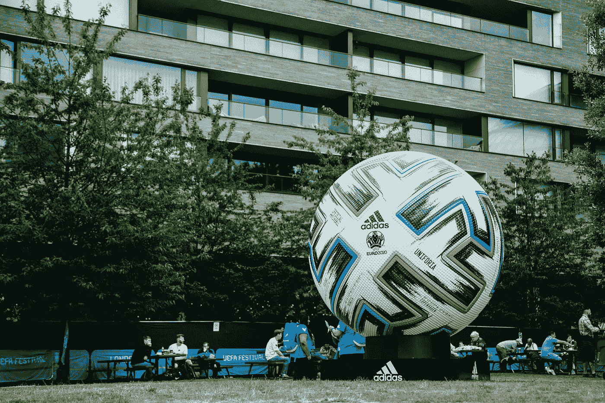
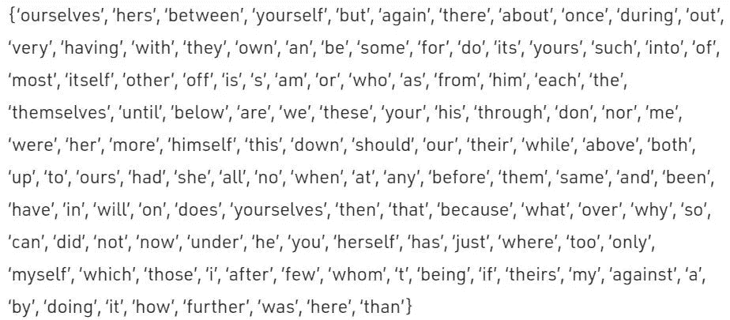
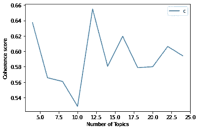

# Redditors 关于 2020 年欧洲杯的帖子和评论

> 原文：<https://towardsdatascience.com/posts-comments-on-euro-2020-by-the-redditors-228af74cef9c?source=collection_archive---------29----------------------->

## 自然语言处理:利用潜在狄利克雷分配(LDA)提取主题



[罗伯特·安德森](https://unsplash.com/@robanderson72?utm_source=unsplash&utm_medium=referral&utm_content=creditCopyText)在 [Unsplash](https://unsplash.com/s/photos/euro-2020-football?utm_source=unsplash&utm_medium=referral&utm_content=creditCopyText) 上拍照

在伦敦温布利体育场举行的 2020 年欧洲杯决赛已经过去了将近两个月。*足球热*正在慢慢消退，但最近的 2022 年 FIFA 世界杯资格赛引起了我的注意和兴趣，想看看人们对 2020 年欧洲杯有什么看法。因此，我利用了一个 [Kaggle 数据集](https://www.kaggle.com/gpreda/euro-2020-on-reddit)，其中包含 Redditors 讨论 2020 年欧洲杯的帖子。

这个小练习的参考资料可以在 [my GitHub](https://github.com/jimmeng-kok-2017/lda_euro2020_reddit_topics/) 上找到，其中包括数据集和 Python 笔记本文件。

# 什么是艾达？

LDA 是一种**主题建模**技术，它假设文档是由混合主题产生的，这些主题基于它们的概率分布生成单词。它还构建了每个文档一个主题的模型和每个主题一个单词的模型。

# 数据预处理

按顺序，数据预处理涉及以下内容:

*   处理空数据: ***标题*** 和 ***正文*** 列是唯一填充有文本的列。但是， ***正文*** 栏中有很多空数据。因此，这些空数据被占位符“NaN”填充，这些占位符稍后将被删除。这样，通过连接 ***标题*** 和 ***正文*** 列，形成了一个新列 ***正文*** 。
*   小写转换:将 ***文本*** 列中的所有文本转换为小写是必要的，因为这有利于矢量化。
*   标点符号删除:使用正则表达式(Regex)删除标点符号。
*   数字移除:使用正则表达式移除数字。
*   停用词移除:通过使用 NLTK 库以及将常见的无关词(如“comment”和“nan”)添加到定制的停用词列表中，停用词被移除。
*   词汇化:将有助于保持文本信息含义的单词标准化，以便进行矢量化。
*   符号化:将文本分割成句子，再将句子分割成单词。



NLTK 的停用词，图片由 GeeksforGeeks 提供

在继续使用 LDA 进行主题建模之前，**矢量化，**旨在建立词典和语料库(单词袋)，应用于标记化和词条。

```
dictionary = gensim.corpora.Dictionary(words_in_docs)
bow = [dictionary.doc2bow(doc) for doc in words_in_docs]
```

在单词包(`bow`)中，Gensim 库为每个单词及其在文档中的词频创建了唯一的标识符。

# 让 LDA 开始吧！

为了启动 LDA 过程，需要指定数据集中主题的数量。因此，我将最小主题数设置为 4，最大主题数设置为 24。

```
# Topics: 4 Score: 0.637187704946018
# Topics: 6 Score: 0.5656505764313163
# Topics: 8 Score: 0.5608577918583089
# Topics: 10 Score: 0.5285639454916335
# Topics: 12 Score: 0.6549002572803391
# Topics: 14 Score: 0.5805171708843707
# Topics: 16 Score: 0.619577703739399
# Topics: 18 Score: 0.5787737269759226
# Topics: 20 Score: 0.5799681660889682
# Topics: 22 Score: 0.6062730130523755
# Topics: 24 Score: 0.5941403131806395
```



一致性得分图表，图片由作者提供

基于上述结果和一致性分数的可视化，指定的主题的最佳数量是 12 个主题。

虽然我们从 LDA 要处理的 12 个独特主题开始，但我们将通过次数设置为 9 (75%训练数据集)。

```
lda_model =  gensim.models.LdaMulticore(bow, 
                                   num_topics = 12, 
                                   id2word = dictionary,                                    
                                   passes = 9,
                                   workers = 3)
```

# 结果的解释

一个好的模型包含**低困惑**和**高主题连贯性**。下面的结果表明，建立的模型符合标准。

```
Perplexity:  -7.724412623387592Coherence Score:  0.6073296144040131
```

该模型的输出显示了 12 个独特的主题，每个主题都按单词分类。由于 LDA 不提供每个主题的主题，因此，通过给每个主题一个主题来推断主题是主观的。以下是输出以及我对每个主题所属主题的推断。

```
Topic 0: Italy vs Spain
Words: "italy", "team", "group", "think", "spain", "game", "match", "final", "played", "goal"

Topic 1: Italy would score goals against England in the final
Words: "team", "euro", "goal", "football", "player", "game", "im", "italy", "would", "england"

Topic 2: England's controversial penalty against Denmark
Words: "england", "right", "penalty", "sure", "see", "well", "im", "football", "game", "player"

Topic 3: Don't underestimate England's performance
Words: "fan", "people", "english", "player", "dont", "country", "team", "one", "know", "football"

Topic 4: England would win against Italy in the final
Words: "england", "game", "like", "win", "team", "italy", "dont", "home", "final", "english"

Topic 5: World questioning England fans' behaviour
Words: "please", "fan", "england", "use", "cup", "question", "world", "contact", "im", "action"

Topic 6: Spain's and England's performances during the semi-finals
Words: "substitution", "match", "shot", "card", "yellow", "scored", "goal", "spain", "england", "thread"

Topic 7: Belgium's performance against its opponents during the tournament
Words: "denmark", "belgium", "v", "finland", "goal", "game", "hazard", "player", "portugal", "bruyne"

Topic 8: Italians don't like the idea of "Football's Coming Home"
Words: "fan", "england", "team", "home", "coming", "english", "dont", "like", "italian", "match"

Topic 9: No red cards for England's fouls throughout the tournament
Words: "england", "red", "card", "didnt", "foul", "would", "even", "im", "ref", "power"

Topic 10: Group A's final matches before Round of 16 started
Words: "switzerland", "italy", "substitution", "match", "card", "shot", "yellow", "turkey", "wale", "goal"

Topic 11: Getting the UEFA Euro 2020 Final tickets
Words: "ticket", "game", "england", "euro", "get", "final", "would", "uefa", "time", "player"
```

# 结论

基于上述分析，我们可以得出以下结论，Reddit 用户对 2020 年欧洲杯感兴趣的是:

*   意大利和英格兰之间的决赛
*   英格兰队及其表现
*   围绕英格兰队及其球迷的有争议的新闻
*   涉及英格兰、意大利、西班牙和比利时的比赛
*   比利时球员——凯文·德·布鲁恩和埃登·阿扎尔(或者甚至是后者的兄弟索尔根·阿扎尔！)

# 参考

班萨尔，S. (2016 年)。*Python 主题建模初学者指南。*分析 Vidhya。8 月 24 日。检索自[https://www . analyticsvidhya . com/blog/2016/08/初学者指南-主题建模-python/](https://www.analyticsvidhya.com/blog/2016/08/beginners-guide-to-topic-modeling-in-python/)

布莱医学博士，Ng，A. Y .，&乔丹医学博士，I. (2016)。*潜在狄利克雷分配。*机器学习研究杂志 3(2003)993–1022。从 http://www.jmlr.org/papers/volume3/blei03a/blei03a.pdf[取回](http://www.jmlr.org/papers/volume3/blei03a/blei03a.pdf)

极客之福。(2020).*在 Python 中用 NLTK 删除停用词。*11 月 24 日。检索自[https://www . geeks forgeeks . org/removing-stop-words-nltk-python/](https://www.geeksforgeeks.org/removing-stop-words-nltk-python/)