# Power BI 和 Synapse，第 2 部分:Synapse 带来了什么？

> 原文：<https://towardsdatascience.com/power-bi-and-synapse-part-1-the-art-of-the-im-possible-b561bb8f82ce?source=collection_archive---------5----------------------->

## 在本系列的第 2 部分中，了解 Synapse 为 Power BI 开发人员带来了什么，以及如何利用这两种工具获得无限多的用例！


[通过比较未溅上的纤维进行成像](https://unsplash.com/photos/9HGPvHThNME)

*通过在 2019 年底推出 Azure Synapse Analytics，在数据处理方面开创了一个全新的视角。一些核心概念，如传统的数据仓库，受到了更多的审查，而在数据爱好者意识到 Synapse 带来的新功能后，各种新方法开始涌现。*

【Synapse 不仅对数据接收、转换和存储选项产生了巨大影响，它还为数据服务和可视化提供了全新的可能性！

因此，在这一系列博文中，我将尝试探索 Power BI 如何与新平台协同工作。作为 Power BI 开发人员，我们在使用 Synapse 时有哪些选择？在哪些数据分析场景中，Synapse 将发挥优势，帮助您实现(im)可能性？什么时候您想利用 Synapse 中的创新解决方案，什么时候您会更好地坚持使用更传统的方法？使用 Power BI — Synapse combo 的最佳实践是什么，在最终决定采用哪种方法之前，您应该评估哪些参数。

*完成后，我相信您应该会更好地理解 Power BI 和 Synapse 之间集成时每个可用选项的“优缺点”。*

*   [*Power BI&Synapse Part 1—(im)可能的艺术！*](/power-bi-synapse-part-1-the-art-of-im-possible-b2bdb4d7c866)

在我们在本系列的[上一篇](/power-bi-synapse-part-1-the-art-of-im-possible-b2bdb4d7c866)打下了扎实的理论基础，对 Azure Synapse Analytics 有了更多的了解之后，我相信是 Power BI 跳上舞台的时候了。

# 面向 Power BI 开发人员的 Synapse

正如在上一篇文章中已经强调的，微软使 Synapse Analytics 成为所有数据相关任务的一站式商店。也就是说，人们会期望 Synapse 和 Power BI 之间的紧密集成，因为 Power BI 被(正确地)视为表达数据和为用户提供各种业务见解的终极工具。

Synapse 与 Power BI 协同工作，反之亦然，不负众望！

在我们深入研究这两者之间的不同集成层之前，让我简要地向您介绍一下作为 Power BI 开发人员，您可能想要考虑使用 Synapse 的场景:

*   ***DirectQuery*** —我已经详细写过[direct query](/direct-query-in-power-bi-what-when-why-8180825812d2)，解释了它是什么，以及在哪些场景下应该考虑使用 DQ。您可能还记得那篇文章，当涉及到报告性能时，DirectQuery 绝不是最佳选择，因为每个可视化将生成至少一个对数据源的查询。但是，在特定情况下，除了使用 DirectQuery，您将没有其他选择，Synapse 可以在这些情况下成为您的朋友！稍后，我们将通过一个真实的例子来验证这在现实中是如何工作的…


斯科特·韦伯在 Unsplash 上拍摄的照片

*   ***安全性*** —如果您想到通过 Azure Active Directory (AAD)进行 Power BI 身份验证，这也是 Synapse 的推荐标准，您可以很容易地想象在 Synapse 内的数据层级别处理 Power BI 解决方案的安全性的场景。这对于依赖 DirectQuery 选项的 Power BI 解决方案尤其重要，因为在使用导入模式时，您可能仍然希望实现行级安全性
*   ***数据整形*** — Power BI 有自己的一套用于执行数据整形的工具——最引人注目的——Power 查询、数据流和 DAX 计算列和表。然而，这些都无法与 Synapse 中企业级的数据转换和准备功能相提并论。首先，Synapse 附带了 Azure Data Factory，这可能是数据编排任务最强大的工具。这意味着您可以在源端执行整体数据整形，因此您的 Power BI 报告可以从使用现成的解决方案中受益
*   *真理的单一来源——如果你正在处理数据，你可能会多次听到这句话。从本质上说，这是我们所有人的最终目标。因为从 Synapse 的一个角度来看，它代表了 Azure SQL 数据仓库的合法继承者，所以您可以利用这一点，将来自 Synapse 的数据用于您的 Power BI 报告，确信数据来自集中且经过批准的位置*

# *简而言之，电源 BI 存储模式*

*在我们进一步研究 Power BI 如何受益于 Synapse Analytics 的协同作用之前，我们需要了解 Power BI 本身不同类型的存储模式。*

*我已经在本文中写了关于表格模型中的[存储引擎，并详细解释了如何通过应用一些能够使 VertiPaq 实现最佳数据压缩的最佳实践来](/how-to-reduce-your-power-bi-model-size-by-90-76d7c4377f2d)[优化您的数据模型大小](/how-to-reduce-your-power-bi-model-size-by-90-76d7c4377f2d)。*

*但是，这里对存储模式的简要概述将有助于更好地理解使用 Synapse 时的各种功能:*

*   ****导入模式*** —基于 VertiPaq。表数据作为快照存储在内存中。数据可以定期刷新*
*   ****直接查询模式*** —在查询时从数据源中检索数据。在查询执行之前、期间和之后，数据都驻留在其原始源中*
*   ****双模*** —前两个选项的组合。表中的数据被加载到内存中，但是在查询时也可以直接从源中检索*

**

*[杰里米·贝赞格在 Unsplash 上拍摄的照片](https://unsplash.com/photos/AuztPcaE6CY)*

# *Synapse 在这里适合做什么？*

*好吧，现在你可能会问自己，当谈到 Power BI 开发时，Synapse 带来了什么？*

*在本文中，我们将研究处理来自 Synapse 分析引擎的数据时的各种场景。您可能还记得上一篇文章，Synapse 中有三个不同的分析引擎:无服务器 SQL 池、专用 SQL 池和 Apache Spark 池。*

*每一种都有自己的优点和实际使用案例。但是，它们都有一个共同点，那就是它们很容易与 Power BI 集成！*

*正如我提到的，处理 Apache Spark 分析引擎将不在本博客系列中讨论。然而，如果你有兴趣了解 Spark Analytic Engine 如何与 Power BI 协同工作，你可以查看[本教程](https://docs.microsoft.com/en-us/azure/hdinsight/spark/apache-spark-use-bi-tools)以了解更多细节。*

*因为本系列的下一篇文章将详细介绍 Power BI 和专用 SQL 池之间的集成，所以让我们在这里将重点放在使用无服务器 SQL 池作为 Power BI 报告的数据源上。*

# *别说了，演示时间到了！*

*现在，是时候尝试使用 Synapse 的分析引擎来存储 Power BI 消耗的数据，并评估不同的场景了。*

*但是，首先。在我们继续之前，您应该理解 Synapse 中链接服务的概念。基本上，使用链接服务，您可以利用 Synapse 之外存在的一整套不同的功能和服务，如 Azure Data Lake、CosmosDB、Amazon Redshift、MongoDB 等……其中之一是 Azure HDInsight，如果您计划使用 Apache Spark 分析引擎的话。并且，通过链接它们，它们成为你的 Synapse 生态系统的一部分！*

*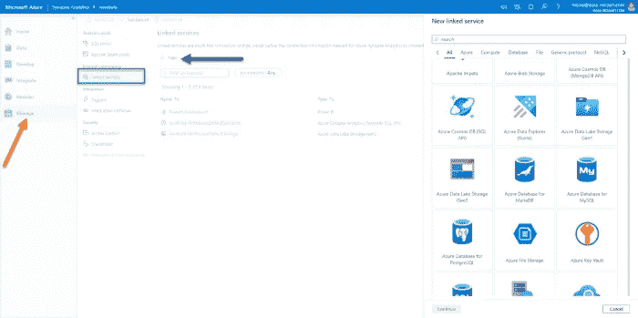*

*作者图片*

*现在，在“管理”选项和“链接的服务”下，我已经链接了我的 Power BI 工作区，这意味着我可以直接从 Synapse Analytics Studio 立即开始开发我的 Power BI 报告！*

*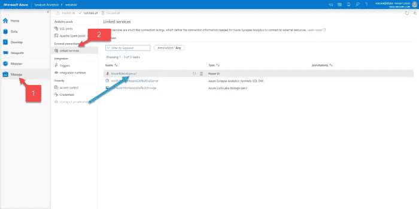*

*作者图片*

*当我单击 Power BI 下的开发时，我会看到我的工作区和可用的 Power BI 数据集和报告。目前还没有，所以我将单击新的 Power BI 数据集:*

*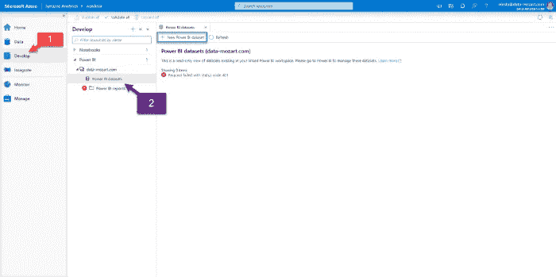*

*作者图片*

*在上一篇文章中，我展示了如何编写普通的 T-SQL 来查询来自 parquet 文件(以及 CSV 和 JSON 文件)的数据！并且，使用 OPENROWSET 函数，我创建了一个包含纽约市出租车乘坐数据的视图。这个数据集大约有 15 亿行，所以让我们看看如何在 Power BI 中可视化这个庞大数据集的数据。*

****一个额外的提示*** :如果某些 AAD 用户没有权限在数据库中创建对象，因此他们不能像我一样创建视图，他们仍然可以通过直接在 Power BI 中编写 T-SQL 查询，使用无服务器 SQL 池作为 Power BI 报告的数据源！*

*只需选择 Azure SQL 数据库作为你的数据源，放入你的 Synapse 工作区的 URL(这个可以在 Serverless SQL Endpoint 下找到)，输入数据库名称(如果没有数据库，输入:master)，直接在查询窗口写 T-SQL 就可以把你的数据导入 Power BI！*

*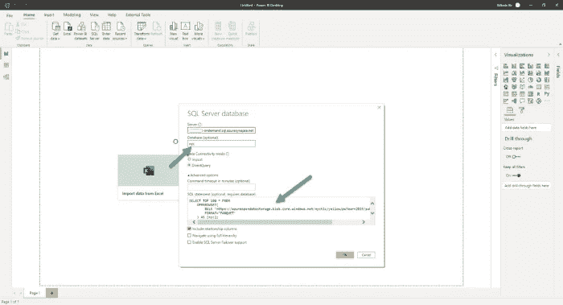*

*作者图片*

*这是一个很棒的特性，并且打开了无数用例的大门！*

*在本文中，我们不会深入讨论性能、优化、成本等细节。本演示的目的只是为了强调 Synapse Analytics 和 Power BI 之间集成的灵活性。*

*由于您在创建 Synapse Analytics 工作区时将获得默认提供的无服务器 SQL 池，因此我将选择我的无服务器 SQL 池作为数据源，然后下载自动创建的。pbids 文件。一旦提供了专用 SQL 池或 Apache Spark 池，您也可以使用它们作为数据源(我将在下一篇文章中向您展示如何使用专用 SQL 池作为数据源)，但是为了简单起见，在本例中我将使用无服务器 SQL 池。*

*一旦我在 Power BI Desktop 中打开这个文件，我的数据就可以开始运行了！*

*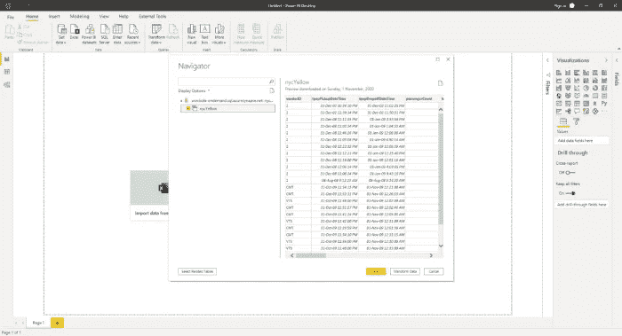*

*作者图片*

*现在，我们将使用 DirectQuery 来演示如何利用 Synapse 和 Power BI 的集成来处理海量数据。我只在我的报告画布上放置了一个视觉效果:显示以下度量的计算的卡片视觉效果:*

*记录总数= COUNTROWS(nycYellow)*

**

*作者图片*

*正如您所看到的，我们正在使用我们最喜欢的报告工具——Power BI——查询一个巨大的数据集！而且，我们的用户连后台是什么都不知道。他们无法想象他们正在切割来自拼花文件的数据！而且，我们使用常规的 T-SQL 实现了它，不需要“物理地”传输和存储数据！本质上，我们在 Synapse 无服务器 SQL 池的帮助下创建了一个“虚拟”数据仓库。最后，由于这些数据是“普通”SQL 视图的形式，我们能够在 Power BI 中与它进行交互，就像与本地 SQL Server 或 Synapse 专用 SQL 池中的任何其他视图进行交互一样！*

*此外，不要忘记，我们在一个环境中执行了所有必需的步骤——Azure Synapse Studio！我们甚至直接从 Synapse 连接到 Power BI Desktop 这就是我一直强调的 Synapse 和 Power BI 之间的集成，这使得这两个乍一看完全不同的工具紧密结合在一起！*

*在 Power BI Desktop 中完成工作后，我可以将报告发布到 Power BI 工作区:*

*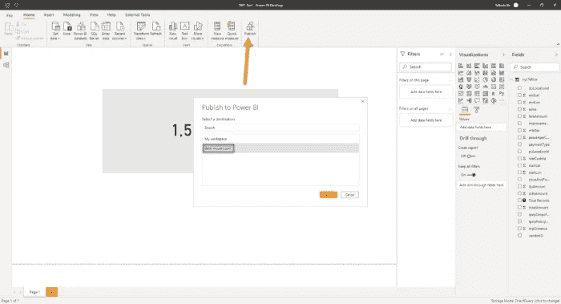*

*作者图片*

*而且，由于我已经将我的 Power BI 工作区链接到 Synapse Analytics Studio，我可以从那里直接访问我的报告！不仅如此，我还可以与报告进行交互，如果我想进行一些更改，我甚至可以直接从 Synapse Analytics Studio 中保存它！多酷啊！*

*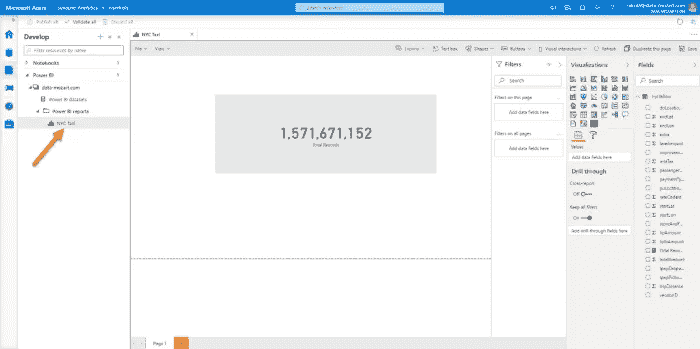*

*作者图片*

*这是本博客系列的关键要点——当 Synapse 和 Power BI 一起使用时，可以释放校准数据工作负载的无限可能性！*

# *专用 SQL 池—保持传统！*

****小测验问题:*** 你知道 Azure Synapse Analytics 的继任者是谁吗？是的，我知道，如果你看过[系列的第一部](/power-bi-synapse-part-1-the-art-of-im-possible-b2bdb4d7c866)，答案就在那里。但是，如果你跳过了介绍部分(是的，你真可耻，回到那里从头开始读)，一个快速的答案将是:Azure SQL 数据仓库。*

*正式来说，Synapse Analytics 是在 2019 年底作为 SQL DW 的合法继任者推出的。然而，在你容易得出 Synapse 只是“SQL DW 更名”的错误结论之前，你应该记住，Synapse 不仅仅是另一个“传统的数据仓库”。通过包含无服务器 SQL 池和 Apache Spark 专用池，Synapse 实质上成为了一种适用于各种不同数据工作负载的无限分析服务！*

*在前一部分中，我们只触及了表面，解释了如何快速利用 Synapse 中的无服务器 SQL 池与 Power BI 协同工作，以快速了解驻留在传统数据仓库之外的数据。此外，您可能还记得，您不需要提供任何资源——使用普通的 T-SQL，您可以直接从 Azure Data Lake Gen2 中查询数据！*

*您还可以利用 Synapse 中的 Apache Spark 分析引擎，但这超出了本系列文章的范围。*

*在 Synapse 中集成了这两个(无服务器 SQL 池和 Apache Spark 池)之后，人们可以假设旧的、传统的数据仓库已经死亡……而且，这将是一个快速而错误的结论。在许多场景和用例中，一个好的旧数据仓库将是最佳解决方案。*

**

*[图片由 iStrfry Marcus 在 Unsplash 上拍摄](https://unsplash.com/photos/8ZQNDtD4oXw)*

*在本文中，我们将研究具有关系数据的各种工作负载，这些数据存储在配置的分析引擎(专用 SQL 池)上，因此您可以认为，或多或少，我们正在后台处理一个很好的旧 SQL 服务器。*

*说实话，专用 SQL 池是基于不同的架构，获得了使用 MPP 架构的好处。*

*我不会深入介绍 [MPP 及其工作原理](https://docs.microsoft.com/en-us/azure/synapse-analytics/sql-data-warehouse/massively-parallel-processing-mpp-architecture) —我只想强调，这种架构能够实现巨大的灵活性，因为您可以根据当前工作负载的数量和性质快速横向扩展您的资源。*

*当然，与本地 SQL Server 相比，Synapse 带来了一些额外的潜在性能提升，例如[结果集缓存](https://docs.microsoft.com/en-us/azure/synapse-analytics/sql-data-warehouse/performance-tuning-result-set-caching)和[物化视图](https://docs.microsoft.com/en-us/azure/synapse-analytics/sql-data-warehouse/performance-tuning-materialized-views)。同样，我不会深入讨论这两个特性的细节——如果你对详细了解物化视图感兴趣，我强烈建议你阅读 Niko Neugebauer 的博客[上的一系列文章。但是，您应该知道物化视图，因为我们将在这里的演示中使用它们…](http://www.nikoport.com/2020/01/01/azure-sql-dw-materialized-views-part-1/)*

*不要再说了，现在是演示时间！*

*现在是时候动手使用 Synapse 的专用 SQL 池来存储 Power BI 所消耗的数据，并评估不同的场景了。*

*但是，首先。与创建 Synapse 工作区时默认创建的无服务器 SQL 池相反，需要手动创建一个专用的 SQL 池。因此，我开始创建我的专用 SQL 池，并为其分配默认大小(DW100c ):*

*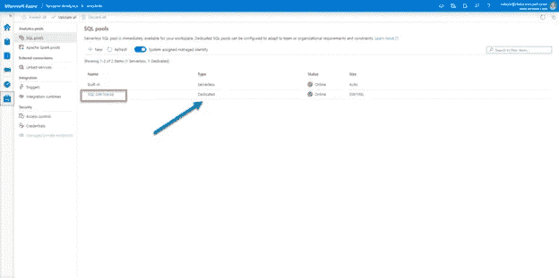*

*作者图片*

*像往常一样，在处理 Power BI 时，我使用一个示例 Contoso 数据库进行演示。我已经在我的专用 SQL 池中提供了这个数据库，并为 factOnlineSales 表和两个维度表导入了数据:dimDate 和 dimProduct。*

*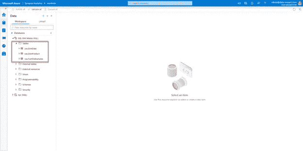*

*作者图片*

*现在，在“管理”选项和“链接的服务”下，我已经链接了我的 Power BI 工作区，这意味着我可以直接从 Synapse Analytics Studio 立即开始开发我的 Power BI 报告！*

*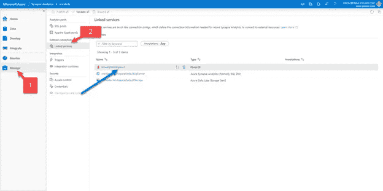*

*作者图片*

*当我单击 Power BI 下的开发时，我会看到我的工作区和可用的 Power BI 数据集和报告。目前还没有，所以我将单击新的 Power BI 数据集:*

*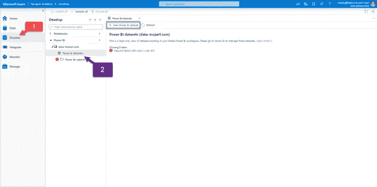*

*作者图片*

*我将选择我的专用 SQL 池作为数据源，然后下载自动创建的。pbids 文件。一旦我在 Power BI Desktop 中打开这个文件，我的数据就可以开始运行了！*

*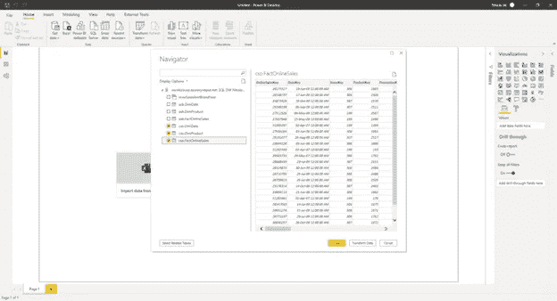*

*作者图片*

*现在，实际上，我的事实表有大约 1200 万行，这在容量上没什么特别的——我的意思是，Power BI 应该能够毫无问题地处理这个问题。但是，让我们假设我们的事实表有 12 亿行，因此在现有粒度级别上导入整个表是不可行的。我们将使用 DirectQuery 来演示如何利用 Synapse 和 Power BI 的集成来处理专用 SQL 池中的海量数据。*

*因此，我创建了一个用于计算销售额总和的[显式度量](/understanding-explicit-vs-implicit-measures-in-power-bi-e35b578808ca)，并在报告画布上放置了三个简单的视觉效果:一个显示每年的总销售额，另一个显示每个品牌的总销售额，最后一个显示按品牌和年份细分的销售额:*

*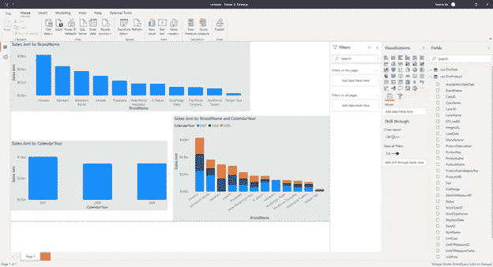*

*作者图片*

*现在，我将连接到一个 [DAX 工作室](https://daxstudio.org/)，这样我可以更深入地了解后台正在发生的事情。如果我从顶部功能区打开服务器计时，我可以粘贴我的 DAX 代码并检查在后台生成的 SQL 查询，以及检索结果所用的总时间:*

*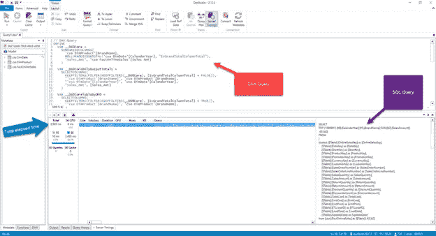*

*作者图片*

*因此，这与 SQL Server 的工作方式非常相似。现在不要离开，我保证我们会添加更多的成分来改善指标。那么，为了加快数据检索，我们能做些什么呢？*

*第一点也是最重要的一点是: ***您需要了解您的分析工作量！*** 这意味着，如果您知道有很多针对这三个表的查询，并且请求相同的数字(每个品牌/年的销售额)，您可以做两件事:*

*   *创建一个 ***聚合表，并将其设置为导入模式*** ，享受使用复合模型的好处。这是最理想的场景，只要聚合表能够适合 Power BI 中的数据模型大小，就应该使用它。使用这一概念，您的聚合表将存储在 Power BI 高速缓存中，经过优化压缩，而包含所有详细信息的巨大表将继续驻留在 Synapse 专用 SQL 池中*
*   *在 Synapse 专用 SQL 池 中创建一个 ***物化视图。本质上，您也可以聚合数据，但是您不会在 Power BI 中导入它，因为您将使用 DirectQuery 模式来定位这个视图。实体化视图只不过是一个虚拟表，但与“标准”视图(每次使用时都会计算数据)不同，实体化视图会像普通表一样在专用的 SQL 池中预先计算、存储和维护其数据！因此，您可以为最频繁的工作负载获得更快的性能，但作为一种代价，您要为额外的存储付出代价****

*现在，我已经在我的 Synapse 专用 SQL 池中创建了一个物化视图，使用了以下 T-SQL 代码:*

```
*CREATE MATERIALIZED VIEW mvwSalesAmtBrandYear WITH (DISTRIBUTION=HASH(BrandName)) AS
SELECT  SUM(f.[SalesAmount]) AS [SalesAmount]
       ,p.[BrandName]
       ,YEAR(d.[DateKey]) AS [Year]
FROM    [cso].[FactOnlineSales] AS f
INNER JOIN    [cso].[DimProduct] AS p ON f.[ProductKey] = p.[ProductKey]
INNER JOIN    [cso].[DimDate]    AS d on f.[DateKey] = d.[DateKey]
GROUP BY p.[BrandName]
        ,YEAR(d.[DateKey])*
```

*让我们转到 Power BI Desktop，将这个视图添加到我们的数据模型中，并将我们的视觉效果切换到所需数据的物化视图。现在，如果我在 DAX Studio 中检查服务器计时，我可以注意到显著的改进:*

*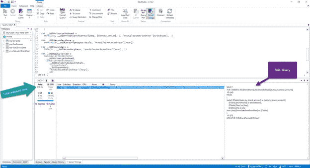*

*作者图片*

*正如你所注意到的，我们得到了完全相同的数字，完全相同的视觉效果，快了 10 倍！仅仅因为我们在 Synapse 专用的 SQL 池中有预聚合的数据。*

*最后要检查的是，如果我们在 Power BI 中导入物化视图会发生什么:*

*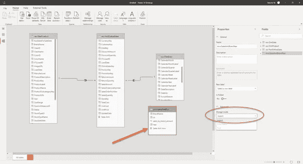*

*作者图片*

*如果我刷新图像，我会得到以下结果:*

*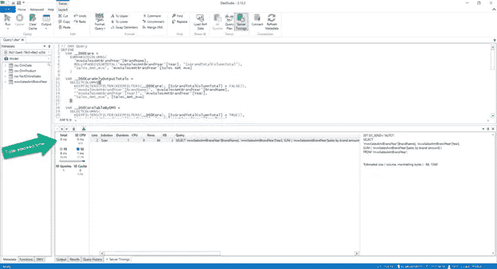*

*作者图片*

*与第一次运行的 3.505 毫秒相比，我的视觉效果现在只需要 9 毫秒就可以呈现出来了！我将让您自己来计算…在最后一次运行中，右边的窗口中没有“常规的”SQL 查询，因为现在数据是直接从 Power BI 的表格模型中存储和检索的。*

*正如我已经提到的，您也可以在 Power BI 桌面模型视图中处理聚合，但是这是一个完全不同的主题，超出了本系列的范围。*

*在本演示中，我想向您展示如何无缝集成 Synapse Analytics 专用 SQL 池和 Power BI。*

*在 Power BI Desktop 中完成工作后，我可以将报告发布到 Power BI 工作区:*

*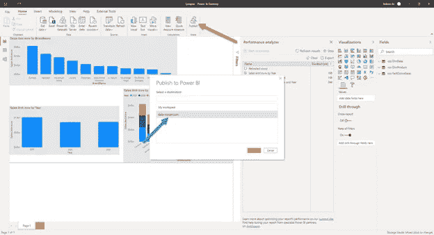*

*作者图片*

*您可能还记得我们之前的演示，因为我已经将 Power BI 工作区链接到 Synapse Analytics Studio，所以我可以从那里直接访问我的报告！不仅如此，我还可以与报告进行交互，如果我想进行一些更改，我甚至可以直接从 Synapse Analytics Studio 中保存它！多牛逼啊！*

*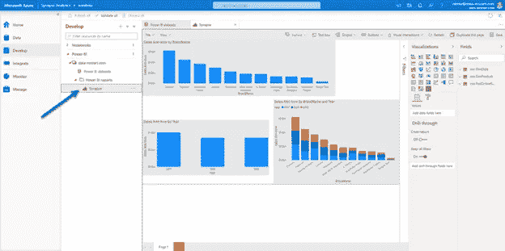*

*作者图片*

*让我再次强调本博客系列的关键要点——当 Synapse 和 Power BI 一起使用时，可以释放校准数据工作负载的无限可能性！*

****结论****

*在本文中，我们研究了 Synapse Analytics 和 Power BI 之间的不同集成方式，在这些场景中，您正在处理以传统数据仓库的典型方式存储的关系数据。*

*我们证明了您不需要放弃传统，即使您计划将工作负载转移到 Synapse。相反，您可以利用它，并基于已建立并经过数十年验证的传统数据仓库概念构建一个现代数据解决方案。如果您有兴趣了解更多关于使用专用 SQL 池作为 Power BI 报告数据源的最佳实践，您可以参考[这篇文章](https://docs.microsoft.com/en-us/azure/synapse-analytics/sql-data-warehouse/sql-data-warehouse-best-practices)。*

*在下一篇文章中，我们将深入关注 Power BI 和 Synapse 之间的不同集成层，在处理半结构化(存储在文件中的数据)方面，使用 Synapse Analytics 中的无服务器 SQL 池。*

*感谢阅读！*

*成为会员，阅读媒体上的每一个故事！*