# Power BI 和 Synapse，第 3 部分—无服务器 SQL:我要花多少钱？

> 原文：<https://towardsdatascience.com/power-bi-and-synapse-part-3-serverless-sql-how-much-will-it-cost-me-46db281ee9f5?source=collection_archive---------13----------------------->

## 如果您将 Power BI 与 Synapse Analytics 结合使用，您会支付多少费用？在本系列的最后一部分，我对 Power BI & Synapse Analytics 无服务器 SQL 池进行了终极基准测试，结果如下！


[图片由 Kolleen Gladden 在 Unsplash 上拍摄](https://unsplash.com/photos/ij5_qCBpIVY)

*通过在 2019 年底推出 Azure Synapse Analytics，在数据处理方面开创了一个全新的视角。一些核心概念，如传统的数据仓库，受到了更多的审查，而在数据爱好者意识到 Synapse 带来的新功能后，各种新方法开始涌现。*

【Synapse 不仅对数据接收、转换和存储选项产生了巨大影响，它还为数据服务和可视化提供了全新的可能性！

因此，在这一系列博文中，我将尝试探索 Power BI 如何与新平台协同工作。作为 Power BI 开发人员，我们在使用 Synapse 时有哪些选择？在哪些数据分析场景中，Synapse 将发挥优势，帮助您实现(im)可能性？什么时候您想利用 Synapse 中的创新解决方案，什么时候您会更好地坚持使用更传统的方法？使用 Power BI — Synapse combo 的最佳实践是什么，在最终决定采用哪种方法之前，您应该评估哪些参数。

*完成后，我相信您应该会更好地理解 Power BI 和 Synapse 之间集成时每个可用选项的“优缺点”。*

*   [*Power BI&Synapse Part 1—(im)可能的艺术！*](/power-bi-synapse-part-1-the-art-of-im-possible-b2bdb4d7c866)
*   [*Power BI&Synapse Part 2——Synapse 带来了什么？*](/power-bi-and-synapse-part-1-the-art-of-the-im-possible-b561bb8f82ce)

不要误解我的意思——这个理论很好，你绝对应该花时间尝试吸收新技术、工具或特性的基本架构概念。因为，如果你不明白某样东西是如何在引擎盖下工作的，那么很有可能你不会最大限度地利用它。

但是，将这些理论知识应用于实践测试才是最有趣的部分！至少对我来说是这样:)…这让我想起了汽车生产过程:他们制造一切，你读了说明书，印象深刻！特征，设备…然而，这些都无关紧要，直到他们把车进行碰撞测试，并得到适当的现实检查。

因此，这篇文章就像是对 Synapse Analytics 中无服务器 SQL 池的碰撞测试——许多不同的场景、测试、演示、测量等。

# 无服务器 SQL 池—下一件大事

我已经写了[关于无服务器 SQL 池](/power-bi-synapse-part-1-the-art-of-im-possible-b2bdb4d7c866)，我坚信它是处理大量半结构化或非结构化数据的下一件大事。

无服务器 SQL 池的最大优势在于，您可以直接从存储在 Azure 数据湖中的 CSV、parquet 或 JSON 文件中查询数据，而无需传输数据！甚至，您可以编写普通的 T-SQL 来直接从文件中检索数据！但是，让我们看看这在各种实际使用案例中是如何工作的，最重要的是， ***每个解决方案将花费您多少钱！***

在使用 Synapse Serverless SQL pool 时，仍有一些东西微软不会向您收取数据处理费用，例如:

*   服务器级元数据(登录名、角色和服务器级凭据)
*   您在端点中创建的数据库。这些数据库只包含元数据(用户、角色、模式、视图、内联表值函数、存储过程、外部数据源、外部文件格式和外部表)
*   DDL 语句，但 CREATE STATISTICS 语句除外，因为它根据指定的样本百分比处理存储中的数据
*   仅元数据查询

# 方案

场景是这样的:我有两个与[纽约出租车数据集](https://www1.nyc.gov/site/tlc/about/tlc-trip-record-data.page)相关的 ***CSV*** 文件，我已经在前面的一个演示中使用过[。一个包含 2019 年 1 月以来所有黄色出租车乘坐的数据(650 MB)，另一个包含 2019 年 2 月以来的数据(620 MB)。](/power-bi-synapse-part-1-the-art-of-im-possible-b2bdb4d7c866)

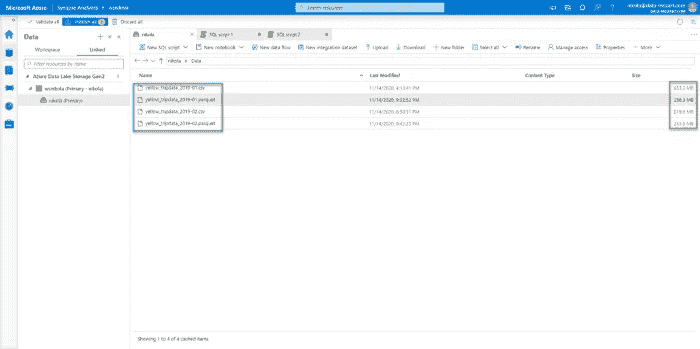

作者图片

我为每个月的数据创建了两个单独的视图。这个想法是为了检查当我们在多种不同条件下查询 Power BI 的数据时会发生什么。

下面是在一个月内创建视图的 T-SQL:

```
DROP VIEW IF EXISTS taxi201902csv;
GOCREATE VIEW taxi201902csv AS
SELECT 
    VendorID
    ,cast(tpep_pickup_datetime as DATE) tpep_pickup_datetime
    ,cast(tpep_dropoff_datetime as DATE) tpep_dropoff_datetime
    ,passenger_count
    ,trip_distance 
    ,RateCodeID 
    ,store_and_fwd_flag 
    ,PULocationID
    ,DOLocationID
    ,payment_type 
    ,fare_amount
    ,extra
    ,mta_tax 
    ,tip_amount 
    ,tolls_amount 
    ,improvement_surcharge
    ,total_amount 
    ,congestion_surcharge
FROM
    OPENROWSET(
        BULK N'https://nikola.dfs.core.windows.net/nikola/Data/yellow_tripdata_2019-02.csv',
        FORMAT = 'CSV',
        PARSER_VERSION='2.0',
        HEADER_ROW = TRUE
    ) 
    WITH(
        VendorID INT,
        tpep_pickup_datetime DATETIME2,
        tpep_dropoff_datetime DATETIME2,
        passenger_count INT,
        trip_distance DECIMAL(10,2),
        RateCodeID INT,
        store_and_fwd_flag VARCHAR(10),
        PULocationID INT,
        DOLocationID INT,
        payment_type INT,
        fare_amount DECIMAL(10,2),
        extra DECIMAL(10,2),
        mta_tax DECIMAL(10,2),
        tip_amount DECIMAL(10,2),
        tolls_amount DECIMAL(10,2),
        improvement_surcharge DECIMAL(10,2),
        total_amount DECIMAL(10,2),
        congestion_surcharge DECIMAL(10,2)
    )
    AS [taxi201902csv]
```

我使用 WITH block 来显式定义数据类型，如果不这样做，所有的字符列将自动设置为 VARCHAR(8000 ),因此会占用更多的内存。

正如您所注意到的，我已经从 CSV 文件中重命名了我的通用列名，因此它们现在看起来更具可读性。我还将 DateTime 列强制转换为 Date 类型，因为我不需要这个演示的时间部分。这样，我们[减少了基数和整个数据模型的大小](/how-to-reduce-your-power-bi-model-size-by-90-76d7c4377f2d)。让我们检查一下每个文件包含多少条记录:

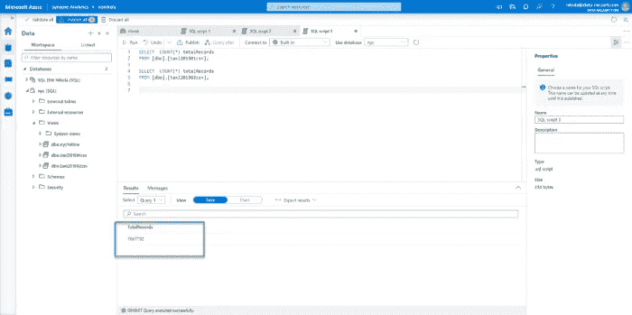

作者图片

一月包含大约 760 万条记录，而二月包含大约 700 万条记录。

此外，我还应用了相同的逻辑，对来自 ***拼花*** 文件的完全相同的数据部分构建了两个视图。因此，我们可以比较 CSV 和拼花文件之间的指标。

用于拼花文件的视图构建略有不同，使用 FILENAME()和 FILEPATH()函数来消除不必要的分区:

```
DROP VIEW IF EXISTS taxi201901parquet;
GOCREATE VIEW taxi201901parquet AS
SELECT
        VendorID
        ,CAST(TpepPickupDatetime AS DATE) TpepPickupDatetime
        ,CAST(TpepDropoffDatetime AS DATE) TpepDropoffDatetime
        ,PassengerCount
        ,TripDistance
        ,PuLocationId
        ,DoLocationId
        ,StartLon
        ,StartLat
        ,EndLon
        ,EndLat
        ,RateCodeId
        ,StoreAndFwdFlag
        ,PaymentType
        ,FareAmount
        ,Extra
        ,MtaTax
        ,ImprovementSurcharge
        ,TipAmount
        ,TollsAmount
        ,TotalAmount
FROM  
    OPENROWSET(
        BULK 'puYear=*/puMonth=*/*.snappy.parquet',
        DATA_SOURCE = 'YellowTaxi',
        FORMAT='PARQUET'
    ) nyc
WHERE
    nyc.filepath(1) = 2019
    AND nyc.filepath(2) IN (1)
    AND tpepPickupDateTime BETWEEN CAST('1/1/2019' AS datetime) AND CAST('1/31/2019' AS datetime)
```

正如在 Synapse 中使用无服务器 SQL 池的[最佳实践中所指定的，我们明确指示我们的查询只针对 2019 年和一月份！这将减少扫描和处理的数据量。对于我们的 CSV 文件，我们不必这样做，因为它们已经按月分区并保存了。](https://docs.microsoft.com/en-us/azure/synapse-analytics/sql/best-practices-sql-on-demand#use-filename-and-filepath-functions-to-target-specific-partitions)

*一个重要的免责声明*:由于无服务器 SQL 池的使用是按处理的数据量收费的(目前的价格是每 TB 处理的数据 5 美元起)，我不会用速度来衡量性能。我想只关注对处理的数据量和通过检查不同场景产生的成本的分析。

# CSV vs 拼花——我需要知道什么？

在我们继续测试之前，再讲一点理论…我计划比较 CSV 和 Parquet 文件之间的数据处理，我认为我们应该了解这两种类型之间的主要区别:

*   在拼花文件中，数据以更优化的方式压缩。您可能还记得上面的一个截图，与包含相同数据部分的 CSV 文件相比，parquet 文件大约消耗 1/3 的内存
*   Parquet 文件支持列存储格式——也就是说，Parquet 文件中的列是物理分离的，这意味着如果您只需要几列中的数据，就不需要扫描整个文件！相反，当你查询一个 CSV 文件时，每次你发送查询，它将扫描整个文件，即使你需要一列的数据
*   对于那些来自传统 SQL 世界的人，你可以想到 CSV 与 Parquet，例如[行存储与列数据库](/rows-or-columns-where-should-i-put-my-index-on-65d429692dee)

# 用例 1 —将 CSV 数据导入 Power BI

让我们从最明显和最理想的场景开始——使用导入模式将所有数据接收到 Power BI 中，并执行数据刷新以检查这将花费我们多少成本。

在我们动手之前，还有最后一件事——在 Synapse Analytics 中，仍然没有一个功能可以衡量特定查询的成本。您可以检查每天、每周或每月处理的数据量。此外，如果您愿意，您可以在每个时间粒度级别上设置限制——在本文的[中有更多相关内容。](https://docs.microsoft.com/en-us/azure/synapse-analytics/sql/data-processed)

这个特性也是相对较新的，所以我很高兴看到 Synapse 在提供完全成本透明的有希望的方式上取得了永久性的进展。

由于我们无法测量每个查询的确切成本，我将使用下面的 T-SQL，通过在主数据库中查询 DMV 来尝试计算这些数字:

```
SELECT * FROM sys.dm_external_data_processed
WHERE type = 'daily'
```

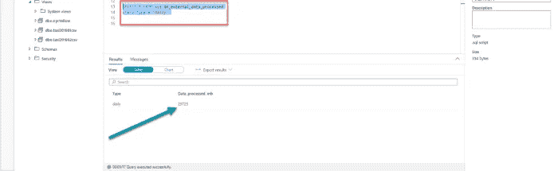

作者图片

因此，我今天的起点大约是 29.7 GB，我将在每次定位无服务器 SQL 池以获取数据时计算差异。

好了，回到第一个场景，我将把这两个月的数据从 CSV 文件导入 Power BI:

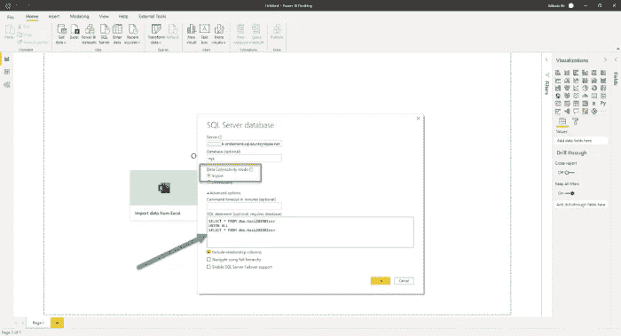

作者图片

最令人着迷的是，我正在编写普通的 T-SQL，所以我的用户甚至不知道他们是直接从 CSV 文件中获取数据的！我使用 UNION ALL，因为我确信在我的两个视图中没有相同的记录，理论上，它应该比 UNION 运行得更快，但是我也可以使用相同的 T-SQL 语句创建一个单独的视图，然后在 Power BI 中使用该联合视图。

我需要一个[合适的日期维度表](/tiq-part-3-ultimate-guide-to-date-dimension-creation-98b951ffa68c)来测试不同的场景，我将使用 Power Query 创建它。该日期表在所有场景中都将处于导入模式，因此它不会影响来自无服务器 SQL 池的已处理数据量。以下是日期表的 M 代码:

```
let
    StartDate = #date(StartYear,1,1),
    EndDate = #date(EndYear,12,31),
    NumberOfDays = Duration.Days( EndDate - StartDate ),
    Dates = List.Dates(StartDate, NumberOfDays+1, #duration(1,0,0,0)),
    #"Converted to Table" = Table.FromList(Dates, Splitter.SplitByNothing(), null, null, ExtraValues.Error),
    #"Renamed Columns" = Table.RenameColumns(#"Converted to Table",{{"Column1", "FullDateAlternateKey"}}),
    #"Changed Type" = Table.TransformColumnTypes(#"Renamed Columns",{{"FullDateAlternateKey", type date}}),
    #"Inserted Year" = Table.AddColumn(#"Changed Type", "Year", each Date.Year([FullDateAlternateKey]), type number),
    #"Inserted Month" = Table.AddColumn(#"Inserted Year", "Month", each Date.Month([FullDateAlternateKey]), type number),
    #"Inserted Month Name" = Table.AddColumn(#"Inserted Month", "Month Name", each Date.MonthName([FullDateAlternateKey]), type text),
    #"Inserted Quarter" = Table.AddColumn(#"Inserted Month Name", "Quarter", each Date.QuarterOfYear([FullDateAlternateKey]), type number),
    #"Inserted Week of Year" = Table.AddColumn(#"Inserted Quarter", "Week of Year", each Date.WeekOfYear([FullDateAlternateKey]), type number),
    #"Inserted Week of Month" = Table.AddColumn(#"Inserted Week of Year", "Week of Month", each Date.WeekOfMonth([FullDateAlternateKey]), type number),
    #"Inserted Day" = Table.AddColumn(#"Inserted Week of Month", "Day", each Date.Day([FullDateAlternateKey]), type number),
    #"Inserted Day of Week" = Table.AddColumn(#"Inserted Day", "Day of Week", each Date.DayOfWeek([FullDateAlternateKey]), type number),
    #"Inserted Day of Year" = Table.AddColumn(#"Inserted Day of Week", "Day of Year", each Date.DayOfYear([FullDateAlternateKey]), type number),
    #"Inserted Day Name" = Table.AddColumn(#"Inserted Day of Year", "Day Name", each Date.DayOfWeekName([FullDateAlternateKey]), type text)
in
    #"Inserted Day Name"
```

将数据加载到 Power BI 桌面需要一些时间，现在让我们检查一些关键指标。

*   我的表有大约 1470 万行
*   我的整个数据模型大小约为 92 MB，因为数据在 Power BI Desktop 中进行了优化压缩(我们已经降低了 DateTime 列的基数)

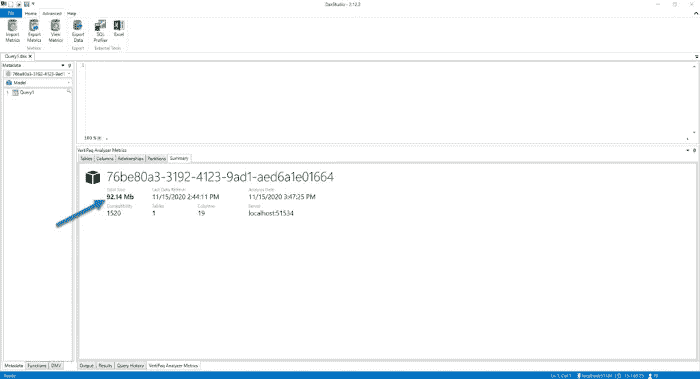

作者图片

一旦我创建了表可视化，显示每个日期的总记录，我每天处理的数据量大约是 33.3 GB。让我们刷新数据模型，看看它有多贵。因此，Power BI Desktop 现在将转到一个无服务器 SQL 池，从我的两个视图中查询数据，但不要忘记在后台有两个 CSV 文件作为我们数据的最终来源！

刷新后，我的每日值增加到了大约 36.9 GB，这意味着这次刷新花费了大约 3.6 GB。钱的话，大概是***0.018 $***(0.0036 TB x 5 USD)。

在此使用案例中，只有当我的 Power BI 模型被更新时，我才会花钱！简单地说，如果我每天刷新一次数据模型，这个报告每月将花费我 54 美分。

# 用例 CSV 文件上的 DirectQuery

现在让我们来看看如果使用完全相同的查询会发生什么，但是我们将使用 DirectQuery 选项，而不是将数据导入 Power BI Desktop。

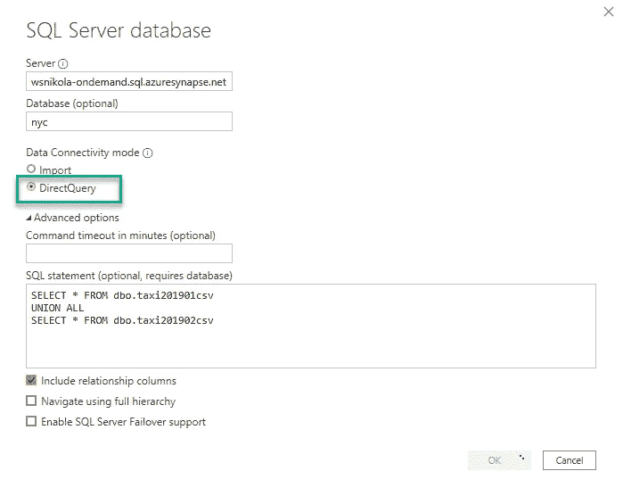

作者图片

让我们首先与日期切片器交互，这样我们可以检查这将花费我们多少。我的测量起点是大约 87.7 GB，这是我的报告的样子:

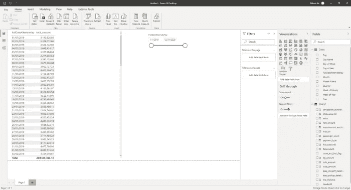

作者图片

刷新整个查询烧掉了~2.8 GB，也就是 ***~0.014$*** 。现在，这是为了页面上的一个单独的视觉效果！请记住，当您使用 DirectQuery 时，每个 visual 将生成一个对底层数据源的单独查询。让我们看看当我在页面上添加另一个视觉效果时会发生什么:

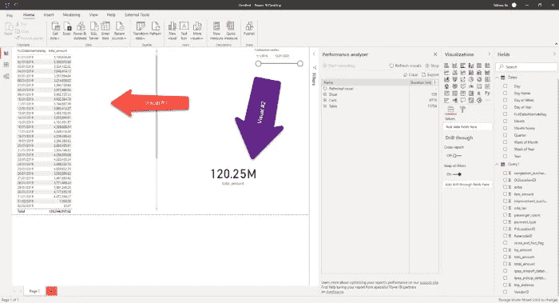

作者图片

现在，这个查询花费了我~4 GB，也就是 ***0.02$*** 。正如您可以得出的结论，增加报表画布上的视觉效果也会增加成本。

还有一点要记住: ***这些成本是每个用户*** ！因此，如果您有 10 个用户并行运行这个相同的报告，您应该将成本乘以 10，因为将为每个视图和每个用户生成一个新的查询。

# 用例 3 —在 DirectQuery 模式下使用日期切片器

现在，我想检查如果我在切片器中选择一个特定的日期范围，例如 1 月 1 日和 1 月 13 日之间，会发生什么情况:

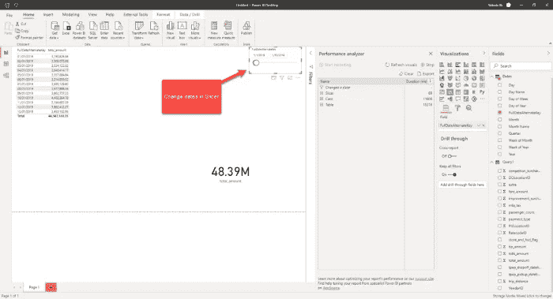

作者图片

我注意到的第一件事是查询花费了我完全一样的钱！奇怪的是，如果我查看为检索数据而生成的 SQL 查询，我可以看到引擎非常聪明地在 WHERE 子句中应用了日期过滤器:

```
/*Query 1*/
SELECT 
TOP (1000001) [semijoin1].[c1],SUM([a0])
 AS [a0]
FROM 
(
(
SELECT [t1].[tpep_pickup_datetime] AS [c14],[t1].[total_amount] AS [a0]
FROM 
(
(SELECT * FROM dbo.taxi201901csv
UNION ALL
SELECT * FROM dbo.taxi201902csv
)
)
 AS [t1]
)
 AS [basetable0]
 INNER JOIN 
(
(SELECT 3 AS [c1],CAST( '20190101 00:00:00' AS datetime) AS [c14] )  UNION ALL 
(SELECT 4 AS [c1],CAST( '20190102 00:00:00' AS datetime) AS [c14] )  UNION ALL 
(SELECT 5 AS [c1],CAST( '20190103 00:00:00' AS datetime) AS [c14] )  UNION ALL 
(SELECT 6 AS [c1],CAST( '20190104 00:00:00' AS datetime) AS [c14] )  UNION ALL 
(SELECT 7 AS [c1],CAST( '20190105 00:00:00' AS datetime) AS [c14] )  UNION ALL 
(SELECT 8 AS [c1],CAST( '20190106 00:00:00' AS datetime) AS [c14] )  UNION ALL 
(SELECT 9 AS [c1],CAST( '20190107 00:00:00' AS datetime) AS [c14] )  UNION ALL 
(SELECT 10 AS [c1],CAST( '20190108 00:00:00' AS datetime) AS [c14] )  UNION ALL 
(SELECT 11 AS [c1],CAST( '20190109 00:00:00' AS datetime) AS [c14] )  UNION ALL 
(SELECT 12 AS [c1],CAST( '20190110 00:00:00' AS datetime) AS [c14] )  UNION ALL 
(SELECT 13 AS [c1],CAST( '20190111 00:00:00' AS datetime) AS [c14] )  UNION ALL 
(SELECT 14 AS [c1],CAST( '20190112 00:00:00' AS datetime) AS [c14] )  UNION ALL 
(SELECT 15 AS [c1],CAST( '20190113 00:00:00' AS datetime) AS [c14] ) 
)
 AS [semijoin1] on 
(
([semijoin1].[c14] = [basetable0].[c14])
)
)
GROUP BY [semijoin1].[c1] /*Query 2*/
SELECT SUM([t1].[total_amount])
 AS [a0]
FROM 
(
(SELECT * FROM dbo.taxi201901csv
UNION ALL
SELECT * FROM dbo.taxi201902csv)
)
 AS [t1]
WHERE 
(
([t1].[tpep_pickup_datetime] IN (CAST( '20190112 00:00:00' AS datetime),CAST( '20190113 00:00:00' AS datetime),CAST( '20190101 00:00:00' AS datetime),CAST( '20190102 00:00:00' AS datetime),CAST( '20190103 00:00:00' AS datetime),CAST( '20190104 00:00:00' AS datetime),CAST( '20190105 00:00:00' AS datetime),CAST( '20190106 00:00:00' AS datetime),CAST( '20190107 00:00:00' AS datetime),CAST( '20190108 00:00:00' AS datetime),CAST( '20190109 00:00:00' AS datetime),CAST( '20190110 00:00:00' AS datetime),CAST( '20190111 00:00:00' AS datetime)))
)
```

但是，底层视图似乎扫描了 CSV 文件中的整个数据块！因此，如果您使用日期切片器来限制数据量，在节省方面没有任何好处，因为在任何情况下都会扫描整个 CSV 文件…

# 用例 DirectQuery 模式下的聚合表

下一个测试将向我们展示如果我们[创建一个聚集表](https://docs.microsoft.com/en-us/power-bi/transform-model/desktop-aggregations)并以 DirectQuery 模式将其存储在 Power BI 中会发生什么。这是一个非常简单的汇总表，由总量和取件时间列组成。

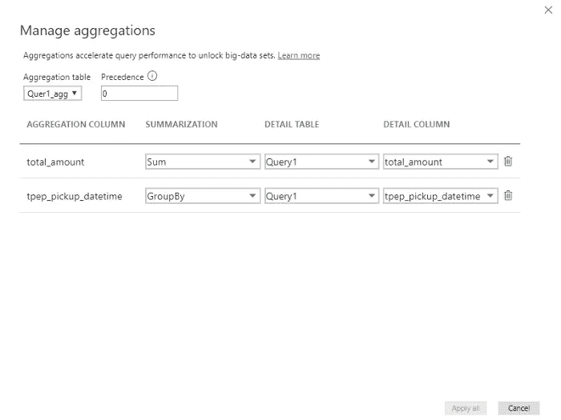

作者图片

我的查询命中了聚合表，但是在总查询成本方面没有任何变化，因为它与前面的用例完全相同: ***~0.02$*** ！

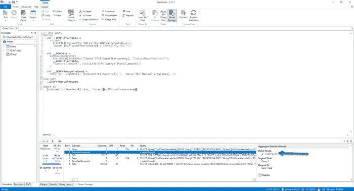

作者图片

# 用例 5 —导入模式下的聚合表

之后，我想检查一下如果我将一个先前聚合的表导入到 Power BI 中会发生什么。我相信计算会更快，但让我们看看它会如何影响查询成本。

正如所料，这非常快，聚合表被命中，因此我们只需支付数据刷新的代价，如我们的用例#1: ***0.018$*** ！

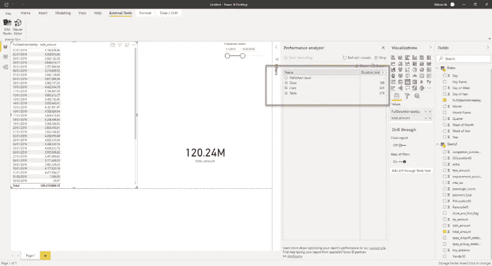

作者图片

# 用例 6 —无服务器 SQL 池中的聚合数据

我想检查的最后一件事是，如果我知道我的分析工作负载，并且可以使用无服务器 SQL 池提前准备一些最频繁的查询，会发生什么情况。

因此，我将创建一个视图，像上一个案例一样在 Power BI Desktop 中聚合数据，但这次是在无服务器 SQL 池中:

```
DROP VIEW IF EXISTS taxi201901_02_agg;
GOCREATE VIEW taxi201901_02_agg AS
  SELECT  CAST(C2 AS DATE) AS tpep_pickup_datetime,
        SUM(CAST(C17 AS DECIMAL(10,2))) AS total_amount
FROM
    OPENROWSET(
        BULK N'https://nikola.dfs.core.windows.net/nikola/Data/yellow_tripdata_2019-01.csv',
        FORMAT = 'CSV',
        PARSER_VERSION='2.0',
        HEADER_ROW = TRUE
    ) 
    AS [taxi201901_02_agg]
    GROUP BY CAST(C2 AS DATE)
```

基本上，我们在源端聚合数据，这显然会有所帮助。所以，让我们来看看结果:

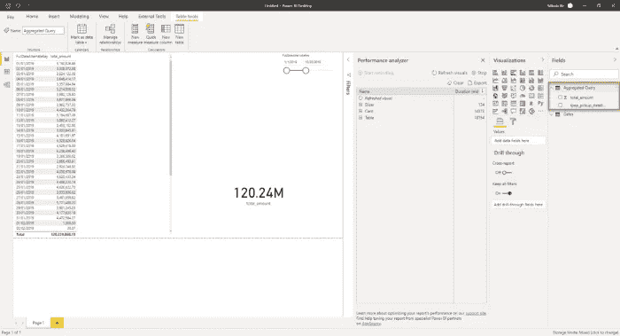

作者图片

它返回请求的数字更快，但是处理的数据量还是一样的！这个查询又花费了我 ***~0.02$*** ！

这使我得出一个结论: ***无论您在 CSV 文件之上的无服务器 SQL 池中执行什么，它们都将在数据准备过程的最低级别被完全扫描！***

**我假设当您处理较大的数据集(几 TB)时，成本差异会明显得多。因此，请记住，在无服务器 SQL 池中预先聚合数据可以节省流数据量，这也意味着您的总体成本将会降低！你可以在这里找到所有的细节。**

# 用例#7 —导入拼花文件

现在，让我们评估一下，如果我们使用来自 Parquet 文件的数据，而不是 CSV，是否会发生一些变化。

第一个用例是导入拼花文件。不出所料，由于它们比 CSV 文件压缩得更好，成本几乎降低了一倍: ***~0.01$*** ！

# 用例 8——对拼花文件进行直接查询

最后，如果我们在 Power BI 中使用 DirectQuery 模式直接从 Synapse 的无服务器 SQL 池中的 Parquet 文件中查询数据，让我们来看看这些数字。

出乎我意料的是，这个查询处理了大约 26 GB 的数据，相当于 ***~0.13$*** ！

由于这看起来非常奇怪，我开始调查并发现高成本的罪魁祸首是使用 M！在后台调试由 Power BI 生成并发送到 SQL 引擎的 SQL 查询时，我注意到已经创建了极其复杂的查询，对日期维度中的每个值执行连接和联合操作:

```
SELECT 
TOP (1000001) [semijoin1].[c1],SUM([a0])
 AS [a0]
FROM 
(
(
SELECT [t1].[TpepPickupDatetime] AS [c13],[t1].[TotalAmount] AS [a0]
FROM 
(
(SELECT *
FROM taxi201901parquet
UNION ALL
SELECT *
FROM taxi201902parquet)
)
 AS [t1]
)
 AS [basetable0]
 INNER JOIN 
(
(SELECT 3 AS [c1],CAST( '20190101 00:00:00' AS datetime) AS [c13] )  UNION ALL 
(SELECT 4 AS [c1],CAST( '20190102 00:00:00' AS datetime) AS [c13] )  UNION ALL 
(SELECT 5 AS [c1],CAST( '20190103 00:00:00' AS datetime) AS [c13] )  UNION ALL 
(SELECT 6 AS [c1],CAST( '20190104 00:00:00' AS datetime) AS [c13] )  UNION ALL 
(SELECT 7 AS [c1],CAST( '20190105 00:00:00' AS datetime) AS [c13] )  UNION ALL 
(SELECT 8 AS [c1],CAST( '20190106 00:00:00' AS datetime) AS [c13] )  UNION ALL 
(SELECT 9 AS [c1],CAST( '20190107 00:00:00' AS datetime) AS [c13] )  UNION ALL 
(SELECT 10 AS [c1],CAST( '20190108 00:00:00' AS datetime) AS [c13] )  UNION ALL 
(SELECT 11 AS [c1],CAST( '20190109 00:00:00' AS datetime) AS [c13] )  UNION ALL
…..
```

这只是生成的查询的摘录，为了可读性，我已经删除了其余的代码。

一旦我从计算中排除了我的日期维度，成本预计会降低到 400 MBs 以下！！！因此，现在处理的数据量约为 400MB，而不是日期维的 26GB！

总之，这些使用复合模型的场景需要仔细的评估和测试。

# 用例 9 —无服务器 SQL 池中的聚合数据

那是我们的引爆点！这就是奇迹发生的地方！通过能够存储物理上分离的列，在这种情况下，Parquet 优于所有以前的用例——当我说这种情况时，我指的是当您能够减少必要的列的数量时(只包括那些您需要从 Power BI 报告中查询的列)。

当我在无服务器 SQL 池中创建了一个包含预聚合数据的视图后，只处理了 400 MB 的数据！与之前的所有测试相比，这是一个巨大的差异。基本上，这意味着这次查询的成本: ***0.002$*** ！为了便于计算，我可以用 1 美元运行 500 次！

# 定论

下表列出了我所研究的每一个用例的成本:

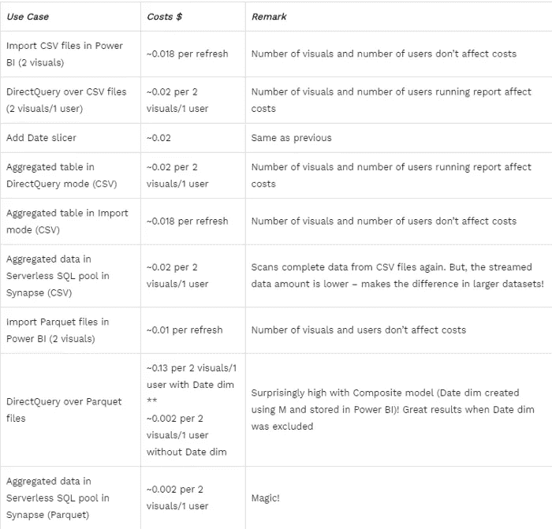

作者图片

查看表格，并考虑我们在上面检查的不同使用案例，可以得出以下结论:

*   ***尽可能使用拼花文件，而不是 CSV***
*   ***尽可能将数据导入 Power BI*** —这意味着您只需在刷新数据快照时付费，而不是为报告中的每个查询付费
*   如果您正在处理 ***Parquet*** 文件，只要有可能， ***就会在 Synapse 的无服务器 SQL 池*** 中创建预聚合数据(视图)
*   由于无服务器 SQL pool 仍然 ***不支持 ResultSet 缓存*** (据我所知，微软的团队正在研究)，请记住，每次运行查询(即使您返回的是相同的结果集)，都会生成查询，您需要为此付费！
*   如果您的分析工作负载需要对大型数据集进行大量查询(如此之大，以至于无法选择导入模式)，也许您应该 ***考虑将数据存储在专用的 SQL 池*** 中，因为您将支付固定的存储成本，而不是每次查询数据时的数据处理成本。这里，为了从使用这个场景中获得额外的好处，您应该在将中间结果导入到专用的 SQL 池之前，使用外部表对它们进行[具体化！这样，您的查询将读取已经准备好的数据，而不是原始数据](https://docs.microsoft.com/en-us/azure/synapse-analytics/sql/create-external-table-as-select)
*   在 Synapse Analytics 中使用无服务器 SQL 池时，坚持使用[通用最佳实践](https://docs.microsoft.com/en-us/azure/synapse-analytics/sql/best-practices-sql-on-demand)

# 结论

在本文中，我们深入测试了在 Synapse Analytics 中将 Power BI 与无服务器 SQL 池结合使用时的不同场景和多个用例。

在我看来，尽管 Synapse 还有很长的路要走，以微调无服务器 SQL 池中的所有功能和产品，但毫无疑问，它正朝着正确的方向前进。通过不断改进产品，并定期添加酷的新功能，Synapse 可以真正成为您所有数据工作负载的一站式商店。

在这个博客系列的最后一部分，我们将检查 Power BI 如何与 Azure 的 NoSQL 解决方案(Cosmos DB)集成，以及无服务器 SQL 池如何在 Azure Synapse Link for Cosmos DB 的帮助下帮助优化分析工作负载。

感谢阅读！

[成为会员，阅读 Medium 上的每一个故事！](https://datamozart.medium.com/membership)