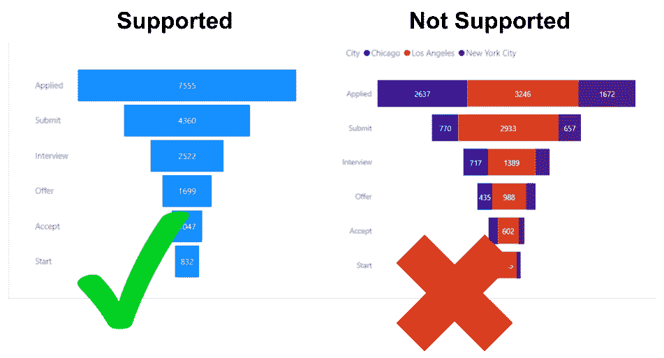
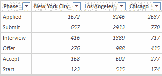
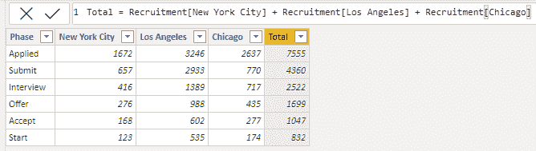
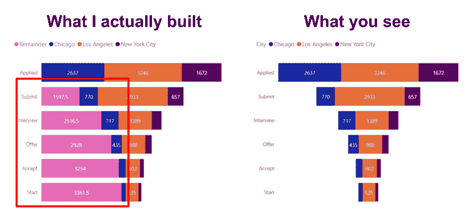
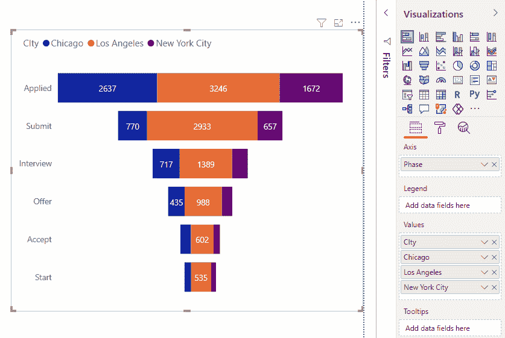
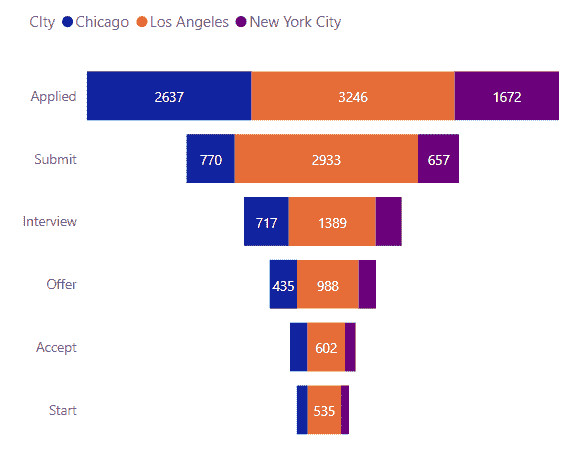

# Power BI:创建堆积漏斗图

> 原文：<https://towardsdatascience.com/power-bi-create-a-stacked-funnel-chart-90c41106fa58?source=collection_archive---------11----------------------->

## Power BI 不支持堆积漏斗图。使用这个技巧，你可以创造一个。

资料来源:Pexels.com

# 问题是

Power BI 提供多种可视化功能来满足您的数据需求。尽管 Power BI 总体上是一个非常成熟的产品，但它的大部分局限仍然在可视化部分。这些限制之一是漏斗图。

Power BI 具有内置的漏斗图功能，但是不能向漏斗图添加类别。换句话说，每个条形只能有一种颜色，如下图所示。

在官方 Power BI 社区的[帖子](https://community.powerbi.com/t5/Desktop/Create-a-quot-stacked-funnel-quot-visual/td-p/783661)中，你可以看到其中一个用户请求类似的解决方案。在本教程中，我将使用他的图表作为灵感。

本机漏斗图目前不支持类别颜色。

尽管第三方视觉或 D3 可能是可行的，但我的客户不想使用其中任何一个，所以我不得不自己想出一个解决方案。

# 修复

在这次演示中，我将使用如下数据。为了便于演示，我简化了结构，但是您可以使用不同的结构，或者在 Power Query 中简单地转换数据。

原始数据。

## 第一步:计算总数。

我们需要做的第一件事是添加一个计算总数的列，这样我们就知道条形的总宽度。这可以通过一个简单的公式来实现，如下所示。

添加了包含所有类别合计的计算列。

## 第二步:计算余数

这个解决方案的诀窍是，我们实际上是在构建一个规则的堆积条形图，但是我们通过隐藏“剩余”类别使它看起来像一个漏斗图。

粉红色区域已被隐藏，使图表看起来像漏斗图。

使用这个 DAX 脚本，我们可以计算余数(左图中的粉色区域)。

`Remainder =
VAR longest_bar = CALCULATE ( MAX ( Recruitment[Total] ), ALL ( Recruitment ) )
RETURN( longest_bar — MAX ( Recruitment[Total] ) ) / 2`

## 第三步:制作图表。

现在我们要做的就是把这些碎片拼在一起。只是一个具有以下字段设置的堆积条形图；

“字段”窗格中的“剩余部分”已被重命名为“城市”。

现在剩下的就是将剩余的颜色改为白色，将其名称改为您的标题图例，瞧:

最后的结果。

# 结论

像所有的软件解决方案一样，Power BI 也有它的局限性，但是只要有点创造力，就有可能绕过其中的大部分。使用这个“技巧”,您可以为您的数据解决方案创建一个堆积漏斗图。

但是请记住，这种粗糙的解决方案有一些限制；

*   您的用户将能够点击隐藏类别
*   DAX 需要额外的资源(尽管在这种情况下非常少)
*   您可能需要转换您的数据

总之，这似乎是一个不错的解决方案，我的客户终端用户很高兴。希望也能帮到你。如果你知道任何更好的解决方法，请在评论中告诉我。

关于我:我叫布鲁诺，是一名数据科学顾问。你可以通过我的网址与我联系:[https://www . zhongtron . me](https://www.zhongtron.me/)