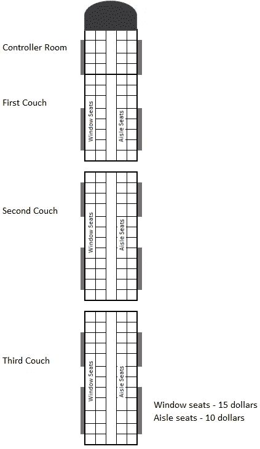
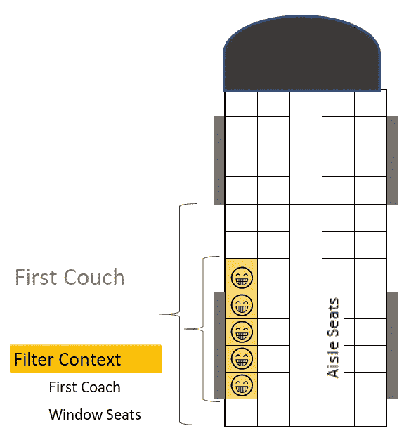
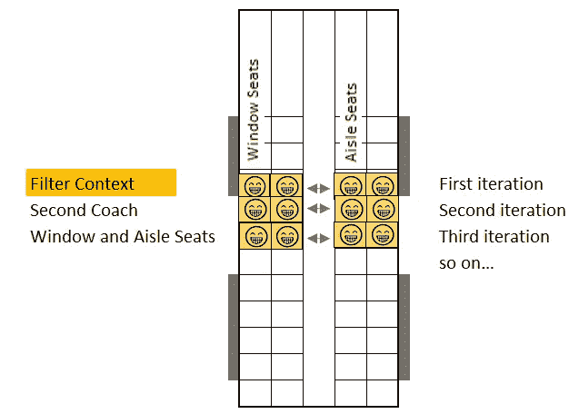
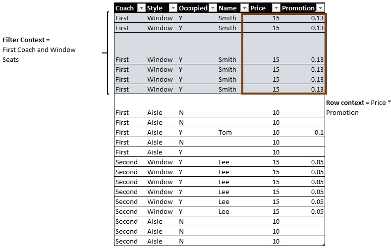
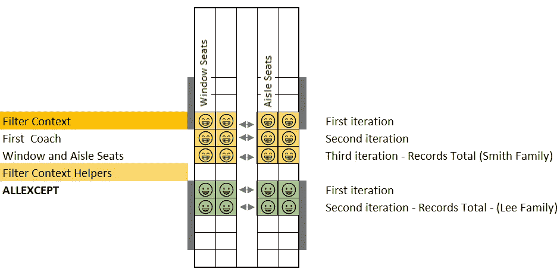
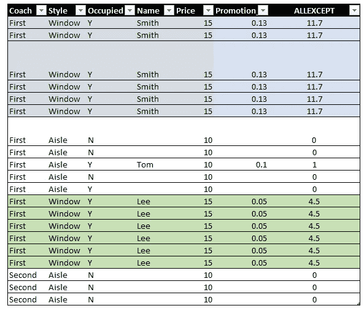

# Power BI:筛选器与行上下文

> 原文：<https://towardsdatascience.com/power-bi-filter-vs-row-context-efd8583f0eb8?source=collection_archive---------17----------------------->

## 一个简单的概念(用火车)。


马库斯·斯皮斯克在 [Unsplash](https://unsplash.com?utm_source=medium&utm_medium=referral) 上的照片

我就是你所说的“超级通勤族”。我过去常常在早上 5 点醒来。早上 5:30 出门，赶火车，早上 8:00 到单位。这听起来像一场噩梦。我热爱我的工作，我热爱到足以做到这一点。后来疫情来了，这不再是我必须经常做的事情了。我对此表示感谢，但是这与 Power BI 过滤器和行上下文有什么关系呢？

你看，如果你知道你在找什么，过滤器和行上下文可以在常见的情况下看到。我乘火车。火车分为不同的车厢，每节车厢内有两种不同类型的座位。有靠窗的座位和靠走廊的座位。

我是一个非常视觉化的人。我就在这里把我的意思引出来。



作者图片

下面是我在 Excel 中画火车的尝试。在这里你可以看到这列火车有三节车厢和一个控制室。

那么，过滤器和行上下文在这里意味着什么呢？

让我们假设你是一名检票员。你需要在火车上找到一个家庭，了解他们在车费上花了多少钱。你知道他们坐在第一节车厢，他们都坐在靠窗的座位。

在这种情况下，你需要走到第一节车厢，走到靠窗的座位，合计他们的票价。这以最简单的形式展示了过滤器上下文和行上下文。

这里，过滤上下文将是头等车厢和靠窗的座位。行上下文是单个座位。他们花了多少钱的记录就是总数。



作者图片

如果你把它转换成能量 BI，这将是一个类似这样的度量。

```
A =
SUMX (
    FILTER ( Train, 
Coach == "First" && Seats == "Windows" && Family == "Smith" ),
    [Ticket_Price]
)
```

在这里，您会告诉 Power BI 去第一节车厢，走到靠窗的座位，找到家庭组—这是过滤器上下文。下一个问题同样重要，如果不是更重要的话。

你想怎么处理这个？Power BI 去了地点却不知道做什么。它需要知道到达目的地后要做什么！这是行上下文。在这里用 SUMX，你是在告诉 Power BI 汇总，一排一排，或者用我们的比喻，一个座位一个座位，票价。

现在再举一个例子，如果我想知道二等车厢靠窗座位和靠过道座位的总价，该怎么办？

作为检票员，你会再次走向第二节车厢，走向靠窗和靠过道的座位。现在我们该怎么办？现在我们需要行上下文。我们划船干什么？我们需要把靠窗座位和靠过道座位的费用加起来。这是功率 BI 中的 SUMX。你将把靠窗座位的价格加起来，把靠过道座位的价格加起来，然后移到下一行，做同样的事情。



作者图片

基本上，这就是过滤器和行上下文。在 Power BI 中，你不再看火车，而是看桌子。您需要根据特定标准过滤表，然后进行聚合。



作者图片

在这里，当用户过滤时，很可能在视觉上，他们会根据教练的号码和风格，是否被占用等进行切片。这将是过滤器上下文。最后，要计算 Price*Promotion，它将应用于行上下文。

好吧，那么这些呢？除全部、全部选定和全部？这些术语是什么意思？

让我们回到我们的火车上。你是检票员，但现在你有了一个助手。这个助手将通过按组记录您的总数来帮助您。这就是 Power BI 中的 ALLEXCEPT 函数。

视觉上，你可以在火车上再次看到这一点。



作者图片

作为 Power BI 中的一个表，会是这样的样子。



作者图片

请将这些过滤功能视为您的助手，以改变您汇总数据的方式。ALLEXCEPT 将帮助您根据您的标准进行分组，ALL 将删除您指定的任何过滤器，ALLSELECTED 将使用用户选择来创建过滤器。

我就不一一赘述了，但概念是一样的，它们充当你任务的助手。用微软的术语来说，它们改变了你的过滤器的“上下文”。

我希望这有助于澄清 Power BI 中过滤器上下文和行上下文的含义。当然，这只是一列火车。这只是有助于说明一个简单的概念，你可能会看到许多列车和加入在同一轨道等。概念是一样的。

我将在下一篇文章中尝试解释这一点:)

我希望这对您的数据之旅有所帮助！