# Power BI —如何在不到 1GB 的空间内容纳 2 亿行数据

> 原文：<https://towardsdatascience.com/power-bi-how-to-fit-200-million-rows-in-less-than-1gb-63ab5a4eb1c0?source=collection_archive---------2----------------------->

## 非同寻常的任务需要非同寻常的解决方案。了解如何在 18 MB Power BI 中封装 2 亿行数据。


[https://unsplash.com/photos/uu-Jw5SunYI](https://unsplash.com/photos/uu-Jw5SunYI)

当你与技术打交道时，有时你需要接受这样一个事实，即存在某些限制，尤其是在涉及可用资源时。有时，业务需求很难或几乎不可能在当前的环境下实现。

我最近面临一个相当具有挑战性的任务——将 SSAS 多维解决方案移植到 Power BI。“问题”是客户机有一个 Pro 许可证(这意味着 1 GB 的模型大小限制)，事实表中大约有 2 亿行(并且还在不断增长)！

我一看就知道，无论表有多窄多优化，都不可能在 1 GB 以下容纳 2 亿行！我已经写了关于数据模型大小优化的[最佳实践](/how-to-reduce-your-power-bi-model-size-by-90-76d7c4377f2d)，但是在这里根本行不通。

# 初步考虑

当我开始思考可能的解决方案时，第一个也是最明显的想法是将 Power BI 仅用作可视化工具，并与 SSAS 立方体进行实时连接。然而，这种解决方案有严重的[限制](https://docs.microsoft.com/en-us/power-bi/connect-data/desktop-ssas-multidimensional#considerations-and-limitations)——最明显的一个，你不能通过编写报告级别的度量来丰富你的语义模型——这是关键客户的要求之一！因此，Live Connection 立即被丢弃…

第二个显而易见的解决方案是使用 DirectQuery 模式将数据导入 Power BI。Power BI 将直接面向数据仓库中的事实表和维度表，而不是 SSAS 立方体。尽管有这些限制，直接查询看起来是一个完全合法的(也是唯一可能的)解决方案。这是我能想到的最好的…


[https://www . pexels . com/photo/macro-outdoors-perspective-rocky-268953/](https://www.pexels.com/photo/macro-outdoors-perspective-rocky-268953/)

…直到我发现 [Phil Seamark 的博客文章](https://dax.tips/2019/10/30/creative-aggs-part-iv-filtered-aggs/)关于过滤聚合，它打开了一个全新的视角！这个关于创造性聚合的系列很棒，但是这个特定的概念给了我启发。

# 简而言之，过滤聚合

我不会深入这个概念的细节，因为菲尔比我解释得更好。本质上，这种想法是将“热”和“冷”数据分开，然后利用 Power BI 中的复合模型特性——在 Power BI 中导入“热”数据，而“冷”数据将留在数据仓库中，并通过直接查询来定位。最重要的是，在 Power BI 数据模型中应用聚合将带来更多好处，您将在后面看到这一点。

现在，我希望你们熟悉“热”和“冷”数据这两个术语，如果你们不熟悉的话，“热”数据是最近的数据，其中单词*“最近”*具有典型的“视情况而定”的含义。它可以是过去 X 分钟、小时、天、月、年等的数据。这取决于您的具体使用情况。

就我而言，在与报告用户交谈后，我们得出结论，大部分分析都集中在前 3 个月的数据上。因此，我们的想法是动态提取“热”数据，如今天之前 3 个月的数据，并将这些数据存储在 Power BI 表格模型中。报告消费者将从快速查询中受益，因为数据将被优化压缩并保存在内存中。另一方面，当需要分析旧数据(“冷”数据)时，Power BI 将直接进入数据源，并在查询时从那里提取数据。


https://unsplash.com/photos/_v0xhIT715g

找到“引爆点”，即分离“热”和“冷”数据的时间点，在这里至关重要。如果您选择对“热”数据使用较短的周期，您将受益于较小的数据模型大小(在 Power BI 中导入较少的数据)，但是您将不得不忍受更频繁的直接查询。

但是，理论已经足够了，让我们进入 Power BI Desktop，我将向您展示在不到 1 GB 的空间内适应“2 亿行”事实表的所有步骤！

# 这一切是如何开始的…

如您所见，我的原始事实表包含关于体育博彩的数据，大约有 2 亿行。

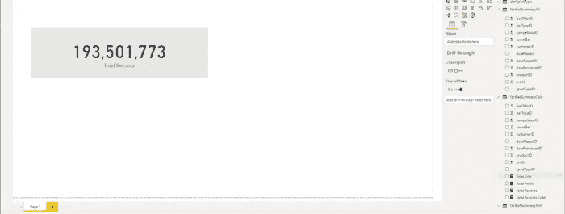

作者图片

我还有两个简单的维度表——日期维度和运动类型维度。

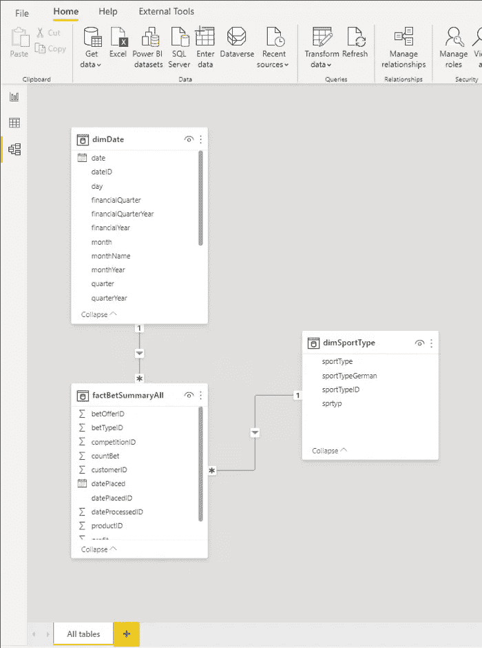

作者图片

由于我已经在 Power BI 中导入了所有数据，我将检查数据模型背后的指标。如您所见，pbix 文件大小略低于 1 GB。而且，这个数字每天都在增加！


作者图片

让我们应用第一步，分离“热”和“冷”数据。您需要确保这两者之间没有重叠，但也没有间隙，这样您最终会得到正确的结果。

这里，我们将利用 Power BI 中的复合模型特性。我已经将我巨大的事实表一分为二:factBetSummaryHot 和 factBetSummaryCold。“热”表将保存前 3 个月的数据，在我的例子中，这个表现在有大约 430 万行。

我首先在直接查询存储模式下创建了“热”和“冷”表。然后，我将首先在“热”数据上构建一个聚合表，该表将使用导入模式。另一方面,“冷”表包含剩余的大约 1 . 9 亿行，它将使用直接查询模式。在此基础上，我将构建几个聚合表来覆盖不同的维度属性(例如日期和运动类型)，并对这两个聚合表使用导入模式，因此 Power BI 将需要切换到直接查询，并将原始数据源仅用于那些对导入模式表不满意的查询！

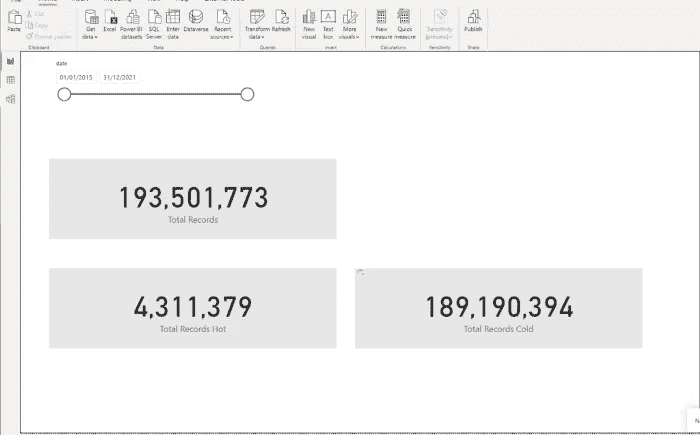

作者图片

好了，现在让我们开始实现过滤聚合解决方案。我已经将“冷”表切换到直接查询存储模式，如下图所示:

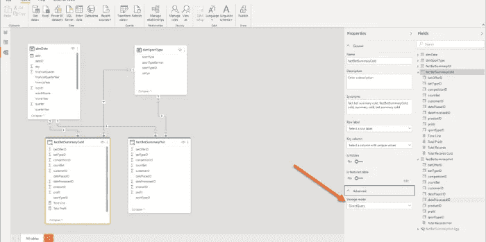

作者图片

如果我现在检查 pbix 文件的大小，我会发现它只有 17mb！


作者图片

因此，我实现了最初的请求，将数据放在小于 1GB 的空间内，因为我设法将数据模型大小从 1GB 减少到 17MB，同时保留了原始数据粒度！

# 改进原始解决方案

现在，让我们在“热”数据上创建一个聚合表，并将该表的存储模式设置为 Import:

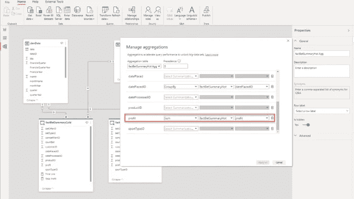

作者图片

我不会详细介绍聚合本身，因为有一篇由莎安娜米黄·沃森撰写的精彩文章，您可以从中了解更多关于这一强大功能的信息。

下一步是在新创建的聚合表和维度表之间建立关系:

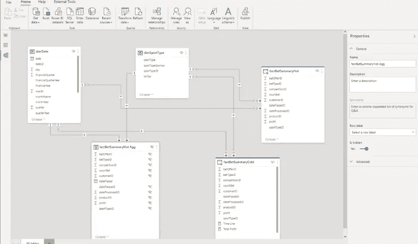

作者图片

现在，这个报告的性能将取决于许多因素。如果用户试图与报告交互，并想要 3 个月以前的数据，Power BI 将通过存储在 SQL Server 数据库中的大约 1 . 9 亿行来搜索该数据，必须处理网络延迟、并发请求等问题。

比方说，我想分析总利润，这是利润列的简单总和。为了检索正确的数字，我需要对“热”和“冷”表中的值求和，编写以下 DAX 度量:

```
Total Profit Hot & Cold = 
                          VAR vProfitHot = SUM(factBetSummaryHot[profit]) 
                          VAR vProfitCold = SUM(factBetSummaryCold[profit])
RETURN
vProfitHot + vProfitCold
```

现在，您可能会假设，如果我们只想查看前 3 个月的数据，Power BI 将只转到一个聚合表，并快速提取数据并呈现给我们。不对！

下图显示，尽管选择的日期在 1 月 31 日和 3 月 30 日之间，Power BI 还是用了将近 12 秒的时间准备好我的数据！而且，如果我们看一下性能分析器的数字，您会发现直接查询几乎占用了那段时间的全部时间:

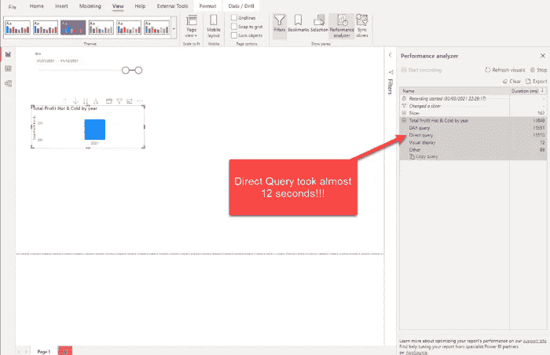

作者图片

为什么 Power BI 需要应用直接查询，而我们已经有了一个很好的汇总表来处理这部分数据？嗯，Power BI 很聪明。其实很聪明！它足够聪明地在内部转换我们的 SUM over profit 列并点击聚合表，而不是“访问”它的直接查询孪生兄弟。但是，在某些情况下，它无法自行解决所有问题。在这个场景中，Power BI 将所有数据*，甚至从“冷”表中直接查询，然后应用日期过滤器！*

*这意味着，我们需要“指示”Power BI 在数据检索之前评估数据过滤器**！再次感谢 Phil Seamark 改进了这个方法:)***

*第一步是在 DAX 中设置时间的“临界点”。我们可以使用与 SQL 中完全相同的逻辑来做到这一点，当时我们将巨大的事实表分为“热”和“冷”:*

```
*Time Line = 
           VAR maxDate = CALCULATE(
                                 MAX('factBetSummaryHot Agg'[datePlaced]),
                                 ALL()
                                  )
RETURN 
    EOMONTH(DATE(YEAR(maxDate),MONTH(maxDate)-3,1),0)*
```

*该方法将返回“热”和“冷”数据之间的截止日期。然后，我们将在改进版的总利润指标中使用这一结果:*

```
*Total Profit = 
               VAR vProfitHot = SUM(factBetSummaryHot[profit])
               VAR vProfitCold = IF(
                                     MIN(dimDate[date]) < [Time Line] ,
                                     SUM(factBetSummaryCold[profit])
                                   )
RETURN
vProfitHot + vProfitCold*
```

*这里，我们在每个场景中都从“热”表中返回 SUM over profit 列，因为它总是在导入模式下命中聚合表。然后，我们向“冷”数据添加一些逻辑—检查日期切片器中的开始日期是否在我们的“临界点”之前—如果是，那么我们需要等待直接查询。*

*但是，如果没有，那么…*

*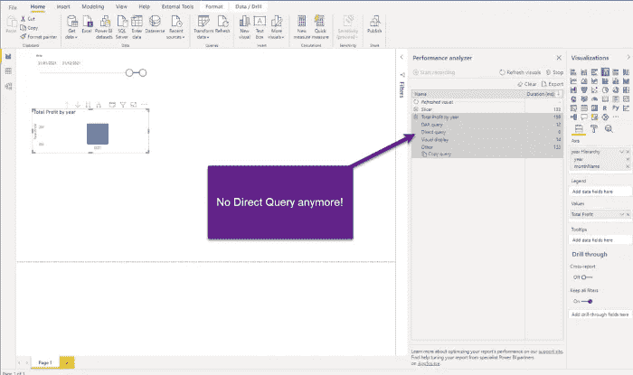*

*作者图片*

*如你所见，现在我们在 159 毫秒内显示了我们的图像！而且，DAX 查询用了 12 毫秒！这次没有直接查询，如果我们在 DAX Studio 中检查查询，我们会注意到我们的聚合表是匹配的，即使我们在度量中使用了直接查询表作为引用！*

*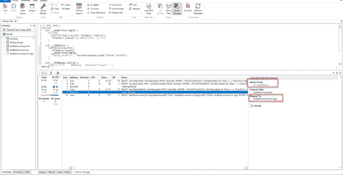*

*作者图片*

*这很好，因为这意味着使用导入模式聚合表将满足最频繁运行的查询(针对前 3 个月的数据)!*

# *处理“冷”数据*

*作为下一个优化步骤，我想在“冷”数据上构建一个聚合表，这可能会满足最频繁运行的用户查询，这些查询需要在“临界点”(超过 3 个月)之前提取数据。这将略微增加数据模型的大小，但会显著提高报告的性能。*

*因此，只有在一些特定的用例中，当用户需要查看“冷”数据中的一些高级粒度时，Power BI 才会直接向底层数据库发出查询。*

*让我们根据我们的维度，创建两个包含“冷”数据的聚合表。第一个将根据日期聚合数据:*

```
*SELECT datePlacedID
      ,SUM(profit) profit
      ,SUM(countBet) countBet
FROM factBetSummaryCold
GROUP BY datePlacedID*
```

*而第二个将汇总按运动类型分组的数据:*

```
*SELECT sportTypeID
      ,SUM(profit) profit
      ,SUM(countBet) countBet
FROM factBetSummaryCold
GROUP BY sportTypeID*
```

*让我们在这两个聚合表和维度之间建立关系，并为新导入的表设置聚合:*

*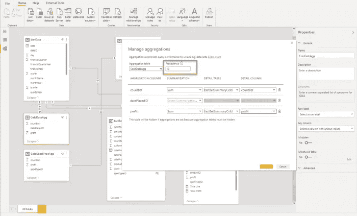*

*作者图片*

*通过设置优先级属性，您可以“指示”Power BI 首先使用哪个聚合表。优先级值越高，相应表格的优先级越高。*

*让我们回到我们的报告，一旦我们包括了“临界点”之前的数据，就检查我们的测量的性能:*

*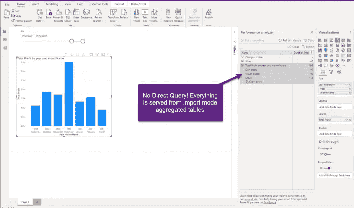*

*作者图片*

*厉害！我将日期范围扩展到之前的 6 个月，我们在 198 毫秒内获得了结果，而 DAX 查询仅用了 40 毫秒！如果我们深入了解 DAX Studio，我们可以确认请求的两个“部分”,即“冷”和“热”数据，都是由导入模式聚合表提供的:*

**

*作者图片*

*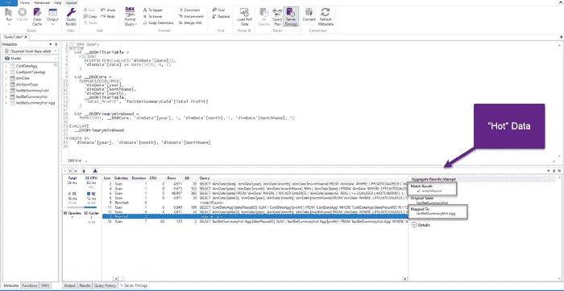*

*作者图片*

*在我们得出结论之前，让我们最后看一下我们的 pbix 文件大小:*

**

*作者图片*

*太不可思议了:18MB！*

# *结论*

*如你所见，我们成功了！最初的请求是将数据模型从 SSAS 立方体移动到 Power BI Pro workspace，而不丢失事实表中的 2 亿行中的任何一行！我们从近 1GB 开始，到 18MB 结束，同时保留了原始数据粒度，并且不影响 99%用例的报告性能！*

*非同寻常的任务需要非同寻常的解决方案，如果你问我，感谢 Phil Seamark 的绝妙想法，我们有一个解决方案，即使在 Pro 限制下也能容纳极其庞大的数据。*

*本质上，我们刚刚做的是，我们已经设法在 18MB 中容纳了 2 亿行…*

*感谢阅读！*

*成为会员，阅读 Medium 上的每一个故事！*