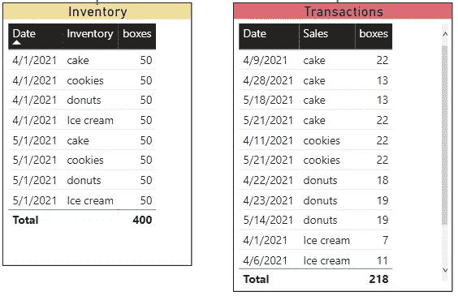
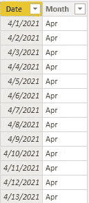
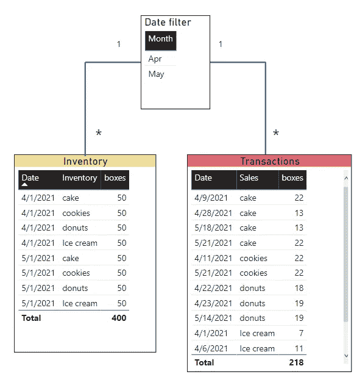
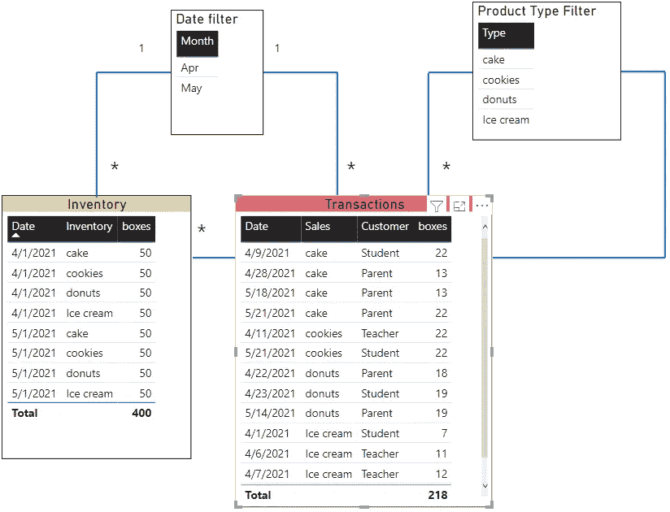
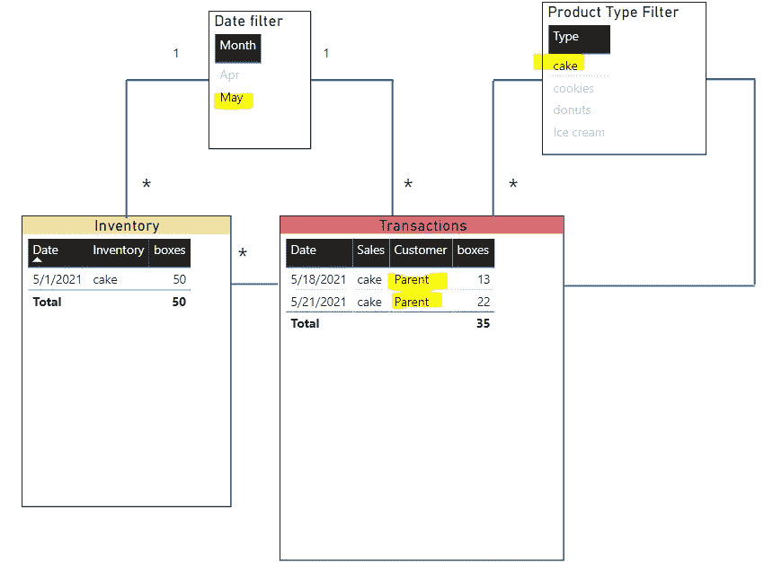
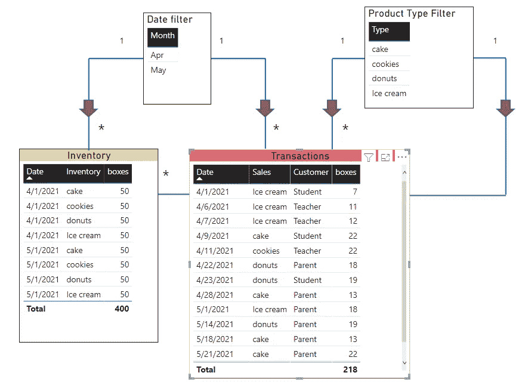
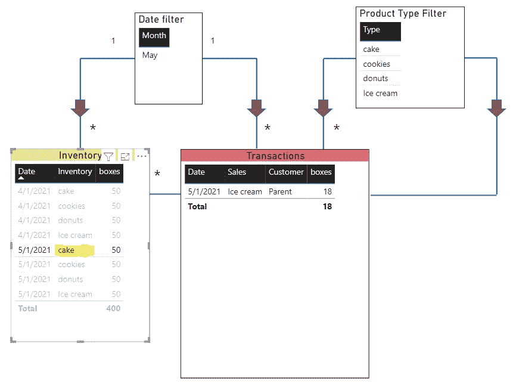
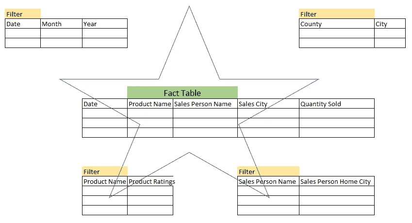

# 功率 BI 建模

> 原文：<https://towardsdatascience.com/power-bi-modelling-8f1e4246c84e?source=collection_archive---------15----------------------->

## 使用简单的概念建立模型


Bret Kavanaugh 在 [Unsplash](https://unsplash.com?utm_source=medium&utm_medium=referral) 上拍摄的照片

Power BI 的很多用户都是 Excel 背景。他们已经使用它很多年了，并使用它建立了仪表板和其他工具。一旦他们获得了 Power BI，他们就想进入表格的单个“单元”级别。

我以前也想这么做，但问题是 Power BI 是一个分栏工具，你必须以分栏的方式来考虑，才能最大限度地利用这个工具。

这是什么意思？

这意味着您必须知道将表连接在一起的公共列。这将要求你思考如何基于一个列来报告数字。这将要求您一起查看您的表，并查看哪些列可以链接到哪个表，以及如何根据这些表创建一个报告解决方案。

我应该使用哪张桌子？我要报告哪些表？

本文将向您介绍一个基本的数据模型。一旦你理解了这个概念，做模特的想法对你来说就不难了。

与 SQL 数据库或 Access 数据库不同，Power BI 不要求您规范化或“拆分”所有的表。它介于两者之间。

首先问自己这个问题，你想报道什么？

这个问题会告诉你很多下一步该做什么。它可能会告诉您需要使用什么表以及要过滤什么。

这是我的问题，

**我想报告每天的库存和交易情况。每天都有销售额，所以我想知道我的销售额。**

在这里，我们已经知道我们想要报告库存和销售。这些可能是我们的事实表。听起来好像有一个日期时间维度，所以我们可能需要一个时间表。

这些是我们想要使用的事实表，



作者图片

我们还需要一个表将 inventory 和 transactions 表连接在一起，这样我们就可以按日期进行筛选。我们需要一张日期表。这里我们可以使用

```
Date_Filter = CALENDAR( DATE(2021,04,01), DATE(2021,12,31))
```

Power BI 会自动为你创建一个表。结果会是这样一个表。



简单的日期表格-作者图片

在这个模型中，您可以看到我将交易日期和库存日期连接到日期表。



作者图片

这是一个你需要记住的基本模型。

在这里，日期表在日期列上连接库存和销售表。如果您要按日期过滤，它将从两个表中“抓取”数据。日期表筛选一对多关系中的库存和交易表。

现在让我们进一步扩展一下，

**我想按类型和购买者查看库存和销售情况。**

这里我们可以看出，我们可能需要再次过滤一些内容，包括库存和销售这两个表。我们有日期维度，但是这里的请求只是按类型。我将不得不创建一个表，该表接受两个表的唯一产品类型，以便对它们进行筛选。

在这里，您可以使用 Power Query 来选择 inventory 和 transactions 表中产品类型的各个列，追加它们并运行 remove duplicate 来创建过滤表。

在 DAX 中，您可以使用 DISTINCT 创建一个包含所有库存的唯一值的表。

```
Product_Type_Filter = DISTINCT(Inventory[Inventory]))
```

这是模型现在的样子，🍦 🍩🍰



作者图片

在这里，我可以按日期、按产品类型进行过滤，并且只看到购买它们的客户。



作者图片

同样，这是一个简单的过滤器，允许您过滤两个表以获得答案。

稍微说一下过滤方向也很重要。让我们再来看看这个模型，我在箭头处添加了。



作者图片

这些箭头是什么意思？

这意味着当用户使用日期筛选器或产品筛选器进行筛选时，因为这些筛选表与库存和交易表相连接，所以他们可以单向筛选。

按照与连接相同的方向进行过滤非常重要。

这里，我在 inventory 表中对 cake 进行了过滤，这不是一个过滤表，它将在 transactions 表中拉出一个冰淇淋的事务。正如你所看到的，如果你没有使用合适的过滤器，它会很快变得非常混乱。



作者图片

我希望通过这篇文章，您可以获得创建数据模型的基础知识。

记住这个。你建立的模型不一定很难。它只需要简单而有效。要让它起作用，它必须是你和其他人能很快理解的东西。

如果你不能产生一个被要求的报告，没有人会关心你的模型看起来有多优雅。

概括一下，

1.  分析你的问题
2.  确定你的事实表
3.  创建过滤表来连接它们

看一看恒星的设置。



作者图片

这不是和我们讨论过的挺像吗？这就是著名的星型数据模型。

现在，如果你认识一个谈论星型模式和雪花的数据建模师，继续问他们过滤表和事实表在哪里。他们应该能马上告诉你。

如果没有，那么很可能有什么问题，我希望你不必成为使用这个模型的人，或者更好的是，重建它！