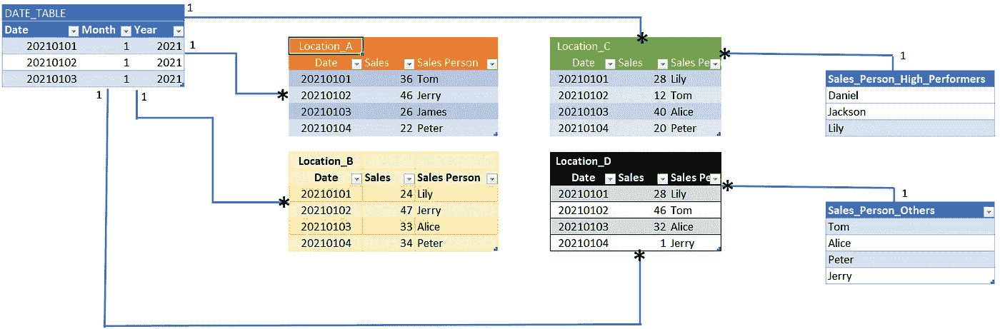
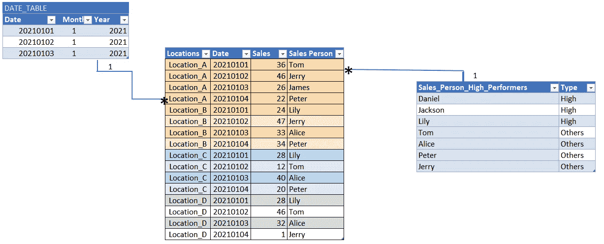
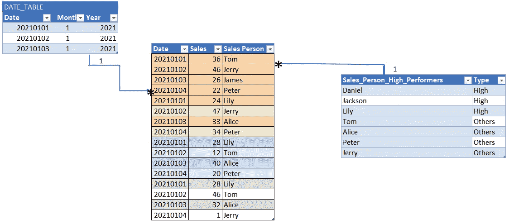
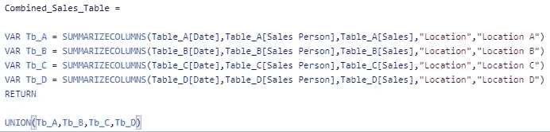
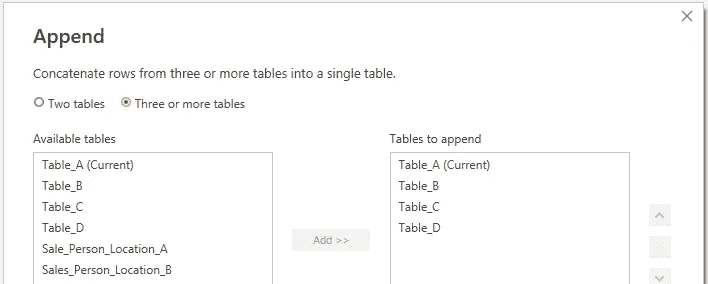
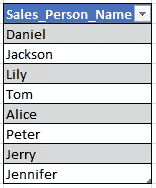
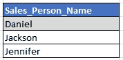
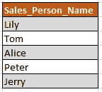

# 功率 BI 建模——技巧和窍门

> 原文：<https://towardsdatascience.com/power-bi-modelling-tips-and-tricks-9726e1d9085b?source=collection_archive---------26----------------------->

## 一些有用的提示和功能，我希望我能早点知道


托德·迪默在 [Unsplash](https://unsplash.com?utm_source=medium&utm_medium=referral) 上拍摄的照片

拥有一个简单的数据模型是很棒的。你知道为什么吗？因为有一个简单的模型会让生活变得容易得多！就像下雨天有把伞。

你的模型简单了就好解释了。最重要的是，它更容易解决问题。

在本文中，我将介绍一个经过简化的模型，以及一些可以帮助您进行故障排除的工具。

这是我遇到的一个模特。



作者图片

位置 A、B、C 和 D 是包含销售日期、销售数量和销售人员的表格。

有一个很棒的日期表。

侧面还有两个维度表，用于区分高绩效者和其他人。

当然，你仍然可以像这样进行一些分析。但是请注意每个事实表(位置 A、B、C 和 D)是如何分开的？

这就是问题所在——您必须创建 4 个不同的度量来计算一个指标。(您必须创建销售位置 A、位置 B 等的总和的度量)。这不是有效的，而且很容易出错。

还有维度表的问题，如果这些表是为了通过表现来区分个人，那么可以将它们合并成一个主题或维度表。

我们该如何简化这一点？

我们可以通过组合事实表和维度表来简化这一点，如下所示。



作者图片

看到这个模型有多简单了吗？

# 两种合并表格的方法。

让我们来谈谈合并数据表的两个选项。

有两个选项，DAX 和 Power Query。

## 使用 DAX 将表追加到一起。

不建议这样做，但不管怎样我们还是要穿过去，因为这样最快；您不必将任何数据重新加载到模型中。

要在 DAX 中做到这一点，您可以使用 UNION 函数并将表追加到一起。将它与前面的维度表连接起来。

```
Combined_Sale_Tables = UNION(Table_A,Table_B,Table_C,Table_D)
```

现在你不需要 4 种不同的方法来衡量销售了！只有一个。

这是模型现在的样子。



作者图片

有一个小问题。

组合事实表没有位置名称，因为它们本来就不在那里。

我们可以通过使用 SUMMARIZECOLUMNS 来解决这个问题。



作者图片

缺点是您的模型中会有多个表。

当然，你可以隐藏它们，但它仍然杂乱。另外，除非特别说明，否则其他用户可能不知道您为什么决定将它们附加在一起。

最大的缺点是，如果列名和列号不同，您可能需要做一些工作。

## 使用 Power Query 将表追加到一起

现在让我们使用下面的 append 方法来尝试 Power Query。

**电力查询>首页>追加查询**



作者图片

这种方法的优点是适应性更强；无论您是否有列标题困难、额外的列或数据格式问题，Power Query 都可以很好地处理它们。

缺点是速度，您需要将这些数据重新加载到模型中。如果你有一个大模型，这可能是一个令人头痛的问题。

DAX 和 Power Query 都是简化事实表的好选择，但是如果您手头拮据，可以尝试 DAX，但是如果您有一点时间，可以使用 Power Query。

使用这两种方法中的任何一种，您都会得到相同的模型。


作者图片

# 让我们让生活变得更简单。

现在，让我们来看看两个非常有用的功能，它们会让你的生活更轻松。

这些是 INTERSECT，EXCEPT 和 VALUES 函数。

## 使用带有值的 EXCEPT 函数来标识异常。

假设 HR 找到你说:“我这里有一份销售员工的名单，你能看看他们是否都做了销售吗？”

这是发给你的表格。



作者图片

现在让我们用除和值☺

```
Table_EXCEPTIONS = EXCEPT(Sale_Person_All,VALUES(Combined_Sale_Tables[Sales Person])) 
```

VALUES 在 Combined_Sales_Tables 中创建一列唯一值(销售人员姓名), EXCEPT 针对发送给我们的表创建一个左反联接。

这就是结果。



作者图片

使用此功能，可以识别三个名称。

## 使用带值的 INTERSECT 函数来标识交点。

类似地，如果你与 INTERSECT 交换代码，你将能够在 HR 发送的表格中看到每一个成交的人。

```
Table_INTERSECT = INTERSECT(Sale_Person_All,VALUES(Combined_Sale_Tables[Sales Person]))
```

这就是结果



作者图片

概括一下，

**建模** —如果您看到多个事实表或维度表四处浮动，请尝试合并它们。

**表格检查** —使用 EXCEPT 和 INTERSECT with 值查找表格之间的差异。

数据建模很有趣！

尽可能保持简单。结果会让你大吃一惊！

暂时就这样了。在您的数据之旅中保持安全并祝好运。