# Power BI + Power Automate —文件监控

> 原文：<https://towardsdatascience.com/power-bi-power-automate-file-monitoring-52a2df01f65b?source=collection_archive---------28----------------------->

## 使用表格功能监视 SharePoint 文件并使用 Power Automate 设置警报

照片由 [Murai 拍摄。hr](https://unsplash.com/@murai?utm_source=medium&utm_medium=referral) on [Unsplash](https://unsplash.com?utm_source=medium&utm_medium=referral)

你使用 SharePoint 吗？就我个人而言，我并不太喜欢它。因为疫情，我不得不在过去的一年里经常使用它。至少可以说，我已经爱上了它。

当我不得不要求各单位在 SharePoint 上填写工作簿时，SharePoint 证明了它的有用性。总共有 50 本练习册。如果我能把所有的工作簿放在一个文档中，事情会简单得多，但是由于工作的性质，它们必须分开。

问题是，当用户与工作簿交互时，额外的列、空白行和数据问题开始出现。(有些人只是喜欢在不需要的时候添加数据)。我不能对工作簿本身进行完全限制，因为这样会禁用排序和过滤。我必须找到一种方法来监控工作簿，这样如果有错误，我可以立即得到通知。

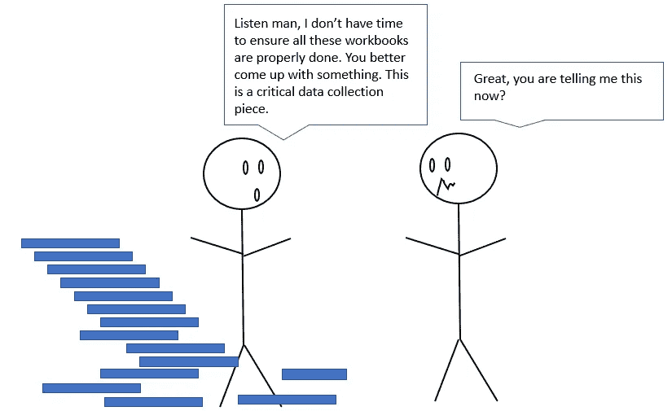

作者图片

解决方法是什么？至少有 50 个工作簿需要进行数据质量监控。

Microsoft Power Query 可以做到这一点！如果您知道您的表函数，Power Query 可以直接访问 SharePoint 工作簿并监视它们。

如果你是 Power BI 的新手——这里有一篇关于如何建立模型的[快速文章](/power-bi-modelling-bcd4431f49f9?sk=1f054aeeeb14c96238fd6e4f8e192ee2)。

我将概述我对这些工作簿中每一个的问题，以及可以解决这些问题的 M 表函数。

# 关于每个工作簿的问题

这些都是简单的问题，但如果在开始时回答不当，以后处理起来就真的很头疼了。

1.  每个工作簿中有多少行？
2.  **每个工作簿中有多少列？**
3.  **标识栏中有多少空格？**
4.  **在标识栏中，它们都是不同的吗？**
5.  **如何使用 Power Automate 为正在更正的工作簿向自己发送预警通知？**

# 答案

首先，让我们使用“连接到 SharePoint 站点”选项将 Power BI 连接到 SharePoint 站点。这可以通过下面的**新源>共享点文件夹>文件夹名称**找到

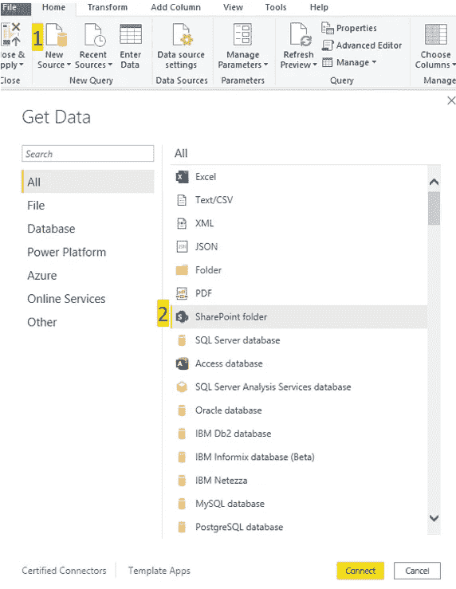

作者图片

现在要使用我们的表函数，(有很多，你可以在这里找到它们)，我们必须将二进制文件转换成表。要使用表函数，您需要表数据类型。

这可以通过使用 ***Excel 轻松实现。工作簿*** 功能。但是，如果您的工作簿更复杂，您必须先创建一个函数来转换它们。你可以在这里阅读如何在 Power BI [中构建函数。](/functions-in-power-bi-56e9e11e4669?sk=32f65f6e5196dbd96ed43a53584ad2fc)

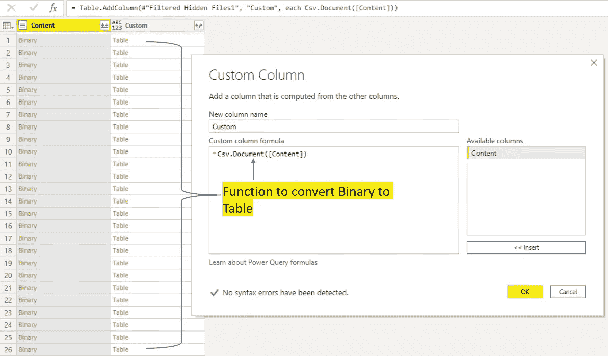

作者图片

二进制文件现在是表格格式。让我们开始回答问题。

## **每个工作簿有多少行？**

我们可以用 ***表来回答这个问题。RowCount* 函数**函数。

我将添加列并添加到 ***表中。RowCount* 函数**函数。

这就是结果。

一般模式是表。函数([您的表列])

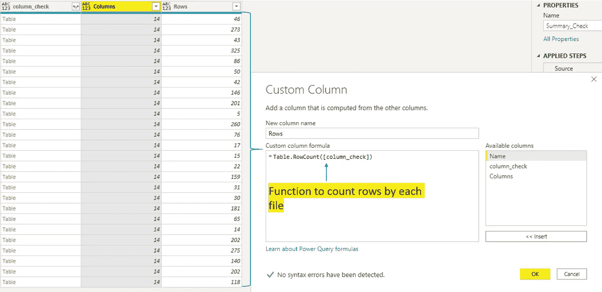

作者图片

## 每个文件有多少列？

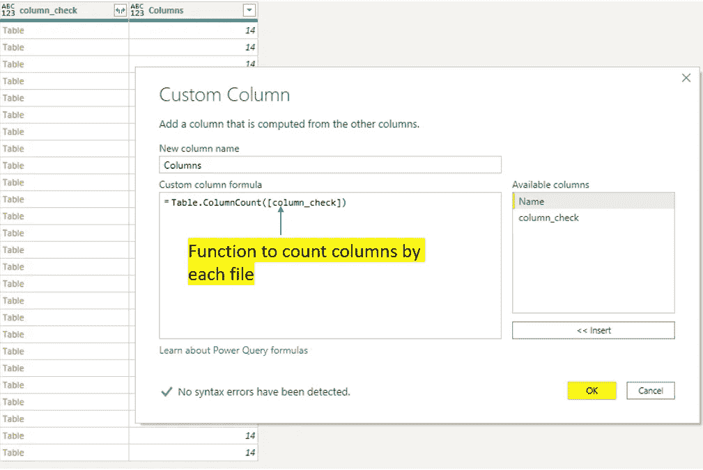

作者图片

我将应用与上面相同的方法，但是使用***table . column count .***

看起来总共有 14 列和行，因工作簿而异。

## 每个文件中有多少个空白标识？

我们将使用一个新的列，并在 Column1=null 中添加，但是因为我们希望看到有多少行是这样的，所以我们将把它包装在 ***表中。行数***

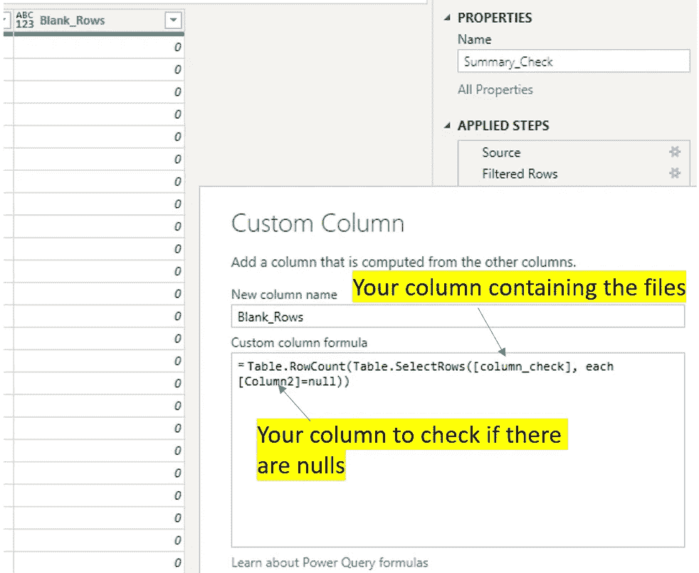

作者图片

一开始就值得关注这些文件。

此后要找到丢失的记录将是一件非常头痛的事。

第一次把事情做对不会有坏处。

## **的标识栏，怎么都是截然不同的？**

同样的过程，但是用一个函数调用 ***列表。分明的*** 。这个有点棘手，因为它需要一个列表数据类型作为输入。

在 power query 中，下面的[column_check]是一列表，而[Column3]是每个表中的一列。

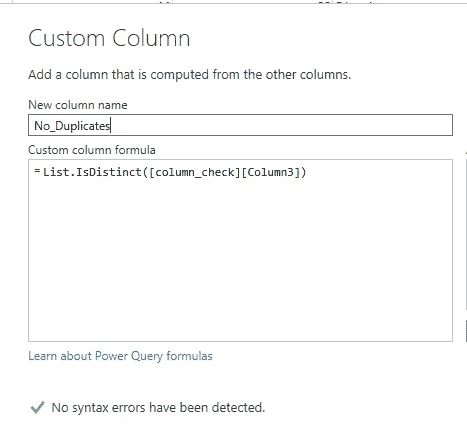

这里我用的是 List。is distinct([表格][列])。

## 如何识别一个条目？

这与上面的模式相同，添加一列并使用右表函数。这里我使用了**和*表。包含*和**

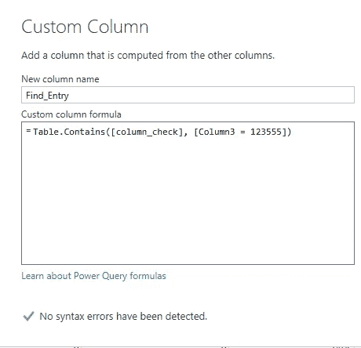

最后，您将得到一个与此非常相似的简单表格。

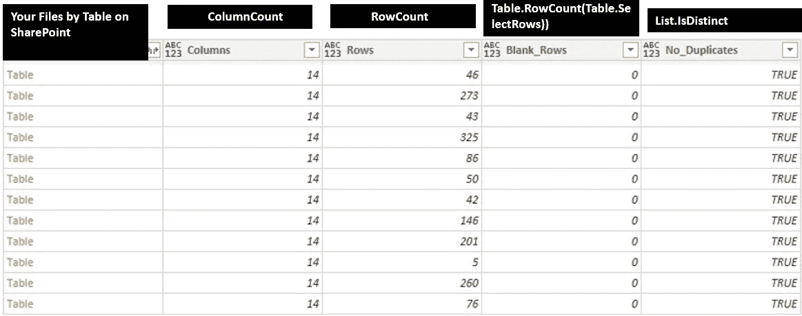

# **如何使用 Power Automate 为正在更正的工作簿向自己发送警告通知？**

我不确定您是否使用 Power Automate，但它绝对值得一试。该工具有助于监控和简化工作流程和审批。

这是一个简单的自动化过程，帮助我跟踪谁访问了 SharePoint 上的这些文件。

我决定为此创建一个流程的原因是，很难找到访问过特定文件夹的历史用户列表。我也不想白天处理数据转储。

## 这是一个简单的 3 步过程。

首先，Power Automate 查看 SharePoint 文件夹 **>获取访问过该文件夹的个人的姓名和电子邮件>将其添加到 SharePoint 上的 Excel 表格中>用通知提醒我**

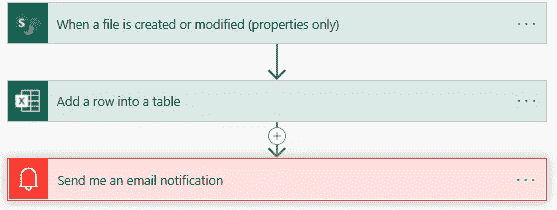

作者图片

这个过程是我在最后设置的，当时我已经完成了数据清理和验证，并发现了错误。然后，我将设置它，以便在工作簿被访问并进行更正时提醒我。

**第一步**

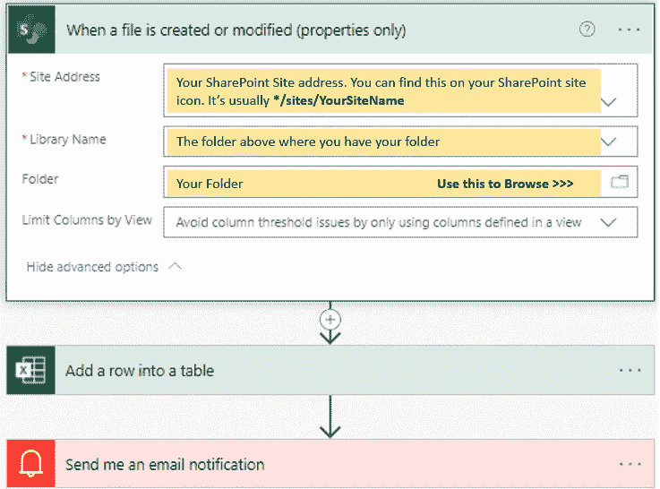

作者图片

**第二步**

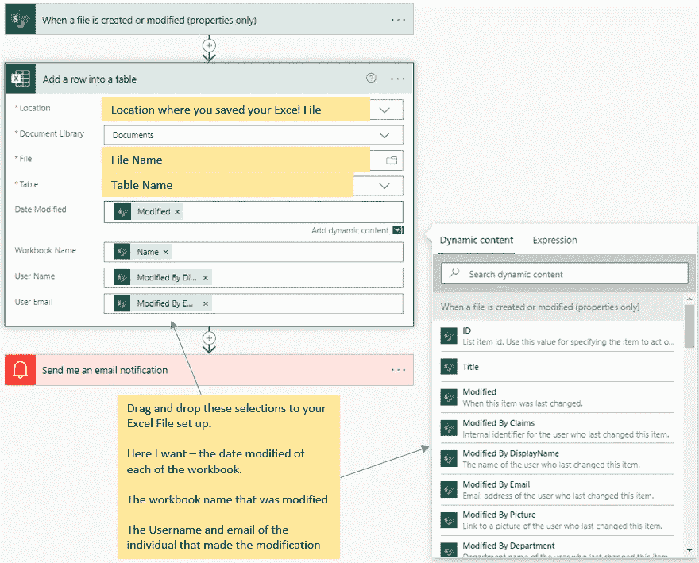

作者图片

您必须首先设置一个简单 Excel 表，这样 Power Automate 将知道在哪里记录您的数据。

我不必将这些元素编码到我的流中，这些都是拖放的，这太棒了！

还有其他可用的属性，如个人的个人资料图片和部门等。

**第三步**

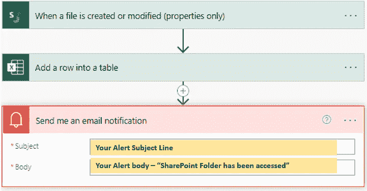

作者图片

最终结果是，当有人访问该文件夹进行更正时，会出现一个警告，同时还会出现一个跟踪用户信息的 Excel 工作簿。

这是记录某人何时访问文件夹的工作簿

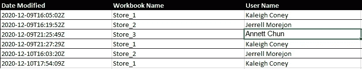

作者图片

万一有人回来说:“我从来没看过你的邮件，也没看过你的文件夹。”

你可以说——“是的，你在 09 年 12 月 9 日访问了这个文件夹”。

现在有一个更简单的方法来监控人们是否访问了一个文件夹，缺点是你没有一个 Excel 跟踪文档。如果这种级别的监控对您来说不重要，那么您可以使用下面的方法。

导航到您的文件夹，右键单击并选择提醒我。

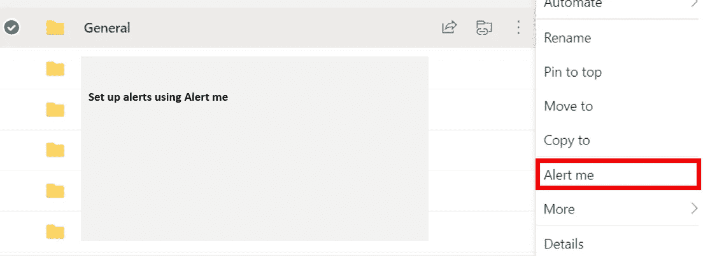

作者图片

您可以在文件夹级别对此进行设置，以便每当有人访问该文件夹时，您都会收到一封电子邮件。

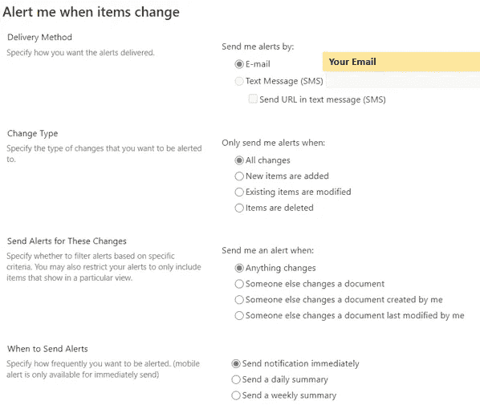

作者图片

然后，您可以选择发送方式，是否希望通过短信或电子邮件向您发送提醒，更改类型和持续时间等。

希望这对你的旅程有所帮助！

我讨厌做“老大哥”，但有时一开始就需要监控，以确保你获得尽可能准确的数据。最后还是值得的。

在本文中，您已经了解了使用 Power Query 连接到 SharePoint、使用表函数监控数据质量，以及最后使用 Power Automate 在有人进行更正时提醒您的一些基本知识。

这里有一些有用的链接-

[Microsoft Power Query 表格函数](https://docs.microsoft.com/en-us/powerquery-m/table-functions) —一旦您将文件转换为列格式的表格，所有这些函数都可供您使用。试着把它们嵌套起来，组合起来。太棒了！

[微软 Power Automate](https://docs.microsoft.com/en-us/power-automate/getting-started)——使用模板并调整它们。这比从头开始创建自己的要好得多。

祝您愉快，并保持安全！