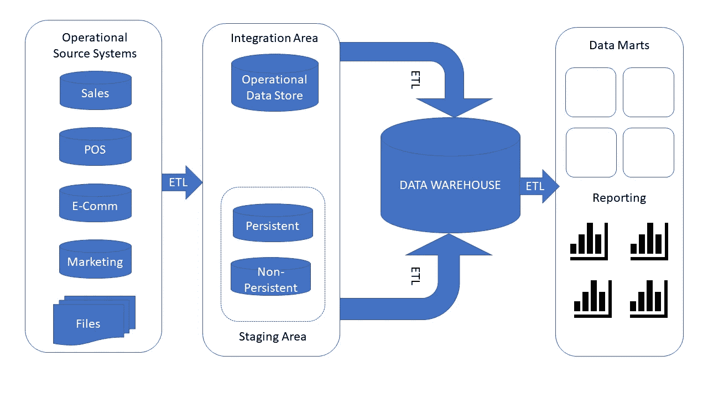
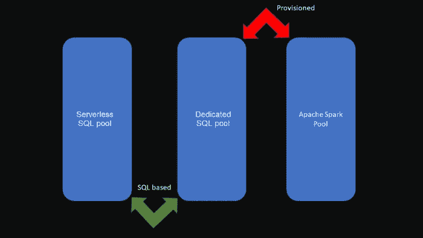
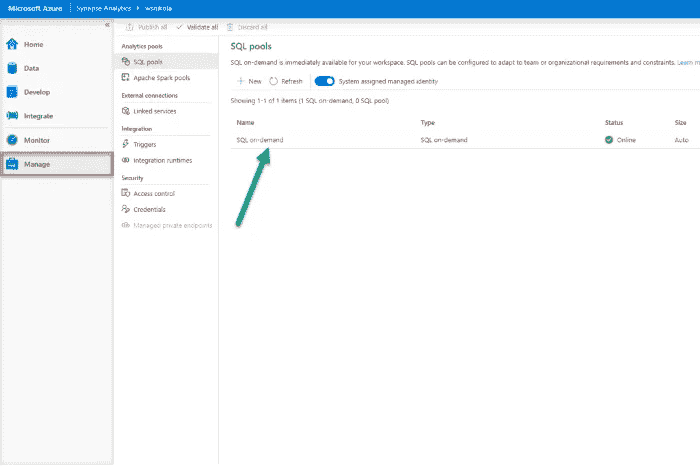
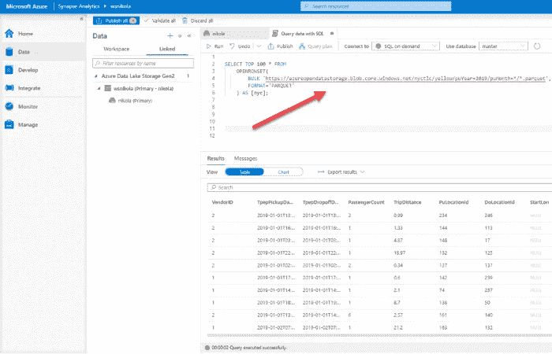
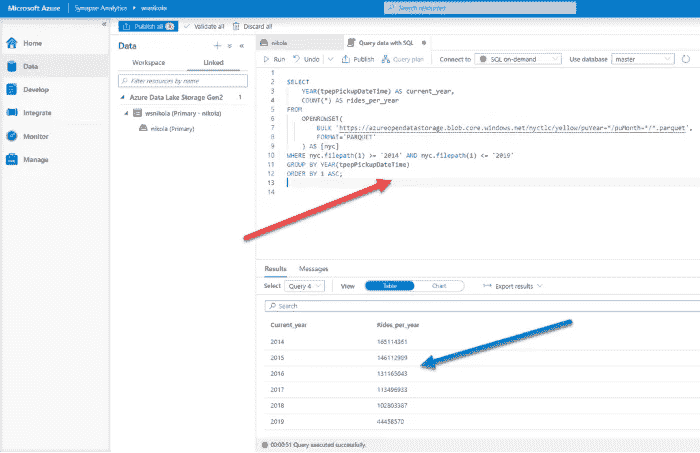
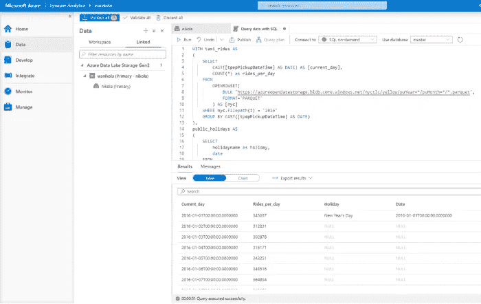

# Power BI 和 Synapse，第 1 部分:可能的艺术

> 原文：<https://towardsdatascience.com/power-bi-synapse-part-1-the-art-of-im-possible-b2bdb4d7c866?source=collection_archive---------12----------------------->

## 在这个关于 Power BI 和 Synapse Analytics 集成的博客系列的第一部分中，了解 Synapse 中的无服务器 SQL 池带来的巨大灵活性。


[https://unsplash.com/photos/7JX0-bfiuxQ](https://unsplash.com/photos/7JX0-bfiuxQ)

*通过在 2019 年底推出 Azure Synapse Analytics，在数据处理方面开创了一个全新的视角。一些核心概念，如传统的数据仓库，受到了更多的审查，而在数据爱好者意识到 Synapse 带来的新功能后，各种新方法开始涌现。*

【Synapse 不仅对数据接收、转换和存储选项产生了巨大影响，它还为数据服务和可视化提供了全新的可能性！

因此，在这一系列博文中，我将尝试探索 Power BI 如何与新平台协同工作。作为 Power BI 开发人员，我们在使用 Synapse 时有哪些选择？在哪些数据分析场景中，Synapse 将发挥优势，帮助您实现(im)可能性？什么时候您想利用 Synapse 中的创新解决方案，什么时候您会更好地坚持使用更传统的方法？使用 Power BI — Synapse combo 的最佳实践是什么，在最终决定采用哪种方法之前，您应该评估哪些参数。

*完成后，我相信您应该会更好地理解 Power BI 和 Synapse 之间集成时每个可用选项的“优缺点”。*

# azure Synapse Analytics——新成员，还是…？

由于 Power BI 已经是一款成熟而知名的产品(去年 7 月庆祝了它的 5 岁生日)，在我们深入了解 Power BI 和 Synapse 之间的关系之前，我相信我们需要花一些时间来了解这项“更年轻”的技术…

正如我已经提到的，Synapse 已经在大约 2 年前推出(2019 年末。)并于今年 3 月正式上市。官方说法是，它继承了 Azure SQL 数据仓库(SQL DW ),是 SQL DW 的一个发展。

那么，如果我们将 Synapse 视为“新上市的公司”，或者仅仅是现有产品的品牌重塑，这公平吗？

在回答这个问题之前，让我们先来看看传统的数据仓库架构:



作者插图

在典型的传统数据仓库场景中，您将从多个不同的来源收集数据，执行一些转换、数据清理等。在将整合的数据放入关系数据仓库之前。这是您的报告解决方案的焦点，是您的数据的“真实的单一来源”,您可以使用一系列工具从那里构建各种报告，如 Crystal Reports、SSRS 或 Power BI，如果我们谈到微软的解决方案的话。您还可以使用 SSAS 构建一个额外的语义层来创建“多维数据集”(包括表格和多维数据集)，然后使用上面提到的报告工具(不要忘了优秀的旧 Excel)将这些多维数据集作为目标。

现在，有了 Azure Synapse Analytics，您可以在一个屋檐下获得所有这些(以及更多)功能！即使默认情况下 Synapse 中没有包含 SSAS，也可以将其作为外部服务进行链接。

# 为您的数据提供瑞士刀

你能认出下图中的物体吗？


[Denise Jans 在 Unsplash 上拍摄的图片](https://unsplash.com/photos/-J1cTtVpj8k)

没错，就是大名鼎鼎的“瑞士刀”。你可以切纸、开瓶葡萄酒或啤酒，或者切一些小物件——所有这些都只需要一个工具！

所以，如果你问自己——瑞士军刀和 Synapse 到底有什么共同之处？！好吧，你可以把 Synapse 想象成一个可以满足你所有数据需求的单一工具。

您需要从多个不同的来源导入数据吗？Synapse 可以做到这一点。在提供数据之前，是否需要对数据进行转换？Synapse 也能做到。你需要存储数据吗？Synapse 可以帮你做到。需要查询非关系型数据，甚至直接查询文件吗？Synapse 可以做到这一点。

现在要小心了:您需要使用普通的老式 T-SQL 查询非关系数据，甚至是直接查询文件吗？Synapse 可以做到这一点！怎么了？？？！！！！是的，您可以编写 T-SQL 来查询 CSV、JSON 或 parquet 文件中的数据。但是，在这个系列的后面会有更多的介绍。需要建立机器学习模型吗？Synapse 可以帮你做到这一点。最后，您是否需要直接从 Synapse 创建您的 Power BI 报告？是的，那也是可能的！

您可能已经注意到，Synapse 是针对所有数据任务的一站式服务。

# Azure Synapse Studio —所有活动的入场券

当我解释一些技术性的东西时，我喜欢和非技术性的东西做比较，这样没有技术背景的人就能理解基本的概念。


[鲍勃·科因在 Unsplash 上拍摄的图片](https://unsplash.com/photos/JjmH7cI6dzo)

现在，你可能知道当你第一次去一个著名的旅游城市旅游时，你会想参观所有重要的地方:博物馆、观光景点、当地景点……而这些城市中的大多数都会给你一张“城市卡”。你可以用一张卡进入所有的主要城市景点，这样可以节省你的时间和金钱。

你可以把 Azure Synapse Studio 想象成“那种”卡。这是一个适用于所有不同任务的统一工作区，包括数据准备、数据仓库、监控和管理资源等。

# Synapse Workspace —了解核心组件

现在，我们准备深入了解 Synapse 工作区的核心组件。

最重要的部分是分析引擎。Synapse 工作区中有三个不同的引擎。其中两个是 SQL 风味的(专用 SQL 池和无服务器 SQL 池)，第三个是基于 Apache Spark 的(Apache Spark Pool)。

此外，其中两个是预配置的(专用 SQL 池和 Apache Spark 池)，而第三个(无服务器 SQL 池)的工作方式类似于无服务器解决方案。用最简单的方式，它看起来像这样:



作者图片

在这个博客系列中，我们将不分析 Spark 池，因为我们的重点将是基于 SQL 的解决方案，尤其是无服务器 SQL 池。

# 无服务器 SQL 池—无需任何硬件即可发挥全部功能！

一旦您创建了 Synapse 工作区，您将在您的 SQL 池下看到一个无服务器 SQL 池:



作者图片

在我看来，这是 Synapse 的革命性特征之一。从本质上讲，无服务器 SQL 池能为您做的事情几乎是无与伦比的:您可以直接在您的数据湖中查询数据，而不需要将它转移或复制到任何地方！而且，您可以编写普通的老式 T-SQL 来查询数据湖中的数据！是的，包括 CSV、JSON 和拼花文件！

由于它是一个无服务器系统，您不需要设置任何类型的基础设施或集群。一旦创建了工作区，您就可以开始查询数据了！无服务器 SQL pool 作为一个独立的聚合库服务，所以保留资源没有成本。您只需为您的查询处理的数据量付费(在撰写本文时，费用为 5 美元/1 TB)。请记住，在规划工作负载时，最小计费量是 10 MB。这个最低阈值不适用于元数据查询，所以如果您执行类似以下的操作，您根本不必担心会被收费:

```
SELECT * FROM sys.objects
```

有了这个工具，你可以思考无数种可能的方法:

*   您可以对数据湖中的数据快速执行即席查询，然后再决定从数据湖中获取更多信息的最佳方式
*   您可以构建一个额外的逻辑层，一种在原始或非关系数据之上的“抽象”数据仓库，而无需将数据移动到物理存储中
*   您可以直接在数据湖中转换数据，并从那里直接使用它(例如，使用 Power BI)

如前所述，您可以使用 T-SQL 直接从数据湖中查询数据。不仅如此！还可以编写 T-SQL 从 Spark 表和 CosmosDB 中检索数据。

通过使用扩展版本的 *OPENROWSET* 函数，可以编写用于查询非 SQL Server 数据的 T-SQL。由于非原生用法，关于 T-SQL 的一些功能，显然[有一些限制](https://docs.microsoft.com/en-us/azure/synapse-analytics/sql/overview-features)。

我强烈建议阅读詹姆斯·塞拉博客上的[这篇文章](https://www.jamesserra.com/archive/2020/08/sql-on-demand-in-azure-synapse-analytics/)，在那里他收集并回答了许多关于无服务器 SQL 池的问题。

这里还有一个关于无服务器 SQL 池[最佳实践的概述](https://docs.microsoft.com/en-us/azure/synapse-analytics/sql/best-practices-sql-on-demand)。

# Abrakadabra —使用 T-SQL 读取拼花文件

是的，我知道这听起来像是我们需要一根魔杖来使用普通的 T-SQL 直接从 parquet 文件中查询数据…但是，这是可能的！相信我，你不需要成为一个魔术师——一些基本的 T-SQL 知识就足够了。



作者图片

在这个例子中，我使用了一个样本纽约出租车数据集。数据存储在一个 parquet 文件中，但是我可以在我的 T-SQL 语法中使用 OPENROWSET 函数来查询大约 15 亿条记录数据集，就像它存储在我的 SQL Server 数据库中一样！多酷啊！

此外，我可以在此基础上进行扩展，执行各种聚合、分组、where 子句…



作者图片

如果这还不够，看看这个:



作者图片

下面是在两个 parquet 文件上运行的 T-SQL 代码:

```
WITH taxi_rides AS
(
    SELECT
        CAST([tpepPickupDateTime] AS DATE) AS [current_day],
        COUNT(*) as rides_per_day
    FROM  
        OPENROWSET(
            BULK 'https://azureopendatastorage.blob.core.windows.net/nyctlc/yellow/puYear=*/puMonth=*/*.parquet',
            FORMAT='PARQUET'
        ) AS [nyc]
    WHERE nyc.filepath(1) = '2016'
    GROUP BY CAST([tpepPickupDateTime] AS DATE)
),
public_holidays AS
(
    SELECT
        holidayname as holiday,
        date
    FROM
        OPENROWSET(
            BULK 'https://azureopendatastorage.blob.core.windows.net/holidaydatacontainer/Processed/*.parquet',
            FORMAT='PARQUET'
        ) AS [holidays]
    WHERE countryorregion = 'United States' AND YEAR(date) = 2016
)
SELECT
*
FROM taxi_rides t
LEFT OUTER JOIN public_holidays p on t.current_day = p.date
ORDER BY current_day ASC
```

因此，我们创建了两个 cte，使用 WHERE 子句过滤数据、聚合函数，最后像查询“普通”SQL Server 数据库一样连接 cte…而且，别忘了，我们是直接从两个 parquet 文件中检索数据！

不，你不需要成为哈利波特来做到这一点——在 Synapse Workspace 中使用无服务器 SQL 池是你应该执行的唯一“技巧”!

# 结论

这只是对 Synapse Analytics 的简单介绍，Synapse Analytics 是针对您的数据工作负载的一体化解决方案。我们并没有涵盖该平台中的所有概念和功能，我们的想法是让您开始使用 Synapse 与 Power BI 协同工作。

现在，我希望您已经对 Synapse 提供的主要功能有了更好的概述和更全面的了解，并且一旦您开始使用 Synapse 构建您的 Power BI 报告，您就可以利用这些功能。

慢慢来，探索 Synapse，尝试不同的方法来处理您的数据工作负载，然后我们一起进入下一阶段，Power BI 及其与 Synapse 的集成(尤其是与无服务器 SQL 池的集成)将是我们的关注点！

感谢阅读！

[成为会员，阅读 Medium 上的每一个故事！](https://datamozart.medium.com/membership)