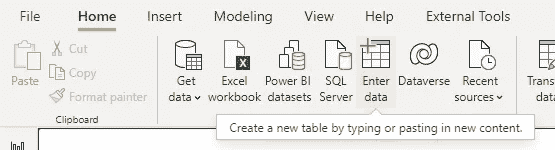
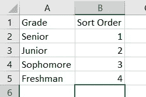
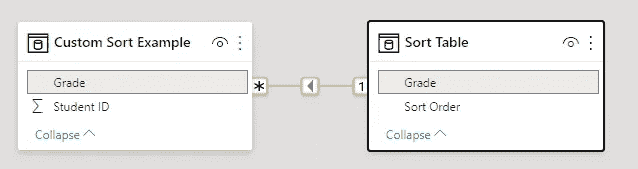
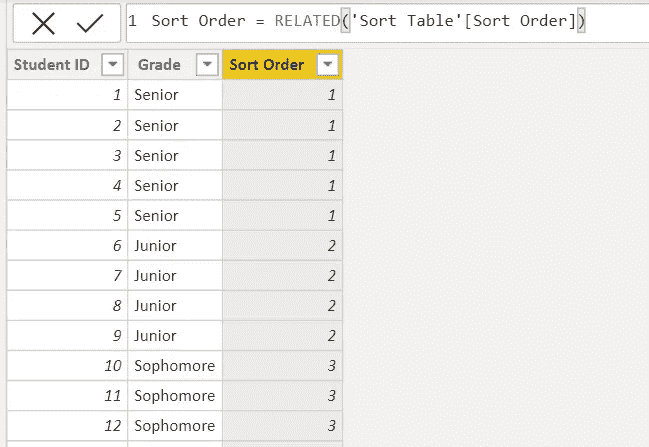
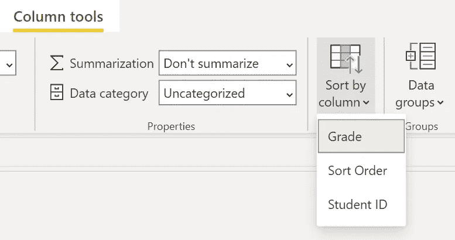
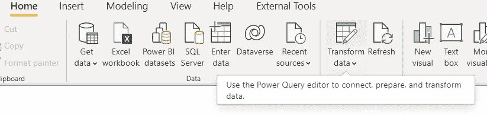
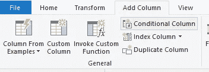
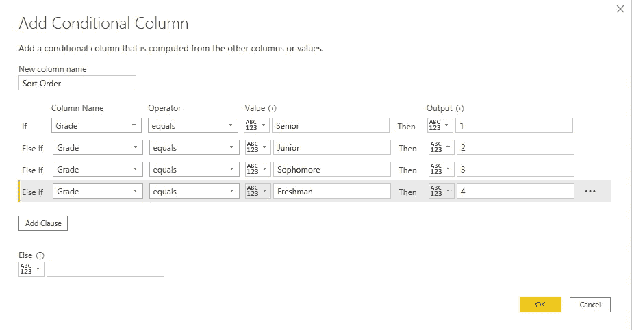

# Power BI 提示和技巧:自定义排序

> 原文：<https://towardsdatascience.com/power-bi-tips-tricks-custom-sort-7cf3b4cf2a5e?source=collection_archive---------11----------------------->

## Power BI 提示和技巧系列的一部分

大约两年前，我开始使用微软的 Power BI。一路走来，我学到了一些更高效做事的技巧和诀窍。这个系列是为了方便初学者而设计的，所以如果你有什么不明白的地方，请告诉我。我也很乐意听到你发现有用的额外的提示和技巧！

您可以直接跳到解决方案，并将它们应用到您自己的数据中，或者您可以跟随[一起了解这个示例数据](https://drive.google.com/file/d/1Vl3vwVeLfydjpR7DkI6V6t18HfgBQ0M8/view?usp=sharing)。

照片由 [Avel Chuklanov](https://unsplash.com/@chuklanov?utm_source=medium&utm_medium=referral) 在 [Unsplash](https://unsplash.com?utm_source=medium&utm_medium=referral) 拍摄

# 问题是

假设我正在处理一所(小)大学的数据，他们想知道每个年级有多少学生。很好，这听起来像是一个制作簇状条形图的机会。

我将“年级”拖到轴上，将“学号”拖到值上，得到如下结果:

我可以按学号(学生人数)或年级的字母顺序对图表进行排序。但是我希望我的数据按照时间顺序排序，学生从大一开始，然后是大二，大三，最后是大四。

啊！当我有一段时间没有这样做时，我几乎总是首先尝试添加一个计算列，然后按此排序。但是这给了我们一个错误，因为我们引入了一个循环依赖。

但是不要害怕！有几种可能的策略可以按照我们想要的任何顺序对数据进行排序。

# 解决方案 1:创建一个附加表

当其他人正在管理排序应该如何出现时，或者如果您有许多不同的级别，这是一个很好的方法。您可以在 Power BI 中直接创建该表:

或者，您可以创建一个额外的 Excel 工作簿或在现有工作簿中添加一个工作表。我通常更喜欢 Excel 格式的表格，因为我觉得在需要的时候更容易更新。我们的表应该是这样的:

现在，我们将把这个表添加到 Power BI 文件中，并在我们的模型中创建一个关系。

因为我们创建了一个单独的表，所以现在我们可以使用 RELATED 创建一个计算列，而不会遇到循环依赖问题。

这个栏目的表现和我们预期的一样(高年级是“1”，低年级是“2”，等等)。).最后，我们告诉 Power BI 按照我们的排序顺序列对我们的等级列进行排序。同时选择等级列>列工具>按列排序>排序顺序。

瞧啊。

而且现在做更新超级容易。假设我们为五年级学生增加了一个超高年级。我们所要做的就是更新我们的 Excel 文件，保存它，并刷新 Power BI。

# 解决方案 2:使用超级查询

如果不太可能改变我们想要的排序方式，这是一个很好的选择。我们仍然可以使用这个选项进行更新，只是对于那些不太熟悉 Power Query 的人来说，它不太方便使用。

使用此选项，我们将通过选择“转换数据”选项进入超级查询编辑器。

我们只需点击鼠标就可以做到这一点，所以不要惊慌，但如果你愿意，我们也可以使用 M 来做到这一点。无论哪种方式都很棒！

如果您想要指向并单击，请在超级查询编辑器中选择“转换”功能区下的“条件列”按钮。

然后，您可以为每个级别创建一个附加子句:

现在，就像我们对另一个解决方案所做的那样，您所要做的就是退出超级查询编辑器，并使我们的新条件列成为排序“Grade”所依据的列。

你有它！当您需要以自定义顺序对列进行排序时，有两种解决方案:一种是使用附加表和相关函数，另一种是在 Power Query 中使用条件列。

你喜欢哪种解决方案？你有更好的解决方案可以分享吗？

继续用你的头撞墙——这样会好得多！

[***珍娜·伊格尔森***](https://medium.com/@jeagleson) *我的背景是工业组织心理学，我在人物分析中找到了自己的家。数据使我的作品变得生动。我主要使用 Power BI，但偶尔也会使用 Tableau 和其他工具。我很想听到更多关于你的旅程！在*[*Linkedin*](https://www.linkedin.com/in/jenna-eagleson/)*或*[*Twitter*](https://twitter.com/JennaEagleson)*上联系我。*