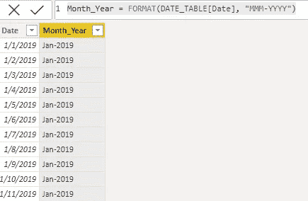
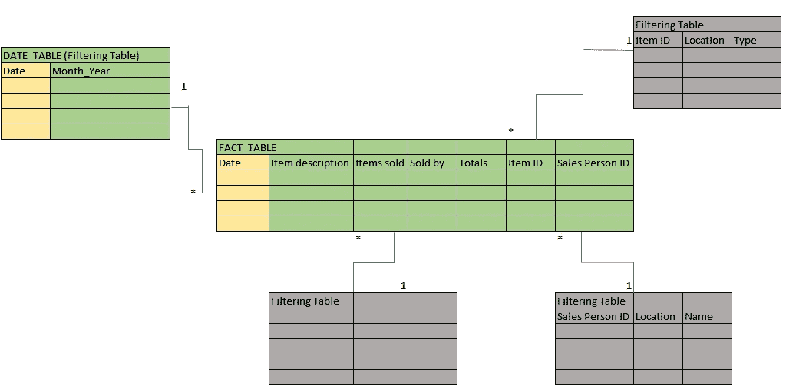
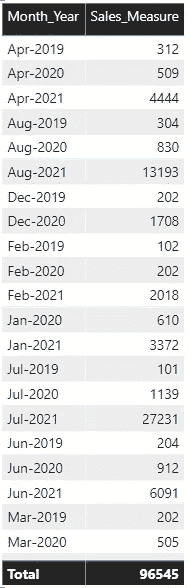
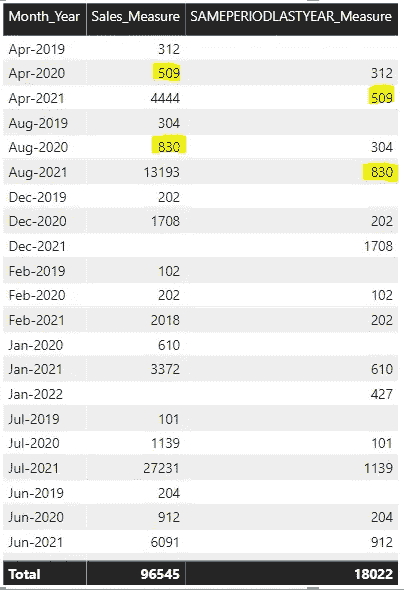
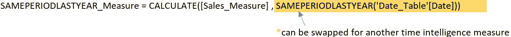
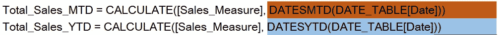
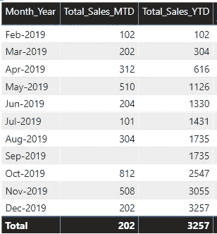
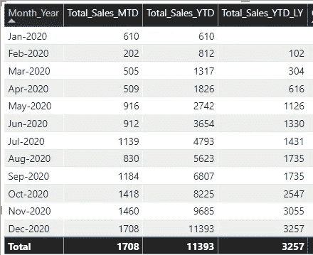
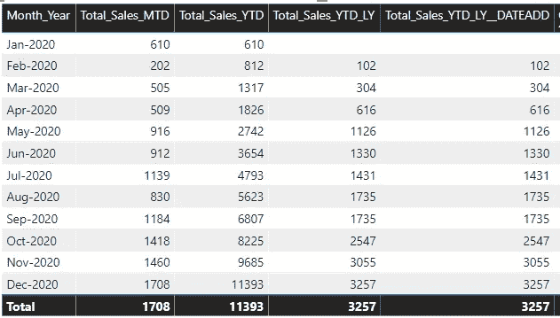

# Power BI —使用时间智能

> 原文：<https://towardsdatascience.com/power-bi-working-with-time-intelligence-3496d288bb61?source=collection_archive---------13----------------------->

## 基于时间的报告的简单概念


由 [Djim Loic](https://unsplash.com/@loic?utm_source=medium&utm_medium=referral) 在 [Unsplash](https://unsplash.com?utm_source=medium&utm_medium=referral) 上拍摄的照片

Power BI 简化了时间智能的使用。一旦您理解了这些概念，您将能够进行各种复杂的基于时间的报告。

为了让时间智能在 Power BI 中工作，您需要一个日期表。没有它肯定不行。一个简单的日期表可以在[这里](/dates-in-power-bi-ada30f85e4b3)找到。

在本文中，我将介绍 Power BI 中一些非常有用的时间智能功能，以及使用它们的步骤。

那么使用这些时间智能功能的步骤是什么呢？

1.  构建一个日期表
2.  构建通用衡量标准
3.  将时间智能函数添加到一般度量中

大概就是这样。我们来分析一下。

# 构建一个日期表

这是我用下面的创建的一个简单的日期表格。

```
DATE_TABLE = CALENDAR(DATE(2019,01,01),DATE(2022,01,01))
```

在这段代码中，Power BI 生成从 2019 年 1 月 1 日到 2022 年 1 月 1 日的所有日期。这就是使用 DAX 创建日期表的方法。

这里的关键词是 *all* ，记住时间智能功能不会处理缺失的日期。

在这里，我还添加了一个额外的列，称为“月 _ 年”,这是通过添加下面的新列来完成的。

```
Month_Year = FORMAT(DATE_TABLE[Date], “MMM-YYYY”)
```

下面是日期表格的外观。也可以随意尝试一下 FORMAT 函数。Power BI 为日期列提供了许多不同的格式样式。



作者图片

下面是添加了 DATE_TABLE 的模型的外观。

使用日期将 date_TABLE 的 DATE 列与 FACT_TABLE 连接起来。这是一个一对多的关系。

如果你想知道为什么这个模型是这样建立的，看看这篇[文章](/power-bi-modelling-bcd4431f49f9)。



作者图片

现在进入下一步。

# 构建一个通用度量。

您在这里建立的度量很重要。永远记住你要回答的问题。

出于演示的目的，我将创建一个没有任何过滤器的通用销售额。

```
Sales_Measure = SUM(FACT_TABLE[Totals])
```

这是它在 Power BI 中的一个简单表格中的外观。



作者图片

现在是最后一步，也是最有趣的部分。😀

# 向度量添加时间智能函数。

我第一次想用的智能函数是 SAMEPERIODLASTYEAR。

```
SAMEPERIODLASTYEAR_Measure = CALCULATE([Sales_Measure] , SAMEPERIODLASTYEAR(’Date_Table’[Date]))
```

在这里，我可以并排看到去年同期的销售额。



作者图片

在这里，2020 年 4 月的销售额是 509，2021 年 4 月是 4444。

SAMEPERIODLASTYEAR 度量从去年开始提取销售额，这样您就可以不用太多代码进行简单的比较。

这里有一个巧妙的技巧！

您可以用一个新的时间智能函数替换以前的函数，以创建一个新的度量值来度量不同的东西:)



作者图片

我想换成按月累计和按年累计。



作者图片

我再一次用另一种方法来代替时间智能方法。第一个是本月至今，另一个是年初至今



作者图片

在这里，您可以看到按月和按年累计的总和。

现在你已经对这些时间情报工作有了一个基本的概念，你可以在它的基础上进行构建了！

现在，我需要今年迄今为止的总销售额，并将其与去年同期进行比较。我想比较 2020 年和 2019 年的年度累计总数。

在这里，因为我们已经建立了“按年总计”度量，所以我们要做的就是像这样添加度量。

```
Total_Sales_YTD = CALCULATE([Total_Ses_YTD], SAMEPERIODLASTYEAR (DATE_TABLE[Date]))
```



作者图片

现在，视觉显示去年的运行总数。

一个被低估的函数是 DATEADD。只要你知道你想在多长时间内旅行，它允许你在任何时间方向旅行。🛸

在这里我也可以写，

```
Total_Sales_YTD_LY__DATEADD = CALCULATE([Total_Sales_YTD],DATEADD(DATE_TABLE[Date],-1, YEAR))
```

这将是结果。



作者图片

DATEADD 允许您按年、月或日移动。唯一的区别是，您必须计算持续时间，而不是调用像 PREVIOUSYEAR 或 SAMEPERIODLASTYEAR 这样的通用函数。注意不要输入错误的时间间隔。它发生了！

概括地说，下面是使用 Power BI 中的时间智能功能的步骤。

1.  **建一个日期表**，用它做维度/过滤/主题表，很重要。如果没有日期表，所有这些时间智能功能都将不起作用。
2.  **建立一个通用的衡量标准**，考虑一下，看看这个衡量标准的结果是否能回答你的业务问题。
3.  **为通用度量**添加一个时间智能函数，例如用 DATEQTD 替换 DATEYTD 当然会得到不同的结果，但模式是一样的。

在您的数据之旅中保持安全并祝您好运！