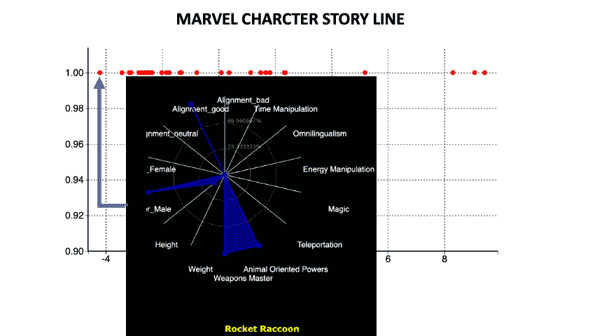

# 数据故事叙述的降维能力

> 原文：<https://towardsdatascience.com/power-of-dimensionality-reduction-for-data-story-telling-f64d7f57cbda?source=collection_archive---------18----------------------->

## 使用降维能力的最好方法之一是创建一个数据故事

米格尔·布鲁纳在 [Unsplash](https://unsplash.com/s/photos/superpower?utm_source=unsplash&utm_medium=referral&utm_content=creditCopyText) 上的照片

哦不！再来一篇降维的文章！但是等等，这不一样。有很多文章是从技术角度来解释降维的。但是，我将重点介绍如何以创新的方式使用降维的力量。您还会更好地体会到降维的强大功能，因为我将重点介绍它的使用，而不是技术细节。

我将带您了解如何使用降维的力量来讲述数据。

伟大的说书人会告诉你弄清故事情节的重要性，这是讲故事最重要的任务之一。它需要弄清楚开头、中间和结尾。

典型的故事情节(来源——作者提供的图片)

所以你可能会问，这和降维有什么关系？嗯，答案是

> 降维可以帮助您确定数据故事的开头、中间和结尾

使用现代最好的故事之一的数据集来说明这一点的最佳方式之一…漫威电影宇宙(MCU)。所以复仇者集合！这个数据集是关于 MCU 中的每一个超级英雄和他们的超能力。这个数据集太大，无法说明，所以这里只是一个示例视图。

漫威字符数据集-按作者分类的图像

现在让我们假设你必须使用这个数据集，讲述一个关于漫威人物的数据故事。这是一个巨大的数据集，几乎有 200 个字符。你可能会惊讶地知道，MCU 已经识别了差不多 175 种超能力。每个角色都可以拥有一种或多种超能力。这意味着您面临着查看 200 行* 175 列的挑战。

> 那么，如何弄清楚如何开始、中间和结束你的数据故事呢？降维有助于将这些庞大的数据压缩成一个 1D 故事情节。

降维有助于将这些庞大的数据压缩成 1D 的故事情节(来源——图片由作者提供)

下面是降维的结果。

降维结果(图片由作者提供)

一旦你看到所有的角色排成一行，你就会开始感受到掌控一切的力量！你不会被 175 维度吓倒。

每个点代表一个字符。让我们看看这些人物是什么。我们也可以叠加一张雷达图，它也将给出关于这些角色的超能力的额外信息。让我们从第一个点开始，如下图所示。

故事线中的第一个角色(图片由作者提供)

我们在这里看到最左边点对应于字符 Rocket 浣熊。你还可以看到显示超能力的雷达图。我们看到火箭浣熊有一个面向动物的超能力，也是一个武器大师。

现在让我们浏览其他初始点。你观察到这些点对应着黑豹和蜘蛛侠。

浏览初始点(作者图片)

所以很明显降维把所有有动物导向力的角色都放在了行首。这真是太棒了，我们看到降维并没有选择一些随机字符放在行首。这已经给了我们一些如何构建数据故事的提示。我们可以从基于动物力量的角色在 MCU 中的重要性说起。

现在让我们把注意力集中在这条线的中间。我们看到了角色猩红女巫。我们可以观察到她拥有心灵运输和魔法的超能力。

线的中间对应于具有传送和魔法的角色(图片由作者提供)

让我们观察一下位于这条线中间的其他一些字符。你会看到像托尔和奇异博士这样的角色。

线的中间对应于具有传送和魔法的角色(图片由作者提供)

这意味着降维选择了具有瞬移、魔法等异能的人物在中线。这真是太神奇了！我们的故事情节开始有意义了。我们可以从面向动物的能力的重要性开始，然后转移到具有魔法和心灵运输能力的角色！

现在让我们来看看角色故事情节的最后部分是什么。我们观察惊奇队长，她有多重超能力，比如心灵运输、魔法、能量操控和通用语。对于好奇的人来说，通用语是说、理解和破译任何和所有语言的能力。

中线对应具有多重能力的角色(图片由作者提供)

让我们观察一下这一行末尾的其他一些字符。我们看到灭霸和奥丁，他们都有多重超能力。所以降维把拥有多重超能力的角色放在了最后。

中线对应具有多重能力的角色(图片由作者提供)

所以我们的数据故事大概是这样的

从描述动物导向的力量在单片机中的重要性开始，并举例说明，如黑豹和蜘蛛侠。

然后谈谈心灵运输和魔法如何在吸引观众方面发挥核心作用。举例说明，如红色女巫，雷神，奇异博士。

以拥有多重超能力的角色结束故事，例如惊奇队长和灭霸。

> 因此，我们已经从令人生畏的 175 列数据变成了一个非常优雅的故事线，既有意义又连贯。感谢降维的超赞超能力！

所以下一次，你有一个看起来很吓人的大栏目文件，你可以把它转换成一个优雅的故事，让你的观众惊叹不已。

# 网站(全球资讯网的主机站)

你可以在我的网站上体验这篇文章中的一些技巧——https://experiencedatascience.com

每当我发布一个新的故事，请订阅保持通知。https://pranay-dave9.medium.com/subscribe
T3

你也可以通过我的推荐链接
[https://pranay-dave9.medium.com/membership](https://pranay-dave9.medium.com/membership)加入 Medium

# Youtube 频道

你可以在我的 YouTube 频道上看到这篇文章的视频。[https://www.youtube.com/c/DataScienceDemonstrated](https://www.youtube.com/c/DataScienceDemonstrated)