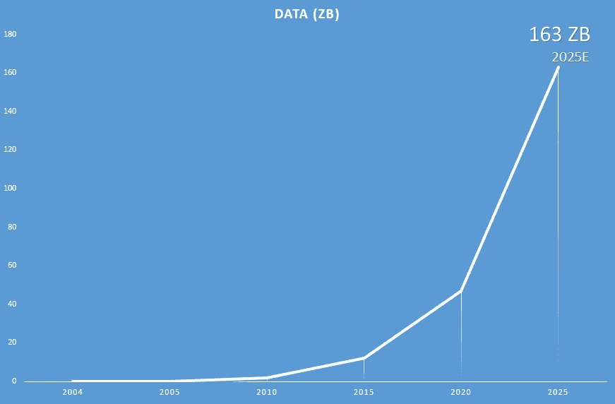
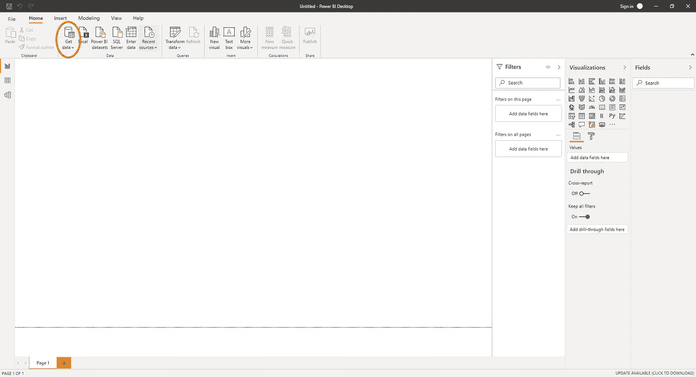
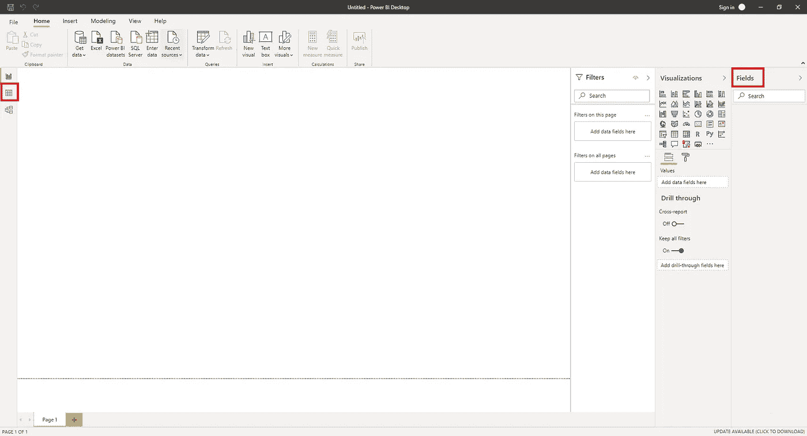
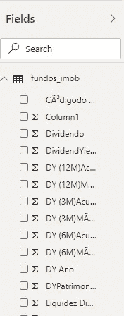
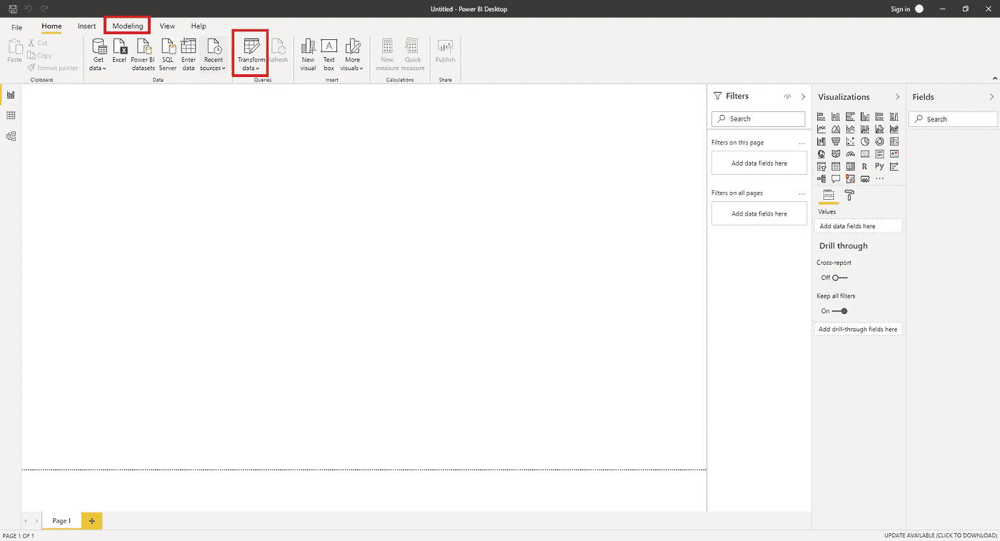
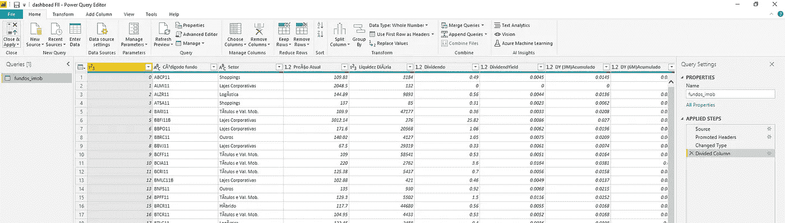
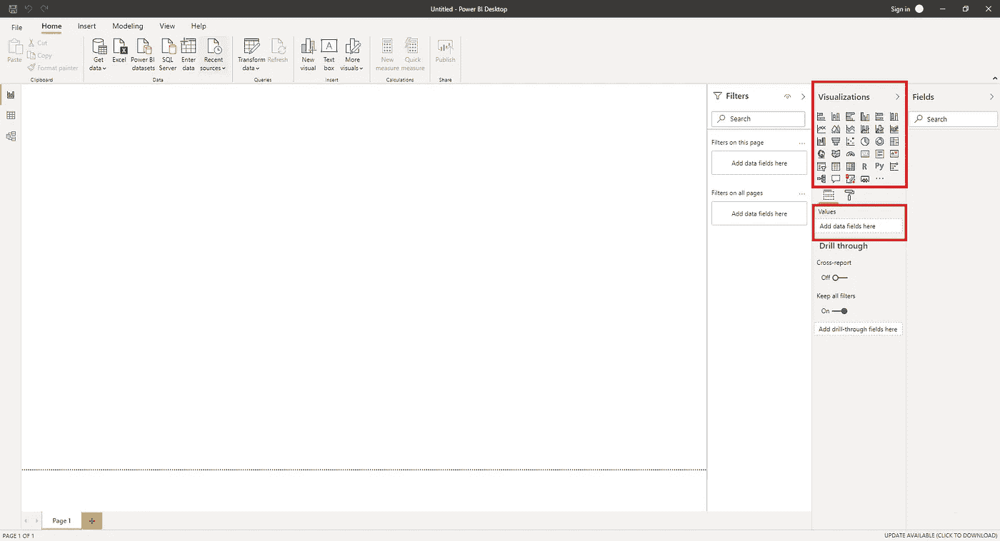
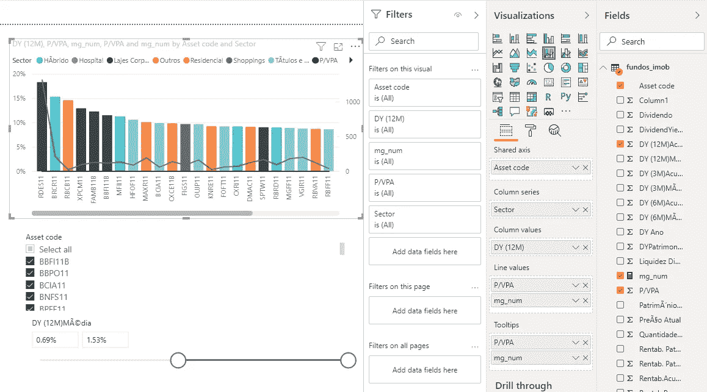

# power BI——打败 Excel 的工具

> 原文：<https://towardsdatascience.com/powerbi-the-tool-that-is-beating-excel-8e88d2084213?source=collection_archive---------9----------------------->

## 为什么 PowerBI 更适合可视化，以及如何使用它

卢卡斯·布拉塞克在 Unsplash 上的照片

数据分析和可视化一直是专业环境中极其重要的问题，也是公司决策的基本工具。在这种环境下，Microsoft Excel 很容易流行起来，并成为市场上主要的数据操作工具之一，但是，随着大数据的发展，全球数据的指数级增长以及分析和数据科学文化的发展，Excel 不再是如此高效的工具。

**世界上的数据量正以每年 40%的速度增长，到 2025 年可能达到约 163 兆字节。**

作者图片

> **“数据是新的黄金！”**

年复一年，公司更加关注数据以及如何从数据中获取价值，以销售更多产品、获得更多客户、提高流程效率等。在这种情况下，处理大量数据并能够公开信息的工具变得至关重要。为了解决这一需要，微软创建了 Power BI，这是一个可视化工具，能够处理大数据，同时改变我们与图表交互的方式。

# Excel 与 Power BI 在可视化方面的对比

我们知道，除了作为市场上已知的工具之外，Excel 还具有出色的功能，允许用户以简单有效的方式处理数据，但即使如此，该程序仍有一些需要改进的地方。当我们需要操作大量数据时，例如，excel 在可视化中经常崩溃，出现一些界面错误，不加载整个文件，并可能导致文件损坏等严重问题。另一种情况是，当我们需要进行复杂的图形分析或创建仪表板时，在 Excel 中组织图形并不简单，设计也不那么吸引人，并且您无法处理动态和相互关联的图形。在这些情况下，Power BI 被证明是非常有用的，与 Excel 相比具有巨大的优势，使数据操作更加敏捷和高效。

凭借广泛的图形和小部件，良好的大数据处理能力，与不同平台的集成和易用性，不同数据源的集中化，Power BI 在市场上日益显示出自己的强大。

以下是这两种工具之间的一些比较数据:

## **数据量**

Power BI 是为大数据准备的，可以处理比 Excel 多 2000 倍的数据。

*   Excel — 1，048，576(100 万)，但它开始出现 50 万行的问题
*   Power BI — 1，999，999，997(20 亿)，优化为不同时显示所有行

## **图表和视觉效果**

Power BI 具有实时动态过滤的交互式视觉效果，高度可定制，是一个您可以找到并下载视觉效果的市场，以及您可以自己开发并导入的新视觉效果。

*   Excel —它提供了激活新型图表的选项，但创建和打印图表的方式并不简单，而且图表之间没有动态交互。
*   Power BI —实时、动态图形中图形之间的交互的可能性，使用 typescript 创建新图形，通过市场或直接导入轻松导入新图形

## **与外部数据整合**

Power BI 可以处理多种数据源，比如云数据库、SQL 服务器等等。

*   Excel —从 Excel 电子表格或 CSV 中读取数据
*   Power BI —数据库(Azure SQL、Spark、Oracle 等。)、内容包(google analytics、GitHub 等。)、文件(Excel 电子表格、CSV、文本等。)，以及更多类型的数据

总的来说，Power BI 支持创建易于创建和操作的高度可定制的仪表板、图表之间的实时交互以实现更动态的数据分析、优化洞察力并生成出色报告的功能、用于开发 ETL 和数据管道的工具等等。

## 第一步

好吧，现在你一定在想，我怎么用这个能量 BI？

Power BI 有两种访问数据和使用服务的方式，一种是从浏览器直接访问的 Power BI 服务，另一种是可以在 Windows 上下载并在本地使用的 Power BI 桌面。

首先，我将演示 Power BI 服务:

 [## 数据可视化| Microsoft Power BI

### 借助 Microsoft Power BI，让团队成员能够发现隐藏在数据中的洞察力。借助以下工具提供大规模见解…

powerbi.microsoft.com](https://powerbi.microsoft.com/) 

主页将会出现，你可以点击**登录**使用你的微软账户，或者创建一个新的免费账户。该开发工具非常类似于 Power BI 桌面。

对于 Power BI Desktop，我将提供一个快速教程，教你如何开始使用它。要在您的 windows 计算机上下载 Power BI desktop，您必须打开下面的链接:

【https://www.microsoft.com/en-us/download/details.aspx? id=58494

下载并安装后，您可以使用下面介绍的第一步开始创建您的仪表板:

## 导入数据

一旦您启动 PowerBI，将显示如下截图所示的主屏幕。您可以单击“Get Data”查看 Power BI 可以导入的各种数据，或者选择菜单中显示的一种数据类型，如 Excel、Power BI 数据集、SQL server 等。

作者图片

您添加的文件将以表格形式显示在右侧菜单中的“字段”中，或者显示在左侧菜单中的“数据”选项卡中。

作者图片

作者图片

## 编辑数据

导入数据后，您可以使用“转换数据”工具编辑和创建一些转换管道，或者使用“建模”选项卡进行一些计算

作者图片

“转换数据”工具，称为 Power Query editor，有很多很好的工具供您编辑和转换数据。你可以在下面的链接中找到更多关于如何使用它的信息，你也可以在图片中看到 Power Query 编辑器的截图。

[https://docs.microsoft.com/en-us/power-bi/transform-model/](https://docs.microsoft.com/en-us/power-bi/transform-model/)

作者图片

## 开发仪表板

在右侧菜单中，您可以访问“Visualizations”窗格，在该窗格中，您可以选择要使用的图表类型，并通过拖放操作轻松地将其拖至工作区。在“字段”菜单中，您可以访问文件中的数据，并将其拖到图表中以生成可视化效果。

作者图片

下面是一个带有图例和过滤器的“折线图和堆积柱形图”的快速演示。我们有一个按资产划分的“DY(12M)”图，图中有一个部门图例分段，还有一个“P/VPA”线变化和一个按“资产代码”和“DY(12M)”的过滤器。

作者图片

# 结论

Power BI 是开始探索数据分析领域并获得对大容量数据集的宝贵见解的绝佳方式。如果你熟悉 Microsoft Excel，你将在开发中拥有巨大的优势，因为许多工具、图表和公式都与 Excel 非常相似。

我希望这是一本好书！关于 Power BI 和数据分析的任何反馈或问题，请随时在 LinkedIn 上联系我:【https://www.linkedin.com/in/octavio-b-santiago/ 

如果你有兴趣了解更多关于 Power BI 的知识，我推荐微软的免费学习路径:[https://docs . Microsoft . com/en-us/learn/Power platform/Power-BI](https://docs.microsoft.com/en-us/learn/powerplatform/power-bi)