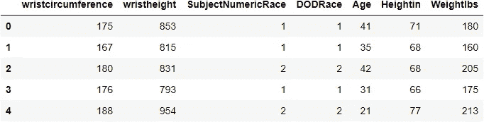
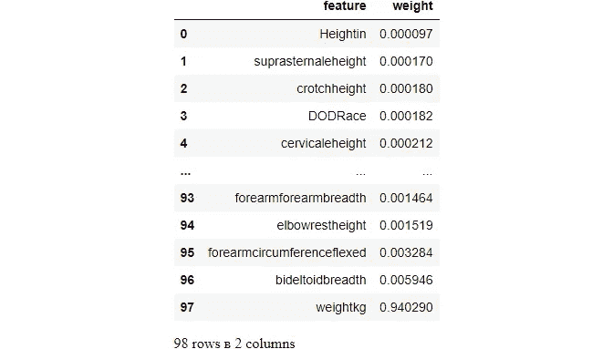
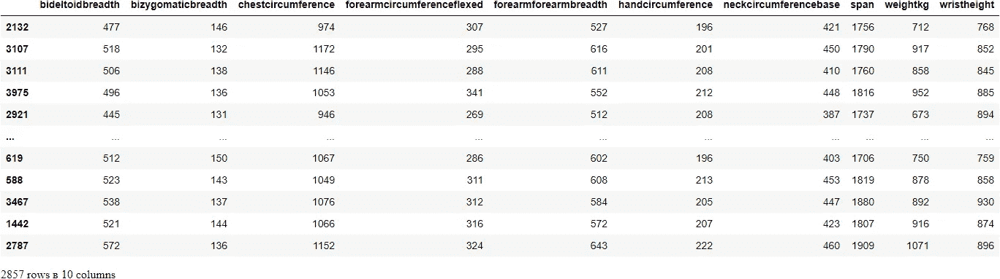

# Sklearn 的递归特征消除(RFE)功能强大的特征选择

> 原文：<https://towardsdatascience.com/powerful-feature-selection-with-recursive-feature-elimination-rfe-of-sklearn-23efb2cdb54e?source=collection_archive---------2----------------------->

## 即使删除 93 个功能，也能获得相同的模型性能


**照片由** [**维多利亚·伊斯基耶多**](https://unsplash.com/@victoriano?utm_source=unsplash&utm_medium=referral&utm_content=creditCopyText)**[**Unsplash**](https://unsplash.com/s/photos/selection?utm_source=unsplash&utm_medium=referral&utm_content=creditCopyText)**

**基本的特征选择方法主要是关于特征的单个属性以及它们如何相互作用。 [*方差阈值处理*](/how-to-use-variance-thresholding-for-robust-feature-selection-a4503f2b5c3f?source=your_stories_page-------------------------------------) 和 [*成对特征选择*](/how-to-use-pairwise-correlation-for-robust-feature-selection-20a60ef7d10?source=your_stories_page-------------------------------------) 是基于方差和它们之间的相关性去除不必要特征的几个例子。然而，更实用的方法是根据特性对特定模型性能的影响来选择特性。Sklearn 提供的一种这样的技术是递归特征消除(RFE)。它通过逐个移除特征来降低模型的复杂性，直到留下最佳数量的特征。**

**由于其灵活性和易用性，它是最流行的特征选择算法之一。该算法可以环绕任何模型，并且它可以产生提供最高性能的最佳可能特征集。通过完成本教程，您将学习如何在 Sklearn 中使用它的实现。**

**[](https://ibexorigin.medium.com/membership) [## 通过我的推荐链接加入 Medium-BEXGBoost

### 获得独家访问我的所有⚡premium⚡内容和所有媒体没有限制。支持我的工作，给我买一个…

ibexorigin.medium.com](https://ibexorigin.medium.com/membership) 

获得由强大的 AI-Alpha 信号选择和总结的最佳和最新的 ML 和 AI 论文:

[](https://alphasignal.ai/?referrer=Bex) [## 阿尔法信号|机器学习的极品。艾总结的。

### 留在循环中，不用花无数时间浏览下一个突破；我们的算法识别…

alphasignal.ai](https://alphasignal.ai/?referrer=Bex) 

## 递归特征消除背后的思想

考虑安苏尔男性数据集的这个子集:



它记录了 6000 多名美国陆军人员的 100 多种不同类型的身体测量数据。我们的目标是使用尽可能少的特征来预测以磅为单位的重量。(数据集中有 93 个数字要素)

让我们用随机森林回归器建立一个基本性能。我们将首先构建特性和目标数组，并将它们分成训练集和测试集。然后，我们将拟合估计量，并使用 R 平方对其性能进行评分:

我们实现了 0.948 的出色 R 平方。我们可以使用所有 98 个特性来完成这项工作，这比我们可能需要的要多得多。所有 Sklearn 估计器都有特殊的属性，显示特征权重(或系数)，或者以`coef_`或`.feature_importances_`给出。让我们看看随机森林回归模型的计算系数:



要降低模型的复杂性，请始终从移除权重接近 0 的要素开始。由于所有权重都要乘以特征值，因此这样小的权重对整体预测的贡献非常小。看上面的权重，可以看到很多权重接近 0。

我们可以设置一个低阈值，并基于它过滤掉特征。但我们必须记住，即使删除一个单一的特征也会迫使其他系数发生变化。因此，我们必须一步一步地消除它们，通过对拟合的模型系数进行排序，留下权重最低的特征。手动为 98 个特性做这件事会很麻烦，但是谢天谢地 Sklearn 为我们提供了递归特性消除功能— [RFE 类](https://scikit-learn.org/stable/modules/generated/sklearn.feature_selection.RFE.html)来完成这项任务。

## Sklearn 递归特征消除类

RFE 是一个转换估计器，这意味着它遵循熟悉的 Sklearn 的拟合/转换模式。由于其易于配置的特性和稳健的性能，它是一种流行的算法。顾名思义，它根据我们在每次迭代中选择的模型给出的权重，一次删除一个特性。

下面，您将看到一个使用上述随机森林回归模型的 RFE 示例:

拟合估计器后，它有一个`.support_`属性，为丢弃的要素提供一个带有假值的布尔掩膜。我们可以用它来划分数据子集:

```
X_train.loc[:, rfe.support_]
```



或者你可以直接调用`.transform()`来获得一个新的`numpy`数组和相关的特性。让我们使用这个较小的子集再次测试随机森林回归器:

即使在删除了将近 90 个特性之后，我们还是得到了同样的分数，这令人印象深刻！

## RFE 性能考虑因素

由于 RFE 每次丢弃一个特征时都会在整个数据集上训练给定的模型，因此对于像我们这样具有许多特征的大型数据集来说，计算时间会很长。为了控制这种行为，RFE 提供了`step`参数，让我们在每次迭代中丢弃任意数量的特性，而不是一个:

## 选择要自动保留的特征数量

RFE 最重要的超参数是*估计器*和 *n_features_to_select* 。在最后一个例子中，我们任意选择了 10 个特性，并希望得到最好的结果。然而，由于 RFE 可以包装任何模型，我们必须根据它们的性能来选择相关特征的数量。

为了实现这一点，Sklearn 提供了一个类似的`RFECV`类，它通过交叉验证实现递归特性消除，并自动找到要保留的最佳特性数量。下面是一个在简单的线性回归中使用 RFECV 的例子。我们将选择线性回归，因为我们可以猜测人体测量值之间存在线性相关性。此外，结合交叉验证，随机森林回归将变得更加计算昂贵:

我为`cv`和`scoring`参数提供了默认值。一个新的超参数是`min_features_to_select`——你可以从名字中猜出它是做什么的。让我们看看估计器计算出要保留多少个特征:

`RFECV`告诉我们只保留 98 个中的 5 个。让我们只在这 5 个上训练模型，并观察它的性能:

即使去掉了 93 个特性，我们仍然得到了 0.956 的高分。

## 摘要

通过阅读本教程，您学习了:

*   递归特征消除背后的思想
*   如何使用 Sklearn RFE 类实现算法
*   如何决定使用 RFECV 类自动保留的特性数量

如果你想更深入地了解算法，你可以阅读这篇[帖子](https://machinelearningmastery.com/rfe-feature-selection-in-python/)。

## 关于特性选择的进一步阅读:

*   [如何使用方差阈值进行鲁棒特征选择](/how-to-use-variance-thresholding-for-robust-feature-selection-a4503f2b5c3f?source=your_stories_page-------------------------------------)
*   [如何使用成对相关性进行稳健的特征选择](/how-to-use-pairwise-correlation-for-robust-feature-selection-20a60ef7d10?source=your_stories_page-------------------------------------)
*   [递归特征消除(RFE) Sklearn 文档](https://scikit-learn.org/stable/modules/generated/sklearn.feature_selection.RFE.html)
*   [RFECV Sklearn 文档](https://scikit-learn.org/stable/modules/generated/sklearn.feature_selection.RFECV.html)

## 您可能也会感兴趣:

*   【HalvingGridSearch 使超参数调谐速度提高了 11 倍
*   [面向数据科学家的面向对象编程介绍](https://towardsdev.com/intro-to-object-oriented-programming-for-data-scientists-9308e6b726a2?source=your_stories_page-------------------------------------)**