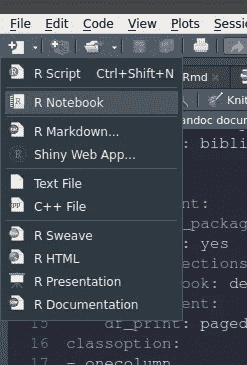
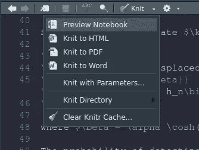
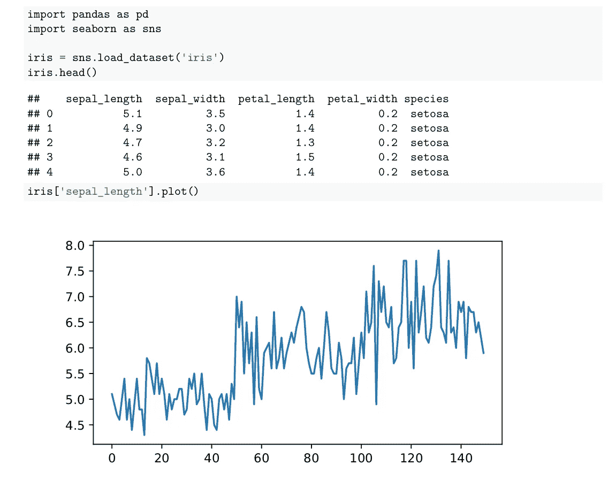

# 为 Python 用户提供强大的 R Markdown

> 原文：<https://towardsdatascience.com/powerful-r-markdown-for-python-users-f20607f24f08?source=collection_archive---------27----------------------->

## 如何使用 R Markdown 将 Python 和 Bash 命令与 LaTeX 文档生成相集成


作者图片

R Markdown 是一个强大的工具，让您使用 TeX 引擎生成丰富的 PDF。在 R Markdown 中，您可以将散文和您的分析与代码、其输出和图形集成在一起。然而，R Markdown 的使用并不局限于 R 语言本身，而是可以集成各种其他语言。

当谈到编写带有解释和描述的代码时，R Markdown 与 Jupyter Notebook 非常相似，但 R Markdown 可以做一些 Jupyter Notebook 所缺乏的事情。例如，对于 Jupyter Notebook，包含一个定制的 LaTeX 包并不简单。使用 R Markdown，我发现包含一个定制的 LaTeX 页面非常容易。如果您的系统中安装了 LaTeX 引擎，它还允许您生成一个 PDF 文件，代码、其输出和图形在同一个 PDF/HTML 报告中生成。

# 使用 R Markdown 生成丰富的 pdf

R Markdown 使用了**knitter，**，这是一个用于 R 语言的动态报告生成引擎。它可以生成 PDF 和 HTML 等多种格式的完全可复制的笔记本。Knitr engine 集成了各种语言，比如 R、Python、Bash 和 SQL。在本文中，我将自己局限于 Python 和 Bash。

为了更好地理解这篇文章，请安装 R Studio 和 R。然而，除了一些额外的步骤之外，所有的例子都可以在 Windows 或 Mac 上运行，我不会在本文中详细介绍这些步骤。

## 生成乳胶文件

一旦你安装了 R 语言和 R Studio，点击创建一个新的 R 笔记本。



你也可以选择 R Markdown 来创建项目风格的文件。但是创建一个 R 笔记本是最简单易用的。文件可以保存为`.Rmd`格式。

下面是您必须拥有的`.Rmd`的代码片段。

```
---
title: "My R Markdown Notebook"
author: 
    - Rahul Bhadani^[The University of Arizona, [rahulbhadani@email.arizona.edu](mailto:rahulbhadani@email.arizona.edu)]
date: "`r format(Sys.time(), '%d %B %Y')`"
bibliography: biblio.bib
output:

  pdf_document:
    citation_package: natbib
    keep_tex: yes
    number_sections: yes
  html_notebook: default
  html_document:
    df_print: paged
classoption:
- onecolumn
header-includes:
- \usepackage[none]{hyphenat}
- \usepackage{physics}
- \graphicspath{ {figures/} }
- \usepackage{color}
- \definecolor{ocre}{RGB}{243,102,25}
- \usepackage[font={color=ocre,bf},labelfont=bf]{caption}
- \usepackage{hyperref}
- \hypersetup{colorlinks=true,citecolor=blue}
- \def\BibTeX{{\rm B\kern-.05em{\sc i\kern-.025em b}\kern-.08em
    T\kern-.1667em\lower.7ex\hbox{E}\kern-.125emX}}
- \newcommand{\spliteq}[1]{\begin{equation}\begin{split}#1\end{split}\end{equation}}
keep_tex: yes
abstract: This is my abstract
---# Section 1
# Section 2```{r setup, include=FALSE}
knitr::opts_chunk$set(echo = TRUE)
``````{r, echo=T,eval=T,warning=FALSE, fig.height = 4, fig.width = 5}
library('nloptr')
hn <- function(x, n)
{
    hret <- 0
    if (n == 0)
    {
       hret <- x + 2*x
    }
    else
    {
       hret <- x - 2*x
    }
    return (hret)}```
```

在上面的代码片段中，`---`之间的任何东西都是定义如何生成 TeX 文件和相应 pdf 的元数据。使用`bibliography:`，你可以指定在你的减价中引用什么`.bib`。您可以在`-`命令后指定额外的 LaTeX 命令。`keep_tex`告诉 R Markdown 不要删除生成的 tex 文件，这有几个原因，包括进一步修改生成的 TeX 文件，如果你决定这样做。

`````中的任何内容都是在`eval=T`被设置时执行的代码片段。

要生成 PDF，请从针织选项中单击针织到 PDF，如下所示:



编译完成后，您将看到一个 PDF 文件被打开。点击**针织**按钮旁边的设置图标，可以浏览其他选项。TeX 源文件将在保存`.Rmd`文件的同一个目录下生成。

# 在 R Markdown 中添加 Python 代码

要将 python 代码添加到 R Markdown 文件中，请添加以下代码片段:

```
```{python, engine.path =  "/home/username/anaconda3/envs/virtualenv/bin/python", fig.height = 3, fig.width = 6}
import pandas as pd
import seaborn as snsiris = sns.load_dataset('iris')
iris.head()
iris['sepal_length'].plot()
```
```

使用`engine.path`，我指定在哪里寻找 python 可执行文件来运行 python 代码片段。运行上述代码后，我可以在我的 PDF 文件中看到以下内容:



# 在 R Markdown 中执行 bash 命令

要执行 bash 命令，您需要添加以下代码片段:

```
```{bash, engine.opts='-l'}
source ~/.bashrc
source /opt/ros/melodic/setup.bash
source ~/catkin_ws/devel/setup.bash
pwd
ls```
```

当您执行完笔记本时，您将在 PDF 中看到`pwd`和`ls`的输出。

使用**knitter**引擎执行 bash 命令有一些限制。在 R Markdown 中，`bash`是通过 R 函数`system2().`调用的，它忽略了像`~/.bash_profile`和`~/.bash_login`这样的概要文件，在这些文件中，您可能已经定义了别名、环境变量和一些额外的定制。出于同样的原因，在上面的例子中，您可以看到我已经显式地指定了 source `.bashrc`和任何其他我包含在`.bashrc`文件中的 sourcing。

此外，当包含在 R 中时，不应该在 bash 代码片段中包含任何永久运行的 bash 命令，因为 knitr 会一直等待执行完成，结果只会失望。

# 最后的想法

R Markdown 提供了一种优雅的方式来为您的数据分析生成各种格式的报告。使用 R Markdown，您可以包含代码、数据、输出和生成的图形。最后，您还可以在 R 和 Python 代码片段之间共享变量。

例如，要访问 python 片段中的任何 R 工件，使用`r.`后跟 R 中定义的任何变量或函数，类似地，要访问 R 中的任何 python 工件，使用`py$`后跟 Python 中定义的任何变量或函数。以下代码片段解释了这个想法:

```
# Use Python artifacts from R
```{r,echo=T,eval=T,warning=FALSE, fig.height = 4, fig.width = 5}
py$iris```# Use R artifacts from Python```{python, engine.path =  "/home/ivory/anaconda3/envs/dbn/bin/python", fig.height = 3, fig.width = 6}
print(r.hn(3,5))
```
```

*注意:作者基于他对技术的理解创建了本文中提供的所有示例。与其他在线资源的相似之处可能纯属巧合。*

[](/how-to-solve-a-constraint-optimization-problem-in-r-fdf5abee197b) [## 如何解决 R 中的一个约束优化问题

### 基于 nloptr 的 R 中非线性约束优化

towardsdatascience.com](/how-to-solve-a-constraint-optimization-problem-in-r-fdf5abee197b)