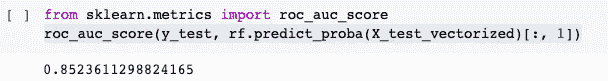
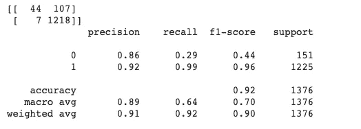
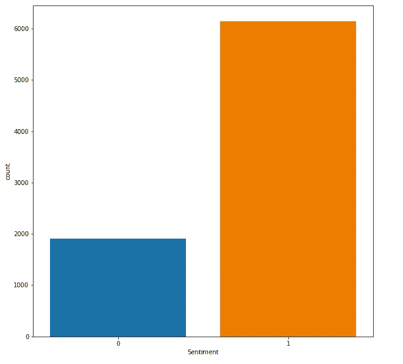
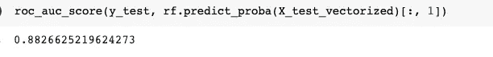
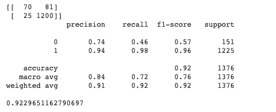
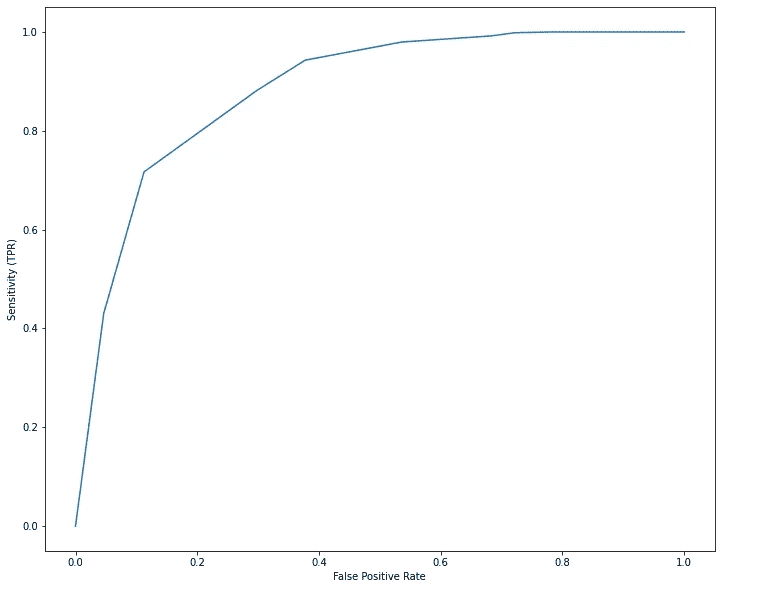

# 使用 NLPAUG 的强大文本增强

> 原文：<https://towardsdatascience.com/powerful-text-augmentation-using-nlpaug-5851099b4e97?source=collection_archive---------9----------------------->

## 使用令人惊奇的 NLPAug 通过文本增强技术处理 NLP 分类问题中的类别不平衡


布雷特·乔丹在 [Unsplash](https://unsplash.com?utm_source=medium&utm_medium=referral) 上的照片

# 什么是数据增强，我们为什么要关注它？

数据扩充是从现有数据中合成新数据的实践。这可以应用于从数字到图像的任何形式的数据。通常，增加的数据类似于已经可用的数据。在所有机器学习问题中，数据集决定了问题的解决程度。有时，我们没有足够的数据来建立稳健的模型，更常见的是数据中存在明显的阶级不平衡。假设我们正在构建一个预测两个类别之一的模型，但我们有一个类别的 5000 个样本进行训练，而另一个类别只有 200 个样本。在这种情况下，我们的模型将几乎总是预测具有更多样本的类别，因为它没有得到足够的数据来区分这两个类别。然后我们必须转向收集更多的数据，但如果我们不能呢？一种方法是生成我们拥有的 200 个数据样本的精确副本，并减少不平衡。虽然这确实提供了一些改进，但是模型仍然在学习相同的特性集！或许一些巧妙的调整可以提高我们现有数据的质量。

# **为什么与其他形式的数据增强相比，文本增强很困难？**

想想看，为了增加图像，我们可以旋转、锐化或裁剪图像的不同区域，新数据仍然有一定的意义。

然而，扩充文本数据是非常困难的。例如，改变单词的顺序乍一看似乎是合理的，但有时这可能会完全改变句子的意思，比如说， ***我清洗了我的汽车*** 不同于 ***我清洗了我的汽车。***

幸运的是，马志威的**[**nlpaug**](https://github.com/makcedward/nlpaug)**给了我们一些惊人的工具来快速扩充文本。下面就来说说其中的一些。****

# ****扩充文本数据的方法****

1.  ****用同义词替换几个单词。****
2.  ******用与这些单词具有相似(基于余弦相似度)单词嵌入的单词(如 word2vec 或 GloVe)替换一些单词。******
3.  ******使用强大的变压器模型(BERT)根据上下文替换单词。******
4.  ****使用反向翻译，即把一个句子翻译成另一种语言，然后再翻译回原文，有时会修改几个单词。****

# ****让我们看看第一个，并将其应用于一个问题，看看增强是否真的有效****

## ****定义问题****

****我将使用来自 [Kaggle](https://www.kaggle.com/sripaadsrinivasan/yelp-coffee-reviews) 的 Yelp 咖啡评论数据集来分析一个情感分析问题。该数据集包含近 7000 条用户评论和评级。用户对咖啡店的评分从 1 到 5，越高越好。为了制造一些不平衡，我放弃了中性评级(3)，并将所有大于 3 的评级标记为正面，所有小于 3 的评级标记为负面。下面是预处理前的一个示例回顾****

## ******评估指标******

****当谈到不平衡分类时，我并不热衷于准确性度量，因此将主要查看[**ROC 曲线**](/understanding-auc-roc-curve-68b2303cc9c5) 下的面积作为评估度量。****

## ******两种情况下使用的型号******

****在一些文本预处理和清理之后，我使用了一个随机森林分类器，它有 10 个估值器。使用 Tfidf 矢量器对文本进行矢量化，并选择基于术语频率的最佳 3000 个特征向量作为分类器的输入特征。这个模型非常简单，我在下面链接了全部代码。对于那些想先查阅[代码的热心读者来说，它就在这里！](https://github.com/rajlm10/NLPAUG_Usage/blob/main/YELP_NLPAUG.ipynb)****

# ******没有文本增强的结果******

****首先，我们来看看阶级不平衡。如你所见，正负之间的不平衡几乎是 6.5 : 1 的比例。****

********

****阶级之间的巨大不平衡(图片由作者提供)****

****这是在数据集上训练 RandomForest 分类器后的结果。****

********

****RandomForest(n=10)分类器的 AUC****

****如您所见，曲线下的面积为 0.85，为了证明模型仅在样本数量较少的类上表现不佳，请仔细查看分类报告。****

********

****详细分类报告****

****该车型的召回率和 f1-在负类上的得分(标为 0)绝对****可怕！这解释了为什么 AUC 是 0.85。**现在，我们将通过 nlpaug 以最小的努力提高 AUC 和 f1 分数。******

# ****增强后的结果****

## ****我们如何通过用同义词替换单词来扩充文本的例子****

****请使用 pip 安装 nlpaug。请参考我的笔记本来查看完整的代码。以下只是一个小片段。****

```
**pip install nlpaug**
```

****在这之后，我将使用 wordnet 库来帮助处理同义词。****

****让我们从数据集中挑出一句话——“***误导性评论。有史以来最糟糕的咖啡，非常令人失望。”*******

```
**import nlpaug
import nlpaug.augmenter.word as naw
aug = naw.SynonymAug(aug_src='wordnet',aug_max=2)
aug.augment("Misleading reviews. Worst coffee ever had, and sorely disappointing vibe.",n=2)**
```

****在上面的代码**中，aug_max** 表示我们想要用相应的同义词替换的单词的最大数量**。在最后一行中，n=2 表示我们想要生成两个扩充句子。******

****下面是惊人的结果！****

*****‘误导性评论文章’。这是有史以来最差的咖啡，非常令人失望。误导评论。这是有史以来最差的咖啡，令人非常不满意*****

****在**第一句**和第二句**误导**和**失望**分别被替换为**导致** **误入歧途**和**不满意**。****

## ****我如何决定扩充数据****

****我决定为标签为 0(属于少数类的负面评论)的训练集中的每个句子引入 2 个新的增强句子。在这些扩充的句子中，我决定用同义词替换最多 3 个单词。你可以自己摆弄这些参数，找点乐子。****

****这是增加数据后的分布。随着一些新的有意义的数据的出现，少数派的人数增加了两倍！****

********

****(图片由作者提供)****

## ****现在是我们期待已久的高潮…****

********

****增强后的 AUC！****

********

****扩充后的分类报告****

******哇！我们将 AUC 从 0.85 提高到 0.88，并将 f1 评分从 0.7 提高到 0.76。******

# ****比较增强前后的 ROC 曲线****

****************

****(左)-增强前数据的 ROC 曲线(右)-增强后数据的 ROC 曲线(图片由作者提供)****

****虽然稍微，但是右边的 ROC 曲线覆盖的面积更大，效果更好。**更棒的是，增强在一个 CPU 上只用了 57 秒。这显示了文本增强的益处。******

# ****注意事项****

1.  ****在实验的任何时候，我们都没有改变模型或调整它，所有性能的提高完全是由于数据的增加。****
2.  ****nlpaug 库使用单词嵌入、BERT 变换器和反向翻译提供了更强大的扩充选项。就存储和执行速度而言，我们使用的是最便宜的选项！****
3.  ****CPU 上的增强用了不到一分钟，这是相当快的。****
4.  ****请浏览参考资料中的链接，了解更多增加数据的方法。****
5.  ****最后，我们用很少的努力(就时间而言)和不到 5 行代码将 AUC 从 0.85 提高到 0.88。****

# ******参考文献******

1.  ****[**nlpaug**](https://github.com/makcedward/nlpaug) 的官方 Github 库，里面包含了示例笔记本****

****查看我的 **G** [**itHub**](https://github.com/rajlm10) 的一些其他项目和整个 [**代码**](https://github.com/rajlm10/NLPAUG_Usage/blob/main/YELP_NLPAUG.ipynb) 。你可以在我的[***w*ebsite**](https://rajsangani.me/)***上联系我。我希望在评论中得到一些反馈。感谢您的宝贵时间！*******