# 用 TigerGraph 支持 Google Forms 和 Google Sheets 应用程序数据

> 原文：<https://towardsdatascience.com/powering-google-forms-and-google-sheets-application-data-with-tigergraph-7f8784335aae?source=collection_archive---------36----------------------->

## 使用 TigerGraph 构建应用程序图

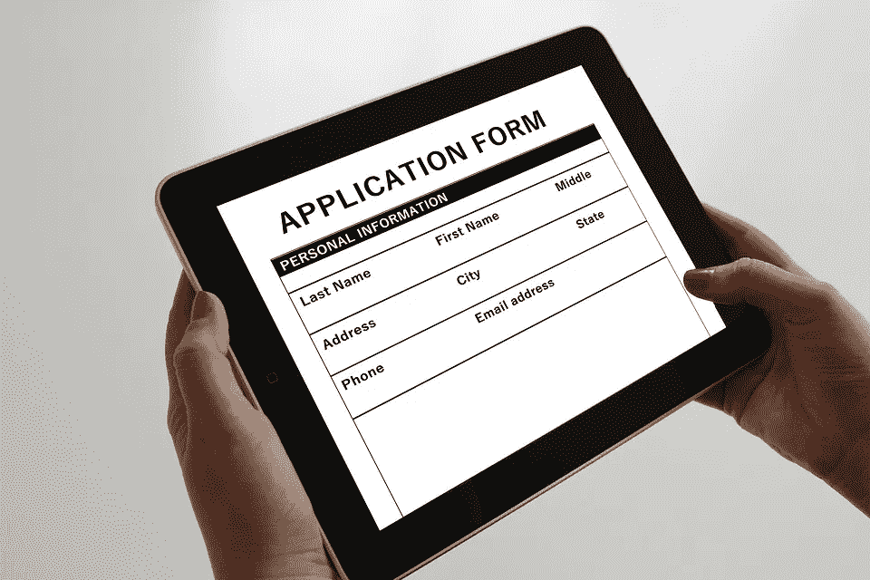

[图片来自 Pixabay](https://pixabay.com/photos/application-request-ipad-tablet-1883453/)

# 目标

欢迎光临！在这篇博客中，我们将学习如何使用 Google Sheets API 来捕获申请数据，并将其放入 TigerGraph 中，以便轻松地查询和筛选申请人。随着学年的开始，我最终需要为我领导的俱乐部打开申请，虽然只有少数人会申请这些职位，但如果我有大量的申请，TigerGraph 和 Graph 数据库可以帮助我轻松快速地找到并筛选各种职位的申请人。在这里，我们将集成 Google Sheets API 来从表单中获取结果，并将其插入到图形数据库中。我们开始吧！

# 第一部分:创建 Google 表单和 Google 工作表

## 第一步:创建 Google 表单

首先，转到 https://docs.google.com/forms/的并创建一个包含您想要采样的适当字段的表单。对于这个例子，我将询问申请人的姓名、电子邮件、职位、技能以及申请人应该获得该职位的原因。

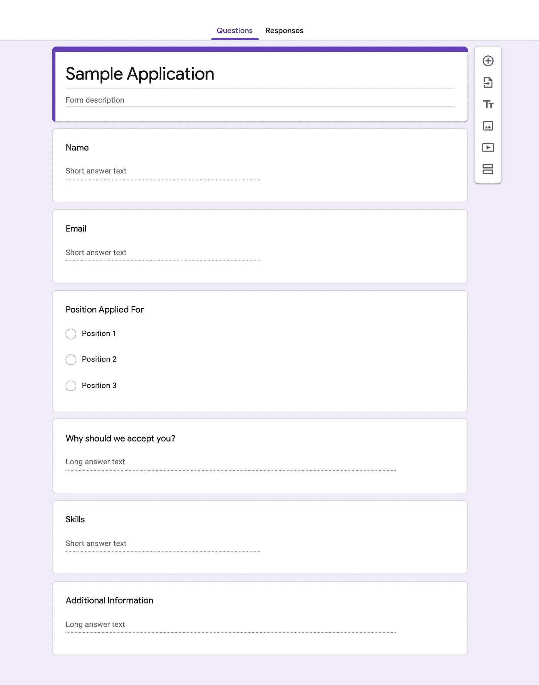

示例 Google 表单

接下来，我将用假数据填充表单。

## 第二步:创建 Google 工作表

如果你点击表格中的“回复”标签，并按下按钮，它会带你到一个谷歌电子表格中的数据。


点击“回复”,然后点击绿色按钮。

在提示中，给电子表格起一个你喜欢的名字，然后点击“创建”

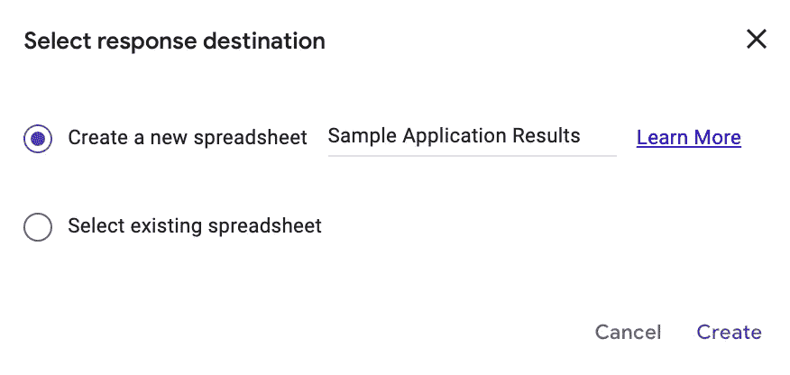

重命名并按“创建”

该电子表格是一个动态电子表格，包含来自您的表单的结果。随着越来越多的用户申请该职位，它将继续被填充。


带有虚假数据的实时电子表格

这里最重要的部分是工作表的 id。您可以从 d/之后/edit 之前的链接中获得此信息。


上例中我的 id 是 19 fcj-0 d056 L9 C5 ksotzuazft-mfkjcuyqoz 2 BD 8 yx 4y。稍后我们将在 Python 脚本中使用它。

> 注意:为 Python 脚本准备好您的电子表格 ID！

# 第二部分:创建一个项目并启用 Sheets API

## 第一步:创建一个谷歌云项目

首先，你需要使用你的谷歌账户，导航到 https://console.cloud.google.com/的。在顶部，按“选择一个项目”


按选择一个项目

接下来，选择一个现有的项目(如果有的话)。如果没有，请按“新建项目”

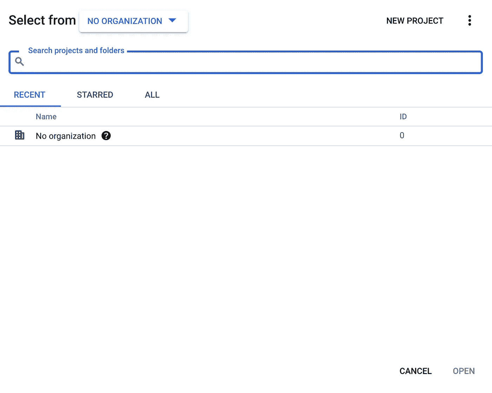

按“新项目”

命名您的项目，然后按“创建”

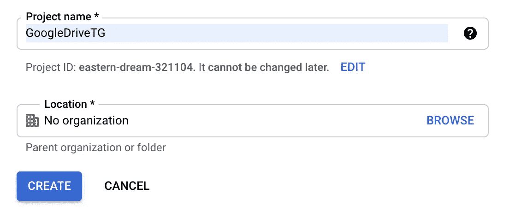

输入详细信息，然后按“创建”

## 第二步:启用 Google Sheets API

创建项目后，您将被导航到一个仪表板。按左上方的三行，然后选择“APIs & Services”


单击 API 和服务

然后，按“+启用 API 和服务”我们将启用 Google Sheets API。


按启用 API 和服务

搜索“Google Sheets API”，点击第一个选项，然后按“启用”


按“启用”

完美！现在我们可以使用 Google Sheets API 了。

## 第三步:创建您的凭证

现在，我们将创建凭证来使用 Google Sheets API。在控制面板中，单击“凭据”并选择“创建凭据”从下拉列表中，选择“OAuth 客户端 ID”

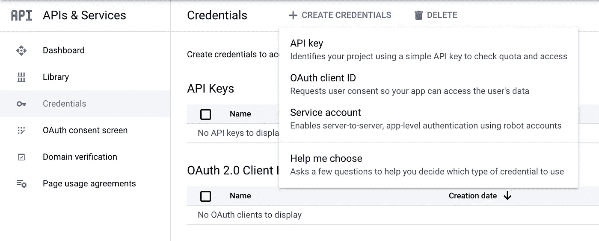

点按“凭证”，按“创建凭证”，然后按“OAuth 客户端 ID”

在选项中，按“桌面应用程序”，然后命名您的应用程序。


选取“桌面应用程序”,然后输入名称

下载 JSON，其中包含您的客户端 ID 和密码。

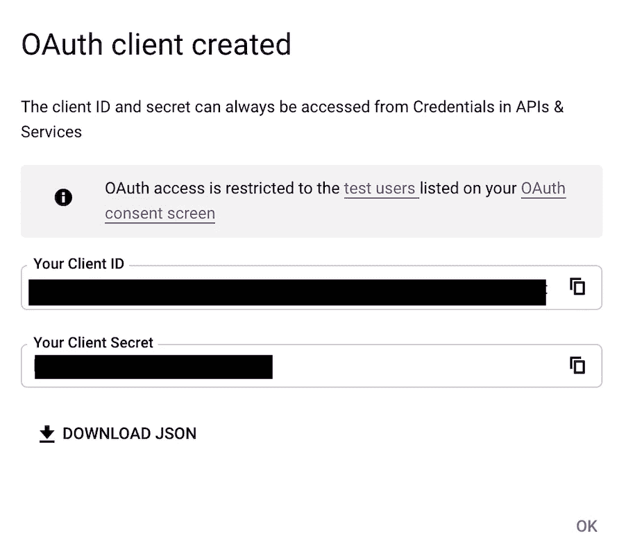

按“下载 JSON”

太棒了。现在，在“OAuth 同意屏幕”中，确保添加您将用来访问表单的每个 Google 帐户的测试用户(包含表单的帐户)。

> 注意:当我们把所有东西放在一起时，您将使用下载的 JSON 文件！确保它易于下载。

# 第三部分:准备 TG 云解决方案

## 第一步:在 TG Cloud 上建立解决方案

接下来，我们将准备我们的图形解决方案。为此，请前往[https://tgcloud.io/](https://tgcloud.io/)。导航至“我的解决方案”选项卡，然后单击“创建解决方案”


在第一页上，按“Blank”(因为我们将创建自己的模式)，然后按“Next”

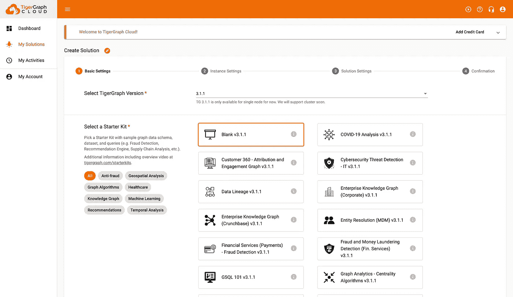

不要更改第二页上的任何内容，然后按“下一步”

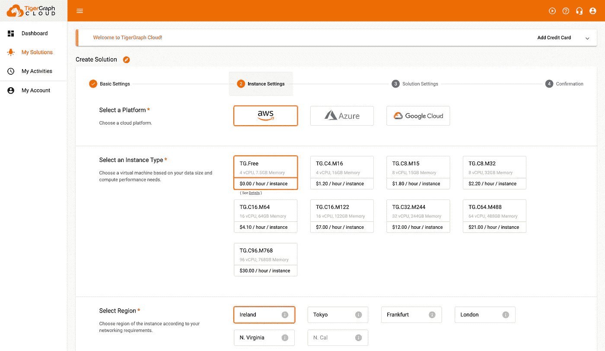

在第三页，自定义您的图表详细信息。

> 注意:记住你的子域和密码！我们将在脚本文件中使用这些。


最后，确认一切正常，然后点击“提交”


您的图表可能需要几分钟才能启动。当图表状态显示带有绿点的“就绪”时，它将就绪。

## 第二步:创建一个图表(可视化)

> 注意:如果您更愿意通过脚本创建图表，请跳到步骤 IV。

在 TG Cloud 中，在您刚刚创建的解决方案旁边，点击 Actions 下的下拉菜单，然后点击“GraphStudio”


选择 GraphStudio

您将被重定向到 GraphStudio。

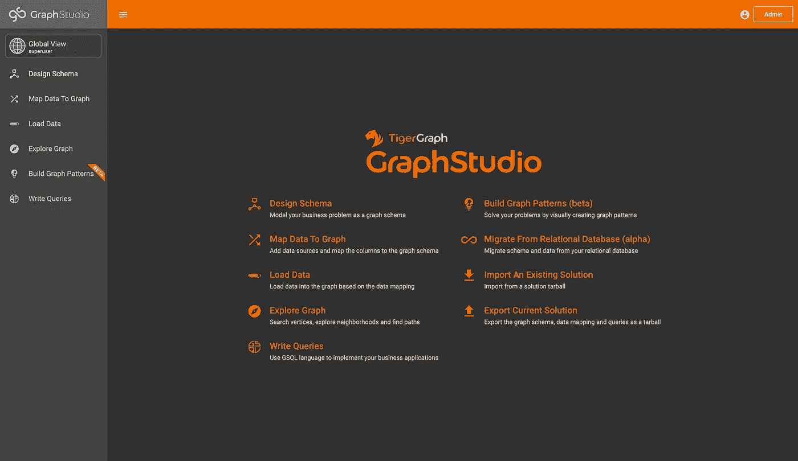

按“全局视图”，然后选择“创建图表”

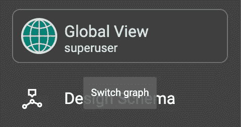

创建图表

你想给这个图起什么名字都行。对于这个例子，我正在创建一个名为“应用程序图”的图表


给图表命名

完美！你的图表现在准备好了。接下来，我们将创建我们的模式，这有点像我们如何增加数据的地图。

## 步骤三:创建一个模式(可视化)

首先，点击进入“设计模式”

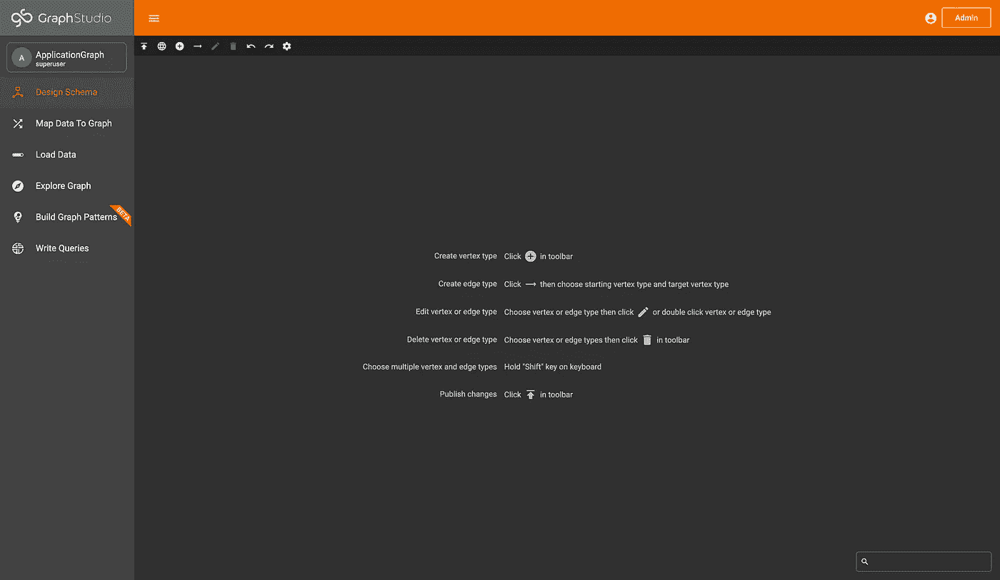

按顶栏上的加号按钮。


在出现的边栏中，自定义顶点细节。该顶点将是“申请人”类型主要 ID 将是电子邮件。它有一个名为“name”的 STRING 类型的属性。自定义后按下复选标记。

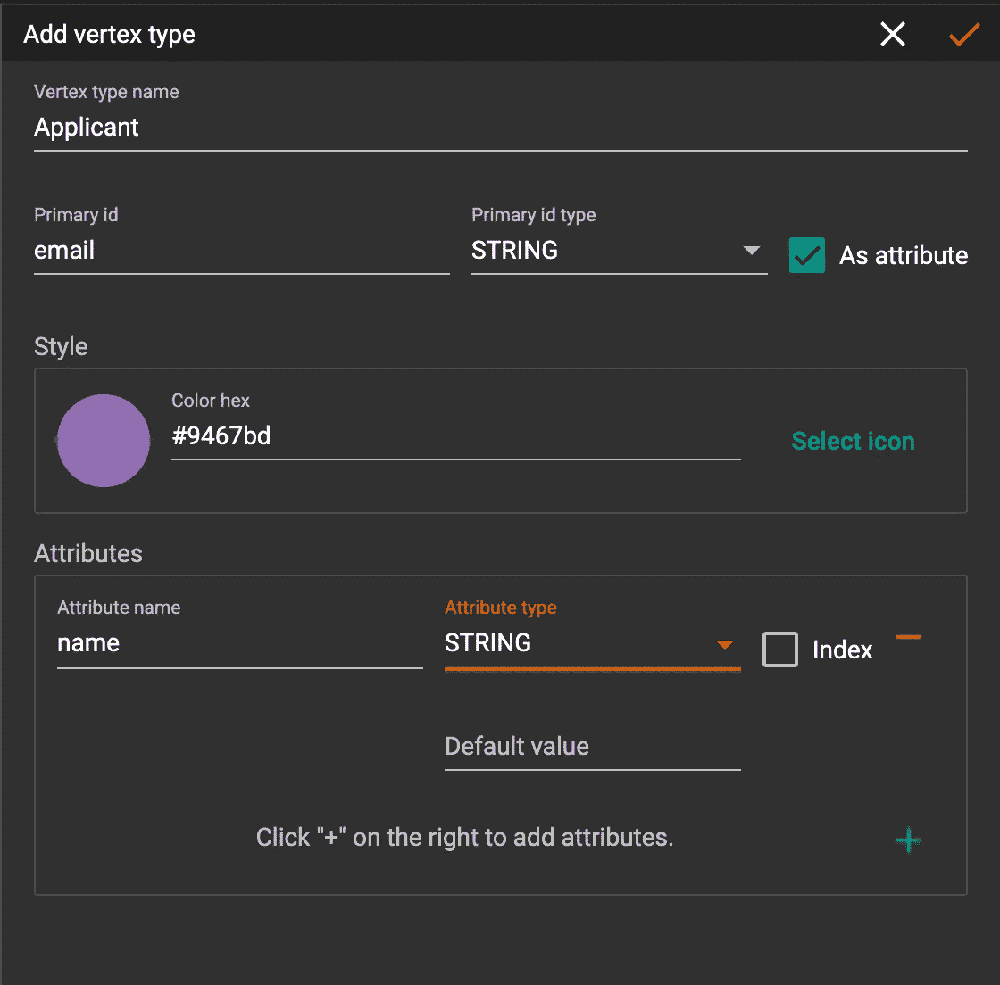

顶点将会出现。

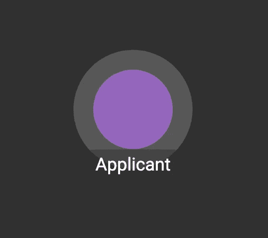

接下来，让我们创建一个位置顶点。

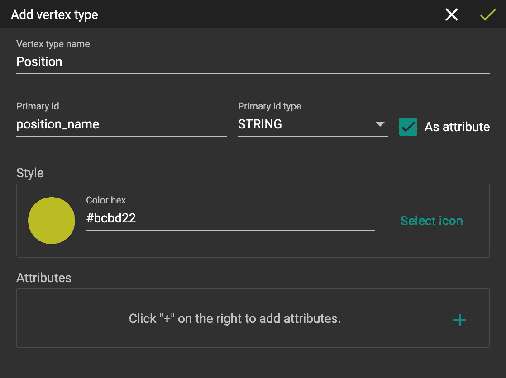

按下“添加局部边类型”,然后单击“申请人”顶点和“位置”顶点。


编辑边描述，然后按检查键。

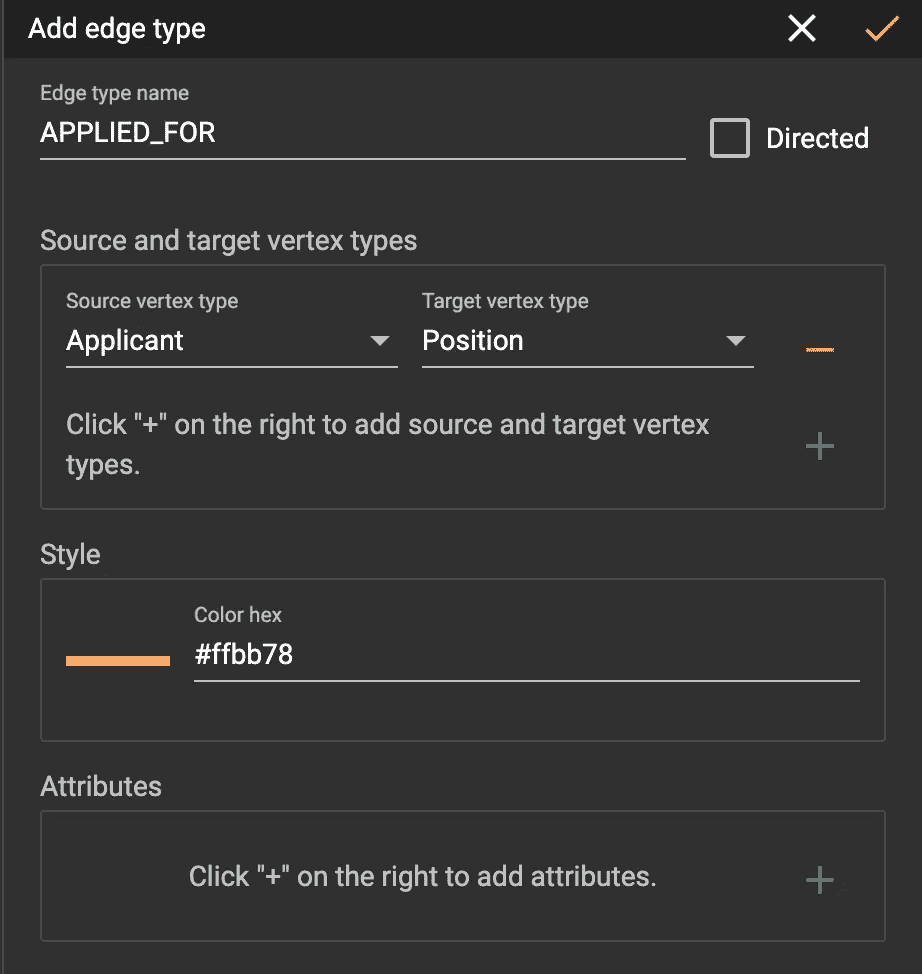

完美！

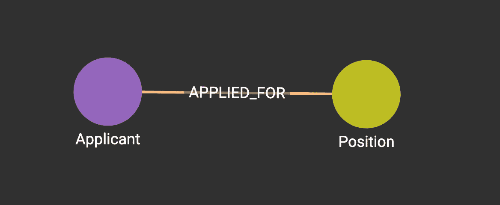

让我们继续构建图表。

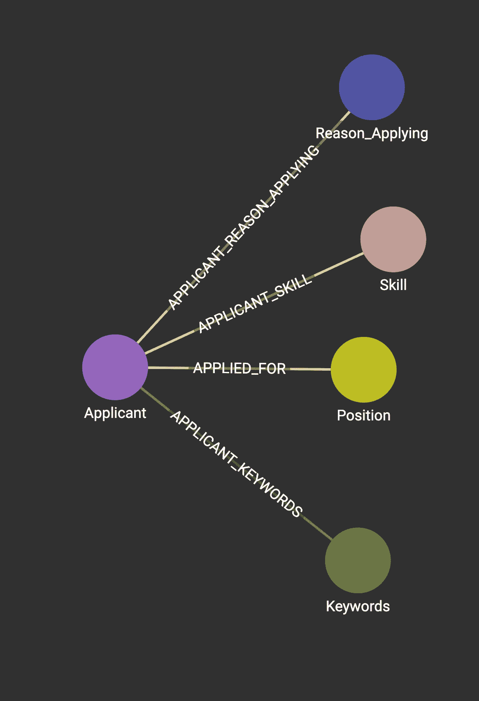

完成后，点击“发布模式”按钮。


加载完成后，你就可以开始了。

## 步骤四:(可选)创建一个图表(脚本)

或者，您可以使用以下脚本通过 Python 创建模式，用您的子域替换子域，用您的密码替换密码。

```
import pyTigerGraph as tg conn = tg.TigerGraphConnection(host="[https://SUBDOMAIN.i.tgcloud.io/](https://tigergraphnlp.i.tgcloud.io/)", password="PASSWORD")conn.gsql('''CREATE VERTEX Applicant(PRIMARY_ID email STRING, name STRING) WITH_PRIMARY_AS_ATTRIBUTE="true"
CREATE VERTEX Position(PRIMARY_ID position_name STRING) WITH_PRIMARY_AS_ATTRIBUTE="true"
CREATE VERTEX Skill(PRIMARY_ID skill STRING) WITH_PRIMARY_AS_ATTRIBUTE="true"
CREATE VERTEX Reason_Applying(PRIMARY_ID response STRING) WITH_PRIMARY_AS_ATTRIBUTE="true"
CREATE VERTEX Keywords(PRIMARY_ID word STRING) WITH_PRIMARY_AS_ATTRIBUTE="true"CREATE UNDIRECTED EDGE APPLIED_FOR(FROM Applicant, TO Position)
CREATE UNDIRECTED EDGE APPLICANT_SKILL(FROM Applicant, TO Skill)
CREATE UNDIRECTED EDGE APPLICANT_REASON_APPLYING(FROM Applicant, TO Reason_Applying)
CREATE UNDIRECTED EDGE APPLICANT_KEYWORDS(FROM Applicant, TO Keywords)CREATE GRAPH ApplicationGraph(Applicant, Position, Skill, Reason_Applying, Keywords, APPLIED_FOR, APPLICANT_SKILL, APPLICANT_REASON_APPLYING, APPLICANT_KEYWORDS)''')
```

太棒了。现在我们可以开始加载数据了。

# 第四部分:创建目录并提取数据

## 第一步:创建目录

在你的机器上，在你喜欢的地方创建一个新文件夹。在那里，您需要创建两个文件:一个 Python 文件，其中包含了大部分内容，另一个是您在第二步中下载的 JSON 文件。将 JSON 文件重命名为 credentials.json。

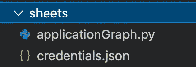

目录文件

## 第二步:安装库

首先，pip 安装 Google Cloud 和 pyTigerGraph。

```
pip install --upgrade google-api-python-client google-auth-httplib2 google-auth-oauthlibpip install pyTigerGraph
```

## 第三步:读这些行

首先，我们将导入刚刚安装的库。

```
import os.pathfrom googleapiclient.discovery import buildfrom google_auth_oauthlib.flow import InstalledAppFlowfrom google.auth.transport.requests import Requestfrom google.oauth2.credentials import Credentials
```

接下来，我们将设置范围、电子表格 ID 和范围。这里，确保用第一部分的 ID 替换电子表格 id from Part I。

> 注:用第一部分中的电子表格标识替换电子表格标识 from Part I。

```
SCOPES = ['https://www.googleapis.com/auth/spreadsheets']SPREADSHEET_ID = SPREADSHEET_ID_FROM_PART_IRANGE_NAME = 'Sheet1!A1:G'
```

然后，我们将编写一个小脚本来更新凭证。

```
creds = Noneif os.path.exists('token.json'):
   creds = Credentials.from_authorized_user_file('token.json', SCOPES) if not creds or not creds.valid:
      if creds and creds.expired and creds.refresh_token:
         creds.refresh(Request()) else:
         flow = InstalledAppFlow.from_client_secrets_file('credentials.json', SCOPES)
         creds = flow.run_local_server(port=0) with open('token.json', 'w') as token:
         token.write(creds.to_json())service = build('sheets', 'v4', credentials=creds)
```

当您运行这个时，您可能需要第一次输入您的凭据。

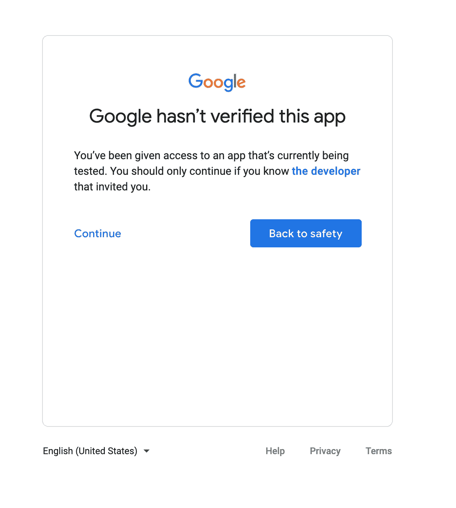

之后，我们可以读取 Google Sheets 数据并向上插入顶点。

```
service = build('sheets', 'v4', credentials=creds)sheet = service.spreadsheets()result = sheet.values().get(spreadsheetId=SPREADSHEET_ID,range=RANGE_NAME).execute()values = result.get('values', [])import pyTigerGraph as tgconn = tg.TigerGraphConnection(host="https://SUBDOMAIN.i.tgcloud.io/", password="PASSWORD", graphname="ApplicationGraph")conn.apiToken = conn.getToken(conn.createSecret())if not values: print('No data found.')else: for row in values: conn.upsertVertex("Applicant", row[2], attributes={"email": row[2], "name": row[1]}) conn.upsertVertex("Reason_Applying", row[4], attributes={"response": row[4]}) conn.upsertVertex("Skill", row[5], attributes={"skill": row[5]}) conn.upsertVertex("Position", row[3], attributes={"position_name": row[3]}) conn.upsertEdge("Applicant", row[2], "APPLICANT_REASON_APPLYING", "Reason_Applying", row[4]) conn.upsertEdge("Applicant", row[2], "APPLICANT_SKILL", "Skill", row[5]) conn.upsertEdge("Applicant", row[2], "APPLIED_FOR", "Position", row[3]) print("Row Upserted")
```

就这样，完美！现在，您可以使用 TigerGraph 与您的 Google Sheets 进行交互。

# 第五部分:祝贺你！

恭喜你。你现在可以正式将 Google Sheets 数据导入 TigerGraph 了！如果您遇到任何问题，请随时在 TigerGraph 社区论坛或 TigerGraph Discord 中提问。

[](https://community.tigergraph.com) [## 老虎图

### 一个学习、提问、展示酷项目以及与其他 TigerGraph 开发人员交流的地方！

community.tigergraph.com](https://community.tigergraph.com) [](https://discord.gg/gRHWBZNpxW) [## 加入 TigerGraph Discord 服务器！

### 查看 Discord 上的 TigerGraph 社区-与 607 名其他成员一起玩，享受免费的语音和文本聊天。

不和谐. gg](https://discord.gg/gRHWBZNpxW) 

最后，如果你想创建像这样的酷项目，并计划加入 TigerGraph 社区，了解社区贡献计划以获得奖励！

[](https://www.tigergraph.com/community-contribution/) [## 图表分析用例|图表数据库解决方案

### 使用 TigerGraph 的图形数据库解决方案连接、分析和学习数据。探索图表分析使用…

www.tigergraph.com](https://www.tigergraph.com/community-contribution/) 

感谢你阅读这篇博客，我希望你加入 TigerGraph 社区，开始获得你的条纹！