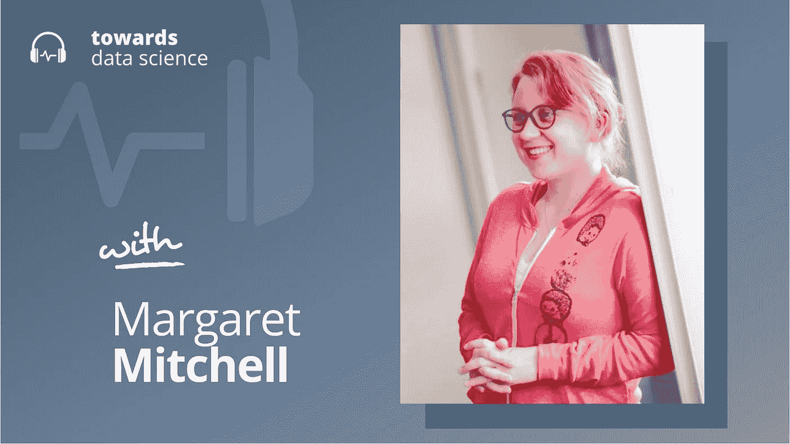

# (实用)人工智能伦理

> 原文：<https://towardsdatascience.com/practical-ai-ethics-639013a782a3?source=collection_archive---------20----------------------->

## [播客](https://towardsdatascience.com/tagged/tds-podcast)

## 玛格丽特·米歇尔谈人工智能最大的挑战公平和偏见

[苹果](https://podcasts.apple.com/ca/podcast/towards-data-science/id1470952338?mt=2) | [谷歌](https://www.google.com/podcasts?feed=aHR0cHM6Ly9hbmNob3IuZm0vcy8zNmI0ODQ0L3BvZGNhc3QvcnNz) | [SPOTIFY](https://open.spotify.com/show/63diy2DtpHzQfeNVxAPZgU) | [其他](https://anchor.fm/towardsdatascience)

*编者按:TDS 播客由 Jeremie Harris 主持，他是数据科学导师初创公司 SharpestMinds 的联合创始人。每周，Jeremie 都会与该领域前沿的研究人员和商业领袖聊天，以解开围绕数据科学、机器学习和人工智能的最紧迫问题。*

偏见在机器学习中名声不好。然而，机器学习模型的全部要点是，它将某些输入偏向于某些输出——例如，一张猫的图片偏向于一个写着“猫”的标签。机器学习*是*偏置生成。

因此，消除人工智能的偏见不是一个选项。相反，我们需要考虑哪些偏见是我们可以接受的，以及它们可以有多极端。这些问题需要很难找到的技术和哲学洞察力的结合。幸运的是，我邀请了谷歌研究和机器智能部门的前高级研究科学家玛格丽特·米歇尔加入播客，他的工作一直专注于实用的人工智能伦理。实际上，我真的是指人工智能伦理如何融入现实系统的具体细节，以及人工智能橡胶遇到道路时出现的复杂道德问题。

以下是我在对话中最喜欢的一些观点:

*   Margaret 认为伦理人工智能开发的关键挑战之一是在构建过程中包含不同的观点。她补充说，仅仅让来自不同背景的人加入一个团队是不够的；团队成员也必须乐于分享他们的观点。因此，在她的开发理念中，团队文化变得和团队构成一样重要。
*   到目前为止，大多数人都知道训练数据中的偏差，以及它对人工智能系统的性能和盲点的影响。但是 Margaret 强调，开发人员的偏见也可能出现在培训过程本身的层面上。应该优化什么目标函数？我们应该优化所有测试样本的准确性，还是应该检查模型在不同身份组或测试集子集上的表现，以确保每个测试样本的性能是可比的？玛格丽特通常是后一种策略的粉丝，这是为了确保不同的群体在消费人工智能系统的输出时有可比较的体验。
*   将测试集分成子集(例如，种族、年龄、性别等)以查看人工智能在不同组中的表现的想法引入了一个问题:身份理论上可以无限精细地解析。我们应该确保人工智能系统在“年轻”、“中年”和“老年”这三个广泛的年龄类别中表现同样出色，还是应该更详细地研究 21.1 岁和 21.2 岁之间的表现差异？一旦我们以这种方式细分群体，我们基本上就面临着与原始数据集相同的伦理问题。出于这个原因，玛格丽特喜欢说人工智能伦理是一个“分形问题”——一个在人口的每个解决水平上不断浮现的问题。
*   我们谈到了以不那么表面可见的方式包含不同视角的挑战。例如，虽然很容易发现少数种族或性别在科技公司中的代表性不足，但要判断这些公司是否缺少“抽象”的少数族裔，如纯素食主义者、保守派或自由主义者，就不那么简单了。鉴于硅谷表现出强烈的政治偏见，公司也有责任注意意识形态的代表性。

你可以[在 Twitter 上关注 Margaret 这里](https://twitter.com/mmitchell_ai)，或者 [me 这里](https://twitter.com/jeremiecharris)。

## **章节**:

*   0:00 介绍
*   1:20 玛格丽特的背景
*   8:30 元学习和伦理
*   10:15 玛格丽特的日常
*   13:00 人工智能中道德问题的来源
*   18:00 总分和分项分数
*   24:02 多大的偏差是可以接受的？
*   29:30 人工智能伦理社区持有哪些偏见？
*   35:00 这些领域的重叠
*   政治方面
*   45:25 总结