# 实用分类标准

> 原文：<https://towardsdatascience.com/practical-classification-metrics-f056805cf1f1?source=collection_archive---------33----------------------->

## 决定使用哪些分类标准来解决现实世界中的分类问题的方法

拉克伦·唐纳德在 [Unsplash](https://unsplash.com?utm_source=medium&utm_medium=referral) 上的照片

一个[快速的谷歌搜索](https://www.google.com/search?q=classification+metrics)会告诉你在[分类标准](https://en.wikipedia.org/wiki/Evaluation_of_binary_classifiers)上有数百个不同的论文/博客/文章，即。、精度、召回率、F1、真阳性率、假阳性率、PPV、NPV 等。如果您不理解这些指标的定义，这些文章是一个很好的起点。例如[这篇](/understanding-data-science-classification-metrics-in-scikit-learn-in-python-3bc336865019)博客谈到了 sklearn 中的各种分类标准；[这个](/the-ultimate-guide-to-binary-classification-metrics-c25c3627dd0a)博客列出了 19 种不同的二进制分类标准(其中许多我甚至从未听说过)；[此](https://medium.com/@MohammedS/performance-metrics-for-classification-problems-in-machine-learning-part-i-b085d432082b)采用“混淆矩阵”的观点来解释一些度量标准；此外，还有针对像[不平衡分类](https://machinelearningmastery.com/tour-of-evaluation-metrics-for-imbalanced-classification/)这样的小众案例的博客。但是，这些博客要么提供了太多的信息，将选择正确指标的责任留给了用户，要么提供了指标的学术观点，这在工业环境中可能可行，也可能不可行(例如，使用 AUC 指标无法给出操作点)。在这里，我提供了一个方法来决定在实际(二进制和多类)分类问题的各种场景中使用哪些度量。它面向知道基本定义，但不知道如何选择期望影响的指标的用户。

> 在这里，我提供了一个方法来决定在实际(二进制和多类)分类问题的各种场景中使用哪些度量。

# 问:选择什么指标？答:试试精确召回覆盖(PRC)频谱。

鉴于机器学习(ML)在企业界的流行，许多产品经理现在都熟悉精确召回或精确覆盖的概念，经常混淆两者。问题是，即使在机器学习领域工作了 15 年，我仍然不明白精度对于手头的问题“到底”意味着什么。一般来说 ***精度*** 的意思是“预测正确的百分比是多少”。但是，对于一个多类问题，人们可以提出两种非常不同的精度定义——都是对“正确预测百分比”的有效解释。召回率和覆盖率是另外两个经常(不正确地)互换使用的指标。 ***回忆*** 本质上是‘我能够检索到的初级类的百分比是多少’，而 ***覆盖*** 本质上是‘我对人口的百分比做了预测’。有时其中一个对问题没有意义，例如，在二进制设置中使用覆盖率是不常见的(尽管我将展示从实践的角度来看它很有意义)。

那么，如何通过逆向成为客户 来决定选择哪个指标呢？首先理解在不同的问题设置中，度量标准意味着什么(这是本博客将帮助你的地方)；接下来，确定这些分类标准对应用程序/最终客户的影响。例如，当任务是将产品分类到一组类别中时，您可能会问— *我是将分类系统用于自动分类还是作为手动工作流的输入？有没有我特别感兴趣的特定类别，或者所有类别都同样重要？或者可能更受欢迎的类，即具有更高发生率的类，应该得到更高的权重？对部分产品不进行分类可以吗？低信心物品不补充手动标签怎么样？*等。其中一些问题的答案将定义如何着手选择正确的指标。让我们尝试理解不同场景中的各种指标。

在我们深入研究之前，需要注意一点——这个博客主要关注分类问题的各种精确召回率。就我的经验而言，就对最终客户的影响而言，它们更具可操作性，解释也更简单。其他指标，如 AUC、ROC、TPR、FPR 等。，可以在特定的环境中找到用途，例如，我仍然更喜欢 PR-AUC 或 ROC-AUC 来在两种算法之间做出决定，因为它们是跨各种操作点的更鲁棒的度量，但是基于精确召回率覆盖的度量是大多数实际分类问题的良好起点，其中分类输出用于一些下游应用。

> 就对最终客户的影响而言，精确召回率更具可操作性，解释也更简单。

精确-召回-覆盖度量对于商业环境中的分类问题是非常实用的。

# TL；速度三角形定位法(dead reckoning)

下表总结了可用于不同设置的各种指标:

## 二元分类

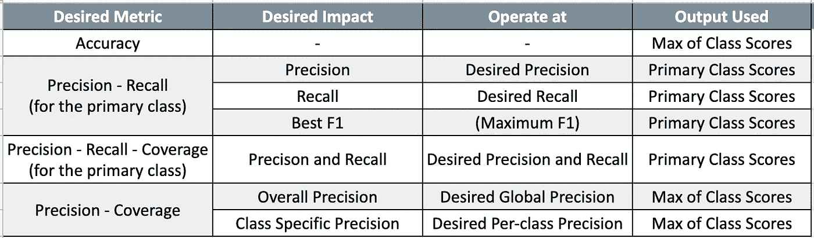

**表-1:** 二进制分类的各种精确-召回-覆盖度量。通常，二元分类器具有主要类别，即感兴趣的主要类别。例如垃圾邮件对非垃圾邮件，将“垃圾邮件”作为主要类别。第 1 列是可以使用的各种 PRC 指标。第 2 列定义了选择“工作点”的度量标准。第 3 列是用户需要输入的操作点的所需主要度量，第 4 列提供了如何计算相应度量的洞察。

## **多级分类**

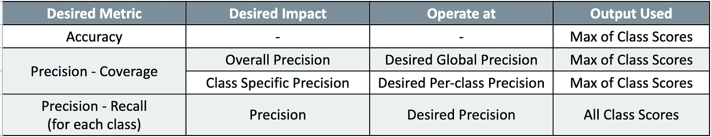

**表-2:** 多类分类的各种精确查全率指标。第 1 列是可以使用的各种 PRC 指标。第 2 列定义了选择“工作点”的度量标准。第 3 列是用户需要输入的操作点的所需主要度量，第 4 列提供了如何计算相应度量的洞察。

## 多标签分类

在下一篇博客中。

# 二元分类

当有两个类时，执行二元分类。通常，两个类别中的一个是主要类别(比如标签为‘1’)，第二个类别是主要类别的缺失(比如标签为‘0’)，例如，垃圾邮件对非垃圾邮件，电子产品对非电子产品。在某些情况下，两个类别都可能是感兴趣的，例如，男子对女子。但是，在这两种情况下，只需要学习一个分类器来区分这两个类别。假设在测试集中有“N”个项目，我们存储两个类的预测。这将产生一个“N”×2 维的输出矩阵“O”。

看上面的表-1，我们可以计算精确召回覆盖度量的三个不同的变量，其在输出矩阵‘O’上使用不同的运算。作为参考，我们可以通过计算两个分数的最大值，并将相应的预测标签与实际情况进行比较，来计算“准确性”度量。

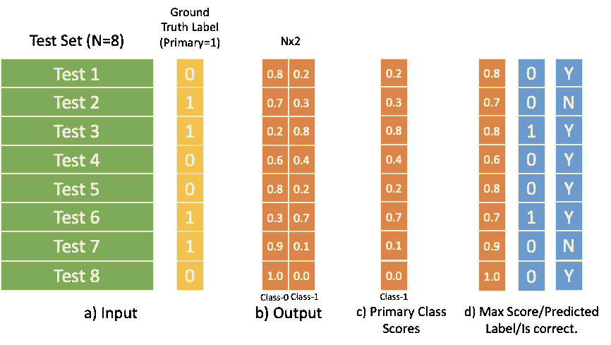

**图-1:** 各种输出分数。a)具有基本事实的输入数据，b)两个类的输出分数，c)初级类的分数(列-2)，以及 d)每行的最大值和作为预测标签的 Max 的相应索引。

例如，对于上面的玩具问题，分类精度是 75%，这是 6/8，因为总共 8 个标签中有 6 个标签匹配，而不管它是 0 还是 1。还要注意的是，在这篇博客中，我采用了一个简单的准确度版本，其中两个分数的最大值是预测的输出，即阈值 0.5。选择不同的阈值是完全有效的，这将给出不同的准确性度量。但是，在这种情况下，最好定义基于 PRC 的指标。在学术环境中，精度仍然是一个受欢迎的选择，尤其是当这两个类在数据集中达到平衡时。

## 初级类的精确召回

二元设置中的精确召回(PR)曲线是二元分类的最常见度量之一。可以计算两条不同的 PR 曲线，每条曲线对应一个类别。尽管通常只对主类进行计算。同样，在大多数问题中，同时实现高精度和高召回率是不可能的，人们必须决定哪一个对下游应用程序具有“期望的影响”——精度或召回率，或者两者的组合(例如 F1 分数)。例如，对于产品分类问题，如果您使用您的分类器来实现更好的“浏览”，即客户选择一个类别(比如“笔记本电脑”)，系统显示所有标有该类别的产品(例如，显示所有笔记本电脑)，那么如果您不想显示“台式机”而不是“笔记本电脑”(这是在谷歌搜索上发生的事情)，那么为了精确度而牺牲召回可能更有意义。可能需要高召回制度的一个例子是“攻击性”产品，如枪支、毒品等。即使展示一个攻击性的产品也会导致信任/公共关系问题，所以如果你正在建立一个攻击性的产品分类器，你可能想要在更高的召回率下操作。如果你不清楚什么对你更重要，一个好的选择是找到 F1 最高分的工作点。f1-分数定义为(2 *(精度*召回率))/(精度+召回率)。同样，您需要深入了解分类器在下游应用中的使用情况/它将如何影响最终客户，以决定是高精度、高召回率还是高 F1 影响。

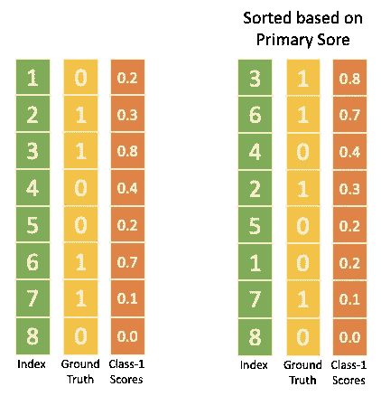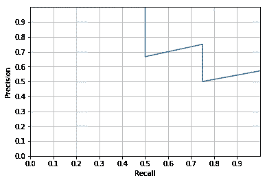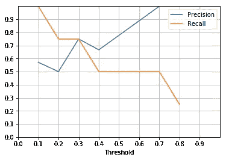

**图-2:【左】**根据原始分数排序的分数和标签，**中间**玩具问题的精度-召回图，**【右】**不同阈值选择的精度和召回。

对于玩具问题，图 2(左)显示了在不同阈值下，基于初级分类的分数排名，(中)精确回忆曲线，(右)精确回忆曲线。需要阈值图来决定工作点。比方说，我们要以 90%的精度操作，看 PR 图，可以看到召回率是 50%。对应的阈值是‘0.6’，这意味着如果分类器的得分≥0.6，我们应该将一个示例分类为‘初级’类，其余的分类为‘次级’类。这些图本身是插值的，对于这个玩具问题，我们只有 8 个例子。在 P=0.75，R=0.75，th=0.3 时，F1 得分最高，为 0.75。

请注意，PR 曲线对测试集中的类别比例很敏感。如果类别比例不同，两个不同的 PR 曲线不能在两个不同的测试集之间进行比较。与小学班级的 10:90 比例的测试集相比，50:50 比例的测试集通常具有更高的分数。这是一些人可能更喜欢基于 TPR/FPR 的指标的地方，因为它们针对等级不平衡进行了标准化。但是，如果在实际环境中，您预计会出现不平衡，PRC 指标可能更容易解释。

## 主要类别的精确召回覆盖率

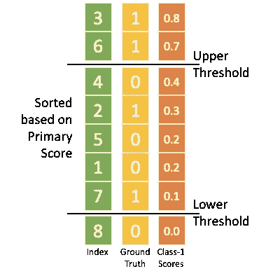

**图-3** :主要类的精确召回覆盖率

在上面的场景中，我们“总是”做出主次分明的决定。在任何操作阈值(th)下，无论是在特定精度下，还是回忆或基于最佳 F1 分数，所有测试项目≥th 都被标记为“主要”,< th 被标记为“次要”。如果我们可以灵活地“不”对物品进行分类，那会怎么样？也许我们想“确保”我们同时以高精度和高召回率运行。也许我们有审计带宽来标记一些项目，但希望挑选对系统来说最困难的项目。假设我们已经花了足够的时间来优化特征、分类器、参数、训练集等。“不分类”是保证高精度和高召回率的一种选择。在这种情况下，我们分类的项目的%年龄被称为覆盖率。这里的权衡是如何在高精度和高召回率下最大化覆盖率。其思想是，如果分数在“上限”和“下限”之间，则不进行分类，并计算剩余样本的精确度和召回率。例如，在图 3 中，如果我们选择上限阈值≥0.7，下限阈值< 0.1，则我们将实现 P=1.0，R=1.0，C=3/8=37.5%。一般来说，最好将第二个类作为一个替代类，并采用精度覆盖度量，如下所示。

## 精确覆盖小学和中学(PPV，NPV)

小学和中学的精确覆盖率也是一个有用的指标。它用于两个类别同等重要的情况(例如，准确地分为男性和女性)。它们也被称为 PPV(正预测值)率和 NPV(负预测值)率。二元问题的这些度量可以用两种不同的方法计算，都可以得到相同的答案。第一种方法与“精确-召回-覆盖”图的方法相同——使用两个不同的阈值，在排序的主要分数上的上限和下限。项目>上部将被分类为初级和

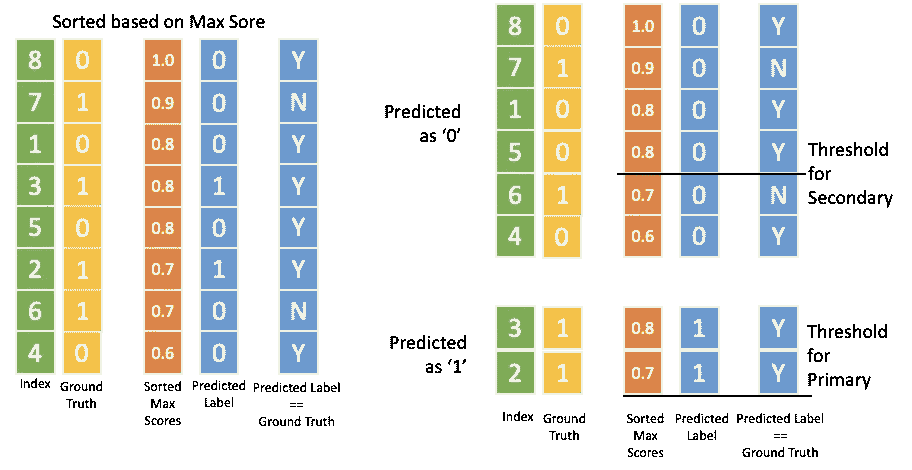

**图-4:** 计算初级和二级精度覆盖率的替代方法。

如图 4 所示，我们分别收集分类为主要和次要的项目，然后根据每个类别的期望精度找到两个不同的阈值。在图中，初级的阈值≥0.7，次级的阈值≥0.8(与初级分数≤0.2 相同)，导致 P_primary=2/2 =1.0，P_secondary=3/4=0.75，C=6/8=75%。

# 多类分类

多类分类问题是当我们想要从“C”类中挑选一个作为标签时。通常情况下，所有的类都是感兴趣的。多类分类器可以以一对一的方式训练，这相当于为每个类学习一个分类器，或者作为单个联合分类器，例如使用 softmax 损失函数，其返回概率分布。与二进制一样，“分类精度”是人们可以选择来评估多类分类器的最简单的度量。分类准确度有两种变体—微观和宏观。微精度是每个实例的平均值，这意味着实例越多的类权重越高，因此对性能的贡献也越大。为了计算宏观精度，我们首先计算每个类的精度，然后平均它，确保每个类得到相同的权重。对于产品分类问题，如果您希望确保目录符合预期的性能，微精度是有意义的。如果您希望确保目录中的每个类别都是准确的，那么宏观准确性是有意义的。

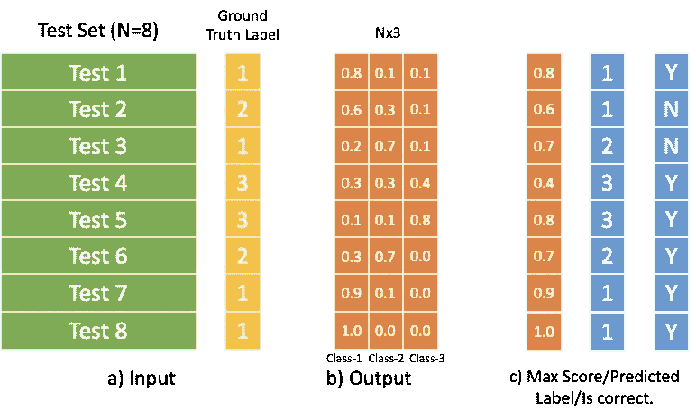

**图-5:** 3 类数据集 a)具有地面真值的输入数据，b)所有三个类的输出分数，c) Max per-row 和 Max 的对应索引作为预测标签。

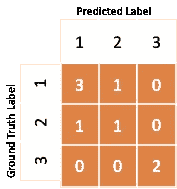

**图-6:** 混乱矩阵

例如，对于上面的玩具问题，微分类准确度是 75%，这是 6/8，因为总共 8 个标签中有 6 个标签匹配。使用图 6 所示的混淆矩阵可以最好地计算出每类的精度。一级精度= 3/4，二级精度= 1/2，三级精度= 2/2，宏观精度= (0.75 + 0.5 + 1)/3，顺便说一下，这本身就是 75%。

## 精确覆盖(全局和每个类别)

多类分类问题的一个实用度量是能够以期望的精度对数据进行分类，并计算准确分类的目录百分比，即覆盖率。与微观和宏观精度一样，可以在目录级别计算精度(其中主导类将主导精度)，或者如果我们希望每个类都精确，我们可以选择选取一个阈值，使每个类都高于所需精度，然后计算 coverage。这两个指标都是通过对最大分数进行排序来计算的。

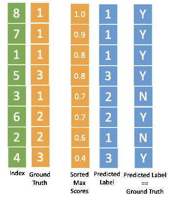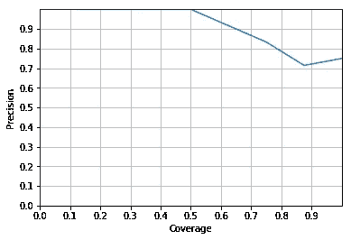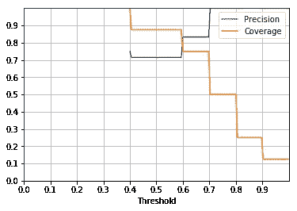

**图-7:【左】**根据最高分排序的分数和标签，**中间**玩具问题的精度-覆盖率图，**【右】**不同阈值选择的精度和覆盖率。

对于玩具问题，图 7(左)显示了基于最高分的分数排名，(中)精度-覆盖率(PC)曲线，(右)不同阈值下的精度和覆盖率。需要阈值图来决定工作点。比方说，我们希望以 95%的精度运行，查看 PC 图，我们可以看到覆盖率为 55%(插值)。对应的阈值是‘0.7’，也就是说如果 max 评分≥0.7，我们就要把一个例子归类，其余的为‘无法归类或 UTC’。这些图本身是插值的，对于这个玩具问题，我们只有 8 个例子。

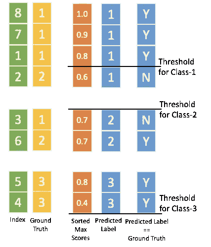

**图-8:** 每类精度覆盖率。

为了计算每个类的阈值，我们将基于预测的类旋转输出，然后计算每个类的阈值，这样每个类都有 95%的精度。这并不类似于图 4 中计算小学和中学精确覆盖率的另一种方法。对于玩具多类问题，这导致 1 类覆盖率(精度> 95%)为 3/3，2 类覆盖率(精度> 95%)为 0/2，3 类覆盖率(精度> 95%)为 2/2，覆盖率(精度> 95%)=(3+0+2)/8 = 62.5%。覆盖范围的增加并不是因为我们对于等级 3，我们可以承受一个更低的阈值 0.4，根据玩具问题。在现实世界中，您可能希望每个类都有最小的计数，以确保健壮性。

## 精确召回率(每类)

可以将 C 类多类分类器视为 C 个独立的二进制分类器，并报告每个二进制分类器的精确召回度量，将特定类视为主要类，将所有其他类视为次要类。

曾经可以使用混淆矩阵(图 6)对 PR 进行点估计。对于每个类，正确分类到该类中的实例百分比是精度，检索到的实例百分比是召回率。例如，对于类-1，精度和召回率都是 3/4 = 75%，类-2: P=1/2，R=1/2，类-3: P=2/2，R=2/2(同样，精度和召回率恰好相同)。为了计算整个 PR 曲线，输出矩阵的每一列都可以作为初级类的分数。遵循类似于二元 PR 曲线的方法，我们可以构建 C 条不同的 PR 曲线，每条曲线对应一个类别。

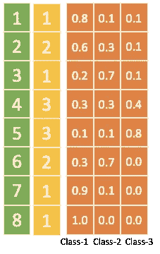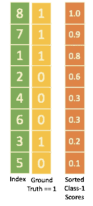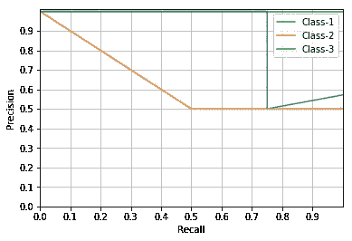

**图-9:[左]** 所有类的分数，**【中】**基于类 1 分数的排序示例，**【右】**所有类的精确召回曲线。

对于上面的 3 类问题，图 9(左)显示了所有类的分数。在中间，突出显示了基于第 1 类分数的排序示例，在右边，绘制了所有类的精确-召回曲线。

# 多标签分类

在下一篇博客中。