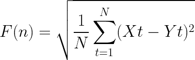
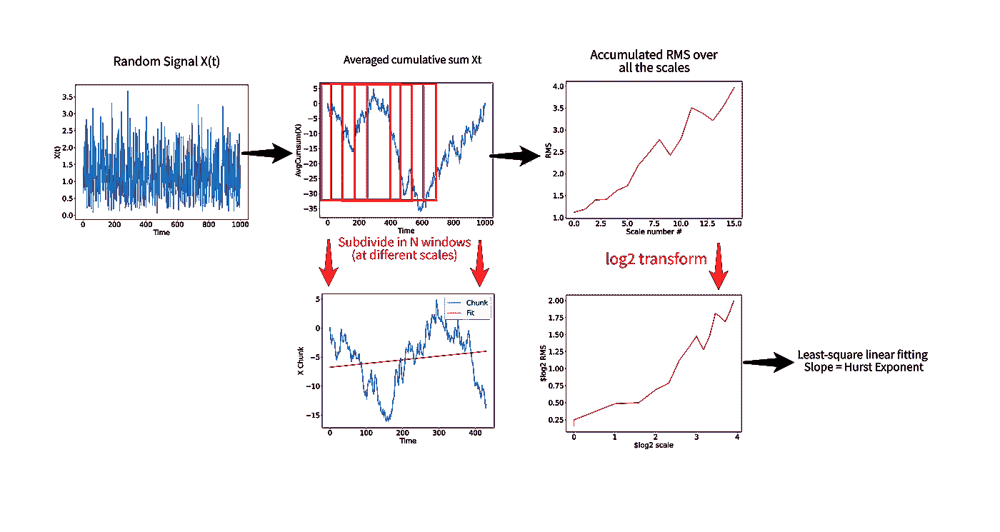
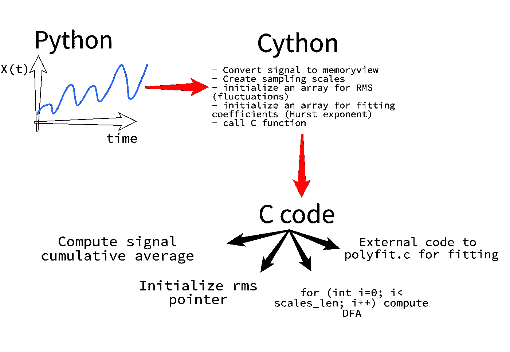
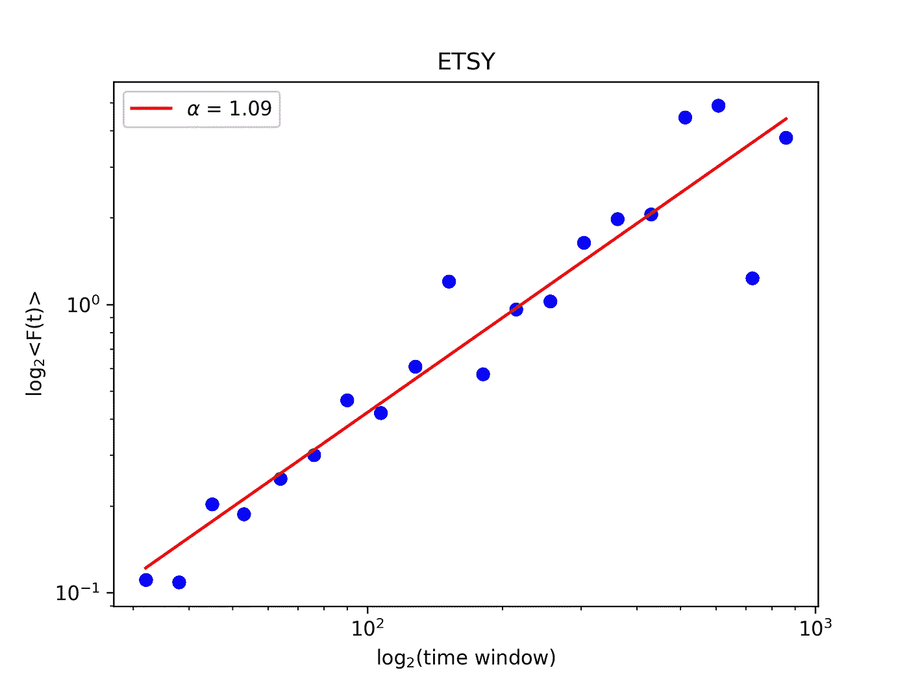
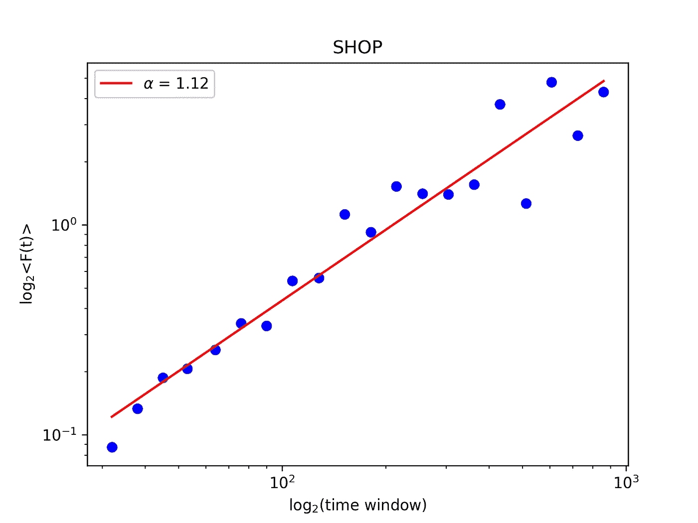
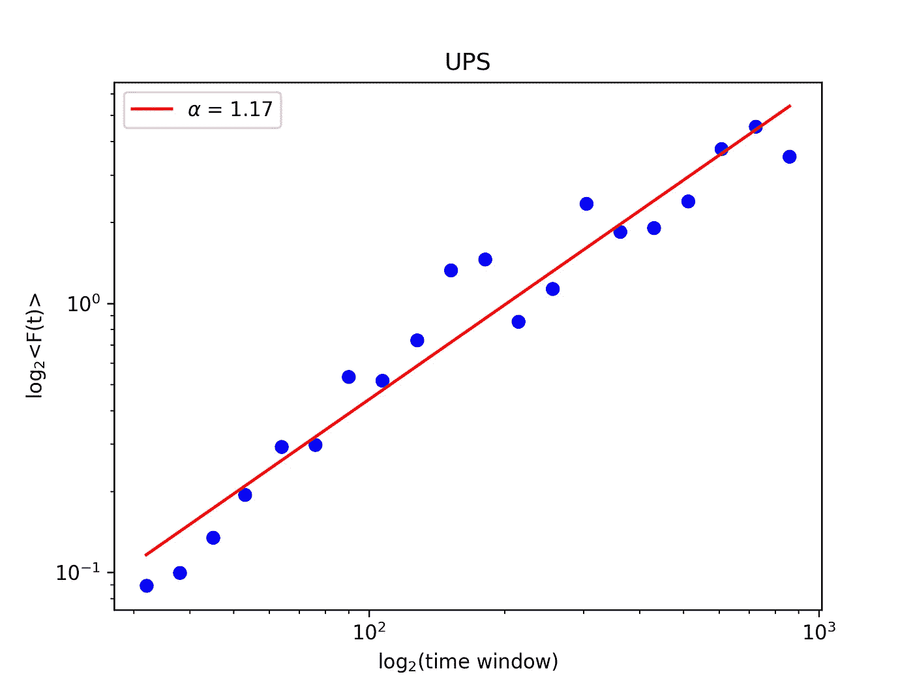

# 实用 cy thon——音乐检索:去趋势波动分析(DFA)

> 原文：<https://towardsdatascience.com/practical-cython-music-retrieval-detrended-fluctuation-analysis-dfa-7935aa84e289?source=collection_archive---------23----------------------->

## [实践教程](https://towardsdatascience.com/tagged/hands-on-tutorials)

这是我关于 Cython 的第三篇教程。这一次我们将实现去趋势波动分析(DFA ),这是一种广泛应用于时间序列分析的技术，范围从音乐到金融


我们能揭开长期事件隐藏的本质吗？图片由[艾萨克·史密斯](https://unsplash.com/@isaacmsmith)在 [Unsplash](https://unsplash.com/photos/AT77Q0Njnt0) 上拍摄

[](https://medium.com/@stefanobosisio1/membership) [## 通过我的推荐链接加入 Medium-Stefano Bosisio

### 作为一个媒体会员，你的会员费的一部分会给你阅读的作家，你可以完全接触到每一个故事…

medium.com](https://medium.com/@stefanobosisio1/membership) 

欢迎回到我的 Cython 教程！今天我们将讨论一种广泛使用的技术，叫做[去趋势波动分析(DFA)](https://en.wikipedia.org/wiki/Detrended_fluctuation_analysis) 。DFA 在音乐 [](http://citeseerx.ist.psu.edu/viewdoc/download;jsessionid=3EC936FFC4219B5D769FDACC62EC6464?doi=10.1.1.73.8209&rep=rep1&type=pdf) [](https://royalsocietypublishing.org/doi/pdf/10.1098/rspa.2011.0118)和金融 [](https://www.researchgate.net/profile/Hui_Xiong10/publication/302473805_Detrended_fluctuation_analysis_of_multivariate_time_series/links/5f88ed75299bf1b53e2bf44e/Detrended-fluctuation-analysis-of-multivariate-time-series.pdf) [⁴](https://people.engr.ncsu.edu/jwilson/files/mfdfa-pafts.pdf) 中得到了广泛的应用，能够捕捉时间序列和非平稳信号中的相关趋势——即随时间变化的信号。自 50 年代以来，这种分析方法的思想简单直接，并且在数学上有很好的基础。一旦你理解了基本的实现，你将能够进一步扩展这个分析，创建一个多趋势分析以及混沌系统[波动分析](https://www.hindawi.com/journals/mpe/2016/2865195/)的扩展。在本教程的最后，你将掌握 DFA 技术，并了解如何在 Cyhton 中处理多个 C 文件，以及在编译时做什么。

所有代码都存储在这个存储库中:

[](https://github.com/Steboss/music_retrieval/tree/master/dfa) [## ste boss/音乐 _ 检索

### 用于检索音乐信息的 python-c-cython 工具小套件

github.com](https://github.com/Steboss/music_retrieval/tree/master/dfa) 

这次没有对应的版本，但是许多用户已经实现了他们自己的 Python DFA 版本，例如:[https://github.com/dokato/dfa](https://github.com/dokato/dfa)

# 外行理论

DFA 的起源可以追溯到 50 年代，这要归功于英国水文学家 Harold Hurst 所做的开创性工作，他致力于确定尼罗河的最佳大坝尺寸，尼罗河自埃及时代起就支撑着文明。即使这看起来是一个非常简单的任务，数学上确定尼罗河流量和正确的大坝高度总是受到不可预见的降雨和干旱条件的高度影响，使这成为几个世纪以来的一个挑战性问题。作为一名优秀的工程师，赫斯特决定着手解决这个问题，从分析他能得到的所有可能的数据开始，这些数据来自尼罗河和所有汇合的河流。因此，赫斯特分析了尼罗河的累积流量(690 个不同的时间序列，75 个特征，如地球物理现象、降雨量、温度等……全部手工完成！)及其随时间变化的汇合流，确定一个数学参数，称为“调整范围” *R* ，作为在规定的环境条件下特定时间点从河流偏离的最大值和最小值之间的差值。将该参数除以(标准化)数据标准偏差，Hurst 获得了重新调整后的范围 *R/S* ，这是一个无量纲数，证明是特定时间段内理想坝高的代表。此外，Hurst 发现在每种情况下，统计参数 *R/S* 与分析周期 *n (n* 可以是一年、两年等)成比例。)具有类似于 *nᵏ* 的幂的行为，平均值为 *k* =0.72 +/- 0.01。

好了，现在这个“赫斯特”数字有什么特别之处？嗯，如果所有这些历史事件都遵循正态分布，正如许多自然事件通常预期的那样，这个数字应该等于 0.5。然而，这在大坝设计中是一个潜在的危险假设，因此大坝会被设计得太低。正如赫斯特所证明的，考虑到多雨和干旱的情况，k = 0.72 是一个长期行为的基础，因此在这些自然事件的统计分布中隐藏了一些东西。由于当时知识的匮乏，赫斯特没能清楚地解释这个结果，但他为*“长期”记忆事件*做了铺垫。

大约 20 年后，伟大的数学家 Benoit Mandlebrot 在 Hurst 的结果中发现了 t 2 现象的重尾和分形行为。赫斯特指数(称为*赫斯特指数—* ，从现在开始用 H 表示)描述了分析数据中的“[自相似](https://en.wikipedia.org/wiki/Self-similarity)现象。按照这种观点，自相似意味着如果一个信号 *Y(t)* 是一个在某个时间点 *ct* (例如今天)被分析的信号(例如，亚马逊股票价格，随时间变化 *t* ),其中 *c* 是任何数字，存在类似于*cᴴy(t*的比例关系，其中 *H* 是赫斯特指数。

这样一个非凡的发现让曼德勃罗和他的合作者范·内斯调查了大量不同的现象，比如经济、音乐、水文。[信不信由你，但所有这些现象都表现出一种 *1/f* 噪声波动行为，即所有这些序列都有一个确定的时间行为，具有长程相关性，根据这些值确定一个序列在时间](https://en.wikipedia.org/wiki/Pink_noise)内的稳健性:

*   *H* > 0.5:信号中存在长时间相关性
*   *H* ~ 0.5:信号完全随机
*   *H* < 0.5:信号中存在反持续/均值回复行为

经过几十年的研究，越来越多的信号被分析，越来越多的技术被发现来寻找长期的相关性。*去趋势波动分析(DFA)* 就是这些技术中的一种，它*决定了一个信号的统计自相似性，所以如果一个信号具有长记忆*过程/相关性/ *1/f* 波动。在实践中，*获得了赫斯特指数，该指数被证明对于非平稳信号也是有效的。*

数学上，DFA 可以分解并定义为四个步骤:

*   计算由 *N* 个样本组成的信号 *x(t)* 的平均累积和 *Xt*
*   将平均累积和 *Xt* 细分为 *n* 个样本，并为每个子样本计算最小二乘线性拟合 *Yt。*在不同的尺度上重复这个过程，即从将信号分成 *n 个*小样本到 n 个大样本
*   由此计算消除趋势的波动，作为每个标度的平均累积和 *Xt* 和拟合 *Yt，*之间的均方根偏差:



等式 1 消除趋势波动计算为平均累积和 Xt 与拟合 Yt 之间的 RMS

*   将 *F(n)* 表示为具有数量为 *n* 个样本的*对数函数*，并找到指数行为(DFA-Hurst 指数)

现在我们已经准备好处理 DFA 实现了！

# Cython 的 DFA:让我们玩得开心

## 行动（或活动、袭击）计划



图 1:从信号的角度理解 DFA 的实现。首先，计算信号 X(t)的平均累积和 Xt。Xt 被细分为 N 个不同尺度的样本。对每个 X 块执行线性拟合，并计算和累加 RMS。最终 RMS 是不同比例下每个 Xt 块的 RMS 总量。最后，RMS 用 log2 进行变换，并计算线性拟合以获得 Hurst 指数。

图 1 定义了如何计算 DFA:

*   计算信号 *X(t)* 的平均累积和 *Xt* ，可以认为是一个简单的过程:

图 2:信号 X 的平均累积和计算示例

*   将 *Xt* 细分为 *n* 个不同尺度的子样本。为了确定尺度以及将 *Xt* 分成多少个子样本，我们可以从一个数组`scales`开始，其中包含我们想要使用的所有尺度。然后，对于每个标度，计算我们可以获得多少子样本，并用来自 *Xt* 的所有子样本填充临时数组`tmpX`

图 3:子样本的创建。首先创建一个我们想要细分 AvgCumsum Xt 的比例数组，然后用每个比例的 shape1 样本填充一个临时数组

*   对于带有`curr_scale`样本的每个`tmpX`，我们执行线性最小二乘拟合，并计算每个块的拟合优度。拟合优度有助于确定均方根(RMS)误差，因此累积所有这些误差
*   一旦每个标度的子样本拟合完成，就可以根据上一步存储的部分均方根值计算最终均方根值
*   将最终 RMS 转换为 log2，并计算线性拟合。拟合的斜率与赫斯特指数一致

现在我们已经对如何计算 DFA 有了一个完整的想法，我们可以继续细分 Python-Cython 和 C 之间的实现:

*   entrypoint 始终是一个 Python 代码，它将输入信号编码并发送给 Cython。
*   Cython 必须为 C 做好准备，首先将输入信号转换为可读的 C 格式，如 memory view，并初始化所有必要的数组以从 C 中检索信息，如 RMS(或波动)和拟合系数以检索 Hurst 指数。最后，Cython 调用 C 函数来执行 DFA 计算，用 C 指针绑定内存视图，如`&cython_memoryview[0]`
*   第一次，我们将不得不处理多个 C 文件:一个用于计算 DFA，另一个用于线性拟合。此外，我们将需要编写一个函数来计算平均累积和，一个函数来执行 log2 变换和地板除法，以及一个主函数与 DFA 计算。所有这些信息都将被发送回 Cython。



图 4:用 C 实现 DFA 并与 Cython 和 Python 交互的行动计划

## Python 脚本

代码:[https://github . com/ste boss/music _ retrieval/blob/master/DFA/installer/tester . py](https://github.com/Steboss/music_retrieval/blob/master/dfa/installer/tester.py)

Python 代码通常是我们的应用程序的入口点。在这里，我们接收输入数据，将它们转换成合适的格式。作为这个代码中的一个例子，我们正在处理一个随机信号——`scipy.signal.hilbert`变换只是为了避免负的幅度值，但它只是为了训练的目的。

一旦输入被处理，可以用下面的代码行调用`dfa`:`scales, fluct_to_array, coeff_to_array = dfa.play(X, 5, 9, 0.25)`:

*   为了在 Cython 中激活 DFA 分析，我们将使用`play`属性
*   `play`接收输入:`X`信号，`5, 9, 0.25`最小样本细分(2⁵)最高样本(2⁹)和间隔间距 0.25
*   `dfa.play`函数返回输入信号`X`已被划分的`scales`，所有样本的 RMS 为`fluct_to_array`，而`coeff_to_array`包含赫斯特指数

最后一步，我们希望可视化 DFA 函数以及 log2 变换和拟合:

图 5:快照，RMS (fluct_to_array)图作为双对数图，作为样本比例的函数

## Cython 脚本

代码:[https://github . com/ste boss/music _ retrieval/blob/master/DFA/installer/DFA . pyx](https://github.com/Steboss/music_retrieval/blob/master/dfa/installer/dfa.pyx)

在`pyx`代码中立即弹出的第一件事是 2 C 代码的声明:

图 6:项目中使用的所有 C 代码的声明

第一个代码是`dfa.c`，它是主 DFA 算法运行的地方，第二个代码是`polyfit.c`，它被`dfa.c`用来运行任何函数的多项式拟合。如你所见，`polyfit.c`是 DFA 例程的附属元素，但是我们必须在这里或者在`setup.py`文件中声明它，以便 Cython 读取 c 的所有依赖项。我决定不在`setup.py`中声明`polyfit.c`，以便保持设置脚本清晰易懂，因此我们只需担心声明中的`dfa.c`(见最后一位 TODO)。如果我们不在任何地方声明`polyfit.c`会怎么样？你可以编译 Cython 代码，但是，在运行时，你会得到一个`flat namespace`错误:

```
- python tester.pyTraceback (most recent call last):File "tester.py", line 2, in <module>import dfaImportError: dlopen(.../dfa.cpython-38-darwin.so, 2): Symbol not found: _polyfitReferenced from: .../dfa/installer/dfa.cpython-38-darwin.soExpected in: flat namespacein .../dfa/installer/dfa.cpython-38-darwin.so
```

这个错误告诉我们 Cython 无法通过`dlopen`加载动态库文件`_polyfit`——注意`_polyfit`中的下划线表示`polyfit`函数受到保护，任何人都无法访问。这在 Cython 中很常见，所以一定要声明所有的代码。

其次，值得强调的另一个错误来源是使用`cpdef.` `cpdef`定义了一个可以在 C 和 Python 之间共享的函数，不同于`def`只能被 Python 读取而不能被 C 读取，以及`cdef`只能被 C 读取而不能被 Python 读取。因此，编写`cdef`而不是`cpdef`会使属性`play`对 Python 隐藏，而`dfa.play()`会引发类似`dfa has not attribute play`的错误。

此代码中的第三件重要事情是正确解析从 NumPy 到 Cython 到 c 的秤类型。从 Numpy 文档中可以检索到下表:

```
NumPy dtype          Numpy Cython type         C Cython type 

np.bool_             None                      None
np.int_              cnp.int_t                 long
np.intc              None                      int       
np.intp              cnp.intp_t                ssize_t
np.int8              cnp.int8_t                signed char
np.int16             cnp.int16_t               signed short
np.int32             cnp.int32_t               signed int
np.int64             cnp.int64_t               signed long long
np.uint8             cnp.uint8_t               unsigned char
np.uint16            cnp.uint16_t              unsigned short
np.uint32            cnp.uint32_t              unsigned int
np.uint64            cnp.uint64_t              unsigned long
np.float_            cnp.float64_t             double
np.float32           cnp.float32_t             float
np.float64           cnp.float64_t             double
np.complex_          cnp.complex128_t          double complex
np.complex64         cnp.complex64_t           float complex
np.complex128        cnp.complex128_t          double complex
```

在第 55 行，在 Numpy 中创建的秤的名称为:`scales=(2**np.arange(scale_low, scale_high, scale_dense)).astype(np.intc)`。最终铸件，`astype(np.intc)`保证了从 NumPy 型到 C 型`int`的正确转换。这通常是错误的来源，因为错误的格式从 Numpy/Cython 传递到 C，导致分段错误

最后，Cython 代码还处理输入数据到存储器视图的正确转换，以及 RMS 和系数数组的初始化:

图 7:初始化并将所有数据转换成内存视图，这样它们就可以在 C 中被读取

然后调用主 C 函数`dfa`，内存视图作为`&memoryview[0]`传递，以便从 C 代码中检索所有最终值。正如这里的[所解释的](http://docs.cython.org/en/latest/src/userguide/memoryviews.html#specifying-more-general-memory-layouts)，由于当前 memoryview 的大小是已知的，底层数据是适当连续的，因此传递一个指向第一个 memory view 元素的指针(`&a[0]`)就足以使它们在 c 中工作。

## c 代码

代码:[https://github . com/ste boss/music _ retrieval/blob/master/DFA/c _ code/DFA . c](https://github.com/Steboss/music_retrieval/blob/master/dfa/c_code/dfa.c)

C 代码实现了主要的 DFA 计算。起初代码可能看起来很吓人，但是让我们一步一步来处理它。

图 8 是最开始的步骤:导入基本库，定义常量和基本函数。最重要的函数是`cumsum_averaged`，它在给定输入信号`float *X`的长度`int n_elems`和信号平均值`float avg`的情况下，计算输入信号`float *X`的平均累积和。最终结果与`float *Xcumsum`指针相关联，所以确切的值在主`dfa`函数中报告

图 8:导入必要的库并为 DFA 定义常量和基本函数

在这些必要的导入之后，可以定义主要的`dfa`函数，考虑 3 个主要的块。在第一位中定义了`fitting_order`，即我们想要执行的拟合类型、平均累积和数组`Xcumsum`、RMS 数组`rms`和拟合的线系数向量`tmpCoeff`:

图 dfa 功能的第一步。定义并初始化向量和拟合顺序

第二步(图 10)是通过 Cython 生产的所有秤`scales`的 for 循环，定义:

*   由当前第 I 个尺度`curr_scale`细分的信号的最终尺寸`shape1`(例如，信号有 1000 个元素，第一个尺度是 2⁵ = 32，所以`shape1 = floor_div(1000, 32) = 31`因此我们将循环通过`Xcumsum` 31 次以将其细分为 32 个)
*   -空向量`tmpX`，其尺寸为`curr_scale`，以便存储`Xcumsum`信号的所有块(例如，在通过`Xcumsum`的 31 个周期中，向量`tmpX`每个周期将存储 32 个样本)
*   空向量`tmpDiff`，其大小为`curr_scale`，用于计算`tmpX`信号块与其线性拟合之间的元素-元素差异(例如，一旦`tmpX`具有 32 个样本并且针对这些样本的拟合完成，`tmpDiff`将存储元素-元素差异，因此元素 0 具有拟合元素 0，元素 1 具有拟合元素 1，等等)
*   一个空向量`tmpShape1`，其大小为`shape1`以存储来自`tmpDiff`向量的当前 RMS，计算如下:`tmpShape1[j] = sort(vector_avg(tmpDiff, curr_scale))`

图 10:DFA 功能的第二步。循环通过所有标度，信号 Xcumsum 被细分并初始化 rms 阵列

最后一步是 DFA 的核心，在这里计算所有的量:

*   `for j=0 ... j=shape1-1`细分`Xcumsum`信号，并将所有样本存储在`tmpX`(例如，假设`shape1=31`，在第一次迭代中，信号`Xcumsum`将从 0 读取到 31，这些样本将被保存到`tmpX`
*   用`polyfit`对`tmpX`进行线性拟合。`polyfit`将 x 轴(`scale_ax`，它简单地从 0 到`shape1`)、具有第一个`curr_scales`样本的 y 轴函数`tmpX`、`tmpX`的长度、`fitting_order`和存储拟合系数的指针`tmpCoeff`作为输入
*   从拟合的系数中检索拟合线:

图 11:从拟合的系数(斜率和截距)定义拟合线

*   通过计算`tmpX`元素和`fitting_results`元素之间的 RMS 来确定拟合优度。最后，将这些结果存储在`tmpShape1`中

图 12:计算每个 tmpX 值和拟合值的元素式 RMS。

*   在第二个周期结束时，记住释放所有必要的向量，并从`tmpShape1`开始累加总数`rms`:

图 13:根据逐元素均方根阵列计算最终均方根

恭喜你。您设法处理了 DFA 实现中最复杂的步骤。DFA C 代码的最后几行非常简单，计算 RMS 的`log2`变换，以返回 Hurst 指数:

图 14:RMS 的 log2 变换和计算赫斯特指数的线性拟合

如前所述，`polyfit`接收作为输入的 x 轴，在这种情况下是从 1 到`scales_len` log2 转换的值，y 轴函数，在这种情况下是 log2-RMS，x 和 y 轴的长度，`fitting_order`和`coeffs`指针，以返回指向主函数的指针。最终，`coeffs[1]`包含赫斯特指数，RMS log2 图可以很容易地用 python 可视化:

图 15:用 Python 可视化 log2-RMS 图并检索赫斯特系数

## 准备 setup.py 并安装所有东西

定义 Mac 警告 so -arch 和 np.get_include()

和前面的[教程](/practical-cython-music-retrieval-short-time-fourier-transform-f89a0e65754d)一样，代码被分成两个文件夹:`c_code`，存放`dfa.c`和`polyfit.c`，以及`installer`，存放`pyx`和 Python 文件。`setup.py`是安装文件，保存在`installer.`安装程序文件遵循这里的代码:[https://github . com/ste boss/music _ retrieval/blob/master/DFA/installer/setup . py](https://github.com/Steboss/music_retrieval/blob/master/dfa/installer/setup.py)。我确保这个设置可以在 Mac 上运行，为 c 编译器`os.environ['ARCHFLAGS']='-arch x86_64`添加了正确的架构，包括正确的 NumPy 头文件(例如 arrayobject.h)和`Extension`下的`include-dir=[numpy.get_include()]`

一旦代码准备好了，我们就可以像下面这样运行`setup.py`:

```
python setup.py build_ext --inplace
```

`build_ext`是构建当前扩展的命令，`--inplace`允许在工作目录中安装当前包。将输出文件复制到`dfa`文件夹中，就可以开始导入 DFA Python 包了

# 实践中的 DFA

总结最后一个使用 DFA 处理财务数据的例子。在我的下一篇博文中，我将展示一个应用于音乐的进一步例子——敬请关注！

## Etsy，Shopify，UPS 的案子

统计学/机器学习/深度学习/超强度学习的圣杯之一就是预测股市。不幸的是，类似的算法并不那么具有预测性，其中许多算法都存在数据泄露的问题，这使得预测变得非常完美——这在 Medium 上经常发生。我决定做的是应用 DFA，检查雅虎列出的所有金融股票(约 856 只股票)是否存在某种长期相关性或趋势。不足为奇的是，大多数股票序列似乎具有布朗行为，即信号中没有相关性。Etsy、Shopify 和 UPS 出现了一个令人惊讶的案例，具有几乎完美的 1/f 噪声，即赫斯特指数(此处用α表示)接近 1，这表明时间序列具有自相似性:



图 16 赫斯特系数约为 1.09 的 ETSY 股票



图 17 Shopify 股票，赫斯特系数~ 1.12



图 18: UPS 股票，赫斯特指数~ 1.17

我希望你喜欢 Cython 上的这个新教程:)如果有任何问题或意见，请发邮件给我，地址是:stefanobosisio1@gmail.com

# 文献学

1.  音乐信号的去趋势波动分析:可舞性估计和进一步的语义表征，s .施特雷希，P. Herrera，2005
2.  通过多重分形去趋势波动分析揭示音乐中的竞争行为:应用于巴赫的交响乐
3.  多变量时间序列的去趋势波动分析，熊宏，尚，2016
4.  多重分形去趋势波动分析:金融时间序列的实际应用，J. R. Thompson，J. R. Wilsonb，2014 年