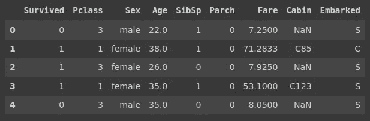
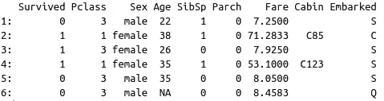
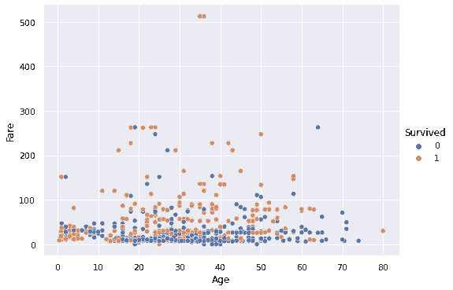
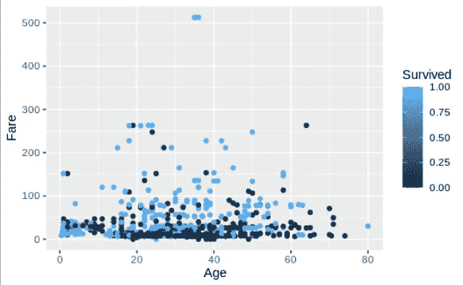
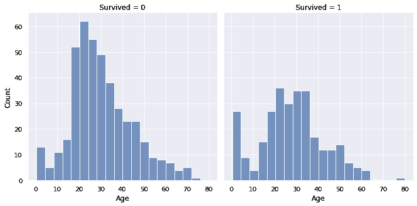
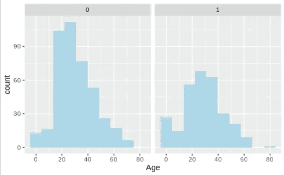
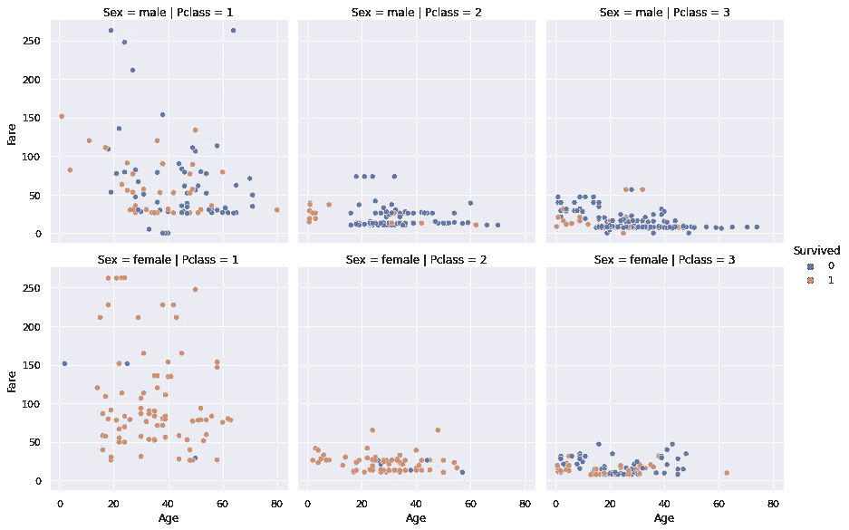
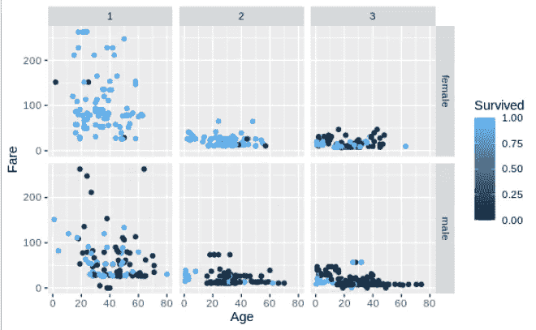

# 实用数据可视化指南:Seaborn vs Ggplot2

> 原文：<https://towardsdatascience.com/practical-data-visualization-guide-seaborn-vs-ggplot2-9747d9153ade?source=collection_archive---------26----------------------->

## 带示例的实践教程


约尔根·哈兰在 [Unsplash](https://unsplash.com/s/photos/twice?utm_source=unsplash&utm_medium=referral&utm_content=creditCopyText) 上的照片

数据可视化是数据科学的重要组成部分。揭示变量之间的关系有助于更好地理解数据。还可以使用设计良好的数据可视化来探索数据集中的底层结构。

在本文中，我们将比较两个流行的数据可视化库:Python 的 Seaborn 和 r 的 ggplot2。

我们将使用著名的泰坦尼克号数据集来创建可视化。您可以从 Kaggle 下载“ [train.csv](https://www.kaggle.com/c/titanic) ”文件进行跟进。

第一步是导入库并创建数据框。我们将使用 Python 的 Pandas 库和 R 的 data.table 库来处理数据操作。

```
import numpy as np
import pandas as pd
import seaborn as sns
sns.set(style='darkgrid')titanic = pd.read_csv("/content/titanic.csv")titanic.drop(['PassengerId', 'Name', 'Ticket'], 
             axis=1, inplace=True)titanic.head()
```



(图片由作者提供)

```
> library(ggplot2)
> library(data.table)> titanic <- fread("/home/soner/Downloads/datasets/titanic.csv")
> titanic[, c("PassengerId", "Name", "Ticket"):=NULL]
> head(titanic)
```



(图片由作者提供)

现在，我们已经将数据集保存在适当的数据结构中。让我们从创建散点图开始。

散点图是一种关系图，通常用于显示两个数值变量的值。我们可以观察它们之间是否有关联。

Seaborn:

```
sns.relplot(data=titanic, x="Age", y="Fare", hue="Survived",
            kind='scatter', aspect=1.4)
```



Seaborn 散点图(图片由作者提供)

Seaborn 的 relplot 函数创建不同种类的关系图，如散点图或线图。绘图类型由 kind 参数指定。我们将要绘制在 x 轴和 y 轴上的列分别传递给 x 和 y 参数。hue 参数根据给定列中的类别，通过对每个类别使用不同的颜色来分隔数据点。最后，aspect 参数调整图形的宽高比。

Ggplot2:

```
> ggplot(data = titanic) + 
+     geom_point(mapping = aes(x = Age,  y = Fare, color =  
                 Survived))
```



Ggplot2 散点图(图片由作者提供)

第一步是创建一个空图的 ggplot 函数。数据被传递给 ggplot 函数。第二步根据给定的映射和绘图类型在图上添加一个新层。geom_point 函数创建散点图。要绘制的列在 aes 方法中指定。颜色列与 Seaborn 库中的色调参数相同。

我们没有观察到年龄和票价之间的特殊关系，这是一种预期。

我们使用颜色参数根据幸存的列来分隔数据点。看起来付钱多的乘客有更高的生存机会。

我们可以创建一个直方图来检查数字变量的分布。通过将值范围划分为离散的仓来创建直方图，并且每个仓中的数据点(或值)的数量用条来可视化。

让我们也在不同的情节上展示幸存和未幸存的乘客。

Seaborn:

```
sns.displot(data=titanic, x="Age", col="Survived", kind="hist")
```



年龄直方图(图片由作者提供)

col 参数通过创建单独的子图来分隔数据点。如果我们使用 row 参数，支线剧情将被创建为行。

Ggplot2:

```
> t <- ggplot(titanic, aes(Age)) + 
+     geom_histogram(bins=10, fill='lightblue')
> t + facet_grid(cols=vars(Survived))
```



年龄直方图(图片由作者提供)

在 ggplot2 库中，我们可以使用 facet_grid 函数根据给定列中的类别创建一个子图网格。它类似于 Seaborn 中的 FacetGrid 对象。

对于最后一个示例，我们将使用 row 和 col 参数创建一个更大的绘图网格。在前面的例子中，我们看到在 fare 列中有几个异常值。我们将首先过滤掉这些观察结果，然后生成图表。

Seaborn:

```
titanic = titanic[titanic.Fare < 300]sns.relplot(data=titanic, x="Age", y="Fare", kind="scatter",
            hue="Survived", row="Sex", col="Pclass",
            height=4)
```



(图片由作者提供)

我们清楚地看到，1 等舱的乘客比其他人更有可能生还。另一个发现是，女性乘客比男性乘客有更高的生还几率。

Ggplot2:

可使用 ggplot2 库创建相同的绘图网格，如下所示:

```
> titanic <- titanic[Fare < 300]> t <- ggplot(titanic, aes(x=Age, y=Fare, color=Survived)) + geom_point()
> t + facet_grid(cols=vars(Pclass), rows=vars(Sex))
```



(图片由作者提供)

虽然语法不同，但方法是相似的。我们通过使用颜色、行和列参数来添加维度。

## 结论

Seaborn 和 ggplot2 都是功能强大的通用数据可视化库。我认为两者都足以完成典型的数据可视化任务。

使用哪一种取决于您对编程语言的选择。因为 Python 和 R 都是数据科学生态系统中的主流，所以它们中的任何一个都可以为您完成这项工作。

感谢您的阅读。如果您有任何反馈，请告诉我。