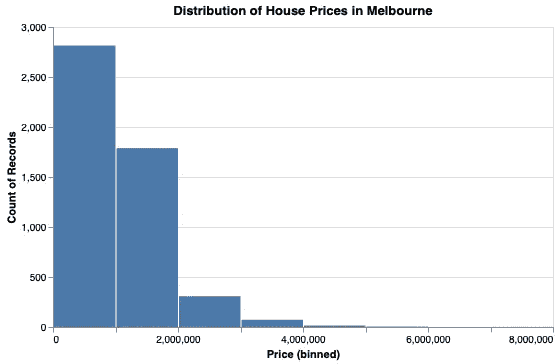
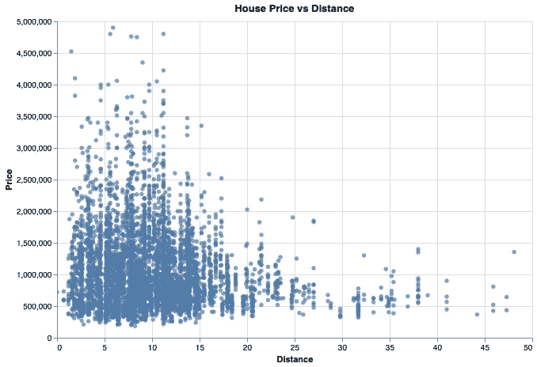
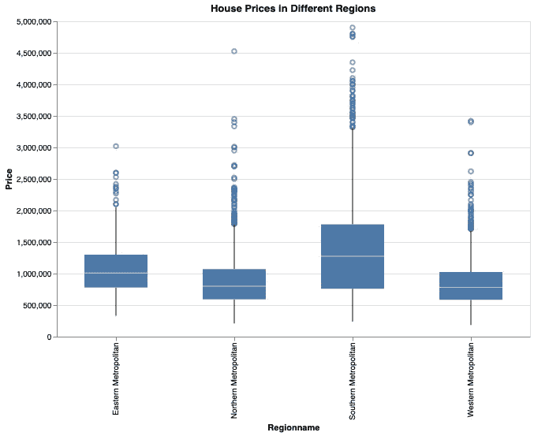
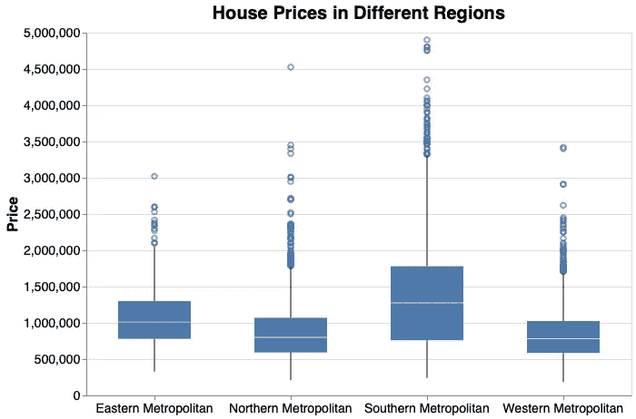
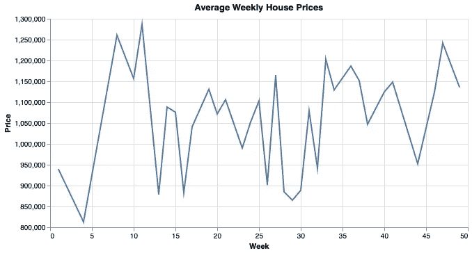

# Python Altair 数据可视化实用指南

> 原文：<https://towardsdatascience.com/practical-data-visualization-guide-with-python-altair-347834d22176?source=collection_archive---------30----------------------->

## 探索墨尔本房价


哈姆扎·扎伊迪在 [Unsplash](https://unsplash.com/s/photos/melbourne-city?utm_source=unsplash&utm_medium=referral&utm_content=creditCopyText) 上的照片

数据可视化是探索性数据分析不可或缺的一部分。一个设计良好的可视化比简单的数字能提供更多的洞察力。因此，在数据科学生态系统中有几个数据可视化库。

在本文中，我们将尝试探索并深入了解 Kaggle 上的墨尔本房产[数据集](https://www.kaggle.com/dansbecker/melbourne-housing-snapshot)。

Altair 是 Python 的统计可视化库。它的语法清晰易懂，我们将在示例中看到。用 Altair 创建交互式可视化也非常简单。

Altair 在数据转换方面非常灵活。在创建可视化时，我们可以应用许多不同种类的转换。它使得库对于探索性数据分析更加有效。

我们将使用 Pandas 来读取数据集和一些数据操作任务。让我们从导入库和读取数据集开始。

```
import numpy as np
import pandas as pd
import altair as altmelb = pd.read_csv("/content/melb_data.csv", parse_dates=['Date']).sample(n=5000)melb.shape
(5000,21)melb.columns
Index(['Suburb', 'Address', 'Rooms', 'Type', 'Price', 'Method', 
'SellerG','Date', 'Distance', 'Postcode', 'Bedroom2', 'Bathroom', 'Car','Landsize', 'BuildingArea', 'YearBuilt', 'CouncilArea', 'Lattitude','Longtitude', 'Regionname', 'Propertycount'],       dtype='object')
```

该数据集包含墨尔本大约 13580 所房屋的 21 个特征(即柱子)。然而，我创建了一个 5000 所房子的随机样本，因为 Altair 默认接受最多 5000 行的数据集。可以增加这个数字，但这超出了本文的目的。

目标变量是价格列。其他栏目应该能提供对房价的有价值的洞察。可以从查房价分布入手。

一种方法是创建直方图。它将连续变量的值域划分为离散的箱，并计算每个箱中的观察值(即行数)。

```
alt.Chart(melb).mark_bar().encode(
   alt.X('Price:Q', bin=True), y='count()'
).properties(
   height=300, width=500,
   title='Distribution of House Prices in Melbourne'
)
```



(图片由作者提供)

我们来详细说明一下语法。存储数据的对象被传递给顶级图表对象。然后下一步是定义绘图的类型。

encode 函数指定在给定的数据帧中绘制什么。因此，我们在编码函数中写的任何东西都必须链接到数据帧。最后，我们使用 properties 函数指定绘图的某些属性。

make_bar 函数可用于创建带有数据转换步骤的直方图。在 encode 函数中，我们将价格变量的值域划分为离散的箱，并计算每个箱中数据点的数量。

大部分房子都在 200 万以下。我们也看到一些花费超过 400 万的异常值。

位置是决定房子价格的一个重要因素。我们可以想象到中央商务区(CBD)的距离对墨尔本房价的影响。由于两者都是连续变量，散点图是这个任务的好选择。

```
alt.Chart(melb).mark_circle(clip=True).encode(
   alt.X('Distance'),
   alt.Y('Price', scale=alt.Scale(domain=(0,5000000)))
).properties(
   height=400, width=600,
   title='House Price vs Distance'
)
```

这里我想强调几点。我已经使用 scale 属性排除了价格高于 500 万的异常值。为了使用 scale 属性，我们用 Y 编码(alt。Y('Price '))而不是传递一个字符串(y='Price ')。

另一点是 mark_circle 函数的 clip 参数。如果我们不将其设置为 True，则仍将绘制超出指定轴限制的数据点。相信我，情况不妙。

上面的代码生成的散点图是:



(图片由作者提供)

总的来说，与中央商务区的距离对墨尔本的房价有负面影响。

墨尔本有几个地区。我们先来检查一下数据集中每个区域的比例。

```
melb.Regionname.value_counts(normalize=True)Southern Metropolitan         0.3530 
Northern Metropolitan         0.2830 
Western Metropolitan          0.2106 
Eastern Metropolitan          0.1096 
South-Eastern Metropolitan    0.0338 
Eastern Victoria              0.0042 
Northern Victoria             0.0034 
Western Victoria              0.0024melb.Regionname.value_counts(normalize=True).values[:4].sum()0.96
```

96%的房屋位于排名前四的地区。我们可以对比一下这些区域的房价。

一种选择是使用提供变量分布概况的箱线图。它显示了值是如何通过四分位数和异常值分布的。

```
alt.Chart(melb_sub).mark_boxplot(size=80, clip=True).encode(
  alt.X('Regionname'),
  alt.Y('Price', scale=alt.Scale(domain=(0,5000000)))
).properties(
  height=400, width=600,
  title='House Prices in Different Regions'
)
```

我只包括了价格低于 500 万英镑的房子。mark_boxplot 函数的 size 参数调整框的大小。



(图片由作者提供)

让我们花一些时间来定制这个可视化，使它看起来更好。我们将使用 configure_title 和 configure_axis 函数进行以下更改。

*   调整标题的字体大小
*   调整轴刻度和标签的字体大小
*   调整轴记号的旋转
*   删除 x 轴的标题，因为它已经在图的标题中描述

```
alt.Chart(melb_sub).mark_boxplot(size=80, clip=True).encode(
   alt.X('Regionname', title=""),
   alt.Y('Price', scale=alt.Scale(domain=(0,5000000)))
).properties(
   height=400, width=600,
   title='House Prices in Different Regions'
).configure_axis(
   labelFontSize=14,
   titleFontSize=16,
   labelAngle=0
).configure_title(
   fontSize=20
)
```



(图片由作者提供)

我觉得现在看起来更好更清晰了。

一般来说，南部大都市地区的房子更贵。该地区的价格也更加分散。在所有地区，我们观察到与整体价格范围相比价格非常高的异常值。

我们可能还想检查一年内房价的趋势。例如，价格可能会在某个特定的月份或季节上涨。

你可以改变频率，但我会画出平均每周房价。第一步是使用 Pandas 的 dt 访问器从日期中提取星期数。然后，我们使用 groupby 函数计算每周的平均价格。

```
melb['Week'] = melb.Date.dt.isocalendar().weekweekly = melb[['Week','Price']].groupby('Week',
as_index=False).mean().round(1)
```

我们现在可以创建一个线图。

```
alt.Chart(weekly).mark_line().encode(
  alt.X('Week'),
  alt.Y('Price', scale=alt.Scale(zero=False))
).properties(
  height=300, width=600,
  title='Average Weekly House Prices'
)
```



(图片由作者提供)

我们没有观察到特定的趋势，但是有一些峰值。可能需要进一步的研究来理解这些峰值。

## 结论

我们已经创建了几种不同类型的可视化来探索墨尔本住房数据集。

本文也可以被认为是 Altair 库的实用指南。本文中的可视化类型几乎可以应用于任何数据集。

如果你想了解更多关于 Altair 的知识，这里有一个我以前写的文章列表:

*   第一部分:[简介](/altair-statistical-visualization-library-for-python-cfb63847c0c0)
*   第二部分:[过滤和转换数据](/altair-statistical-visualization-library-for-python-part-2-4c8ce134e743)
*   第三部分:[互动剧情和动态过滤](/altair-statistical-visualization-library-for-python-part-3-c1e650a8411e)
*   第 4 部分:[定制可视化](/altair-statistical-visualization-library-for-python-part-4-9ec970fb12e8)

感谢您的阅读。如果您有任何反馈，请告诉我。