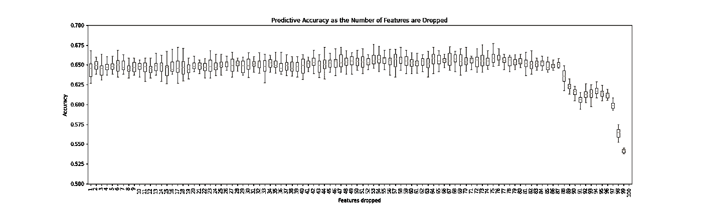
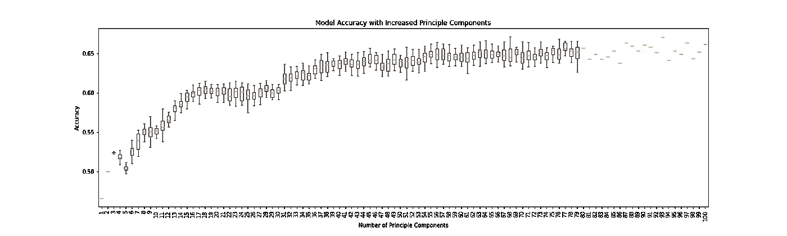

# 降维的实际例子

> 原文：<https://towardsdatascience.com/practical-example-of-dimensionality-reduction-d0525632c355?source=collection_archive---------19----------------------->

## 使用的技术:缺失值比率、高相关滤波器、递归特征消除(RFE)、主成分分析(PCA)


照片由 [Alex wong](https://unsplash.com/@killerfvith?utm_source=medium&utm_medium=referral) 在 [Unsplash](https://unsplash.com?utm_source=medium&utm_medium=referral) 上拍摄

***所有这些功能能帮我解决问题吗？我真的需要所有这些特性吗？我的数据集中的要素有多重要？***

> 如果您发现自己在数据科学项目中问这样的问题，那么这篇文章就是为您准备的。

在这篇文章中，我将介绍使用 Python 进行降维的四种技术。它们包括:

1.  **缺失值比率**
2.  **高相关滤波器**
3.  **递归特征消除** ( *RFE* )
4.  **主成分分析** ( *PCA* )

这些技术将在位于 Kaggle 上的 [**ANSUR 2 数据集**](https://www.kaggle.com/seshadrikolluri/ansur-ii?select=ANSUR+II+FEMALE+Public.csv) 上执行。该数据集代表了 2012 年美国陆军人体测量调查的信息，包括个人身体部位的**数字测量及其在军队中的角色**，以及其他特征。你可以自己去看看。

在我们深入实践之前，让我们确保您理解什么是降维以及为什么需要这样做。

## 什么是降维？

> 简而言之，降维是将数据集从高维空间转换到低维空间，同时保持其信息完整性以进行预测建模的过程。

**为什么要降维？**

1.  *减轻* [*维数灾难*](https://builtin.com/data-science/curse-dimensionality) *(* 随着特征数量的减少而减少预测误差 *)*
2.  *计算成本更低*
3.  *更容易使数据可视化*
4.  *从数据集中去除噪声*
5.  *机器学习模型性能的提高*

降维分为两个部分:

*   [**特征选择**](https://deepai.org/machine-learning-glossary-and-terms/feature-selection) **:** *通过丢弃包含少量信息的变量，将维度减少到原始数据集的一个子集。*
*   [**特征提取**](https://deepai.org/machine-learning-glossary-and-terms/feature-extraction) **:** *通过识别每个变量内的关键信息来组合特征，创建新的特征。*

ANSUR 数据集上使用的技术属于这两类中的任何一类。

了解了降维及其必要性之后，让我们开始吧！

## 数据集

这项工作中使用的数据集是男性和女性 ANSUR 2 数据集的串联。如前所述，该功能包括军队中许多人的身体测量。利用这些测量，我将通过预测军队中个人的“C *成分*来测试相关特征。这项工作需要注意的一些要点如下:

*   基础**随机森林分类器**模型用于对所有方法进行预测。
*   **“成分”(** *正规军、陆军国民警卫队、陆军预备役*)特征被用作目标变量。

## **基本统计&信息**

ANSUR 2 数据帧存储为对象 ***df*** 。原始数据集有 **109 个特征**和 **6068 个观察值**。

```
<class 'pandas.core.frame.DataFrame'>
RangeIndex: 6068 entries, 0 to 6067
Columns: 109 entries, Unnamed: 0 to WritingPreference
dtypes: int64(101), object(8)
memory usage: 5.0+ MB
```

## 1.缺失值比率

要素选择方法缺失值比率听起来一模一样。该方法计算每个要素的缺失观测值的比率。下面的代码显示了这是如何工作的，并打印了要素和整个数据集中缺失值的比率。

```
[('Ethnicity', 0.765820698747528)]
```

种族特征有 76.6%的缺失值。在这种情况下，由于缺少大量值而简单地删除该特性是可以接受的。删除某个要素会导致信息丢失，因此，如果某个要素的缺失值比率较低，则插补方法更合适。一些常见的插补方法包括:

*   ***意为*** *插补*
*   [**插补**](https://machinelearningmastery.com/knn-imputation-for-missing-values-in-machine-learning/)
*   ****热卡*** *插补**
*   ****冷甲板*** *插补**
*   ****预测回归*** *插补**

*更多关于这些插补方法及其背后的逻辑可以在 [**这里**](https://www.theanalysisfactor.com/seven-ways-to-make-up-data-common-methods-to-imputing-missing-data/) 找到。*

*对于这项工作，所有的**‘Object’数据类型都从数据集中删除，** *不包括'* ***组件*** *'(目标变量)和军队'* ***分支*** *'，它们都是标签编码的。*得到的数据帧尺寸有 **101 个特征和 6068 个观察值。**对于其余技术，**该数据帧将被称为基础数据集**。*

*首先，机器学习模型( ***随机森林分类器*** )计算原始数据集的预测准确度。*由于随机森林分类器的随机性，取 20 次试运行的平均值。**

```
*Predictive accuracy of base random forrest classifier 0.643*
```

*基础数据集导致 **64.3%的预测准确性**。该值用作所有其他技术的参考。*

> *请记住，降维的目的是减少特征的数量，同时保持或提高模型的预测精度。*

## *2.高度相关滤波器*

*对于包含大量要素的数据来说，可视化非常困难，这使得对包含大量要素的数据集进行降维变得非常困难。寻找高度相关的特征也是如此。这种要素选择技术可确定哪些要素高度相关，并将其从数据集中删除。要确定哪个相关值适合您的数据集，需要执行以下几个步骤:*

1.  *使你的数据正常化*
2.  ***创建相关标准化绝对值的屏蔽***
3.  ***迭代一系列高相关值**(本例中为*，0.85–0.99*)*
4.  ***删除相关性高于可迭代的特征***
5.  ***用删除的数据集测试预测精度***

*下面的代码展示了这个逻辑。*

```
*{0.85: 0.6471, 0.86: 0.6488, 0.87: 0.6477, 0.88: 0.6523, 0.89: 0.6471, 0.9: 0.6499, 0.91: 0.646, 0.92: 0.6476, 0.93: 0.6514, 0.94: 0.6434, 0.95: 0.6468, 0.96: 0.6453, 0.97: 0.6465, 0.98: 0.65, 0.99: 0.6385}Correlation coefficient with the highest predictive accuracy 0.88Number of feature's dropped 17*
```

*结果显示，0.88 的**相关值给出了最高的**预测准确度，为 65.2%** 。这比基础数据集增加了**0.9%**，减少了 **17 个特征**。***

## *3.递归特征消除(RFE)*

*下一个降维技术是基于随机森林分类器模型的特征重要性的手动递归特征消除方法。RandomForestClassifier()。feature_importances_ 用于查找预测目标变量的信息量最少的特征。*

****最不重要的特征从数据集中删除*** *，* ***创建新的训练和测试集*** *，计算* ***预测精度*** *为轨迹数(在本例中为 20)*。*

*这个逻辑的代码如下所示。*

**

*作者图片*

*上图显示了随着数据集中最不重要的要素数量的减少，模型的预测准确性如何降低。*

> *提示:在计算预测精度时，减少试验次数并包括步骤，以降低计算成本。*

```
*Number of features to drop 75
Accuracy of model 0.6597*
```

*使用随机福里斯特分类器的*特征 _ 重要性 _* 属性，通过递归特征消除逻辑，该模型显示出**预测准确度为** **66%，**提高了**1.7%，**从基础数据集**中删除了 **75 个特征**。***

*另一种 RFE 方法是使用 **Scikit 学习递归特征消除方法**。下面的代码展示了如何应用这种方法。*

> *需要预先选择想要将数据集缩减到的要素数量。*

```
*65.7% accuracy on test set.*
```

*使用这种方法，**输入了 26 个特征**(与手动 RFE 的结果相同)，预测精度为 65.7% ，比原始数据集提高了**1.4%**。*

## *4.主成分分析*

*PCA 是一种特征提取技术，其工作原理是:*

1.  ***标准化**数据(因此每个变量的贡献相等)*
2.  ***计算协方差矩阵**(识别特征之间的关系)*
3.  ***计算协方差矩阵的特征值和特征向量**(计算主成分)*

> *请记住:经过主成分分析后，特征值的可解释性将会降低。*

*要了解更多关于 PCA 和算法如何工作的信息，点击 [**这里**](https://sebastianraschka.com/Articles/2015_pca_in_3_steps.html) 。*

*下面的代码展示了如何实现 PCA。数据被分成训练和测试数据集；创建了一个管道来标准化数据。计算一组主分量，然后应用于随机福里斯特分类器。对于每个主成分，由于随机福里斯特分类器的随机性质，运行 20 次试验。*

**

*作者图片*

*上图显示了随着主成分数量的增加，预测的准确性。*

```
*{55: 0.6503}*
```

*使用 **55 个主成分**，模型显示 **0.75%的增长**，预测精度**65.03%。***

## *结束*

*所有技术都证明适用于数据集，因为随着预测准确性的提高，特征的数量会减少。**手动 RFE 方法表现出最佳性能，与原始数据集相比，减少了 75 个要素，增加了 1.7%** 。*

*我希望这篇文章对你的数据科学之旅有所帮助。*

*感谢您的阅读！*

*努力整合您的数据科学项目？看一看关于从头开始完成数据科学项目的简单指南。*

*[](/7-steps-to-a-successful-data-science-project-b452a9b57149) [## 成功数据科学项目的 7 个步骤

### 从头开始完成数据科学项目的初学者指南

towardsdatascience.com](/7-steps-to-a-successful-data-science-project-b452a9b57149) 

## 取得联系

**领英:**[https://www.linkedin.com/in/amit-bharadwa123/](https://www.linkedin.com/in/amit-bharadwa123/)*