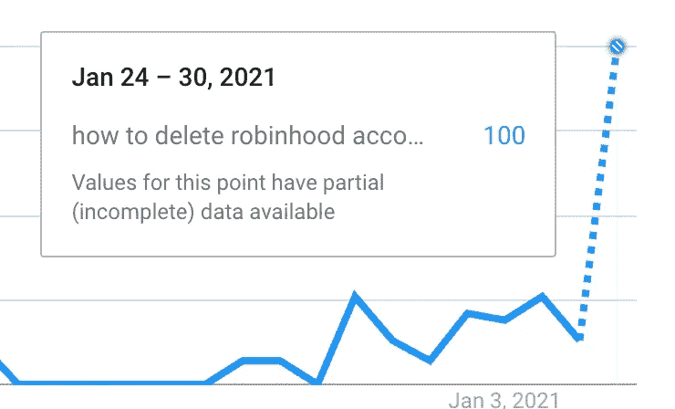

# 利用罗宾汉/GME 惨败的实用实验技巧

> 原文：<https://towardsdatascience.com/practical-experimentation-tips-using-the-robinhood-gme-fiasco-4455840ba0e2?source=collection_archive---------36----------------------->

## TL；你不需要(也可能无法使用)A/B 测试来了解罗宾汉通过限制 GME 交易来搅动其用户群。

我将把最近罗宾汉/GME 的惨败作为一个假设的例子，分享几个我多年来收集的关于实验的实际想法。*免责声明:这显然是假设。我只是一直在寻找好的教学例子，这感觉像是对时间的有趣利用。:)*

# **假设罗宾汉做了一个实验，随机让一些用户交易 GME。**

即假设他们进行了 A/B 测试，以确定其贸易限制的因果效应。在这种情况下，测试规范应该是这样的:

**处理:**用户不能交易 GME。
**控制:**用户可以交易 GME。
**度量:**卸载。

在将用户随机分配到治疗组和对照组后，他们可以观察治疗组和对照组用户之间卸载的差异，这将产生禁止用户交易 GME 的影响。现在，我肯定你马上会反对:你不需要 A/B 测试来知道罗宾汉对 GME 的反应导致卸载。所以，我的第一课。

# *1)如果影响足够大，不做 A/B 测试也能活。*

> 你不需要 A/B 测试来告诉你，禁止 GME 交易是导致人们卸载罗宾汉的原因。

不，你不会有一个反事实，但是来吧——当你的指标看起来像这样时，你通常不需要实验来告诉你发生了什么。

好吧，我知道这不是卸载的情节(这是谷歌趋势“如何删除罗宾汉”的情节)，但它应该作为一个合理的代理。:)

诚然，在大多数大公司，这种异常大的提升可能很难实现。但是，如果你正在为一家初创公司或一家刚刚开始进入其市场的小公司工作，你所产生的任何影响都将足够大，以至于你的行动成果将会引人注目。

> 给初创公司数据科学家的建议:因为你的努力的相对影响将会很大(任何东西/ 0 =无穷大)，所以你不需要随机化来知道某件事情是否有效。找曲棍球棒！

# 2)如果人们在谈论你的治疗，你很可能不能相信你的 A/B 测试结果(溢出)。

因无法交易 GME 而直接受到影响的用户数量可能很少(并不是每个人都持有或想要交易 GME)。但是由于社交媒体、新闻渠道和病毒式传播，几乎整个罗宾汉用户群都知道 GME 的贸易限制。

现在让我们回到我们的假设实验。在实验的世界里，用户之间这种不可控的互动意味着治疗将影响对照组，而不仅仅是治疗组。这种效应被称为**溢出**。在罗宾汉案中，这种效应背后的机制是显而易见的:

> 大多数卸载罗宾汉的人并不是因为他们个人不能交易 GME。

因此，治疗组和对照组之间的差异是对真实效果大小的严重低估。这是你得出的虚假结论:*既然每个人都卸载了罗宾汉(不仅仅是那些接受治疗的人)，排除 GME 肯定不是问题。*

> 给大公司的建议是:如果你的 A/B 测试上了新闻，你的 A/B 测试很可能不起作用。

# 现在你走吧！让我们让 2021 年成为实验少的高影响年。

我开玩笑的，算是吧。

显然，一般来说，A/B 测试非常有价值。如果可能的话，您通常应该运行 A/B 测试——产品变更经常会有意想不到的副作用，即使是出于最好的意图，您希望在它们真正把事情弄糟之前发现它们。即使在溢出效应泛滥的情况下，通过正确的事后分析，A/B 测试也是可以挽救的。

真的，我正看着你——小公司的数据科学家——用那个标题。这可能是显而易见的，但不要谴责缺乏严格的测试实践和数据不足。跟我重复:

> “我们无法精确衡量影响，但如果我们做得非常好，我们应该能够看到它。”

向您的利益相关者重复这一点，观察您的指标，并寻找曲棍球棒。现在只要确保他们朝着正确的方向前进。

***推特***[***@ imrobertyi***](https://twitter.com/imrobertyi)***打个招呼，或者在***[***LinkedIn***](https://www.linkedin.com/in/robert-yi/)***上找我。***