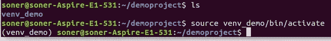

# Python 虚拟环境实用指南

> 原文：<https://towardsdatascience.com/practical-guide-for-virtual-environments-in-python-b59bd5fe8f1?source=collection_archive---------19----------------------->

## 使用 virtualenv 和 pipenv 工具


马库斯·斯皮斯克在 [Unsplash](https://unsplash.com/s/photos/virtual?utm_source=unsplash&utm_medium=referral&utm_content=creditCopyText) 上的照片

我们从事的项目很可能有许多需要安装的依赖项。这些依赖关系简化了项目中的许多任务。然而，我们需要小心对待它们，尤其是在处理多个项目的时候。

就像任何其他技术一样，软件包或编程语言也在不断改进。因此，新的版本正在推出。

不同的项目可能需要不同版本的包或软件。例如，我们可能有一个项目需要 Python 2.7，而另一个项目需要 Python 3.6。随着项目和依赖项数量的增加，跟踪和处理这些差异变得越来越困难。

解决这个问题的一个方法是使用虚拟环境。它们可以被认为是软件包的边界框。我们可以在虚拟环境中开发一个项目，并安装特定于该项目的所有依赖项。我们在虚拟环境中拥有的东西不受我们机器全局范围变化的影响。

Python 的虚拟环境工具有很多，比如 pipenv、virtualenv、venv 等等。在本文中，我们将通过一些使用 virtualenv 和 pipenv 的例子来熟悉虚拟环境的概念以及它们是如何工作的。

让我们从虚拟开始。我们首先使用 python 包安装程序(pip)从终端安装它。

```
$ pip install virtualenv
```

我们创建一个样例项目文件作为我们的工作目录。

```
$ mkdir demoproject
$ cd demoproject
```

我们现在在 demoproject 目录中。我们将使用以下命令创建一个虚拟环境。

```
$ virtualenv venv_demo
```

它已经被创造出来了。我们可以运行 ls 命令来查看当前工作目录中的文件。

```
$ ls
venv_demo
```

下一步是激活虚拟环境。

```
$ source venv_demo/bin/activate
```

一旦虚拟环境被激活，其名称将显示在终端中，如下所示:



(图片由作者提供)

我们现在可以安装软件包了。

```
$ python -m pip install pandas
```

我们现在在虚拟环境中安装了熊猫。冻结命令显示已安装软件包的列表。

```
$ python -m pip freeze
numpy==1.19.4
pandas==1.1.5
python-dateutil==2.8.1
pytz==2020.5
six==1.15.0
```

NumPy 也被安装了，因为它是熊猫的附属品。熊猫的安装版本是 1.1.5。我们可以在安装包时指定我们需要的版本。

```
$ python -m pip install pandas==1.0.5
```

如果您只想检查特定软件包的安装版本，freeze 命令与 grep 一起使用:

```
$ pip freeze | grep pandas
pandas==1.0.5
```

我们也可以安装几个保存在文本文件中的包。这比一个一个地安装依赖项要好，尤其是当有多个依赖项时。

```
$ python -m pip install -r requirements.txt
```

为了退出虚拟环境，我们使用 deactivate 命令。

```
$ deactivate
```

我们将发现的下一个工具是 pipenv，它可以使用 pip 进行安装:

```
$ pip install pipenv
```

让我们使用 pipenv 创建一个新的虚拟环境。

```
$ pipenv install --python=/usr/bin/python3.6
```

Pipenv 允许在创建虚拟环境时安装依赖项。例如，我可以在上面的命令末尾添加 pandas，这样就创建了安装了 pandas 的虚拟环境。

我们运行 shell 命令来激活虚拟环境。

```
$ pipenv shell
```


(图片由作者提供)

我们现在在虚拟环境中。我们也给这个装熊猫吧。

```
$ pipenv install pandas
```

graph 命令显示已安装软件包的详细概述。

```
$ pipenv graphpandas==1.1.5
  - numpy [required: >=1.15.4, installed: 1.19.4]
  - python-dateutil [required: >=2.7.3, installed: 2.8.1]
    - six [required: >=1.5, installed: 1.15.0]
  - pytz [required: >=2017.2, installed: 2020.5]
```

我们可以使用 uninstall 命令卸载虚拟环境中的特定软件包或所有软件包。

```
$ pipenv uninstall pandas 
```

以下命令卸载所有软件包。

```
$ pipenv uninstall -all
```

我们键入“exit”命令来退出虚拟环境。

## 结论

虚拟环境是同时管理多个项目的绝佳工具。有许多软件包和库可以随时更新。因此，试图手动跟进是非常费力且低效的。

我们在本文中讨论的内容可以被认为是对 Python 虚拟环境的实用介绍。当然，在理论和实践方面还有很多东西要学。

[virtualenv](https://virtualenv.pypa.io/en/latest/) 和 [pipenv](https://github.com/pypa/pipenv) 的官方文档提供了关于这些工具的更详细的概述。

感谢您的阅读。如果您有任何反馈，请告诉我。