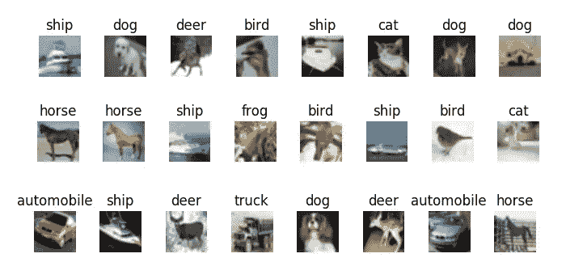
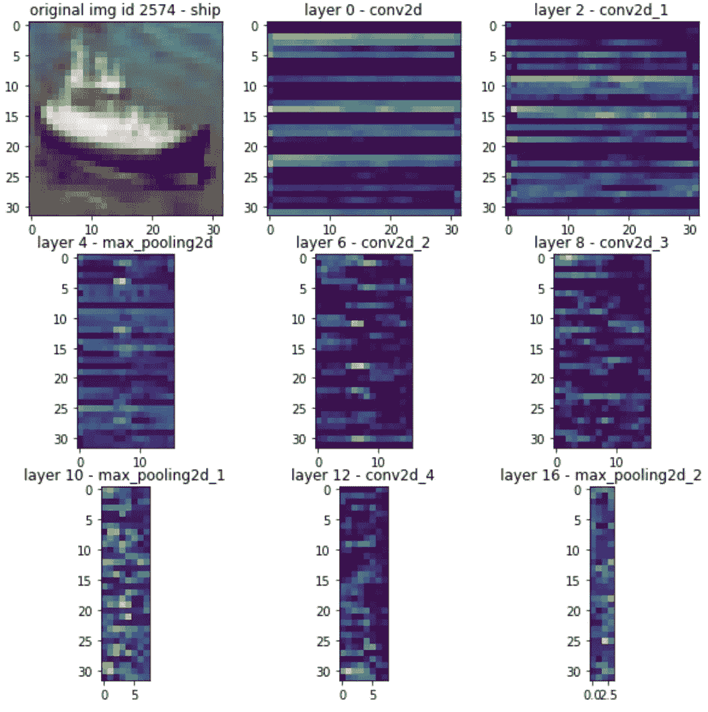
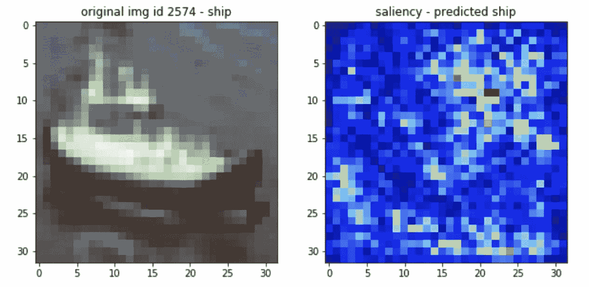

# 使用显著图可视化 CNN 的实用指南

> 原文：<https://towardsdatascience.com/practical-guide-for-visualizing-cnns-using-saliency-maps-4d1c2e13aeca?source=collection_archive---------9----------------------->

## Python 深度学习可解释性教程

照片由 E [berhard Grossgasteiger](https://unsplash.com/@eberhardgross) 在 Unsplash 上拍摄

# 深度学习可解释性

虽然在计算机视觉中通过组成超大质量神经网络来解决复杂问题很方便，但理解每个权重对结果的影响很困难。

 [## 人工智能怎么能比你的眼睛看得更清楚

### 卷积神经网络用简单的英语解释。

medium.com](https://medium.com/dataseries/how-ai-can-see-better-than-your-eyes-do-93e5a5da1e8a) 

事实上，神经网络的权重与网络所代表的功能之间的关系极其复杂，尤其是当网络具有数十亿个权重时。

例如，一辆特斯拉电动汽车同时运行[至少 50 个大型卷积神经网络](https://heartbeat.fritz.ai/computer-vision-at-tesla-cd5e88074376)**来对车辆、车道线、路缘、人行横道和所有其他特定的环境变量进行分类。**

# **卷积神经网络**

**在本文中，我们使用 Keras 创建并可视化一个卷积神经网络，用于预测来自 [CIFAR-10](https://keras.io/datasets/#cifar10-small-image-classification) 数据集的图像中显示的对象类型，该数据集包含数千幅图像及其相应的类。**

**如果你看到下面的图片，并被要求分类，你很可能会马上回答——船，狗…等等！**

****

**我们可以精确地描述我们如何区分一艘船和其他东西，但我们想了解是什么使卷积神经网络给出某个类作为输出。**

# **打开深度学习黑盒**

**将网络可视化有助于诊断模型的问题，解释模型的意义，或者简单地教授深度学习概念。**

**我们可以可视化决策边界、模型权重、激活、梯度、性能指标、将学习到的过滤器应用于图像的结果或过滤器本身。**

**对于给定的输入图像，我使用下面提供的代码从隐藏的卷积层中提取了特征图。**

**每幅图像都显示了识别船只时相应层学习到的特征的热图。**

****

# **显著图**

**显著图更进了一步，它提供了一种可解释的技术来研究 CNN 中的隐藏层。**

> **显著图是一种测量每个图像中特定类别的空间支持度的方法。**

**它是解释卷积神经网络预测的最古老和最常用的解释方法。**

**显著图是使用输出对输入的梯度来构建的。这突出了与分类相关的图像区域。**

**例如，我们可以在下面看到，水在识别船只时起着重要的作用。也许模型如果给一艘建筑工地的水外船就不会这么成功了。这一观察提供了重要的线索，即需要用不同环境条件下船只的额外图像来重新训练模型。**

****

**显著图属于决策归因的后向方法。 [Grad-CAM 和基于梯度的显著图](https://papers.nips.cc/paper/2018/file/294a8ed24b1ad22ec2e7efea049b8737-Paper.pdf)被认为是最可靠的技术。也可以套用所谓的[前传归因](https://christophm.github.io/interpretable-ml-book/pixel-attribution.html#shap%7D)。这是一种遮挡方法，包括在整个图像上运行补丁，以查看哪些像素对分类影响最大。**

# **结论**

**在这篇文章中，我用 Python 代码演示了可视化卷积神经网络的好处。显著图非常受欢迎，我鼓励深度学习从业者打开他们的模型。这很容易，很有趣，并且赢得了客户更多的信任。**

**感谢阅读。**