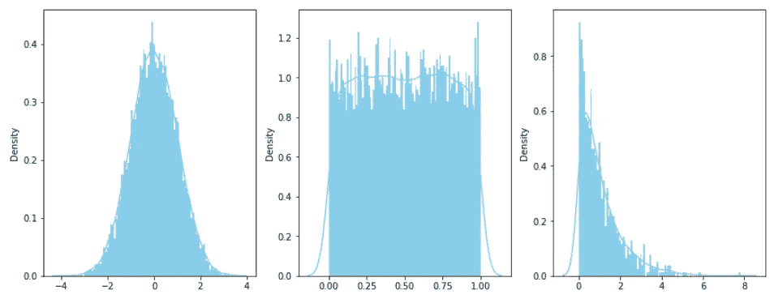
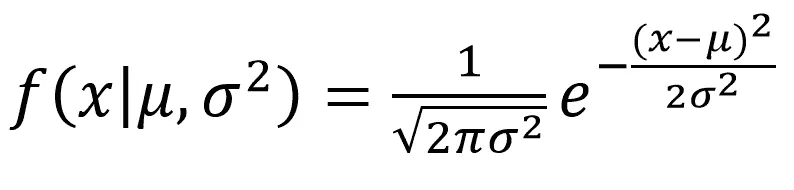
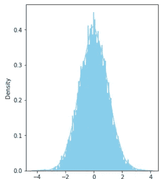
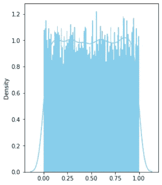
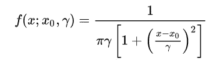
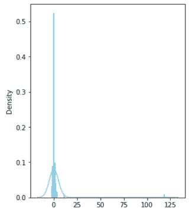
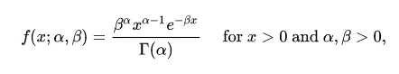
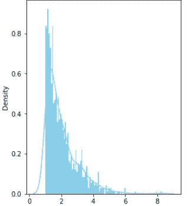
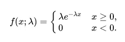

# 机器学习中常见概率分布实用指南

> 原文：<https://towardsdatascience.com/practical-guide-to-common-probability-distributions-in-machine-learning-487f6137625?source=collection_archive---------12----------------------->

## 常见概率分布的性质和数学定义介绍(一)

概率是机器学习和数据科学的基本组成部分。事实上，现代机器学习算法的一些基本原理部分建立在这些统计理解上。在这篇文章中，我们将获得一些关于*如何*和*为什么*一些更常见的概率分布函数表现的直觉。我们还将定义它们的数学定义，以及如何用 Python 构建一个。



不同类型的发行版(图片由作者提供)

这篇文章的部分灵感来自于我写的一篇关于贝叶斯统计的文章(下面的链接)。我注意到这个话题很少被讨论，但它是需要学习的更重要的知识之一，尤其是对于那些正在构建机器学习模型的人来说。

[](/bayesian-statistical-programming-an-introduction-4ca3e2ddae76) [## 贝叶斯统计程序设计:导论

towardsdatascience.com](/bayesian-statistical-programming-an-introduction-4ca3e2ddae76) 

你可以在这里找到第二部分。那么，事不宜迟，我们开始吧！

[](/practical-guide-to-common-probability-distributions-in-machine-learning-part-2-5bcb910218c0) [## 机器学习中常见概率分布实用指南(第二部分)

towardsdatascience.com](/practical-guide-to-common-probability-distributions-in-machine-learning-part-2-5bcb910218c0) 

# 目录:

1.  什么是概率分布
2.  正态分布
3.  均匀分布
4.  柯西分布
5.  伽马分布
6.  指数分布

# 什么是概率分布

概率分布是一个函数，它给出实验中不同可能结果出现的概率。

举例来说，给定一个 6 面骰子，有 6 种可能的结果可以掷出:1，2，3，4，5，6。如果骰子是公平的，那么所有可能结果的概率是相同的:1/6。因此，对于*x*【1…6】的所有可能值，概率分布是 1/6。

***为什么概率分布很重要？*** 部分是因为它:

1.  帮助您根据给定的概率分布进行采样。例如，你的朋友让你将六面骰子滚动 100 次，以评估骰子是否公平。
2.  允许您通过对观测值或参数的基本分布做出*假设*来构建统计模型(例如，假设贝叶斯模型中的特定总体参数遵循指数分布)。

现在让我们讨论一些您可能会遇到的主要发行版！

# 正态分布

正态分布是正常的，因为它描述了许多自然现象:血压、测量误差、智商分数等等。

正态分布的数学公式如下，其中μ(读作:miu)是平均值，σ(读作:sigma)是观测值的偏差。



正态分布公式

通常，μ为 0，σ为 1，如下图所示。



正态分布(作者图片)

通过首先导入所需的库，您可以使用 scipy 在 Python 中创建一个正态分布。

```
from scipy.stats import norm
import seaborn as sns
import matplotlib.pyplot as plt
```

调用函数…(使用大小为 10000 的样本)

```
data_normal = norm.rvs(size=10000,loc=0,scale=1)
```

并绘制它…

```
sns.distplot(data_normal,
              kde=True,
              bins=100,
              color='skyblue',
              hist_kws={"linewidth": 15,'alpha':1})
```

# 均匀分布

均匀分布描述了在可能结果中均匀发生的现象。例如，我们早期的 6 面公平骰子或 52 张牌游戏套件。

均匀分布的数学公式将定义一个极限 **a 和 b(即。【a，b】)**。任何低于或高于 b 的 *x* 的值将被赋予零概率，而剩余的有效观测值将被赋予均匀概率，给定 a 和 b 之间的离散区间数


均匀分布公式

通过首先导入所需的库，您可以使用 scipy 在 Python 中创建一个统一的发行版。

```
from scipy.stats import uniform
import seaborn as sns
import matplotlib.pyplot as plt
```

调用函数…(使用大小为 10000 的样本)

```
data_uniform = uniform.rvs(size=10000, loc = 0, scale=1)
```

并绘制它…

```
sns.distplot(data_uniform,
              kde=True,
              bins=100,
              color='skyblue',
              hist_kws={"linewidth": 15,'alpha':1})
```



均匀分布(图片由作者提供)

# 柯西分布

柯西分布在形状上类似于正态分布，但有值得注意的差异。例如，它有一个比正态分布更高的峰值。柯西分布也有它的厚尾，衰减得慢得多。这种分布在物理学中被大量使用，尤其是在光谱学领域(即电磁辐射的研究)。

数学定义如下，其中 *γ* (读作:γ)是决定分布有多宽或多窄的比例因子。



柯西分布公式

通过首先导入所需的库，您可以使用 scipy 在 Python 中创建一个 cauchy 发行版。

```
from scipy.stats import cauchy
import seaborn as sns
import matplotlib.pyplot as plt
```

调用函数…

```
data_cauchy = cauchy.rvs(scale=0.5,loc=0,size=100)
```

并绘制它…

```
sns.distplot(data_cauchy,
              kde=True,
              bins=100,
              color='skyblue',
              hist_kws={"linewidth": 15,'alpha':1})
```



柯西分布(图片由作者提供)

# 伽马分布

伽马分布是一种双参数概率分布，它总是正的，并且具有偏斜分布。它自然发生在事件之间的等待时间很重要的过程中(即滞后时间)，如新开发的治疗病毒感染的药物的效果等。伽马分布可以通过 *α* 和 *β* 来参数化，这决定了分布的偏斜程度，如下 *:*



伽马概率分布

通过首先导入所需的库，您可以使用 scipy 在 Python 中创建 gamma 发行版。

```
from scipy.stats import gamma
import seaborn as sns
import matplotlib.pyplot as plt
```

调用函数…

```
data_gamma = gamma.rvs(1,1,size=1000)
```

并绘制它…

```
sns.distplot(data_gamma,
              kde=True,
              bins=100,
              color='skyblue',
              hist_kws={"linewidth": 15,'alpha':1})
```



伽玛分布(图片由作者提供)

# 指数分布

指数分布通常用于模拟指数增长(或下降)的事件，例如随着时间的推移人口增长(或下降)的趋势。分布由λ(读作:lambda)来参数化，λ调节指数下降或上升的速度，如下所示:



指数分布公式

通过首先导入所需的库，您可以使用 scipy 在 Python 中创建一个指数分布。

```
from scipy.stats import expon
import seaborn as sns
import matplotlib.pyplot as plt
```

调用函数…

```
data_expon = expon.rvs(size=1000)
```

并绘制它…

```
sns.distplot(data_expon,
              kde=True,
              bins=100,
              color='skyblue',
              hist_kws={"linewidth": 15,'alpha':1})
```

# 结论

这个帖子到此为止！希望您已经获得了一些直觉，知道为什么以及如何使用这些概率分布来模拟真实世界的场景。在下一篇的[文章中，我们将深入探讨其他流行的分布，包括泊松分布、F 分布、t 分布、*分布等*。敬请期待！](/practical-guide-to-common-probability-distributions-in-machine-learning-part-2-5bcb910218c0)

***做订阅我的邮件简讯:***[*【https://tinyurl.com/2npw2fnz】*](https://tinyurl.com/2npw2fnz)****在这里我定期用通俗易懂的语言和漂亮的可视化方式总结 AI 研究论文。****